---
# Preamble

## Author
author:
  name: Бызова Мария Олеговна
## Title
title: Отчет по лабораторной работе № 3
subtitle: Настройка DHCP-сервера
license: CC BY
date: 2025-09-05

## Generic options
lang: ru-RU
crossref:
  lof-title: Список иллюстраций
  lot-title: Список таблиц
  lol-title: Листинги

## Fonts 
mainfont: PT Serif 
romanfont: PT Serif 
sansfont: PT Sans 
monofont: PT Mono 
mainfontoptions: Ligatures=TeX 
romanfontoptions: Ligatures=TeX 
sansfontoptions: Ligatures=TeX,Scale=MatchLowercase 
monofontoptions: Scale=MatchLowercase,Scale=0.9

## Formats
format:
### Pdf output format
  beamer:
    toc: true
    toc-title: Содержание
    number-sections: true
    colorlinks: false
    toc-depth: 2
    slide_level: 2
    aspectratio: 169
    section-titles: true
    theme: metropolis
    themeoptions: progressbar=frametitle,sectionpage=progressbar,numbering=fraction
    pdf-engine: xelatex
    fontenc: T2A
#### Language
    babel-lang: russian
    babel-otherlangs: english

### Html output
  revealjs:
    transition: slide
    margin: 0.2
    smaller: false
    output-ext: html
    theme: beige
    logo: _resources/image/logo_rudn.png
---

## Цель работы

Целью данной лабораторной работы является приобретение практических навыков по установке и конфигурированию DHCP-
сервера.

# Выполнение лабораторной работы

## Установка DHCP-сервера

Загрузим нашу операционную систему и перейдем в рабочий каталог с проектом. Запустим виртуальную машину server (рис. 1)

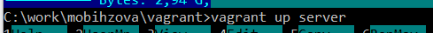{#fig-001 width=70%}

## Установка DHCP-сервера

На виртуальной машине server войдем под нашим пользователем и откроем терминал. Перейдем в режим суперпользователя. Установим dhcp (рис. 2)

{#fig-002 width=70%}

## Конфигурирование DHCP-сервера

Сохраним на всякий случай конфигурационный файл. Откроем для редактирования конфигурационный файл (рис. 3)

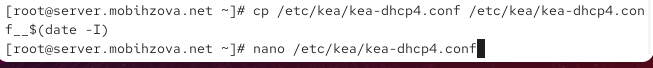{#fig-003 width=70%}

## Конфигурирование DHCP-сервера

В этом файле заменим шаблон для domain-name, блок domain-name-servers и на базе одного из приведённых в файле примеров конфигурирования подсети зададим собственную конфигурацию dhcp-сети, задав адрес подсети, диапазон адресов для распределения клиентам, адрес маршрутизатора и broadcast-адрес. Остальные примеры задания конфигураций подсетей удалим. Настроим привязку dhcpd к интерфейсу eth1 виртуальной машины server (рис. 4)

## Конфигурирование DHCP-сервера

{#fig-004 width=70%} 

## Конфигурирование DHCP-сервера

Проверим правильность конфигурационного файла (рис. 5)

{#fig-005 width=70%}

## Конфигурирование DHCP-сервера

Перезагрузим конфигурацию dhcpd и разрешим загрузку DHCP-сервера при запуске виртуальной машины server (рис. 6)

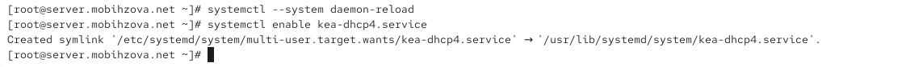{#fig-006 width=70%} 

## Конфигурирование DHCP-сервера

Добавим запись для DHCP-сервера в конце файла прямой DNS-зоны /var/named/master/fz/user.net (рис. 7).

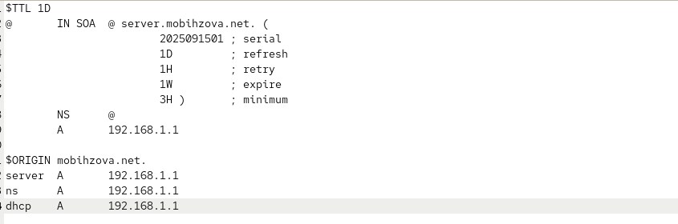{#fig-007 width=70%} 

## Конфигурирование DHCP-сервера

Добавим запись для DHCP-сервера в конце файла обратной зоны /var/named/master/rz/192.168.1 (рис. 8).

{#fig-008 width=70%} 

## Конфигурирование DHCP-сервера

Перезапустим named. Проверим, что можно обратиться к DHCP-серверу по имени (рис. 9).

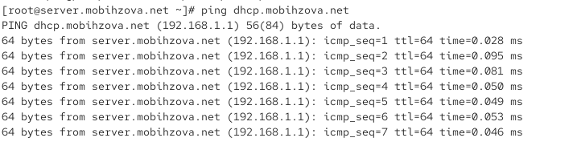{#fig-009 width=70%}

## Конфигурирование DHCP-сервера

Внесем изменения в настройки межсетевого экрана узла server, разрешив работу с DHCP (рис. 10).

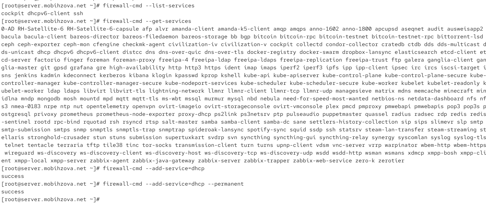{#fig-010 width=70%}

## Конфигурирование DHCP-сервера

Восстановим контекст безопасности в SELinux (рис. 11).

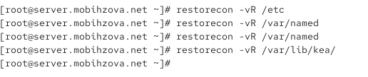{#fig-011 width=70%}

## Конфигурирование DHCP-сервера

В дополнительном терминале запустим мониторинг происходящих в системе процессов в реальном времени (рис. 12).

{#fig-012 width=70%}

## Конфигурирование DHCP-сервера

В основном рабочем терминале запустим DHCP-сервер (рис. 13).

{#fig-013 width=70%}

## Анализ работы DHCP-сервера

Перед запуском виртуальной машины client в каталоге с проектом в нашей операционной системе в подкаталоге vagrant/provision/client создадим файл 01-routing.sh. Открыв его на редактирование, пропишем в нём скрипт (рис. 14).

{#fig-014 width=70%}

## Анализ работы DHCP-сервера

В Vagrantfile подключим этот скрипт в разделе конфигурации для клиента (рис. 15).

{#fig-015 width=70%}

## Анализ работы DHCP-сервера

Зафиксируем внесённые изменения для внутренних настроек виртуальной машины client и запустим её (рис. 16).

{#fig-016 width=70%}

## Анализ работы DHCP-сервера

Ввойдем в систему виртуальной машины client под нашим пользователем и откроем терминал. В терминале введем ifconfig (рис. 17).

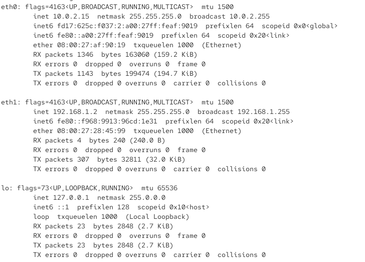{#fig-017 width=40%}

## Анализ работы DHCP-сервера

На машине server посмотрим список выданных адресов (рис. 18).

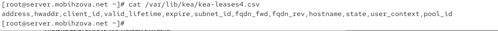{#fig-018 width=70%}

## Настройка обновления DNS-зоны

Создадим ключ на сервере с Bind9 (на виртуальной машине server). Поправим права доступа (рис. 19).

{#fig-019 width=70%}

## Настройка обновления DNS-зоны

Подключим ключ в файле /etc/named.conf (рис. 20).

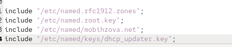{#fig-020 width=70%}

## Настройка обновления DNS-зоны

На виртуальной машине server под пользователем с правами суперпользователя отредактируем файл /etc/named/user.net (рис. 21).

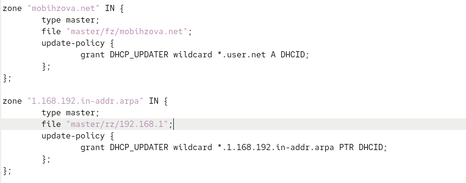{#fig-021 width=70%}

## Настройка обновления DNS-зоны

Сделаем проверку конфигурационного файла. Перезапустим DNS-сервер (рис. 22).

{#fig-022 width=70%}

## Настройка обновления DNS-зоны

Перенесём ключ на сервер Kea DHCP и перепишем его в формате json (рис. 23).

{#fig-023 width=70%}

## Настройка обновления DNS-зоны

Сменим владельца. Поправим права доступа (рис. 24).

{#fig-024 width=70%}

## Настройка обновления DNS-зоны

Внесём изменения в файле /etc/kea/kea-dhcp-ddns.conf (рис. 25).

{#fig-025 width=70%}

## Настройка обновления DNS-зоны

Изменим владельца файла. Проверим файл на наличие возможных синтаксических ошибок. Запустим службу ddns. Проверим статус работы службы (рис. 26).

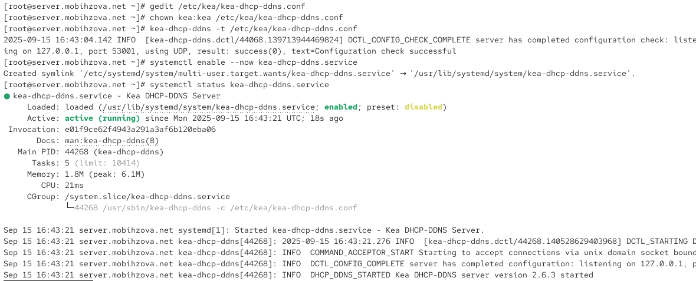{#fig-026 width=70%}

## Настройка обновления DNS-зоны

Внесем изменения в конфигурационный файл /etc/kea/kea-dhcp4.conf, добавив в него разрешение на динамическое обновление DNS-записей с локального узла прямой и обратной зон (рис. 27).

{#fig-027 width=70%}

## Настройка обновления DNS-зоны

Проверим файл на наличие возможных синтаксических ошибок (рис. 28).

{#fig-028 width=70%}

## Настройка обновления DNS-зоны

Перезапустим DHCP-сервер. Проверим статус (рис. 29).

{#fig-029 width=70%}

## Настройка обновления DNS-зоны

На машине client переполучим адрес (рис. 30).

{#fig-030 width=70%}

## Анализ работы DHCP-сервера после настройки обновления DNS-зоны

На виртуальной машине client под нашим пользователем откроем терминал и с помощью утилиты dig убедимся в наличии DNS-записи о клиенте в прямой DNS-зоне (рис. 31).

{#fig-031 width=70%}
    
## Внесение изменений в настройки внутреннего окружения виртуальной машины

На виртуальной машине server перейдем в каталог для внесения изменений в настройки внутреннего окружения /vagrant/provision/server/, создадим в нём каталог dhcp, в который поместим в соответствующие подкаталоги конфигурационные файлы DHCP (рис. 32).

{#fig-032 width=70%}

## Внесение изменений в настройки внутреннего окружения виртуальной машины

Заменим конфигурационные файлы DNS-сервера (рис. 33).

{#fig-033 width=70%}

## Внесение изменений в настройки внутреннего окружения виртуальной машины

В каталоге /vagrant/provision/server создадим исполняемый файл dhcp.sh (рис. 34).

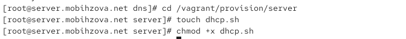{#fig-034 width=70%}

## Внесение изменений в настройки внутреннего окружения виртуальной машины

Открыв его на редактирование, пропишем в нём скрипт (рис. 35).

{#fig-035 width=70%}

## Внесение изменений в настройки внутреннего окружения виртуальной машины

Для отработки созданного скрипта во время загрузки виртуальной машины server в конфигурационном файле Vagrantfile необходимо добавить в разделе конфигурации для сервера (рис. 36).

{#fig-036 width=70%}

## Внесение изменений в настройки внутреннего окружения виртуальной машины

После этого виртуальные машины client и server можно выключить.

## Выводы

В ходе выполнения лабораторной работы мной были приобретены практические навыки по установке и конфигурированию DHCP-
сервера.
