---
# Preamble

## Author
author:
  name: Бызова Мария Олеговна
## Title
title: "Отчёт по лабораторной работе №3"
subtitle: "Настройка DHCP-сервера"
license: "CC BY"
## Generic options
lang: ru-RU
number-sections: true
toc: true
toc-title: "Содержание"
toc-depth: 2
## Crossref customization
crossref:
  lof-title: "Список иллюстраций"
  lot-title: "Список таблиц"
  lol-title: "Листинги"
## Bibliography
bibliography:
  - bib/cite.bib
csl: _resources/csl/gost-r-7-0-5-2008-numeric.csl
## Formats
format:
### Pdf output format
  pdf:
    toc: true
    number-sections: true
    colorlinks: false
    toc-depth: 2
    lof: true # List of figures
    lot: true # List of tables
#### Document
    documentclass: scrreprt
    papersize: a4
    fontsize: 12pt
    linestretch: 1.5
#### Language
    babel-lang: russian
    babel-otherlangs: english
#### Biblatex
    cite-method: biblatex
    biblio-style: gost-numeric
    biblatexoptions:
      - backend=biber
      - langhook=extras
      - autolang=other*
#### Misc options
    csquotes: true
    indent: true
    header-includes: |
      \usepackage{indentfirst}
      \usepackage{float}
      \floatplacement{figure}{H}
      \usepackage[math,RM={Scale=0.94},SS={Scale=0.94},SScon={Scale=0.94},TT={Scale=MatchLowercase,FakeStretch=0.9},DefaultFeatures={Ligatures=Common}]{plex-otf}
### Docx output format
  docx:
    toc: true
    number-sections: true
    toc-depth: 2
---

# Цель работы

Целью данной лабораторной работы является приобретение практических навыков по установке и конфигурированию DHCP-
сервера.

# Задание

1. Установите на виртуальной машине server DHCP-сервер (см. раздел 3.4.1).
2. Настройте виртуальную машину server в качестве DHCP-сервера для виртуальной внутренней сети (см. раздел 3.4.2).
3. Проверьте корректность работы DHCP-сервера в виртуальной внутренней сети путём запуска виртуальной машины client и применения соответствующих утилит диагностики (см. раздел 3.4.3).
4. Настройте обновление DNS-зоны при появлении в виртуальной внутренней сети новых узлов (см. раздел 3.4.4).
5. Проверьте корректность работы DHCP-сервера и обновления DNS-зоны в виртуальной внутренней сети путём запуска виртуальной машины client и применения соответствующих утилит диагностики (см. раздел 3.4.5).
6. Напишите скрипт для Vagrant, фиксирующий действия по установке и настройке DHCP-сервера во внутреннем окружении виртуальной машины server. Соответствующим образом внести изменения в Vagrantfile (см. раздел 3.4.6).

# Выполнение лабораторной работы

## Установка DHCP-сервера

Загрузим нашу операционную систему и перейдем в рабочий каталог с проектом. Запустим виртуальную машину server ([рис. @fig-001]).

{#fig-001 width=70%}

На виртуальной машине server войдем под нашим пользователем и откроем терминал. Перейдем в режим суперпользователя. Установим dhcp ([рис. @fig-002]).

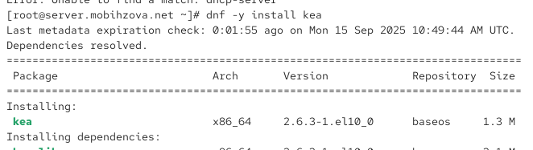{#fig-002 width=70%}

## Конфигурирование DHCP-сервера

Сохраним на всякий случай конфигурационный файл. Откроем для редактирования конфигурационный файл ([рис. @fig-003]).

{#fig-003 width=70%}

В этом файле заменим шаблон для domain-name, блок domain-name-servers и на базе одного из приведённых в файле примеров конфигурирования подсети зададим собственную конфигурацию dhcp-сети, задав адрес подсети, диапазон адресов для распределения клиентам, адрес маршрутизатора и broadcast-адрес. Остальные примеры задания конфигураций подсетей удалим. Настроим привязку dhcpd к интерфейсу eth1 виртуальной машины server ([рис. @fig-004]).

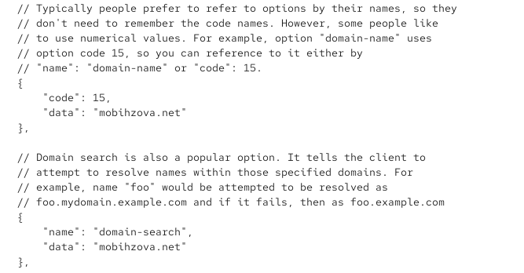{#fig-004 width=70%} 

Проверим правильность конфигурационного файла ([рис. @fig-005]).

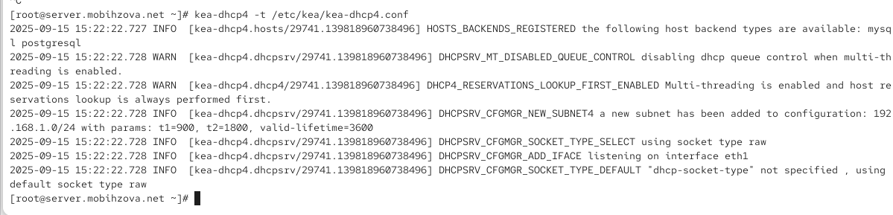{#fig-005 width=70%}

Перезагрузим конфигурацию dhcpd и разрешим загрузку DHCP-сервера при запуске виртуальной машины server ([рис. @fig-006]).

{#fig-006 width=70%} 

Добавим запись для DHCP-сервера в конце файла прямой DNS-зоны /var/named/master/fz/user.net ([рис. @fig-007]).

{#fig-007 width=70%} 

Добавим запись для DHCP-сервера в конце файла обратной зоны /var/named/master/rz/192.168.1 ([рис. @fig-008]).

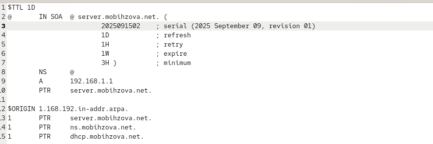{#fig-008 width=70%} 

Перезапустим named. Проверим, что можно обратиться к DHCP-серверу по имени ([рис. @fig-009]).

{#fig-009 width=70%}

Внесем изменения в настройки межсетевого экрана узла server, разрешив работу с DHCP ([рис. @fig-010]).

{#fig-010 width=70%}

Восстановим контекст безопасности в SELinux ([рис. @fig-011]).

{#fig-011 width=70%}

В дополнительном терминале запустим мониторинг происходящих в системе процессов в реальном времени ([рис. @fig-012]).

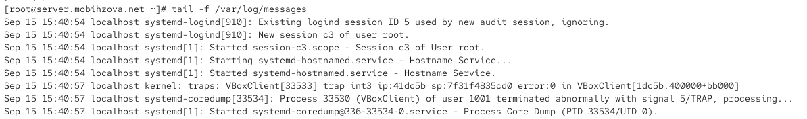{#fig-012 width=70%}

В основном рабочем терминале запустим DHCP-сервер ([рис. @fig-013]).

{#fig-013 width=70%}

## Анализ работы DHCP-сервера

Перед запуском виртуальной машины client в каталоге с проектом в нашей операционной системе в подкаталоге vagrant/provision/client создадим файл 01-routing.sh. Открыв его на редактирование, пропишем в нём скрипт ([рис. @fig-014]).

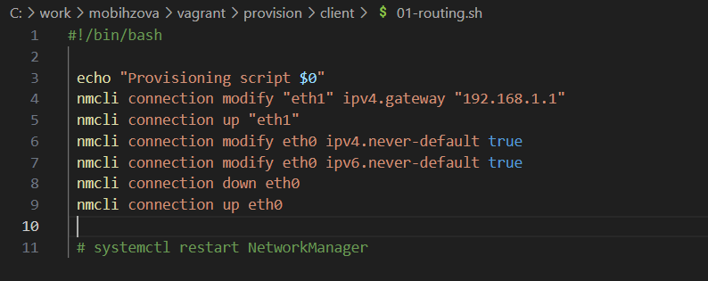{#fig-014 width=70%}

Этот скрипт изменяет настройки NetworkManager так, чтобы весь трафик на виртуальной машине client шёл по умолчанию через интерфейс eth1. 

В Vagrantfile подключим этот скрипт в разделе конфигурации для клиента ([рис. @fig-015]).

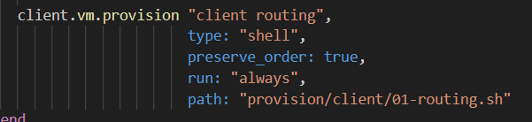{#fig-015 width=70%}

Зафиксируем внесённые изменения для внутренних настроек виртуальной машины client и запустим её ([рис. @fig-016]).

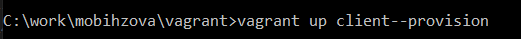{#fig-016 width=70%}

Ввойдем в систему виртуальной машины client под нашим пользователем и откроем терминал. В терминале введем ifconfig ([рис. @fig-017]).

{#fig-017 width=70%}

На экран будет выведена информация об имеющихся интерфейсах. На виртуальной машине client настроены три сетевых интерфейса: eth0 (NAT-интерфейс с IP 10.0.2.15 для доступа во внешнюю сеть), eth1 (внутренний интерфейс с IP 192.168.1.2/24, полученным через DHCP, что подтверждает работу DHCP-сервера) и loopback (lo). Интерфейс eth1 имеет корректную конфигурацию для работы во внутренней сети — назначен адрес из пула DHCP (192.168.1.2), маска 255.255.255.0 и broadcast 192.168.1.255, а также активное состояние (UP, RUNNING), что свидетельствует о успешном подключении к виртуальной сети и получении настроек по протоколу DHCP.

На машине server посмотрим список выданных адресов ([рис. @fig-018]).

{#fig-018 width=70%}

Заголовок указывает на структуру данных: address (IP-адрес), hwaddr (MAC-адрес), client_id (идентификатор клиента), valid_lifetime (время жизни аренды), expire (время истечения), subnet_id (ID подсети), fqdn_fwd (прямое DNS-обновление), fqdn_rev (обратное DNS-обновление), hostname (имя узла), state (состояние аренды), user_context (контекст пользователя), pool_id (ID пула).

## Настройка обновления DNS-зоны

Создадим ключ на сервере с Bind9 (на виртуальной машине server). Поправим права доступа ([рис. @fig-019]).

{#fig-019 width=70%}

Подключим ключ в файле /etc/named.conf ([рис. @fig-020]).

{#fig-020 width=70%}

На виртуальной машине server под пользователем с правами суперпользователя отредактируем файл /etc/named/user.net ([рис. @fig-021]).

{#fig-021 width=70%}

Сделаем проверку конфигурационного файла. Перезапустим DNS-сервер ([рис. @fig-022]).

{#fig-022 width=70%}

Перенесём ключ на сервер Kea DHCP и перепишем его в формате json ([рис. @fig-023]).

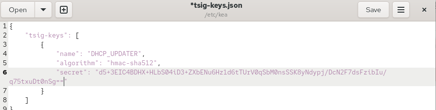{#fig-023 width=70%}

Сменим владельца. Поправим права доступа ([рис. @fig-024]).

{#fig-024 width=70%}

Внесём изменения в файле /etc/kea/kea-dhcp-ddns.conf ([рис. @fig-025]).

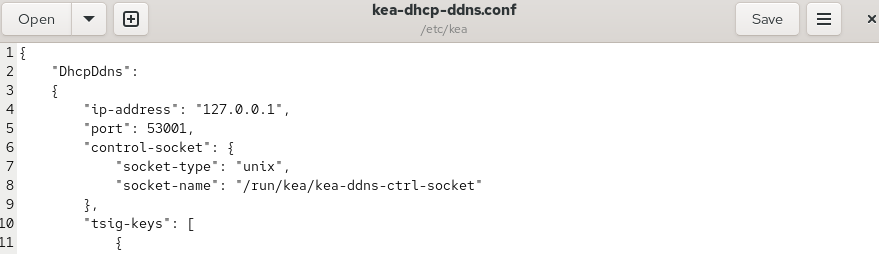{#fig-025 width=70%}

Изменим владельца файла. Проверим файл на наличие возможных синтаксических ошибок. Запустим службу ddns. Проверим статус работы службы ([рис. @fig-026]).

{#fig-026 width=70%}

Внесем изменения в конфигурационный файл /etc/kea/kea-dhcp4.conf, добавив в него разрешение на динамическое обновление DNS-записей с локального узла прямой и обратной зон ([рис. @fig-027]).

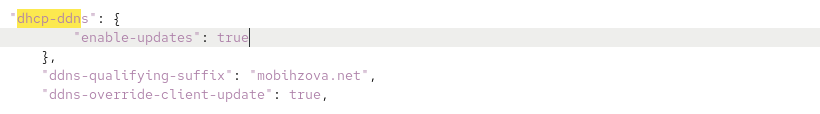{#fig-027 width=70%}

Проверим файл на наличие возможных синтаксических ошибок ([рис. @fig-028]).

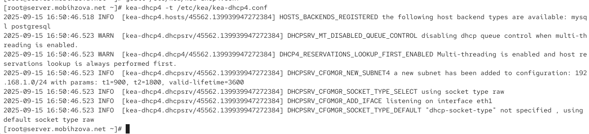{#fig-028 width=70%}

Перезапустим DHCP-сервер. Проверим статус ([рис. @fig-029]).

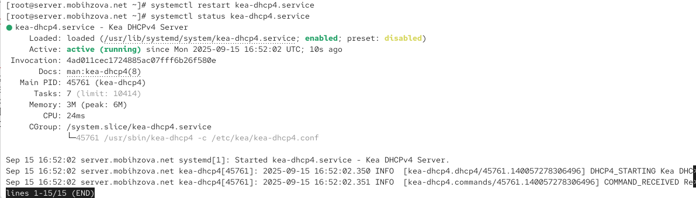{#fig-029 width=70%}

На машине client переполучим адрес ([рис. @fig-030]).

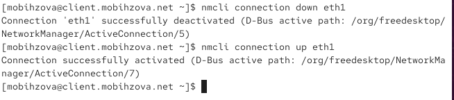{#fig-030 width=70%}

## Анализ работы DHCP-сервера после настройки обновления DNS-зоны

На виртуальной машине client под нашим пользователем откроем терминал и с помощью утилиты dig убедимся в наличии DNS-записи о клиенте в прямой DNS-зоне ([рис. @fig-031]).

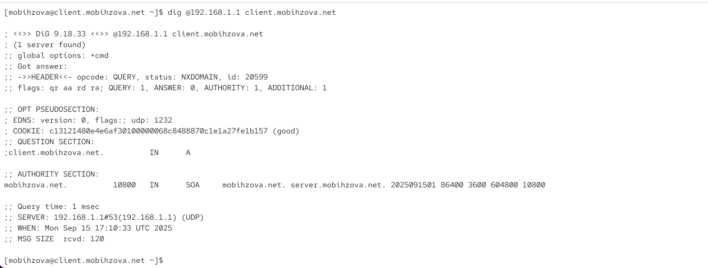{#fig-031 width=70%}

Анализ вывода dig @192.168.1.1 client.mobthzova.net:

Строка 1-2: Утилита DIG версии 9.18.33 выполняет запрос к DNS-серверу 192.168.1.1 для разрешения имени client.mobthzova.net.

Строка 3-4: Найден один сервер (192.168.1.1), глобальные опции включены (командный режим).

Строка 5-7: Получен ответ с заголовком: opcode QUERY (стандартный запрос), статус NXDOMAIN (запись не найдена), id 20599 (идентификатор транзакции).

Строка 8: Флаги ответа: qr (ответный пакет), aa (авторитативный ответ от сервера зоны), rd (рекурсия запрошена), ra (рекурсия доступна).

Строка 9-12: Псевдосекция OPT: версия EDNS 0, размер UDP-буфера 1232 байта, корректный COOKIE для защиты от атак.

Строка 13-14: Секция вопроса: запрос записи типа A (IPv4-адрес) для имени client.mobthzova.net.

Строка 15-16: Секция authority: SOA-запись зоны mobthzova.net, подтверждающая авторитативность сервера (серийный номер 2025091501, тайминги обновления).

Строка 17-19: Время выполнения запроса — 1 мс, сервер ответил по UDP на порту 53, время запроса — 15.09.2025 17:10:33 UTC.

Строка 20: Размер полученного сообщения — 120 байт.
    
## Внесение изменений в настройки внутреннего окружения виртуальной машины

На виртуальной машине server перейдем в каталог для внесения изменений в настройки внутреннего окружения /vagrant/provision/server/, создадим в нём каталог dhcp, в который поместим в соответствующие подкаталоги конфигурационные файлы DHCP ([рис. @fig-032]).

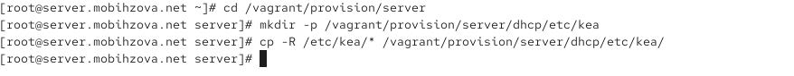{#fig-032 width=70%}

Заменим конфигурационные файлы DNS-сервера ([рис. @fig-033]).

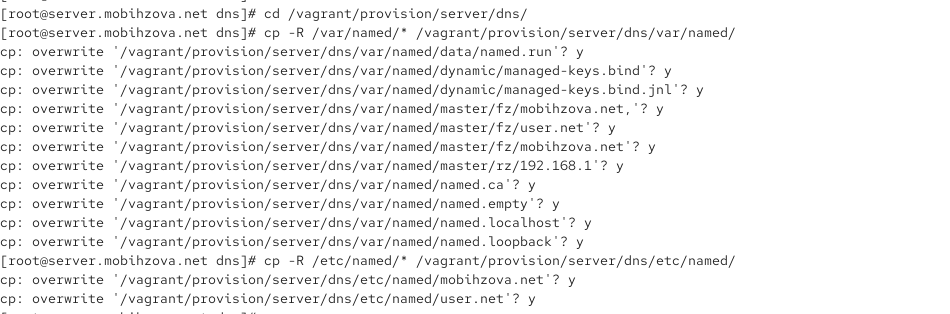{#fig-033 width=70%}

В каталоге /vagrant/provision/server создадим исполняемый файл dhcp.sh ([рис. @fig-034]).

{#fig-034 width=70%}

Открыв его на редактирование, пропишем в нём скрипт ([рис. @fig-035]).

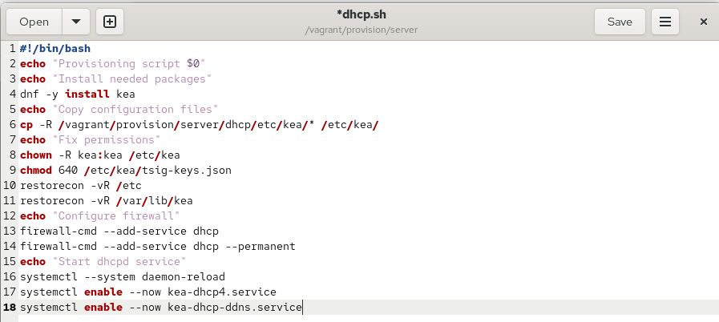{#fig-035 width=70%}

Для отработки созданного скрипта во время загрузки виртуальной машины server в конфигурационном файле Vagrantfile необходимо добавить в разделе конфигурации для сервера ([рис. @fig-036]).

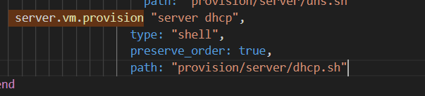{#fig-036 width=70%}

После этого виртуальные машины client и server можно выключить.

# Выводы

В ходе выполнения лабораторной работы мной были приобретены практические навыки по установке и конфигурированию DHCP-
сервера.

# Ответы на контрольные вопросы

Ответы на контрольные вопросы:

1. В каких файлах хранятся настройки сетевых подключений?  
Настройки сетевых подключений в Linux хранятся в файлах конфигурации сетевых интерфейсов, расположенных в директории /etc/sysconfig/network-scripts/ (для систем, использующих NetworkManager) или в /etc/netplan/ (для систем на основе Netplan). Основные файлы:  
- /etc/sysconfig/network-scripts/ifcfg-<интерфейс> — настройки конкретного интерфейса,  
- /etc/resolv.conf — DNS-серверы и доменные суффиксы,  
- /etc/hosts — статические записи имён узлов.  

2. За что отвечает протокол DHCP?  
Протокол DHCP (Dynamic Host Configuration Protocol) отвечает за автоматическое назначение сетевых параметров узлам в сети, включая IP-адрес, маску подсети, шлюз по умолчанию, адреса DNS-серверов и другие опции. Это позволяет избежать ручной настройки каждого устройства.  

3. Поясните принцип работы протокола DHCP. Какими сообщениями обмениваются клиент и сервер?  
Принцип работы DHCP основан на модели «клиент-сервер» и включает четыре этапа:  
- DISCOVER — клиент широковещательно запрашивает доступный DHCP-сервер;  
- OFFER — сервер предлагает клиенту конфигурацию (IP-адрес и параметры);  
- REQUEST — клиент подтверждает принятие предложения;  
- ACKNOWLEDGMENT — сервер подтверждает выделение адреса и параметров.  

4. В каких файлах обычно находятся настройки DHCP-сервера? За что отвечает каждый из файлов?  
Настройки DHCP-сервера в Linux хранятся в:  
- /etc/dhcp/dhcpd.conf — основной конфигурационный файл, определяющий подсети, пулы адресов, опции и резервирования;  
- /var/lib/dhcpd/dhcpd.leases — база данных выданных аренд IP-адресов;  
- /etc/sysconfig/dhcpd — параметры запуска демона DHCP.  

5. Что такое DDNS? Для чего применяется DDNS?  
DDNS (Dynamic Domain Name System) — это механизм динамического обновления DNS-записей в реальном времени. Он применяется для автоматического сопоставления изменяющихся IP-адресов (например, полученных через DHCP) с постоянными доменными именами, что особенно полезно для узлов с нестатическими адресами.  

6. Какую информацию можно получить, используя утилиту ifconfig? Приведите примеры с использованием различных опций.  
Утилита ifconfig отображает конфигурацию сетевых интерфейсов: IP-адрес, MAC-адрес, маску подсети, статистику трафика. Примеры:  
- ifconfig — информация обо всех интерфейсах;  
- ifconfig eth0 — детали интерфейса eth0;  
- ifconfig eth0 up — активация интерфейса eth0;  
- ifconfig eth0 192.168.1.10 netmask 255.255.255.0 — ручная установка IP и маски.  

7. Какую информацию можно получить, используя утилиту ping? Приведите примеры с использованием различных опций.  
Утилита ping проверяет доступность узла и измеряет задержку (RTT). Примеры:  
- ping example.com — отправка эхо-запросов до упора;  
- ping -c 4 192.168.1.1 — отправка 4 пакетов;  
- ping -i 2 8.8.8.8 — интервал между запросами 2 секунды;  
- ping -s 1000 google.com — отправка пакетов размером 1000 байт.
