---
# Preamble

## Author
author:
  name: Бызова Мария Олеговна
## Title
title: Отчет по лабораторной работе № 4
subtitle: Базовая настройка HTTP-сервера Apache
license: CC BY
date: 2025-09-23

## Generic options
lang: ru-RU
crossref:
  lof-title: Список иллюстраций
  lot-title: Список таблиц
  lol-title: Листинги

## Fonts 
mainfont: PT Serif 
romanfont: PT Serif 
sansfont: PT Sans 
monofont: PT Mono 
mainfontoptions: Ligatures=TeX 
romanfontoptions: Ligatures=TeX 
sansfontoptions: Ligatures=TeX,Scale=MatchLowercase 
monofontoptions: Scale=MatchLowercase,Scale=0.9

## Formats
format:
### Pdf output format
  beamer:
    toc: true
    toc-title: Содержание
    number-sections: true
    colorlinks: false
    toc-depth: 2
    slide_level: 2
    aspectratio: 169
    section-titles: true
    theme: metropolis
    themeoptions: progressbar=frametitle,sectionpage=progressbar,numbering=fraction
    pdf-engine: xelatex
    fontenc: T2A
#### Language
    babel-lang: russian
    babel-otherlangs: english

### Html output
  revealjs:
    transition: slide
    margin: 0.2
    smaller: false
    output-ext: html
    theme: beige
    logo: _resources/image/logo_rudn.png
---

## Цель работы

Целью данной работы является приобретение практических навыков по установке и базовому конфигурированию HTTP-сервера Apache.

# Выполнение лабораторной работы

## Установка HTTP-сервера

Загрузим нашу операционную систему и перейдём в рабочий каталог с проектом. Далее запустим виртуальную машину server (рис. 1)

{#fig-001 width=70%}

## Установка HTTP-сервера

На виртуальной машине server войдём под нашим пользователем и откроем терминал. Далее перейдём в режим суперпользователя и установим из репозитория стандартный веб-сервер (HTTP-сервер и утилиты httpd, криптоутилиты и пр.) (рис. 2)

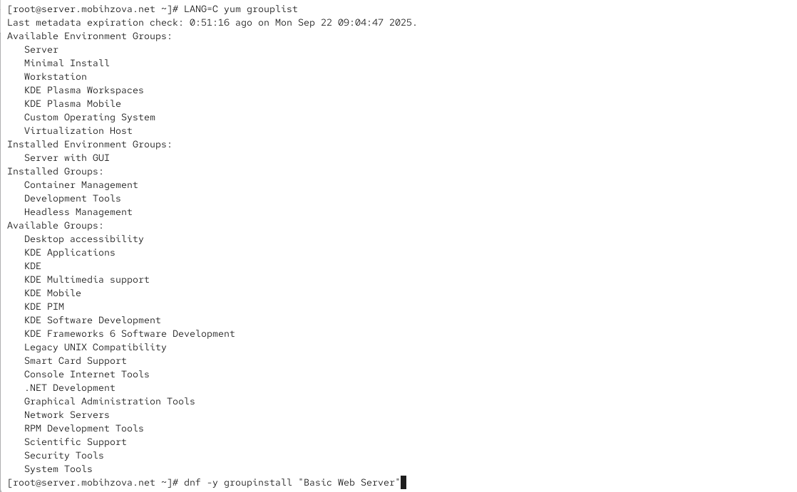{#fig-002 width=40%}

## Базовое конфигурирование HTTP-сервера

Посмотрим какие конфигурационные файлы есть в каталогах /etc/httpd/conf и /etc/httpd/conf.d ((рис. 3) - (рис. 11)).

## Базовое конфигурирование HTTP-сервера

{#fig-003 width=70%}

## Базовое конфигурирование HTTP-сервера

{#fig-004 width=70%}

## Базовое конфигурирование HTTP-сервера

{#fig-005 width=70%}

## Базовое конфигурирование HTTP-сервера

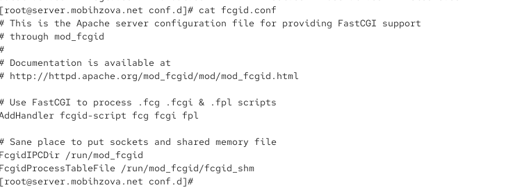{#fig-006 width=70%}

## Базовое конфигурирование HTTP-сервера

{#fig-007 width=70%}

## Базовое конфигурирование HTTP-сервера

{#fig-008 width=70%}

## Базовое конфигурирование HTTP-сервера

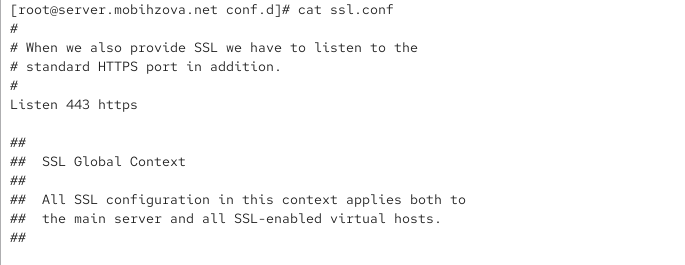{#fig-009 width=70%}

## Базовое конфигурирование HTTP-сервера

{#fig-010 width=70%}

## Базовое конфигурирование HTTP-сервера

{#fig-011 width=70%}

## Базовое конфигурирование HTTP-сервера

Внесём изменения в настройки межсетевого экрана узла server, разрешив работу с http (рис. 12).

{#fig-012 width=70%}

## Базовое конфигурирование HTTP-сервера

В дополнительном терминале запустим в режиме реального времени расширенный лог системных сообщений, чтобы проверить корректность работы системы (рис. 13).

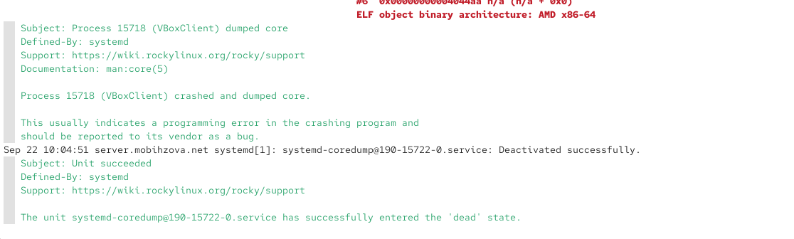{#fig-013 width=70%}

## Базовое конфигурирование HTTP-сервера

В первом терминале активируем и запустим HTTP-сервер (рис. 14).

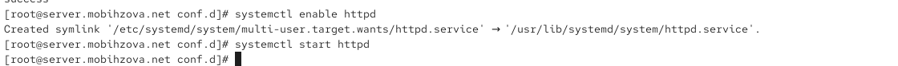{#fig-014 width=70%}

## Базовое конфигурирование HTTP-сервера

Просмотрим расширенный лог системных сообщений, убедимся, что веб-сервер успешно запустился.

## Анализ работы HTTP-сервера

Запустим виртуальную машину client. На виртуальной машине server просмотрим лог ошибок работы веб-сервера. Далее запустим мониторинг доступа к веб-серверу. (рис. 15)

{#fig-015 width=70%}

## Анализ работы HTTP-сервера

На виртуальной машине client запустим браузер и в адресной строке введём 192.168.1.1 (рис. 16)

{#fig-016 width=70%}

## Настройка виртуального хостинга для HTTP-сервера

Остановим работу DNS-сервера для внесения изменений в файлы описания DNS-зон (рис. 17)

{#fig-017 width=70%}

## Настройка виртуального хостинга для HTTP-сервера

Теперь добавим запись для HTTP-сервера в конце файла прямой DNS-зоны (рис. 18)

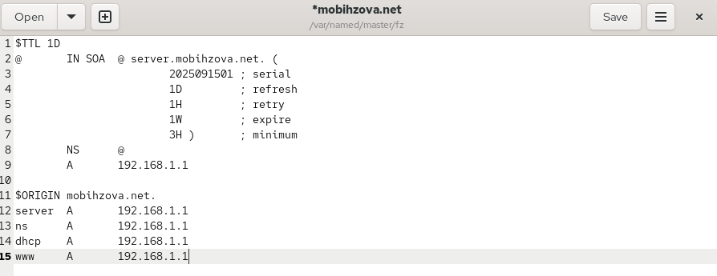{#fig-018 width=70%}

## Настройка виртуального хостинга для HTTP-сервера

Также в конце файла обратной зоны /var/named/master/rz/192.168.1 (рис. 19)

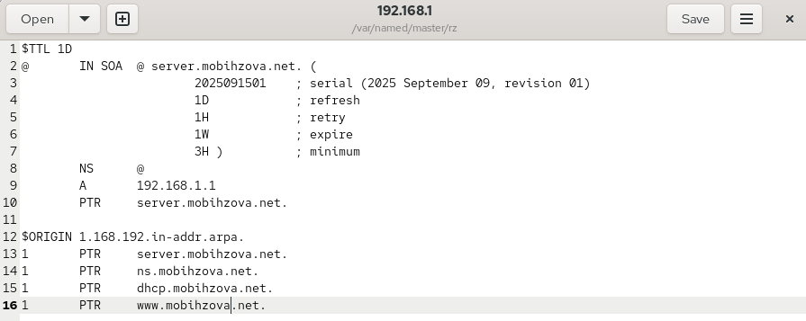{#fig-019 width=70%}

## Настройка виртуального хостинга для HTTP-сервера

Перезапустим DNS-сервер. В каталоге /etc/httpd/conf.d создадим файлы server.mobihzova.net.conf и www.mobihzova.net.conf (рис. 20)

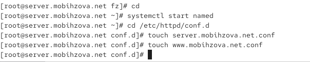{#fig-020 width=70%}

## Настройка виртуального хостинга для HTTP-сервера

Откроем на редактирование файл server.mobihzova.net.conf и внесём туда следующее содержание (рис. 21)

{#fig-021 width=70%}

## Настройка виртуального хостинга для HTTP-сервера

Откроем на редактирование файл www.mobihzova.net.conf и внесём туда следующее содержание (рис. 22)

{#fig-022 width=70%}

## Настройка виртуального хостинга для HTTP-сервера

Перейдём в каталог /var/www/html, в котором находятся файлы с содержимым (контентом) веб-серверов, и создадим тестовые страницы для виртуальных веб-серверов. Для виртуального веб-сервера server.mobihzova.net (рис. 23)

{#fig-023 width=70%}

## Настройка виртуального хостинга для HTTP-сервера

Откроем на редактирование файл index.html и внесём следующее содержание (рис. 24)

{#fig-024 width=70%}

## Настройка виртуального хостинга для HTTP-сервера

Для виртуального веб-сервера www.mobihzova.net (рис. 25)

{#fig-025 width=70%}

## Настройка виртуального хостинга для HTTP-сервера

Откроем на редактирование файл index.html и внесём следующее содержание (рис. 26)

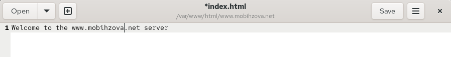{#fig-026 width=70%}

## Настройка виртуального хостинга для HTTP-сервера

Скорректируем права доступа в каталог с веб-контентом. Далее восстановим контекст безопасности в SELinux(рис. 27)

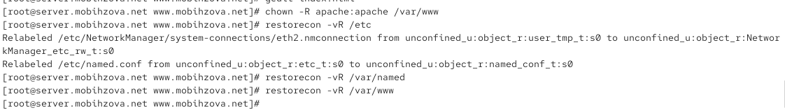{#fig-027 width=70%}

## Настройка виртуального хостинга для HTTP-сервера

Теперь перезапустим HTTP-сервер (рис. 28)

{#fig-028 width=70%}

## Настройка виртуального хостинга для HTTP-сервера

На виртуальной машине client убедимся в корректном доступе к веб-серверам (рис. 29 - рис. 30).

## Настройка виртуального хостинга для HTTP-сервера

{#fig-029 width=70%}

## Настройка виртуального хостинга для HTTP-сервера

{#fig-030 width=70%}

## Внесение изменений в настройки внутреннего окружения виртуальной машины

На виртуальной машине server перейдём в каталог для внесения изменений в настройки внутреннего окружения /vagrant/provision/server/, создадим в нём каталог http, в который поместим в соответствующие подкаталоги конфигурационные файлы HTTP-сервера. Теперь заменим конфигурационные файлы DNS-сервера. В каталоге /vagrant/provision/server создадим исполняемый файл http.sh (рис. 31).

## Внесение изменений в настройки внутреннего окружения виртуальной машины

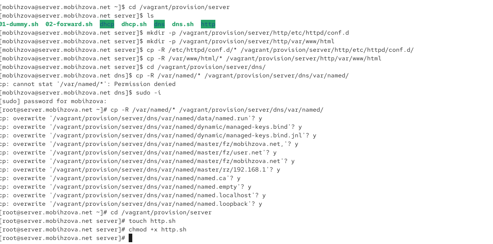{#fig-031 width=40%}

## Внесение изменений в настройки внутреннего окружения виртуальной машины

Откроем созданный файл на редактирование и пропишем в нём скрипт (рис. 32)

## Внесение изменений в настройки внутреннего окружения виртуальной машины

{#fig-032 width=70%}

## Внесение изменений в настройки внутреннего окружения виртуальной машины

Для отработки созданного скрипта во время загрузки виртуальных машин в конфигурационном файле Vagrantfile добавим в конфигурации сервера следующую запись (рис. 33)

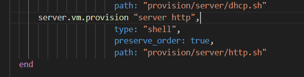{#fig-033 width=70%}

## Выводы

В ходе выполнения лабораторной работы были приобретены практические навыки по установке и базовому конфигурированию HTTP-сервера Apache.

