---
# Preamble

## Author
author:
  name: Бызова Мария Олеговна
## Title
title: "Отчёт по лабораторной работе №4"
subtitle: "Администрирование сететвых подсистем"
license: "CC BY"
## Generic options
lang: ru-RU
number-sections: true
toc: true
toc-title: "Содержание"
toc-depth: 2
## Crossref customization
crossref:
  lof-title: "Список иллюстраций"
  lot-title: "Список таблиц"
  lol-title: "Листинги"
## Bibliography
bibliography:
  - bib/cite.bib
csl: _resources/csl/gost-r-7-0-5-2008-numeric.csl
## Formats
format:
### Pdf output format
  pdf:
    toc: true
    number-sections: true
    colorlinks: false
    toc-depth: 2
    lof: true # List of figures
    lot: true # List of tables
#### Document
    documentclass: scrreprt
    papersize: a4
    fontsize: 12pt
    linestretch: 1.5
#### Language
    babel-lang: russian
    babel-otherlangs: english
#### Biblatex
    cite-method: biblatex
    biblio-style: gost-numeric
    biblatexoptions:
      - backend=biber
      - langhook=extras
      - autolang=other*
#### Misc options
    csquotes: true
    indent: true
    header-includes: |
      \usepackage{indentfirst}
      \usepackage{float}
      \floatplacement{figure}{H}
      \usepackage[math,RM={Scale=0.94},SS={Scale=0.94},SScon={Scale=0.94},TT={Scale=MatchLowercase,FakeStretch=0.9},DefaultFeatures={Ligatures=Common}]{plex-otf}
### Docx output format
  docx:
    toc: true
    number-sections: true
    toc-depth: 2
---

# Цель работы

Целью данной работы является приобретение практических навыков по установке и базовому конфигурированию HTTP-сервера Apache.

# Выполнение лабораторной работы

## Установка HTTP-сервера

Загрузим нашу операционную систему и перейдём в рабочий каталог с проектом. Далее запустим виртуальную машину server ([рис. @fig-001]).

{#fig-001 width=70%}

На виртуальной машине server войдём под нашим пользователем и откроем терминал. Далее перейдём в режим суперпользователя и установим из репозитория стандартный веб-сервер (HTTP-сервер и утилиты httpd, криптоутилиты и пр.) ([рис. @fig-002]).

{#fig-002 width=70%}

## Базовое конфигурирование HTTP-сервера

Посмотрим какие конфигурационные файлы есть в каталогах /etc/httpd/conf и /etc/httpd/conf.d ([рис. @fig-003] - [рис. @fig-011]).

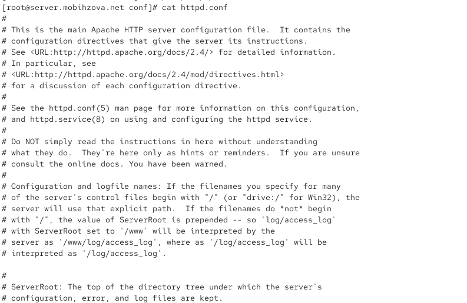{#fig-003 width=70%}

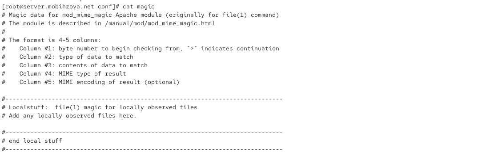{#fig-004 width=70%}

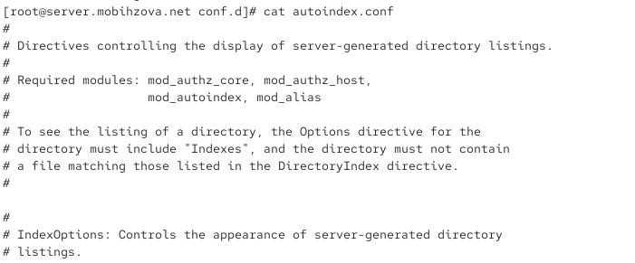{#fig-005 width=70%}

{#fig-006 width=70%}

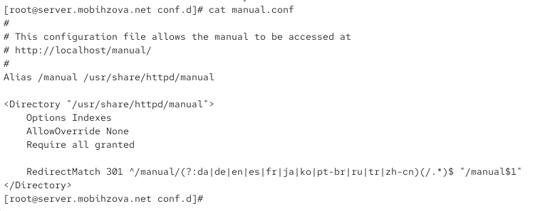{#fig-007 width=70%}

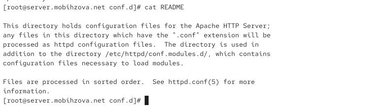{#fig-008 width=70%}

{#fig-009 width=70%}

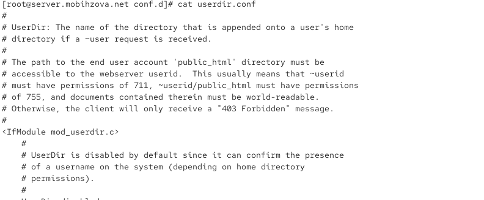{#fig-010 width=70%}

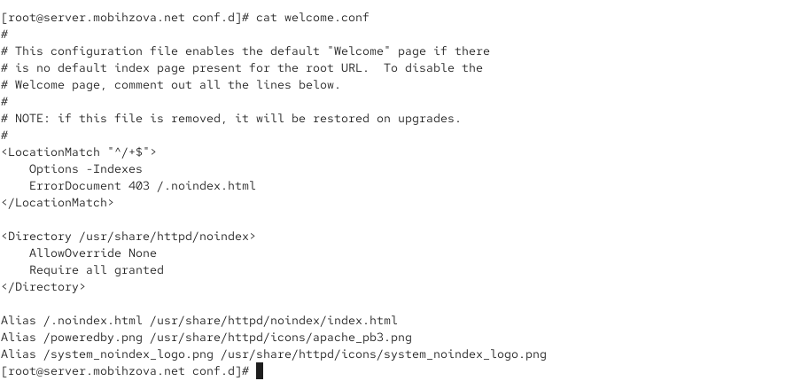{#fig-011 width=70%}

Данный файл httpd.conf является основным конфигурационным файлом веб-сервера Apache. Он содержит главные директивы, которые определяют работу сервера, такие как настройки виртуальных хостов, портов прослушивания, путей к корневым директориям сервера (ServerRoot) и логам. Файл хорошо документирован и отсылает администратора к официальной документации для понимания назначения каждой директивы, что подчёркивает его критическую важность для функционирования всего веб-сервера.

Файл magic используется модулем Apache mod_mime_magic (или утилитой file в системе) для определения типа файла (MIME-типа) по его содержимому ("магическим числам" или сигнатурам), а не только по расширению. Синтаксис файла позволяет задавать последовательности байтов, их смещение в файле и соответствующий им MIME-тип. 

Конфигурационный файл autoindex.conf, расположенный в каталоге conf.d, управляет отображением автоматически генерируемых списков файлов в директориях веб-сервера (когда отсутствует индексный файл, например, index.html). Как указано в комментариях, для работы этой функции у директории должна быть активна опция Indexes в директиве Options.

Файл fcqid.conf настраивает поддержку FastCGI через модуль mod_fcqid, который предназначен для эффективного выполнения динамических приложений (например, написанных на PHP, Python). Директива AddHandler связывает расширения файлов .fcg, .fcgi и .fpl с обработчиком fcqid-script. Далее в файле задаются пути для сокетов и файла разделяемой памяти (FcqidIPCDir, FcqidProcessTableFile), которые используются для межпроцессного взаимодействия, что является ключевым для производительности FastCGI.

Данный файл manual.conf настраивает доступ к документации Apache HTTP Server через веб-интерфейс по адресу http://localhost/manual/. Директива Alias сопоставляет URL-путь /manual с физическим каталогом на сервере /usr/share/httpd/manual. В секции <Directory> разрешён доступ к этому каталогу и генерация индексного списка файлов (опция Indexes). Директива RedirectMatch выполняет постоянное перенаправление (код 301) с URL-ов, содержащих указанные языковые префиксы (например, /manual/en/), на базовый путь /manual, что, вероятно, предназначено для выбора языка документации по умолчанию.

Файл README является информационным и объясняет назначение каталога conf.d. В нём указано, что все файлы с расширением .conf в этом каталоге автоматически обрабатываются веб-сервером Apache как часть его конфигурации, что позволяет удобно модульно организовать настройки. Также упоминается, что файлы обрабатываются в алфавитном порядке, и что существует отдельный каталог conf.modules.d/ для конфигурации загружаемых модулей.

Файл ssl.conf содержит начальные настройки для работы веб-сервера по протоколу HTTPS. Директива Listen 443 https предписывает серверу прослушивать входящие соединения на стандартном порту 443 для защищённого HTTPS-трафика. Комментарии указывают, что последующие настройки в глобальном контексте SSL Global Context будут применяться ко всему серверу и всем SSL-виртуальным хостам, определяя такие параметры, как пути к сертификатам, версии протоколов и шифры.

Конфигурационный файл userdir.conf управляет функционалом пользовательских директорий, который позволяет пользователям системы размещать веб-контент в своих домашних каталогах (обычно в папке public_html). Файл активирован условной директивой <IfModule mod_userdir.c>, проверяющей наличие модуля mod_userdir. Комментарии подробно объясняют требования к правам доступа: домашний каталог пользователя должен иметь права 711, а папка public_html — 755, чтобы веб-сервер мог получить к ним доступ. Отмечается, что функция по умолчанию отключена из-соображений безопасности.

Файл welcome.conf определяет поведение сервера при обращении к корневому URL (например, http://localhost/), когда в корневой директории сайта отсутствует индексный файл. С помощью директивы <LocationMatch> для запросов к корню отключается генерация списка файлов (-Indexes) и вместо ошибки 403 "Forbidden" устанавливается кастомный документ /.notindex.html. Далее, с помощью директив Alias, этот документ и несколько изображений сопоставляются с реальными файлами в каталоге /usr/share/httpd/notindex/, которые образуют стандартную "Приветственную страницу" Apache. Это страница по умолчанию, которая отображается на новом сервере.

Внесём изменения в настройки межсетевого экрана узла server, разрешив работу с http ([рис. @fig-012]).

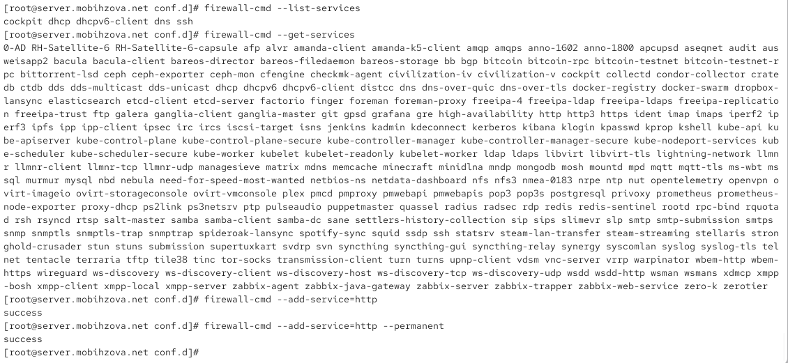{#fig-012 width=70%}

В дополнительном терминале запустим в режиме реального времени расширенный лог системных сообщений, чтобы проверить корректность работы системы ([рис. @fig-013]).

{#fig-013 width=70%}

В первом терминале активируем и запустим HTTP-сервер ([рис. @fig-014]).

{#fig-014 width=70%}

Просмотрим расширенный лог системных сообщений, убедимся, что веб-сервер успешно запустился.

## Анализ работы HTTP-сервера

Запустим виртуальную машину client. На виртуальной машине server просмотрим лог ошибок работы веб-сервера. Далее запустим мониторинг доступа к веб-серверу. ([рис. @fig-015]).

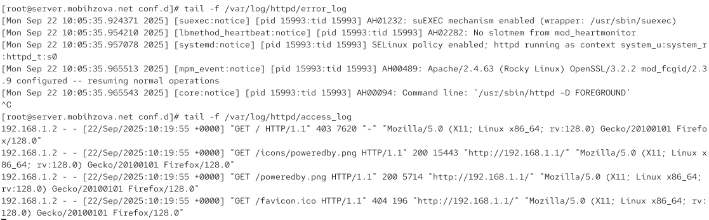{#fig-015 width=70%}

На виртуальной машине client запустим браузер и в адресной строке введём 192.168.1.1 ([рис. @fig-016]).

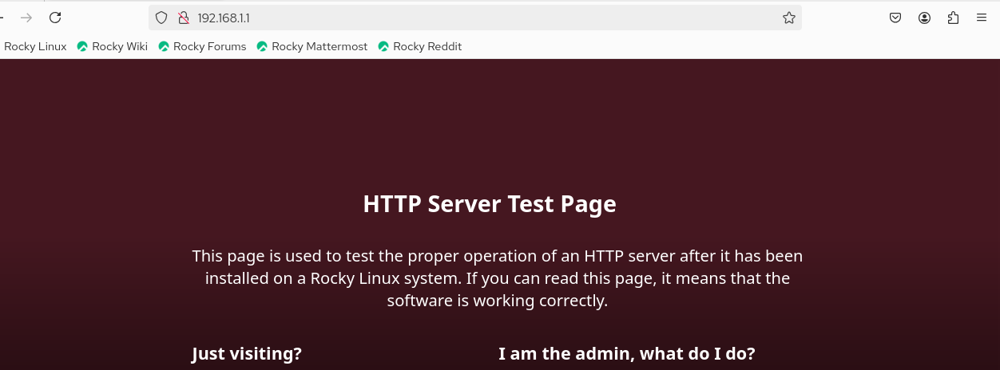{#fig-016 width=70%}

Анализ обращения к веб-серверу по адресу 192.168.1.1, выполненный на основе журналов и содержимого страницы, показывает штатную и корректную работу сервера Apache. Стандартная тестовая страница HTTP-сервера Rocky Linux, увиденная в браузере, свидетельствует о том, что сервер успешно обрабатывает запросы. Мониторинг журналов детализирует этот процесс: запрос от клиента 192.168.1.2 на получение корневой страницы (GET /) изначально привёл к ответу с кодом состояния 403 Forbidden, что является стандартной реакцией при отсутствии индексного файла в корневой директории и запрете на листинг содержимого. Однако благодаря конфигурации, заданной в файле welcome.conf, вместо голой ошибки сработала директива ErrorDocument 403, которая перенаправила клиента на кастомную страницу /.notindex.html, отобразившую знакомую тестовую страницу. Последующие автоматические запросы браузера на загрузку изображений с этой страницы (`/poweredby.png`) были успешно обработаны с кодом 200 OK, а попытка найти фавиконку вернула ожидаемую ошибку 404 Not Found. При этом журнал ошибок (`error_log`) не содержит каких-либо критичных сообщений, фиксируя лишь информационные уведомления о успешном запуске всех необходимых модулей (suexec, mod_fcgid), работе под управлением SELinux и переходе сервера в нормальный режим работы, что в совокупности подтверждает стабильную и правильно настроенную конфигурацию веб-сервера.

## Настройка виртуального хостинга для HTTP-сервера

Остановим работу DNS-сервера для внесения изменений в файлы описания DNS-зон ([рис. @fig-017]).

{#fig-017 width=70%}

Теперь добавим запись для HTTP-сервера в конце файла прямой DNS-зоны ([рис. @fig-018]).

{#fig-018 width=70%}

Также в конце файла обратной зоны /var/named/master/rz/192.168.1 ([рис. @fig-019]).

{#fig-019 width=70%}

Перезапустим DNS-сервер. В каталоге /etc/httpd/conf.d создадим файлы server.mobihzova.net.conf и www.mobihzova.net.conf ([рис. @fig-020]).

{#fig-020 width=70%}

Откроем на редактирование файл server.mobihzova.net.conf и внесём туда следующее содержание ([рис. @fig-021]).

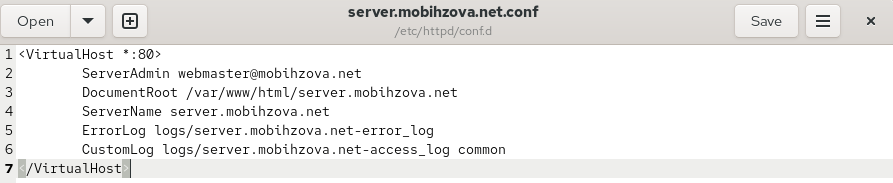{#fig-021 width=70%}

Откроем на редактирование файл www.mobihzova.net.conf и внесём туда следующее содержание ([рис. @fig-022]).

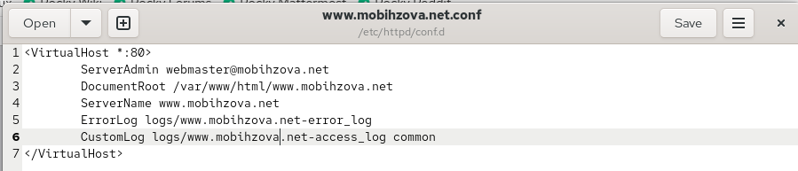{#fig-022 width=70%}

Перейдём в каталог /var/www/html, в котором находятся файлы с содержимым (контентом) веб-серверов, и создадим тестовые страницы для виртуальных веб-серверов. Для виртуального веб-сервера server.mobihzova.net ([рис. @fig-023]).

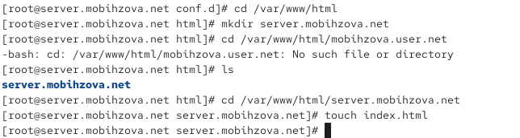{#fig-023 width=70%}

Откроем на редактирование файл index.html и внесём следующее содержание ([рис. @fig-024]).

{#fig-024 width=70%}

Для виртуального веб-сервера www.mobihzova.net ([рис. @fig-025]).

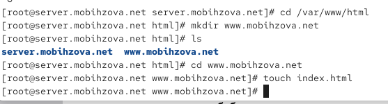{#fig-025 width=70%}

Откроем на редактирование файл index.html и внесём следующее содержание ([рис. @fig-026]).

{#fig-026 width=70%}

Скорректируем права доступа в каталог с веб-контентом. Далее восстановим контекст безопасности в SELinux.([рис. @fig-027]).

{#fig-027 width=70%}

Теперь перезапустим HTTP-сервер ([рис. @fig-028]).

{#fig-028 width=70%}

На виртуальной машине client убедимся в корректном доступе к веб-серверам ([рис. @fig-029] - [рис. @fig-030]).

{#fig-029 width=70%}

{#fig-030 width=70%}

## Внесение изменений в настройки внутреннего окружения виртуальной машины

На виртуальной машине server перейдём в каталог для внесения изменений в настройки внутреннего окружения /vagrant/provision/server/, создадим в нём каталог http, в который поместим в соответствующие подкаталоги конфигурационные файлы HTTP-сервера. Теперь заменим конфигурационные файлы DNS-сервера. В каталоге /vagrant/provision/server создадим исполняемый файл http.sh ([рис. @fig-031]).

{#fig-031 width=70%}

Откроем созданный файл на редактирование и пропишем в нём скрипт ([рис. @fig-032]).

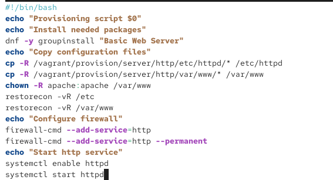{#fig-032 width=70%}

Для отработки созданного скрипта во время загрузки виртуальных машин в конфигурационном файле Vagrantfile добавим в конфигурации сервера следующую запись ([рис. @fig-033]).

{#fig-033 width=70%}

# Выводы

В ходе выполнения лабораторной работы были приобретены практические навыки по установке и базовому конфигурированию HTTP-сервера Apache.

# Ответы на контрольные вопросы 

1. Через какой порт по умолчанию работает Apache?

По умолчанию веб-сервер Apache работает через TCP-порт 80 для незашифрованного HTTP-трафика. Если на сервере настроена поддержка SSL/TLS шифрования (HTTPS), то для этого протокола используется порт 443. Номера портов задаются в конфигурационных файлах (например, в httpd.conf или ssl.conf`) с помощью директивы `Listen. Стандартные порты (80 и 443) позволяют клиентам обращаться к серверу, не указывая номер порта в адресной строке браузера явно.

2. Под каким пользователем запускается Apache и к какой группе относится этот пользователь?

В операционных системах семейства Linux, таких как Rocky Linux, процесс Apache (httpd) по умолчанию запускается от имени непривилегированного пользователя apache (иногда может называться www-data или httpd`), который принадлежит к группе с тем же именем – `apache. Запуск от имени непривилегированного пользователя является важной мерой безопасности, которая минимизирует потенциальный ущерб в случае компрометации веб-сервера, так как этот пользователь имеет ограниченные права в системе.

3. Где располагаются лог-файлы веб-сервера? Что можно по ним отслеживать?

Лог-файлы веб-сервера Apache по умолчанию располагаются в каталоге /var/log/httpd/. Основными файлами являются access_log и error_log. В access_log фиксируется вся история HTTP-запросов к серверу: IP-адрес клиента, дата и время запроса, тип запроса (GET, POST), запрашиваемый ресурс, код ответа (200, 404, 403 и т.д.) и другие метаданные. Это позволяет анализировать трафик, находить популярные страницы и выявлять подозрительную активность. В error_log записываются сообщения об ошибках и предупреждения, возникающие в работе сервера (проблемы с конфигурацией, сбои в работе модулей, ошибки выполнения скриптов), что является ключевым инструментом для диагностики неисправностей.

4. Где по умолчанию содержится контент веб-серверов?

Контент веб-сайтов (HTML-страницы, изображения, скрипты) по умолчанию располагается в каталоге /var/www/html/. Это стандартная корневая директория документа (DocumentRoot) для основного хоста в Apache. На практике для отдельных сайтов или виртуальных хостов часто создаются выделенные каталоги, например, /var/www/site1.com/html/, путь к которым указывается в соответствующей конфигурации виртуального хоста.

5. Каким образом реализуется виртуальный хостинг? Что он даёт?

Виртуальный хостинг в Apache реализуется через специальные конфигурационные блоки (обычно `<VirtualHost>`) в файлах настроек. Он позволяет запускать несколько независимых веб-сайтов (с разными доменными именами или IP-адресами) на одном физическом сервере и одном экземпляре Apache. Существует два основных типа: *Name-based* (на основе имён), где несколько доменов используют один IP-адрес, и *IP-based* (на основе IP), где каждому сайту выделен уникальный IP-адрес. Виртуальный хостинг даёт значительную экономию ресурсов, так как отпадает необходимость в отдельных серверах для каждого сайта, и обеспечивает гибкость управления, позволяя для каждого виртуального хоста настраивать собственные параметры, такие как корневая директория, политики доступа, SSL-сертификаты и логи.

