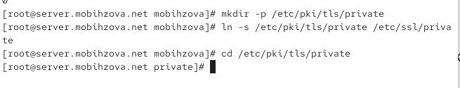
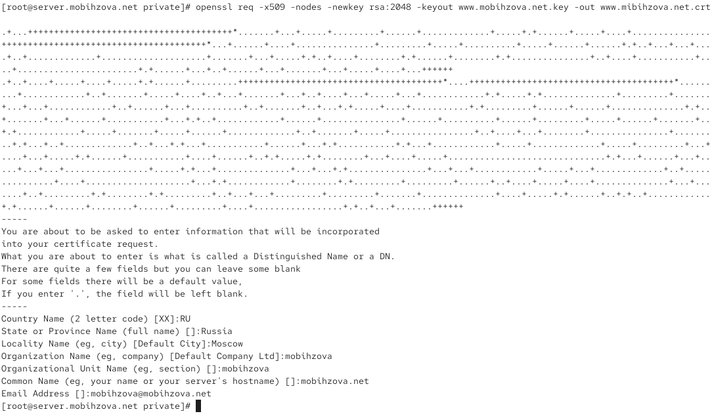
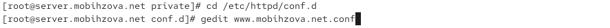
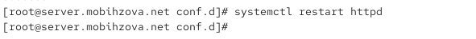
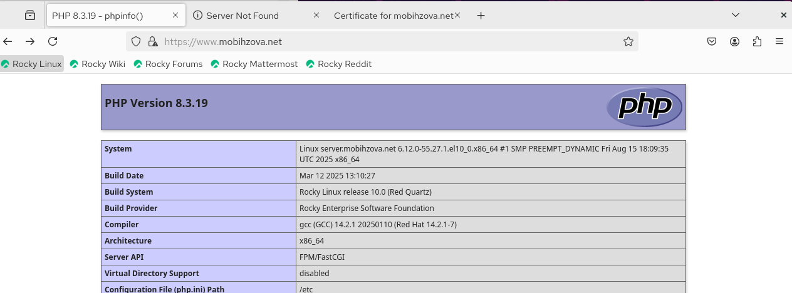
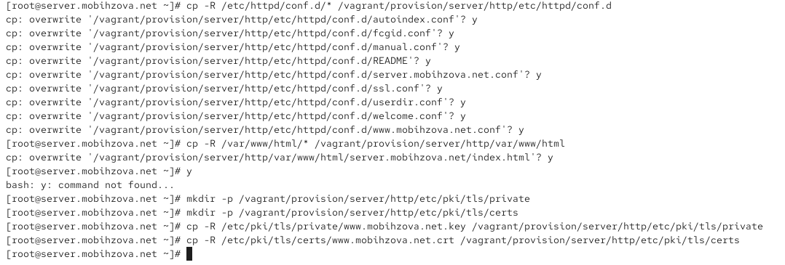
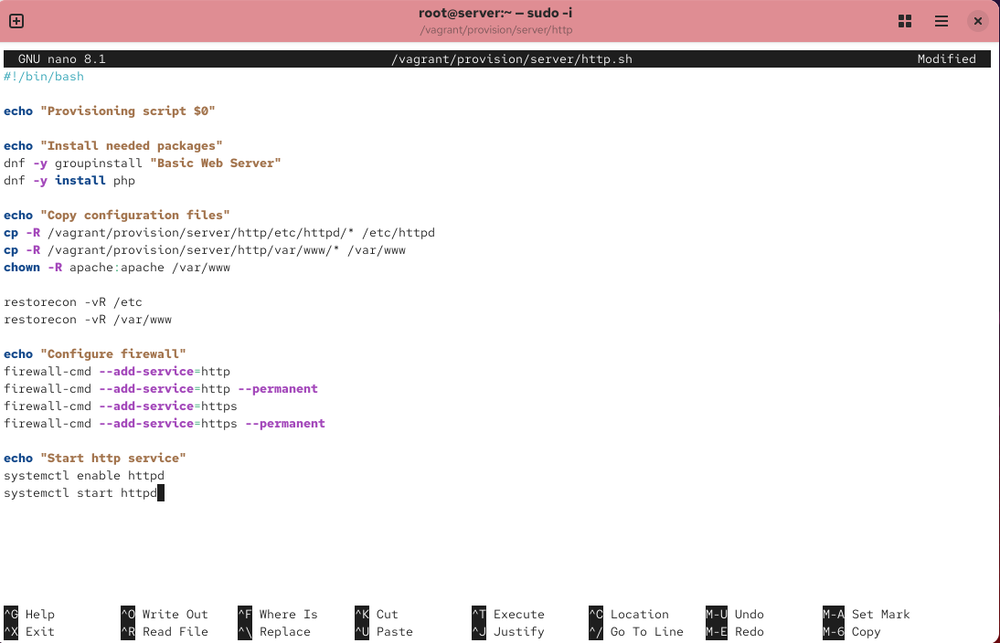

---
# Preamble

## Author
author:
  name: Бызова Мария Олеговна
## Title
title: Отчет по лабораторной работе № 5
subtitle: Расширенная настройка HTTP-сервера Apache
license: CC BY
date: 2025-09-23

## Generic options
lang: ru-RU
crossref:
  lof-title: Список иллюстраций
  lot-title: Список таблиц
  lol-title: Листинги

## Fonts 
mainfont: PT Serif 
romanfont: PT Serif 
sansfont: PT Sans 
monofont: PT Mono 
mainfontoptions: Ligatures=TeX 
romanfontoptions: Ligatures=TeX 
sansfontoptions: Ligatures=TeX,Scale=MatchLowercase 
monofontoptions: Scale=MatchLowercase,Scale=0.9

## Formats
format:
### Pdf output format
  beamer:
    toc: true
    toc-title: Содержание
    number-sections: true
    colorlinks: false
    toc-depth: 2
    slide_level: 2
    aspectratio: 169
    section-titles: true
    theme: metropolis
    themeoptions: progressbar=frametitle,sectionpage=progressbar,numbering=fraction
    pdf-engine: xelatex
    fontenc: T2A
#### Language
    babel-lang: russian
    babel-otherlangs: english

### Html output
  revealjs:
    transition: slide
    margin: 0.2
    smaller: false
    output-ext: html
    theme: beige
    logo: _resources/image/logo_rudn.png
---

## Цель работы

Целью данной работы является приобретение практических навыков по расширенному конфигурированию HTTP-сервера Apache в части безопасности и возможности использования PHP.

## Конфигурирование HTTP-сервера для работы через протокол HTTPS

Загрузим нашу операционную систему и перейдём в рабочий каталог с проектом. Далее запустим виртуальную машину server (рис. 1)

{#fig-001 width=70%}

## Конфигурирование HTTP-сервера для работы через протокол HTTPS

На виртуальной машине server войдём под нашим пользователем и откроем терминал. Далее перейдём в режим суперпользователя. В каталоге /etc/ssl создадим каталог private (рис. 2)

{#fig-002 width=70%}

## Конфигурирование HTTP-сервера для работы через протокол HTTPS

Сгенерируем ключ (рис. 3) и сертификат (рис. 4)

## Конфигурирование HTTP-сервера для работы через протокол HTTPS

{#fig-003 width=70%}

## Конфигурирование HTTP-сервера для работы через протокол HTTPS

{#fig-004 width=70%}

## Конфигурирование HTTP-сервера для работы через протокол HTTPS

Для перехода веб-сервера www.mobihzova.net на функционирование через протокол HTTPS требуется изменить его конфигурационный файл. Для этого перейдём в каталог с конфигурационными файлами (рис. 5)

{#fig-005 width=70%}

## Конфигурирование HTTP-сервера для работы через протокол HTTPS

Откроем на редактирование файл /etc/httpd/conf.d/www.mobihzova.net.conf и заменим его содержимое на то, которое дано нам в лабораторной работе (рис. 6).

## Конфигурирование HTTP-сервера для работы через протокол HTTPS

{#fig-006 width=70%}

## Конфигурирование HTTP-сервера для работы через протокол HTTPS

Внесём изменения в настройки межсетевого экрана на сервере, разрешив работу с https (рис. 7)

## Конфигурирование HTTP-сервера для работы через протокол HTTPS

{#fig-007 width=70%}

## Конфигурирование HTTP-сервера для работы через протокол HTTPS

Перезапустим веб-сервер (рис. 8)

{#fig-008 width=70%}

## Конфигурирование HTTP-сервера для работы через протокол HTTPS

На виртуальной машине client в строке браузера введём название веб- сервера www.mobihzova.net и убедимся, что произошло автоматическое переключение на работу по протоколу HTTPS. На открывшейся странице с сообщением о незащищённости соединения нажмём кнопку "Дополнительно", затем добавим адрес нашего сервера в постоянные исключения. Затем просмотрим содержание сертификата. (рис. 9)

## Конфигурирование HTTP-сервера для работы через протокол HTTPS

{#fig-009 width=40%}

## Конфигурирование HTTP-сервера для работы с PHP

Установим пакеты для работы с PHP (рис. 10)

{#fig-010 width=70%}

## Конфигурирование HTTP-сервера для работы с PHP

В каталоге /var/www/html/www.mobihzova.net заменим файл index.html на index.php следующего содержания (рис. 11)

{#fig-011 width=70%}

## Конфигурирование HTTP-сервера для работы с PHP

Скорректируем права доступа в каталог с веб-контентом. После чего восстановим контекст безопасности в SELinux (рис. 12)

{#fig-012 width=70%}

## Конфигурирование HTTP-сервера для работы с PHP

На виртуальной машине client в строке браузера введём название веб-сервера www.mobihzova.net и убедимся, что будет выведена страница с информацией об используемой на веб-сервере версии PHP (рис. 13)

## Конфигурирование HTTP-сервера для работы с PHP

{#fig-013 width=70%}

## Внесение изменений в настройки внутреннего окружения виртуальной машины

На виртуальной машине server перейдём в каталог для внесения изменений в настройки внутреннего окружения /vagrant/provision/server/http и в соответствующие каталоги скопируем конфигурационные файлы (рис. 14)

## Внесение изменений в настройки внутреннего окружения виртуальной машины

{#fig-014 width=70%}

## Внесение изменений в настройки внутреннего окружения виртуальной машины

В имеющийся скрипт /vagrant/provision/server/http.sh внесём изменения, добавив установку PHP и настройку межсетевого экрана, разрешающую работать с https (рис. 15).

## Внесение изменений в настройки внутреннего окружения виртуальной машины

{#fig-015 width=40%}

## Выводы

В ходе выполнения лабораторной работы были приобретены практические навыки по расширенному конфигурированию HTTP-сервера Apache в части безопасности и возможности использования PHP.

