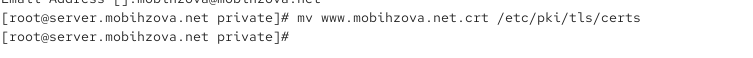
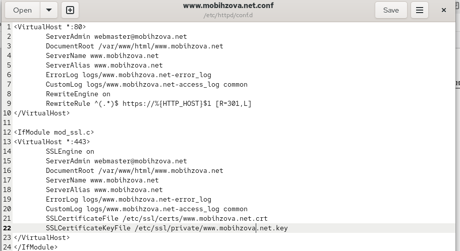
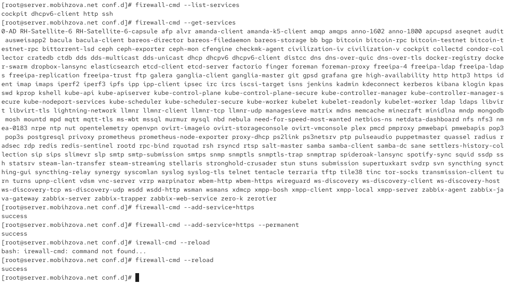
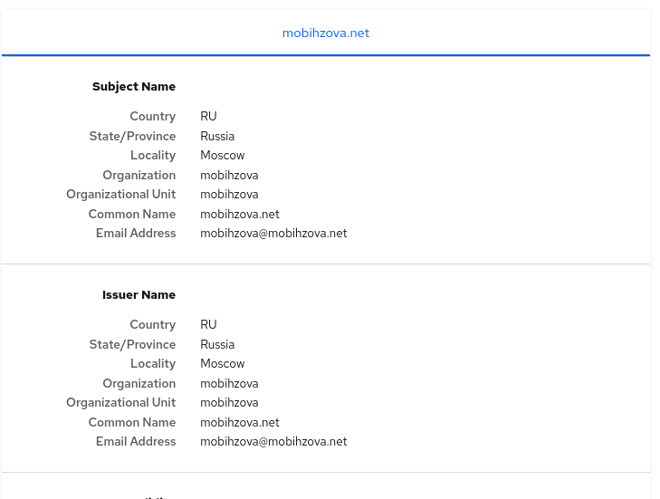
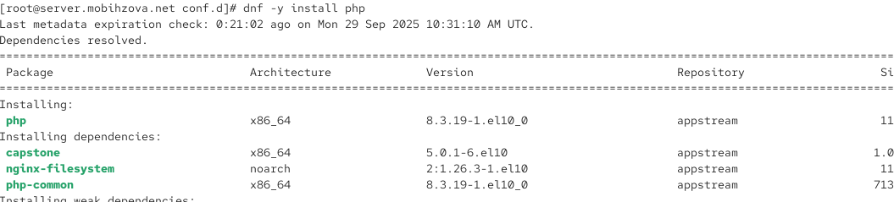
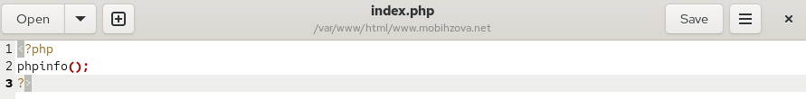
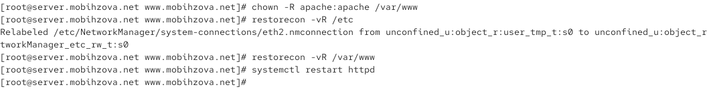

---
# Preamble

## Author
author:
  name: Бызова Мария Олеговна
## Title
title: "Отчёт по лабораторной работе №5"
subtitle: "Администрирование сетевых подсистем"
license: "CC BY"
## Generic options
lang: ru-RU
number-sections: true
toc: true
toc-title: "Содержание"
toc-depth: 2
## Crossref customization
crossref:
  lof-title: "Список иллюстраций"
  lot-title: "Список таблиц"
  lol-title: "Листинги"
## Bibliography
bibliography:
  - bib/cite.bib
csl: _resources/csl/gost-r-7-0-5-2008-numeric.csl
## Formats
format:
### Pdf output format
  pdf:
    toc: true
    number-sections: true
    colorlinks: false
    toc-depth: 2
    lof: true # List of figures
    lot: true # List of tables
#### Document
    documentclass: scrreprt
    papersize: a4
    fontsize: 12pt
    linestretch: 1.5
#### Language
    babel-lang: russian
    babel-otherlangs: english
#### Biblatex
    cite-method: biblatex
    biblio-style: gost-numeric
    biblatexoptions:
      - backend=biber
      - langhook=extras
      - autolang=other*
#### Misc options
    csquotes: true
    indent: true
    header-includes: |
      \usepackage{indentfirst}
      \usepackage{float}
      \floatplacement{figure}{H}
      \usepackage[math,RM={Scale=0.94},SS={Scale=0.94},SScon={Scale=0.94},TT={Scale=MatchLowercase,FakeStretch=0.9},DefaultFeatures={Ligatures=Common}]{plex-otf}
### Docx output format
  docx:
    toc: true
    number-sections: true
    toc-depth: 2
---

# Цель работы

Целью данной работы является приобретение практических навыков по расширенному конфигурированию HTTP-сервера Apache в части безопасности и возможности использования PHP.

# Выполнение лабораторной работы

## Конфигурирование HTTP-сервера для работы через протокол HTTPS

Загрузим нашу операционную систему и перейдём в рабочий каталог с проектом. Далее запустим виртуальную машину server ([рис. @fig-001]).

{#fig-001 width=70%}

На виртуальной машине server войдём под нашим пользователем и откроем терминал. Далее перейдём в режим суперпользователя. В каталоге /etc/ssl создадим каталог private ([рис. @fig-002]).

{#fig-002 width=70%}

Сгенерируем ключ ([рис. @fig-003]) и сертификат ([рис. @fig-004])

{#fig-003 width=70%}

{#fig-004 width=70%}

Для перехода веб-сервера www.mobihzova.net на функционирование через протокол HTTPS требуется изменить его конфигурационный файл. Для этого перейдём в каталог с конфигурационными файлами ([рис. @fig-005]).

{#fig-005 width=70%}

Откроем на редактирование файл /etc/httpd/conf.d/www.mobihzova.net.conf и заменим его содержимое на то, которое дано нам в лабораторной работе ([рис. @fig-006]).

{#fig-006 width=70%}

Данный конфигурационный файл Apache содержит настройки виртуальных хостов для работы как по HTTP на порту 80 так и по HTTPS на порту 443. В первом блоке VirtualHost настроен хост для приёма HTTP-запросов где указаны основные параметры сервера включая электронную почту администратора корневую директорию с веб-контентом имя сервера и его псевдонимы а также файлы для записи ошибок и логов доступа. Особенностью этой конфигурации является использование модуля перезаписи RewriteEngine который активирован для автоматического перенаправления всех HTTP-запросов на HTTPS-версию сайта с помощью правила RewriteRule устанавливающего код перенаправления 301. Второй блок VirtualHost расположенный внутри условия проверки наличия модуля SSL настраивает хост для безопасного HTTPS-соединения с аналогичными базовыми параметрами но с дополнительными директивами для SSL включая включение SSL-движка и указание путей к файлам сертификата и закрытого ключа которые необходимы для шифрования соединения и аутентификации сервера. Таким образом данный конфигурационный файл обеспечивает автоматическое перенаправление пользователей с незащищённого HTTP-протокола на защищённый HTTPS-протокол с использованием SSL-сертификата для всего трафика веб-сайта.

Внесём изменения в настройки межсетевого экрана на сервере, разрешив работу с https ([рис. @fig-007]).

{#fig-007 width=70%}

Перезапустим веб-сервер ([рис. @fig-008]).

{#fig-008 width=70%}

На виртуальной машине client в строке браузера введём название веб- сервера www.mobihzova.net и убедимся, что произошло автоматическое переключение на работу по протоколу HTTPS. На открывшейся странице с сообщением о незащищённости соединения нажмём кнопку "Дополнительно", затем добавим адрес нашего сервера в постоянные исключения. Затем просмотрим содержание сертификата. ([рис. @fig-009]).

{#fig-009 width=70%}

## Конфигурирование HTTP-сервера для работы с PHP

Установим пакеты для работы с PHP ([рис. @fig-010]).

{#fig-010 width=70%}

В каталоге /var/www/html/www.mobihzova.net заменим файл index.html на index.php следующего содержания ([рис. @fig-011]).

{#fig-011 width=70%}

Скорректируем права доступа в каталог с веб-контентом. После чего восстановим контекст безопасности в SELinux ([рис. @fig-012]).

{#fig-012 width=70%}

На виртуальной машине client в строке браузера введём название веб-сервера www.mobihzova.net и убедимся, что будет выведена страница с информацией об используемой на веб-сервере версии PHP ([рис. @fig-013]).

{#fig-013 width=70%}

## Внесение изменений в настройки внутреннего окружения виртуальной машины

На виртуальной машине server перейдём в каталог для внесения изменений в настройки внутреннего окружения /vagrant/provision/server/http и в соответствующие каталоги скопируем конфигурационные файлы ([рис. @fig-014]).

{#fig-014 width=70%}

В имеющийся скрипт /vagrant/provision/server/http.sh внесём изменения, добавив установку PHP и настройку межсетевого экрана, разрешающую работать с https ([рис. @fig-015]).

{#fig-015 width=70%}

# Выводы

В ходе выполнения лабораторной работы были приобретены практические навыки по расширенному конфигурированию HTTP-сервера Apache в части безопасности и возможности использования PHP.

# Ответы на контрольные вопросы

1. В чём отличие HTTP от HTTPS?

HTTP (HyperText Transfer Protocol) – это протокол передачи данных, который используется для передачи информации между клиентом (например, веб-браузером) и сервером. Однако он не обеспечивает шифрование данных, что делает их уязвимыми к перехвату злоумышленниками.

HTTPS (HyperText Transfer Protocol Secure) - это расширение протокола HTTP с добавлением шифрования, обеспечивающее безопасную передачу данных между клиентом и сервером. Протокол HTTPS использует SSL (Secure Sockets Layer) или более современный TLS (Transport Layer Security) для шифрования данных.

2. Каким образом обеспечивается безопасность контента веб-сервера при работе через HTTPS?

Шифрование данных: при использовании HTTPS данные, передаваемые между клиентом и сервером, шифруются, что делает их невозможными для прочтения злоумышленниками, перехватывающими трафик.

Идентификация сервера: сервер предоставляет цифровой сертификат, подтверждающий его легитимность. Этот сертификат выдается сертификационным центром и содержит информацию о владельце сертификата, публичный ключ для шифрования и подпись, подтверждающую подлинность сертификата.

3. Что такое сертификационный центр? Приведите пример.

Определение: сертификационный центр (Центр сертификации) - это доверенная сторона, которая выдает цифровые сертификаты, подтверждающие подлинность владельца сертификата.

Пример: Одним из известных сертификационных центров является "Let's Encrypt". Он предоставляет бесплатные SSL-сертификаты, которые используются для обеспечения безопасного соединения на множестве веб-сайтов. Владельцы веб-сайтов могут получить сертификат от Let's Encrypt, чтобы обеспечить шифрование и подтвердить свою легитимность в онлайн-среде.
