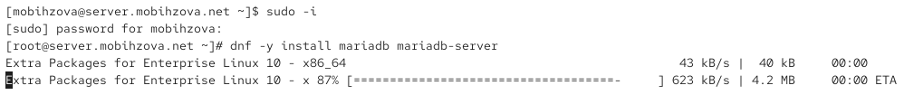
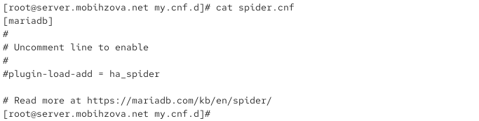
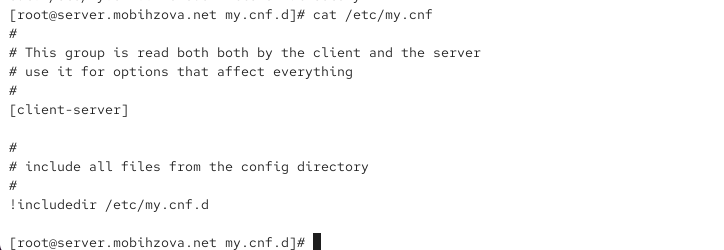
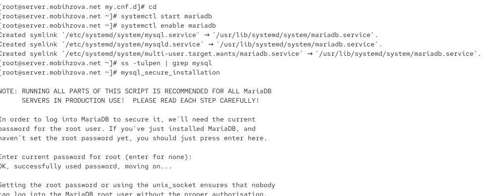
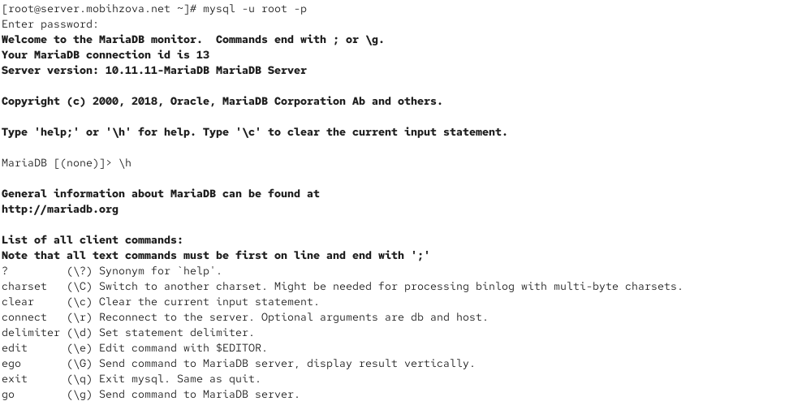
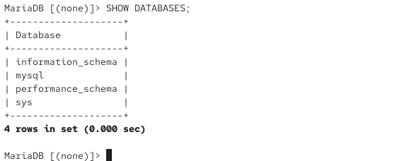
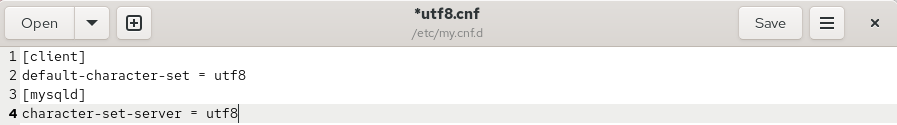
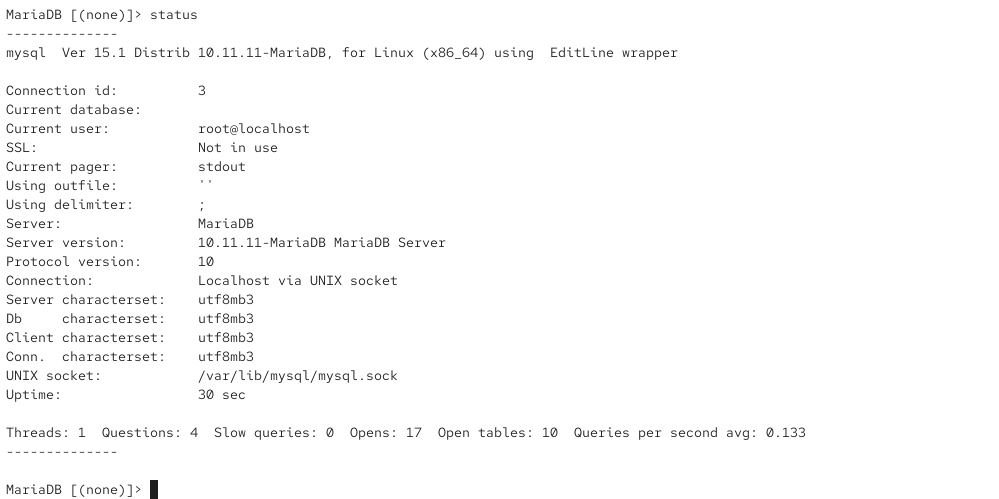
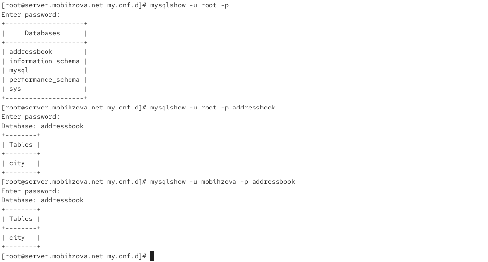
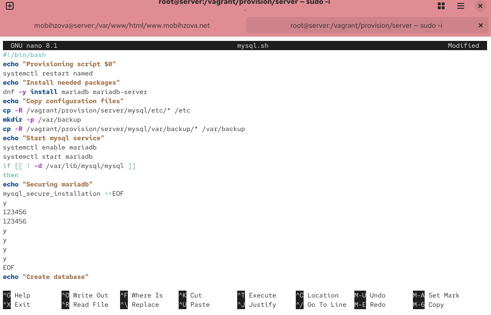

---
# Preamble

## Author
author:
  name: Бызова Мария Олеговна
## Title
title: Отчет по лабораторной работе № 6
subtitle: Установка и настройка системы управления базами данных MariaDB
license: CC BY
date: 2025-09-23

## Generic options
lang: ru-RU
crossref:
  lof-title: Список иллюстраций
  lot-title: Список таблиц
  lol-title: Листинги

## Fonts 
mainfont: PT Serif 
romanfont: PT Serif 
sansfont: PT Sans 
monofont: PT Mono 
mainfontoptions: Ligatures=TeX 
romanfontoptions: Ligatures=TeX 
sansfontoptions: Ligatures=TeX,Scale=MatchLowercase 
monofontoptions: Scale=MatchLowercase,Scale=0.9

## Formats
format:
### Pdf output format
  beamer:
    toc: true
    toc-title: Содержание
    number-sections: true
    colorlinks: false
    toc-depth: 2
    slide_level: 2
    aspectratio: 169
    section-titles: true
    theme: metropolis
    themeoptions: progressbar=frametitle,sectionpage=progressbar,numbering=fraction
    pdf-engine: xelatex
    fontenc: T2A
#### Language
    babel-lang: russian
    babel-otherlangs: english

### Html output
  revealjs:
    transition: slide
    margin: 0.2
    smaller: false
    output-ext: html
    theme: beige
    logo: _resources/image/logo_rudn.png
---

## Цель работы

Целью данной работы является приобретение практических навыков по установке и конфигурированию системы управления базами данных на примере программного обеспечения MariaDB.

## Установка MariaDB

Загрузим нашу операционную систему и перейдём в рабочий каталог с проектом. Далее запустим виртуальную машину server (рис. 1)

{#fig-001 width=70%}

## Установка MariaDB

На виртуальной машине server войдём под нашим пользователем и откроем терминал. Далееперейдём в режим суперпользователя и установим необходимые для работы с базами данных пакеты (рис. 2)

{#fig-002 width=70%}

## Установка MariaDB

Просмотрим конфигурационные файлы mariadb в каталоге /etc/my.cnf.d и в файле /etc/my.cnf (рис. 3 - 12)
## Установка MariaDB

{#fig-003 width=70%}

## Установка MariaDB

{#fig-004 width=70%}

## Установка MariaDB

{#fig-005 width=70%}

## Установка MariaDB

{#fig-006 width=70%}

## Установка MariaDB

{#fig-007 width=70%}

## Установка MariaDB

{#fig-008 width=70%}

## Установка MariaDB

{#fig-009 width=70%}

## Установка MariaDB

{#fig-010 width=70%}

## Установка MariaDB

{#fig-011 width=70%}

## Установка MariaDB

{#fig-012 width=70%}

## Установка MariaDB

Для запуска и включения программного обеспечения mariadb используем systemctl start mariadb и systemctl enable mariadb. Убедимся, что mariadb прослушивает порт, используя: ss -tulpen | grep mysql. Теперь мы видим процесс mysqld, прослушивающий порт 3306. После чего запустим скрипт конфигурации безопасности mariadb, используя:
mysql_secure_installation. С помощью запустившегося диалога и путём выбора [Y/n] установим пароль для пользователя root базы данных, отключим удалённый корневой доступ и удалим тестовую базу данных и любых анонимных пользователей (рис. 13)

## Установка MariaDB

{#fig-013 width=70%}

## Установка MariaDB

Для входа в базу данных с правами администратора базы данных введём: mysql -u root -p. После чего просмотрим список команд MySQL, введя команду (рис. 14)

## Установка MariaDB

{#fig-014 width=70%}

## Установка MariaDB

Из приглашения интерактивной оболочки MariaDB для отображения доступных в настоящее время баз данных введём MySQL-запрос: SHOW DATABASES. Для выхода из интерфейса интерактивной оболочки MariaDB введём exit (рис. 15)

## Установка MariaDB

{#fig-015 width=70%}

## Конфигурация кодировки символов

Войдём в базу данных с правами администратора. Для отображения статуса MariaDB введём из приглашения интерактивной
оболочки MariaDB status (рис. 16).

## Конфигурация кодировки символов

{#fig-016 width=70%}

## Конфигурация кодировки символов

В каталоге /etc/my.cnf.d создадим файл utf8.cnf (рис. 17)

{#fig-017 width=70%}

## Конфигурация кодировки символов

Откроем его на редактирование и укажем в нём следующую конфигурацию (рис. 18).

{#fig-018 width=70%}

## Конфигурация кодировки символов

Перезапустим MariaDB (рис. 19)

{#fig-019 width=70%}

## Конфигурация кодировки символов

Войдём повторно в базу данных с правами администратора и посмотрим статус MariaDB для проверки изменений (рис. 20)

## Конфигурация кодировки символов

{#fig-020 width=70%}

## Создание базы данных

Войдём в базу данных с правами администратора. Создадим базу данных с именем addressbook. Теперь перейдём к базе данных addressbook. Отобразим имеющиеся в базе данных addressbook таблицы. Создадим таблицу city с полями name и city. И заполним несколько строк таблицы некоторыми данными по аналогии в соответствии с синтаксисом MySQL. В частности, добавим в базу сведения о Петрове и Сидорове (рис. 21)

## Создание базы данных

{#fig-021 width=70%}

## Создание базы данных

Сделаем следующий MySQL-запрос: SELECT * FROM city. Теперь создадим пользователя для работы с базой данных addressbook и
зададим для него пароль. Предоставим права доступа созданному пользователю ismakhorin на действия с базой данных addressbook (просмотр, добавление, обновление, удаление данных). Обновим привилегии (права доступа) базы данных addressbook. Просмотрим общую информацию о таблице city базы данных addressbook. Выйдем из окружения MariaDB (рис. 22)

## Создание базы данных

{#fig-022 width=30%}

## Создание базы данных

Просмотрим список баз данных. Отдельно просмотрим список таблиц базы данных addressbook (рис. 23)

## Создание базы данных

{#fig-023 width=70%}

## Резервные копии

На виртуальной машине server создадим каталог для резервных копий. Сделаем резервную копию базы данных addressbook. Сделаем сжатую резервную копию базы данных addressbook. Сделаем сжатую резервную копию базы данных addressbook с указанием даты создания копии. Восстановим базу данных addressbook из резервной копии. Восстановим базу данных addressbook из сжатой резервной копии (рис. 24)

## Резервные копии

{#fig-024 width=70%}

## Внесение изменений в настройки внутреннего окружения виртуальной машины

На виртуальной машине server перейдём в каталог для внесения изменений в настройки внутреннего окружения /vagrant/provision/server/, создадим в нём каталог mysql, в который поместим в соответствующие подкаталоги конфигурационные файлы MariaDB и резервную копию базы данных addressbook (рис. 25)

## Внесение изменений в настройки внутреннего окружения виртуальной машины

{#fig-025 width=70%}

## Внесение изменений в настройки внутреннего окружения виртуальной машины

Откроем его на редактирование и пропишем в нём следующий скрипт (рис. 26)

## Внесение изменений в настройки внутреннего окружения виртуальной машины

{#fig-026 width=40%}

## Внесение изменений в настройки внутреннего окружения виртуальной машины

Для отработки созданного скрипта во время загрузки виртуальных машин в конфигурационном файле Vagrantfile добавим в конфигурации сервера следующую запись (рис. 27)

## Внесение изменений в настройки внутреннего окружения виртуальной машины

{#fig-027 width=70%}

## Выводы

В ходе выполнения лабораторной работы были приобретены практические навыки по установке и конфигурированию системы управления базами данных на примере программного обеспечения MariaDB.
