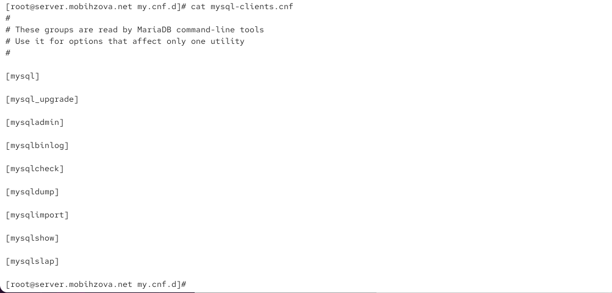
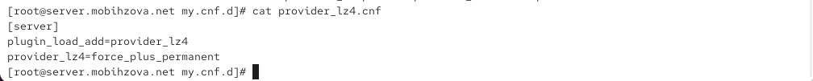
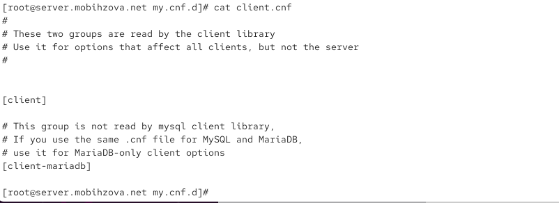
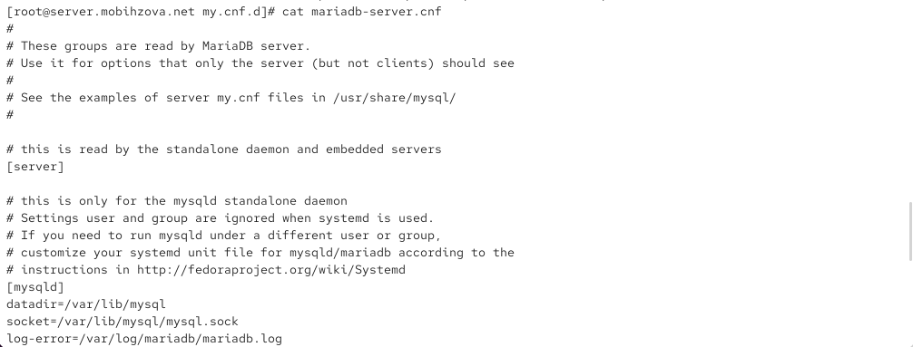
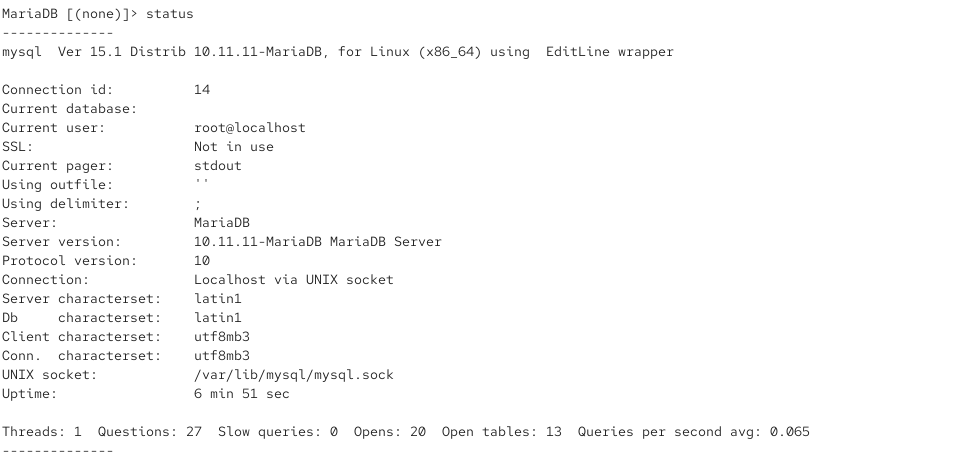
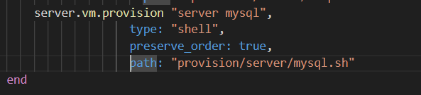

---
# Preamble

## Author
author:
  name: Бызова Мария Олеговна
## Title
title: "Отчёт по лабораторной работе №6"
subtitle: "Администрирование локальных подсистем"
license: "CC BY"
## Generic options
lang: ru-RU
number-sections: true
toc: true
toc-title: "Содержание"
toc-depth: 2
## Crossref customization
crossref:
  lof-title: "Список иллюстраций"
  lot-title: "Список таблиц"
  lol-title: "Листинги"
## Bibliography
bibliography:
  - bib/cite.bib
csl: _resources/csl/gost-r-7-0-5-2008-numeric.csl
## Formats
format:
### Pdf output format
  pdf:
    toc: true
    number-sections: true
    colorlinks: false
    toc-depth: 2
    lof: true # List of figures
    lot: true # List of tables
#### Document
    documentclass: scrreprt
    papersize: a4
    fontsize: 12pt
    linestretch: 1.5
#### Language
    babel-lang: russian
    babel-otherlangs: english
#### Biblatex
    cite-method: biblatex
    biblio-style: gost-numeric
    biblatexoptions:
      - backend=biber
      - langhook=extras
      - autolang=other*
#### Misc options
    csquotes: true
    indent: true
    header-includes: |
      \usepackage{indentfirst}
      \usepackage{float}
      \floatplacement{figure}{H}
      \usepackage[math,RM={Scale=0.94},SS={Scale=0.94},SScon={Scale=0.94},TT={Scale=MatchLowercase,FakeStretch=0.9},DefaultFeatures={Ligatures=Common}]{plex-otf}
### Docx output format
  docx:
    toc: true
    number-sections: true
    toc-depth: 2
---

# Цель работы

Целью данной работы является приобретение практических навыков по установке и конфигурированию системы управления базами данных на примере программного обеспечения MariaDB.

# Выполнение лабораторной работы

## Установка MariaDB

Загрузим нашу операционную систему и перейдём в рабочий каталог с проектом. Далее запустим виртуальную машину server ([рис. @fig-001]).

{#fig-001 width=70%}

На виртуальной машине server войдём под нашим пользователем и откроем терминал. Далееперейдём в режим суперпользователя и установим необходимые для работы с базами данных пакеты ([рис. @fig-002]).

{#fig-002 width=70%}

Просмотрим конфигурационные файлы mariadb в каталоге /etc/my.cnf.d и в файле /etc/my.cnf ([рис. @fig-003] - [рис. @fig-012]).

{#fig-003 width=70%}

{#fig-004 width=70%}

{#fig-005 width=70%}

{#fig-006 width=70%}

{#fig-007 width=70%}

{#fig-008 width=70%}

{#fig-009 width=70%}

{#fig-010 width=70%}

{#fig-011 width=70%}

{#fig-012 width=70%}

auth_gssapi.cnf
Файл предназначен для настройки аутентификации GSSAPI (Kerberos) в MariaDB. Строка plugin-load-add=auth_gssapi.so загружает соответствующий плагин, но в данном случае она закомментирована, поэтому функциональность отключена.

mysql-clients.cnf
Этот файл содержит отдельные секции для различных клиентских утилит MariaDB (например, mysql, mysqldump). Он позволяет задавать специфические параметры для каждой утилиты, но в текущем виде все секции пусты, настройки по умолчанию не изменены.

provider_lz4.cnf
Конфигурация для загрузки плагина сжатия LZ4. Директива plugin_load_add подключает плагин, а provider_lz4=force_plus_permanent принудительно активирует его.

provider_snappy.cnf
Аналогично предыдущему, этот файл настраивает плагин сжатия Snappy. Плагин принудительно загружается и активируется.

client.cnf
Содержит общие настройки для всех клиентских приложений MariaDB. Секция [client] применяется ко всем клиентам, а [client-mariadb] — только к клиентам MariaDB. В текущей конфигурации параметры не заданы.

mariadb-server.cnf
Основной конфигурационный файл сервера MariaDB. В нём заданы ключевые пути: datadir для хранения данных, socket для соединений и log-error для журналирования. Это стандартная базовая конфигурация сервера.

provider_bzip2.cnf
Настраивает плагин сжатия Bzip2. Как и в других файлах провайдеров, плагин принудительно загружается и активируется.

provider_lzo.cnf
Конфигурация для плагина сжатия LZO. Плагин загружается и принудительно активируется.

spider.cnf
Файл для настройки плагина Spider, который позволяет шардинг и доступ к удалённым таблицам. Строка загрузки плагина ha_spider закомментирована, поэтому функциональность не активна.

/etc/my.cnf
Главный конфигурационный файл, который читается и сервером, и клиентами. Его основная роль — включение всех дополнительных конфигов из директории /etc/my.cnf.d с помощью директивы !includedir. Это стандартный подход для организации настроек в MariaDB.

Для запуска и включения программного обеспечения mariadb используем systemctl start mariadb и systemctl enable mariadb. Убедимся, что mariadb прослушивает порт, используя: ss -tulpen | grep mysql. Теперь мы видим процесс mysqld, прослушивающий порт 3306. После чего запустим скрипт конфигурации безопасности mariadb, используя:
mysql_secure_installation. С помощью запустившегося диалога и путём выбора [Y/n] установим пароль для пользователя root базы данных, отключим удалённый корневой доступ и удалим тестовую базу данных и любых анонимных пользователей ([рис. @fig-013]).

{#fig-013 width=70%}

Для входа в базу данных с правами администратора базы данных введём: mysql -u root -p. После чего просмотрим список команд MySQL, введя команду ([рис. @fig-014]).

{#fig-014 width=70%}

Из приглашения интерактивной оболочки MariaDB для отображения доступных в настоящее время баз данных введём MySQL-запрос: SHOW DATABASES. Для выхода из интерфейса интерактивной оболочки MariaDB введём exit ([рис. @fig-015]).

{#fig-015 width=70%}

* information_schema - системная база данных, содержащая метаинформацию о всех других базах данных, таблицах, столбцах и привилегиях
* mysql - системная база данных, в которой хранятся учётные записи пользователей, привилегии и другие системные настройки
* performance_schema - системная база данных для мониторинга производительности сервера
* sys - системная база данных, содержащая удобные представления (views) для анализа производительности

## Конфигурация кодировки символов

Войдём в базу данных с правами администратора. Для отображения статуса MariaDB введём из приглашения интерактивной
оболочки MariaDB status ([рис. @fig-016]).

{#fig-016 width=70%}

Построчный анализ вывода команды status:

mysql Ver 15.1 Distrib 10.11.11-MariaDB, for Linux (x86_64) using EditLine wrapper
Версия клиента MySQL 15.1, дистрибутив MariaDB 10.11.11, собран для Linux на архитектуре x86_64, использует библиотеку EditLine для работы с командной строкой.

Connection id: 14
Идентификатор текущего соединения с сервером - 14, что означает, что это 14-е соединение с момента запуска сервера.

Current database:
Текущая база данных не выбрана (пусто).

Current user: root@localhost
Текущий пользователь - root, подключенный с локального хоста.

SSL: Not in use
SSL-шифрование не используется для текущего соединения.

Current pager: stdout
Вывод направляется в стандартный поток вывода (stdout), без использования программ-пейджеров типа less/more.

Using outfile: ''
Результаты запросов не перенаправляются в файл.

Using delimiter: ;
Разделитель команд - точка с запятой (;).

Server: MariaDB
Тип сервера базы данных - MariaDB.

Server version: 10.11.11-MariaDB MariaDB Server
Версия сервера MariaDB - 10.11.11.

Protocol version: 10
Версия протокола соединения - 10.

Connection: Localhost via UNIX socket
Подключение выполнено через UNIX-сокет локального хоста (не через сетевой порт).

Server characterset: latin1
Кодировка сервера по умолчанию - latin1 (устаревшая, требует изменения на utf8).

Db characterset: latin1
Кодировка базы данных по умолчанию - latin1.

Client characterset: utf8mb3
Кодировка клиента - utf8mb3 (трехбайтный UTF-8).

Conn. characterset: utf8mb3
Кодировка соединения - utf8mb3.

UNIX socket: /var/lib/mysql/mysql.sock
Путь к UNIX-сокету для локальных соединений.

Uptime: 6 min 51 sec
Время работы сервера MariaDB - 6 минут 51 секунда.

Threads: 1 Questions: 27 Slow queries: 0 Opens: 20 Open tables: 13 Queries per second avg: 0.065

Threads: 1 активное соединение

Questions: 27 выполненных запросов

Slow queries: 0 медленных запросов

Opens: 20 открытых таблиц

Open tables: 13 открытых таблиц в кэше

Queries per second avg: 0.065 среднее количество запросов в секунду

В каталоге /etc/my.cnf.d создадим файл utf8.cnf ([рис. @fig-017]).

{#fig-017 width=70%}

Откроем его на редактирование и укажем в нём следующую конфигурацию ([рис. @fig-018]).

{#fig-018 width=70%}

Перезапустим MariaDB ([рис. @fig-019]).

{#fig-019 width=70%}

Войдём повторно в базу данных с правами администратора и посмотрим статус MariaDB для проверки изменений ([рис. @fig-020]).

{#fig-020 width=70%}

Сравнивая с предыдущим статусом, можно выделить следующие ключевые изменения:

Server characterset: utf8mb3 (было: latin1)
Кодировка сервера изменилась с latin1 на utf8mb3 (трехбайтный UTF-8), что позволяет корректно работать с Unicode-символами, включая кириллицу.

Db characterset: utf8mb3 (было: latin1)
Кодировка базы данных по умолчанию также изменилась на utf8mb3.

Uptime: 30 sec (было: 6 min 51 sec)
Время работы сервера уменьшилось до 30 секунд, что подтверждает успешный перезапуск службы MariaDB командой systemctl restart mariadb.

Threads: 1 Questions: 4 (было: Threads: 1 Questions: 27)
Количество выполненных запросов уменьшилось до 4, что логично после перезапуска сервера.

Queries per second avg: 0.133 (было: 0.065)
Среднее количество запросов в секунду увеличилось, что может быть связано с перезапуском и очисткой статистики.

## Создание базы данных

Войдём в базу данных с правами администратора. Создадим базу данных с именем addressbook. Теперь перейдём к базе данных addressbook. Отобразим имеющиеся в базе данных addressbook таблицы. Создадим таблицу city с полями name и city. И заполним несколько строк таблицы некоторыми данными по аналогии в соответствии с синтаксисом MySQL. В частности, добавим в базу сведения о Петрове и Сидорове ([рис. @fig-021]).

{#fig-021 width=70%}

Сделаем следующий MySQL-запрос: SELECT * FROM city. Теперь создадим пользователя для работы с базой данных addressbook и
зададим для него пароль. Предоставим права доступа созданному пользователю ismakhorin на действия с базой данных addressbook (просмотр, добавление, обновление, удаление данных). Обновим привилегии (права доступа) базы данных addressbook. Просмотрим общую информацию о таблице city базы данных addressbook. Выйдем из окружения MariaDB ([рис. @fig-022]).

{#fig-022 width=70%}

Запрос вывел все записи из таблицы city базы данных addressbook. В результате отображается 3 строки данных:

1. Иванов | Москва - сотрудник Иванов работает в Москве
2. Петров | Сочи - сотрудник Петров работает в Сочи
3. Сидоров | Дубна - сотрудник Сидоров работает в Дубне

Структура данных:

Таблица содержит два поля: name (имя сотрудника) и city (город работы). Все три записи успешно добавлены в таблицу Данные отображаются корректно, включая кириллические символы. Запрос выполнен быстро - за 0.000 секунд.

Просмотрим список баз данных. Отдельно просмотрим список таблиц базы данных addressbook ([рис. @fig-023]).

{#fig-023 width=70%}

## Резервные копии

На виртуальной машине server создадим каталог для резервных копий. Сделаем резервную копию базы данных addressbook. Сделаем сжатую резервную копию базы данных addressbook. Сделаем сжатую резервную копию базы данных addressbook с указанием даты создания копии. Восстановим базу данных addressbook из резервной копии. Восстановим базу данных addressbook из сжатой резервной копии ([рис. @fig-024]).

{#fig-024 width=70%}

## Внесение изменений в настройки внутреннего окружения виртуальной машины

На виртуальной машине server перейдём в каталог для внесения изменений в настройки внутреннего окружения /vagrant/provision/server/, создадим в нём каталог mysql, в который поместим в соответствующие подкаталоги конфигурационные файлы MariaDB и резервную копию базы данных addressbook ([рис. @fig-025]).

{#fig-025 width=70%}

Откроем его на редактирование и пропишем в нём следующий скрипт ([рис. @fig-026]).

{#fig-026 width=70%}

Для отработки созданного скрипта во время загрузки виртуальных машин в конфигурационном файле Vagrantfile добавим в конфигурации сервера следующую запись ([рис. @fig-027]).

{#fig-027 width=70%}

# Выводы

В ходе выполнения лабораторной работы были приобретены практические навыки по установке и конфигурированию системы управления базами данных на примере программного обеспечения MariaDB.

# Ответы на контрольные вопросы

1. Какая команда отвечает за настройки безопасности в MariaDB?
Настройки безопасности в MariaDB обычно управляются с помощью команды mysql_secure_installation. Эта команда выполняет несколько шагов, включая установку пароля для пользователя root, удаление анонимных учетных записей, отключение удаленного входа для пользователя root и удаление тестовых баз данных.

2. Как настроить MariaDB для доступа через сеть?
Для настройки MariaDB для доступа через сеть, вы можете отредактировать файл конфигурации MariaDB (обычно называемый my.cnf) и убедиться, что параметр bind-address установлен на IP-адрес, доступный в вашей сети. Также, убедитесь, что пользователь имеет права доступа извне, например, с использованием команды GRANT.

3. Какая команда позволяет получить обзор доступных баз данных после входа в среду оболочки MariaDB?
Обзор доступных баз данных после входа в среду оболочки MariaDB можно получить с помощью команды SHOW DATABASES;.

4. Какая команда позволяет узнать, какие таблицы доступны в базе данных?
Для просмотра доступных таблиц в базе данных используйте команду SHOW TABLES;.

5. Какая команда позволяет узнать, какие поля доступны в таблице?
Чтобы узнать, какие поля доступны в таблице, используйте команду DESCRIBE table_name; или SHOW COLUMNS FROM table_name;.

6. Какая команда позволяет узнать, какие записи доступны в таблице?
Для просмотра записей в таблице можно использовать команду SELECT * FROM table_name;.

7. Как удалить запись из таблицы?
Для удаления записи из таблицы используйте команду DELETE FROM table_name WHERE condition;, где condition - условие, определяющее, какие записи следует удалить.

8. Где расположены файлы конфигурации MariaDB? Что можно настроить с их помощью?
Файлы конфигурации MariaDB обычно располагаются в различных местах в зависимости от системы, но основной файл - my.cnf. Он может быть в /etc/my.cnf, /etc/mysql/my.cnf или /usr/etc/my.cnf. С помощью этих файлов можно настроить различные параметры, такие как порт, пути к файлам данных, параметры безопасности и другие.

9. Где располагаются файлы с базами данных MariaDB?
Файлы с базами данных MariaDB располагаются в директории данных. Обычно это /var/lib/mysql/ на Linux-системах.

10. Как сделать резервную копию базы данных и затем её восстановить?
Для создания резервной копии базы данных используйте команду mysqldump. Например, mysqldump -u username -p dbname > backup.sql. Для восстановления базы данных из резервной копии используйте команду mysql -u username -p dbname < backup.sql.
