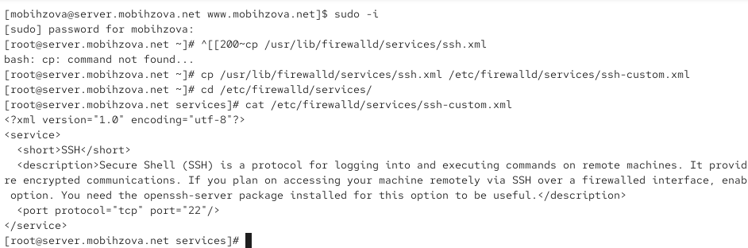
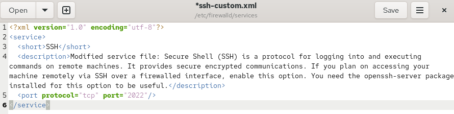
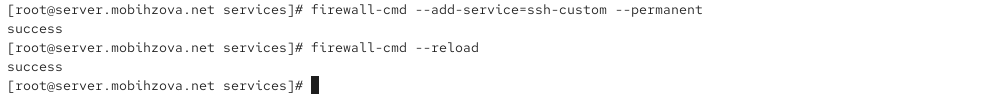
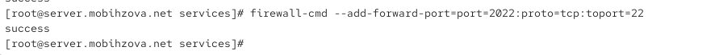
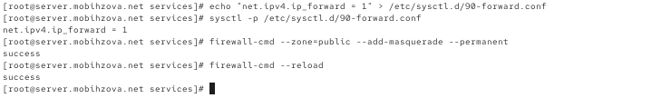
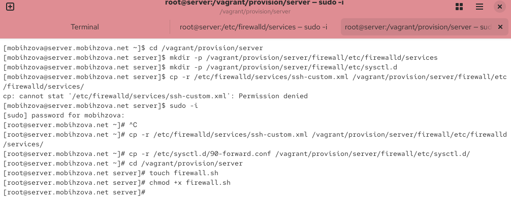
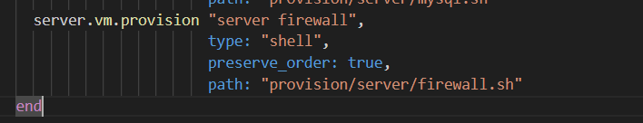

---
# Preamble

## Author
author:
  name: Бызова Мария Олеговна
## Title
title: Отчёт по лабораторной работе №7
subtitle: Расширенные настройки межсетевого экрана

license: CC BY
date: 2025-10-14
## Generic options
lang: ru-RU
crossref:
  lof-title: Список иллюстраций
  lot-title: Список таблиц
  lol-title: Листинги
## Formats
format:
### Pdf output format
  beamer:
    toc: true
    toc-title: Содержание
    number-sections: true
    colorlinks: false
    toc-depth: 2
    slide_level: 2
    aspectratio: 169
    section-titles: true
    theme: metropolis
    themeoptions: progressbar=frametitle,sectionpage=progressbar,numbering=fraction
#### Language
    babel-lang: russian
    babel-otherlangs: english
### Html output
  revealjs:
    transition: slide
    margin: 0.2
    smaller: false
    output-ext: html
    theme: beige
    logo: _resources/image/logo_rudn.png
    
## Fonts 
mainfont: PT Serif 
romanfont: PT Serif 
sansfont: PT Sans 
monofont: PT Mono 
mainfontoptions: Ligatures=TeX 
romanfontoptions: Ligatures=TeX 
sansfontoptions: Ligatures=TeX,Scale=MatchLowercase 
monofontoptions: Scale=MatchLowercase,Scale=0.9

---

# Цель работы

## Цель работы

Целью данной работы является получение навыков настройки межсетевого экрана в Linux в части переадресации портов и настройки Masquerading.

# Выполнение лабораторной работы

## Создание пользовательской службы firewalld

Загрузим нашу операционную систему и перейдём в рабочий каталог с проектом. Далее запустим виртуальную машину server (рис. 1).

{#fig-001 width=70%}

## Создание пользовательской службы firewalld

На виртуальной машине server войдём под нашим пользователем и откроем терминал. Далее перейдём в режим суперпользователя. На основе существующего файла описания службы ssh создадим файл с собственным описанием. Посмотрим содержимое файла службы (рис. 2).

{#fig-002 width=70%}

## Создание пользовательской службы firewalld

Откроем файл описания службы на редактирование и заменим порт 22 на новый порт (2022). В этом же файле скорректируем описание службы для демонстрации, что это модифицированный файл службы (рис. 3).

{#fig-003 width=70%}

## Создание пользовательской службы firewalld

Просмотрим список доступных FirewallD служб (рис. 4).

{#fig-004 width=50%}

## Создание пользовательской службы firewalld

Перегрузим правила межсетевого экрана с сохранением информации о состоянии и вновь выведем на экран список служб, а также список активных служб (рис. 5).

{#fig-005 width=50%}

## Создание пользовательской службы firewalld

Добавим новую службу в FirewallD и выведем на экран список активных служб (рис. 6).

{#fig-006 width=70%}

## Создание пользовательской службы firewalld

Перегрузите правила межсетевого экрана с сохранением информации о состоянии (рис. 7).

{#fig-007 width=70%}

## Переадресация портов

Организуем на сервере переадресацию с порта 2022 на порт 22 (рис. 8).

{#fig-008 width=70%}

## Переадресация портов

На клиенте попробуем получить доступ по SSH к серверу через порт 2022 (рис. 9).

{#fig-009 width=70%}

## Настройка Port Forwarding и Masquerading

На сервере посмотрим, активирована ли в ядре системы возможность перенаправления IPv4-пакетов (рис. 10).

## Настройка Port Forwarding и Masquerading

{#fig-010 width=70%}

## Настройка Port Forwarding и Masquerading

Включим перенаправление IPv4-пакетов на сервере и маскарадинг на сервере (рис. 11).

{#fig-011 width=70%}

## Настройка Port Forwarding и Masquerading

На клиенте проверим доступность выхода в Интернет (рис. 12).

{#fig-012 width=70%}

## Внесение изменений в настройки внутреннего окружения виртуальной машины

На виртуальной машине server перейдём в каталог для внесения изменений в настройки внутреннего окружения /vagrant/provision/server/, создадим в нём каталог firewall, в который поместим в соответствующие подкаталоги конфигурационные файлы FirewallD. Создадим в каталоге /vagrant/provision/server файл firewall.sh (рис. 13).

{#fig-013 width=40%}

## Внесение изменений в настройки внутреннего окружения виртуальной машины

Открыв его на редактирование, пропишем в нём скрипт из лабораторной работы (рис. 14).

{#fig-014 width=50%}

## Внесение изменений в настройки внутреннего окружения виртуальной машины

Для отработки созданного скрипта во время загрузки виртуальной машины server в конфигурационном файле Vagrantfile добавим в разделе конфигурации для сервера соответствующую запись (рис. 15).

{#fig-015 width=70%}

# Выводы

## Выводы

В ходе выполнения лабораторной работы были получены навыки настройки межсетевого экрана в Linux в части переадресации портов и настройки Masquerading.

