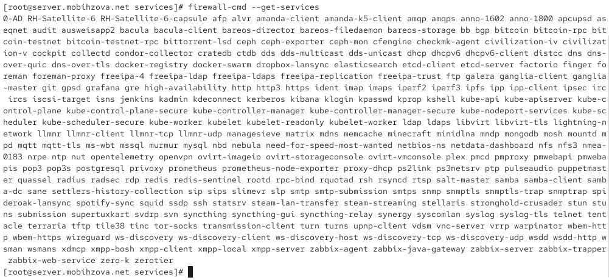
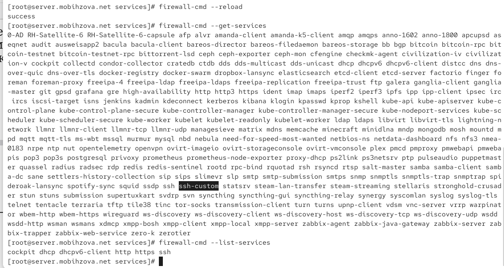
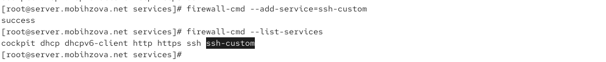
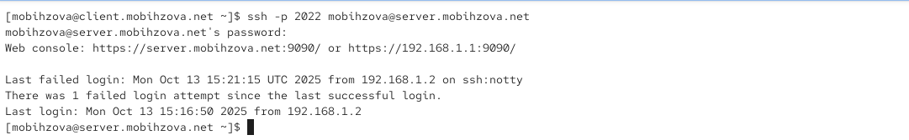
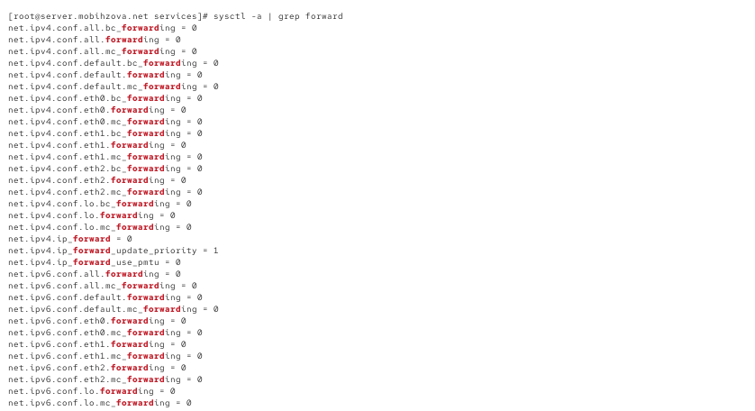
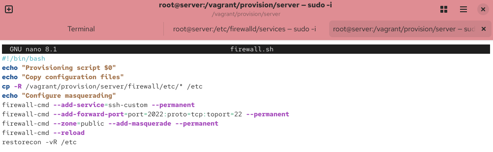

---
# Preamble

## Author
author:
  name: Бызова Мария Олеговна
## Title
title: "Отчёт по лабораторной работе №7"
subtitle: "Расширенные настройки межсетевого экрана"
license: "CC BY"
## Generic options
lang: ru-RU
number-sections: true
toc: true
toc-title: "Содержание"
toc-depth: 2
## Crossref customization
crossref:
  lof-title: "Список иллюстраций"
  lot-title: "Список таблиц"
  lol-title: "Листинги"
## Bibliography
bibliography:
  - bib/cite.bib
csl: _resources/csl/gost-r-7-0-5-2008-numeric.csl
## Formats
format:
### Pdf output format
  pdf:
    toc: true
    number-sections: true
    colorlinks: false
    toc-depth: 2
    lof: true # List of figures
    lot: true # List of tables
#### Document
    documentclass: scrreprt
    papersize: a4
    fontsize: 12pt
    linestretch: 1.5
#### Language
    babel-lang: russian
    babel-otherlangs: english
#### Biblatex
    cite-method: biblatex
    biblio-style: gost-numeric
    biblatexoptions:
      - backend=biber
      - langhook=extras
      - autolang=other*
#### Misc options
    csquotes: true
    indent: true
    header-includes: |
      \usepackage{indentfirst}
      \usepackage{float}
      \floatplacement{figure}{H}
      \usepackage[math,RM={Scale=0.94},SS={Scale=0.94},SScon={Scale=0.94},TT={Scale=MatchLowercase,FakeStretch=0.9},DefaultFeatures={Ligatures=Common}]{plex-otf}
### Docx output format
  docx:
    toc: true
    number-sections: true
    toc-depth: 2
---

# Цель работы

Целью данной работы является получение навыков настройки межсетевого экрана в Linux в части переадресации портов и настройки Masquerading.

# Выполнение лабораторной работы

## Создание пользовательской службы firewalld

Загрузим нашу операционную систему и перейдём в рабочий каталог с проектом. Далее запустим виртуальную машину server ([рис. @fig-001]).

{#fig-001 width=70%}

На виртуальной машине server войдём под нашим пользователем и откроем терминал. Далее перейдём в режим суперпользователя. На основе существующего файла описания службы ssh создадим файл с собственным описанием. Посмотрим содержимое файла службы ([рис. @fig-002]).

{#fig-002 width=70%}

**Построчный анализ синтаксиса файла описания службы:**

`<?xml version="1.0" encoding="utf-8"?>` - объявление XML-документа с указанием версии и кодировки

`<service>` - корневой элемент, определяющий службу

`<short>SSH</short>` - краткое название службы

`<description>Secure Shell (SSH)...</description>` - подробное описание службы и её назначения

`<port protocol="tcp" port="22"/>` - определение порта службы с указанием протокола (tcp) и номера порта (22)

Откроем файл описания службы на редактирование и заменим порт 22 на новый порт (2022). В этом же файле скорректируем описание службы для демонстрации, что это модифицированный файл службы ([рис. @fig-003]).

{#fig-003 width=70%}

Просмотрим список доступных FirewallD служб ([рис. @fig-004]).

{#fig-004 width=70%}

Перегрузим правила межсетевого экрана с сохранением информации о состоянии и вновь выведем на экран список служб, а также список активных служб ([рис. @fig-005]).

{#fig-005 width=70%}

Добавим новую службу в FirewallD и выведем на экран список активных служб ([рис. @fig-006]).

{#fig-006 width=70%}

Перегрузите правила межсетевого экрана с сохранением информации о состоянии ([рис. @fig-007]).

{#fig-007 width=70%}

## Переадресация портов

Организуем на сервере переадресацию с порта 2022 на порт 22 ([рис. @fig-008]).

{#fig-008 width=70%}

На клиенте попробуем получить доступ по SSH к серверу через порт 2022 ([рис. @fig-009]).

{#fig-009 width=70%}

## Настройка Port Forwarding и Masquerading

На сервере посмотрим, активирована ли в ядре системы возможность перенаправления IPv4-пакетов ([рис. @fig-010]).

{#fig-010 width=70%}

Включим перенаправление IPv4-пакетов на сервере и маскарадинг на сервере ([рис. @fig-011]).

{#fig-011 width=70%}

На клиенте проверим доступность выхода в Интернет ([рис. @fig-012]).

{#fig-012 width=70%}

## Внесение изменений в настройки внутреннего окружения виртуальной машины

На виртуальной машине server перейдём в каталог для внесения изменений в настройки внутреннего окружения /vagrant/provision/server/, создадим в нём каталог firewall, в который поместим в соответствующие подкаталоги конфигурационные файлы FirewallD. Создадим в каталоге /vagrant/provision/server файл firewall.sh ([рис. @fig-013]).

{#fig-013 width=70%}

Открыв его на редактирование, пропишем в нём скрипт из лабораторной работы ([рис. @fig-014]).

{#fig-014 width=70%}

Для отработки созданного скрипта во время загрузки виртуальной машины server в конфигурационном файле Vagrantfile добавим в разделе конфигурации для сервера соответствующую запись ([рис. @fig-015]).

{#fig-015 width=70%}

# Выводы

В ходе выполнения лабораторной работы были получены навыки настройки межсетевого экрана в Linux в части переадресации портов и настройки Masquerading.

# Ответы на контрольные вопросы

1. Где хранятся пользовательские файлы firewalld?

В firewalld пользовательские файлы хранятся в директории /etc/firewalld/.

2. Какую строку надо включить в пользовательский файл службы, чтобы указать порт TCP 2022?

Для указания порта TCP 2022 в пользовательском файле службы, вы можете добавить строку в секцию port следующим образом:
`<port protocol="tcp" port="2022"/>`

3. Какая команда позволяет вам перечислить все службы, доступные в настоящее время на вашем сервере?

Чтобы перечислить все службы, доступные в настоящее время на сервере с использованием firewalld, используйте команду:
`firewall-cmd --get-services`

4. В чем разница между трансляцией сетевых адресов (NAT) и маскарадингом (masquerading)?

Разница между трансляцией сетевых адресов (NAT) и маскарадингом (masquerading) заключается в том, что в случае NAT исходный IP-адрес пакета заменяется на IP-адрес маршрутизатора, а в случае маскарадинга используется IP-адрес интерфейса маршрутизатора.

5. Какая команда разрешает входящий трафик на порт 4404 и перенаправляет его в службу ssh по IP-адресу 10.0.0.10?

Для разрешения входящего трафика на порт 4404 и перенаправления его на службу SSH по IP-адресу 10.0.0.10, вы можете использовать команды:

* `firewall-cmd --zone=public --add-port=4404/tcp --permanent`
* `firewall-cmd --zone=public --add-forward-port=port=4404:proto=tcp:toport=22:toaddr=10.0.0.10 --permanent`
* `firewall-cmd --reload`

6. Какая команда используется для включения маскарадинга IP-пакетов для всех пакетов, выходящих в зону public?

Для включения маскарадинга IP-пакетов для всех пакетов, выходящих в зону public, используйте следующую команду:

* `firewall-cmd --zone=public --add-masquerade --permanent`
* `firewall-cmd --reload`
