---
# Preamble

## Author
author:
  name: Бызова Мария Олеговна
## Title
title: Отчёт по лабораторной работе №8
subtitle: Настройка SMTP-сервера
license: CC BY
date: 2025-10-20
## Generic options
lang: ru-RU
crossref:
  lof-title: Список иллюстраций
  lot-title: Список таблиц
  lol-title: Листинги
## Formats
format:
### Pdf output format
  beamer:
    toc: true
    toc-title: Содержание
    number-sections: true
    colorlinks: false
    toc-depth: 2
    slide_level: 2
    aspectratio: 169
    section-titles: true
    theme: metropolis
    themeoptions: progressbar=frametitle,sectionpage=progressbar,numbering=fraction
#### Language
    babel-lang: russian
    babel-otherlangs: english
### Html output
  revealjs:
    transition: slide
    margin: 0.2
    smaller: false
    output-ext: html
    theme: beige
    logo: _resources/image/logo_rudn.png
    
## Fonts 
mainfont: PT Serif 
romanfont: PT Serif 
sansfont: PT Sans 
monofont: PT Mono 
mainfontoptions: Ligatures=TeX 
romanfontoptions: Ligatures=TeX 
sansfontoptions: Ligatures=TeX,Scale=MatchLowercase 
monofontoptions: Scale=MatchLowercase,Scale=0.9

---

# Цель работы

## Цель работы

Целью данной лабораторной работы является приобретение практических навыков по установке и конфигурированию SMTP-
сервера.

# Задание 

## Задание 

1. Установить на виртуальной машине server SMTP-сервер postfix.
2. Сделать первоначальную настройку postfix при помощи утилиты postconf, задав отправку писем не на локальный хост, а на сервер в домене.
3. Проверить отправку почты с сервера и клиента.
4. Сконфигурировать Postfix для работы в домене. Проверить отправку почты с сервера и клиента.
5. Написать скрипт для Vagrant, фиксирующий действия по установке и настройке Postfix во внутреннем окружении виртуальной машины server. Соответствующим образом внести изменения в Vagrantfile.

# Выполнение лабораторной работы

## Установка Postfix

Загрузим нашу операционную систему и перейдём в рабочий каталог с проектом. Далее запустим виртуальную машину server (рис. 1)

{#fig-001 width=70%}

## Установка Postfix

На виртуальной машине server войдём под нашим пользователем и откроем терминал. Далее перейдём в режим суперпользователя и установим необходимые для работы пакеты (рис. 2)

{#fig-002 width=70%}

## Установка Postfix

Установим почтовый клиент s-nail (рис. 3)

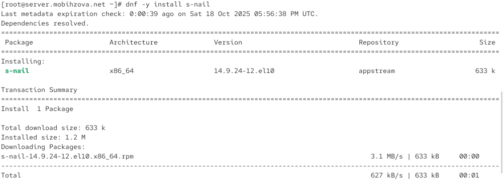{#fig-003 width=70%}

## Установка Postfix

Сконфигурируем межсетевой экран, разрешив работать службе протокола SMTP, восстановим контекст безопасности в SELinux и запустим Postfix (рис. 4)

{#fig-004 width=70%}

## Изменение параметров Postfix с помощью postconf

Просмотрим список текущих настроек Postfix (рис. 5)

{#fig-005 width=70%}

## Изменение параметров Postfix с помощью postconf

Посмотрим текущие значения параметров myorigin и mydomain, затем заменим значение параметра myorigin на значение параметра mydomain (рис. 6)

{#fig-006 width=70%}

## Изменение параметров Postfix с помощью postconf

Просмотрим все параметры с значением, отличным от значения по умолчанию (рис. 7)

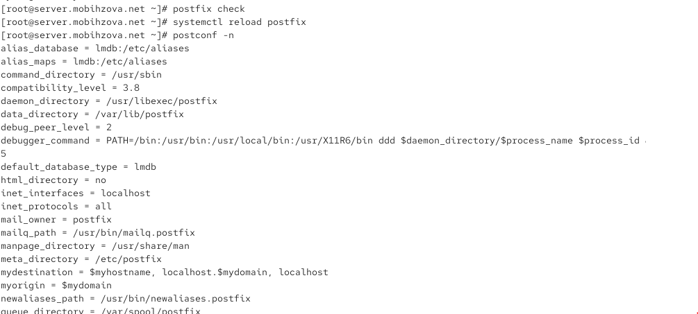{#fig-007 width=70%}

## Изменение параметров Postfix с помощью postconf

Зададим жёстко значение домена и отключим IPv6 в списке разрешённых протоколов (рис. 8)

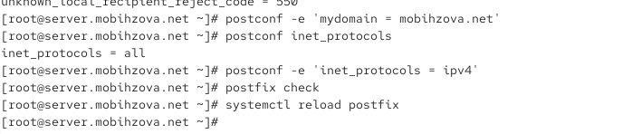{#fig-008 width=70%}

## Проверка работы Postfix

На сервере под учётной записью пользователя отправим себе письмо (рис. 9)

{#fig-009 width=70%}

## Проверка работы Postfix

Запустим мониторинг работы почтовой службы и посмотрим, что произошло с сообщением (рис. 10)

{#fig-010 width=70%}

## Проверка работы Postfix

Проверим содержание каталога /var/spool/mail (рис. 11)

{#fig-011 width=70%}

## Проверка работы Postfix

На виртуальной машине client установим необходимые для работы пакеты ((рис. 12), (рис. 13)).

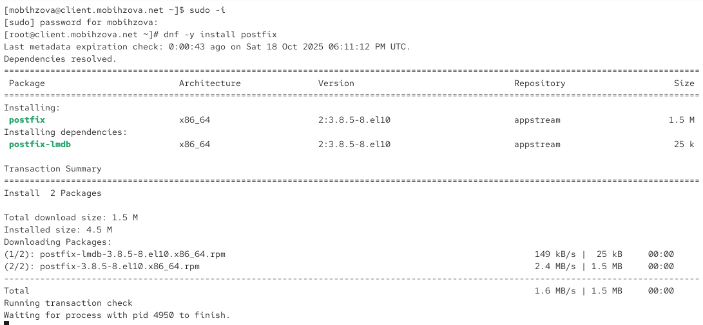{#fig-012 width=70%}

## Проверка работы Postfix

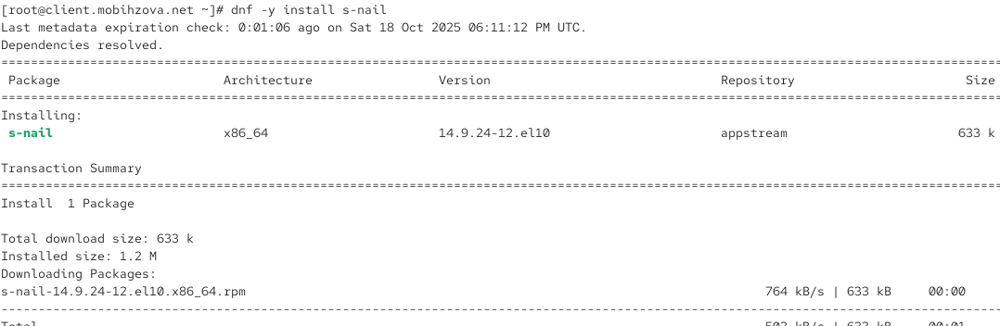{#fig-013 width=70%}

## Проверка работы Postfix

На клиенте под учётной записью пользователя отправим себе письмо (рис. 14)

{#fig-013-5 width=70%}

## Проверка работы Postfix

Запустим мониторинг работы почтовой службы на клиенте (рис. 15)

{#fig-014 width=70%}

## Проверка работы Postfix

На сервере в конфигурации Postfix посмотрим значения параметров сетевых интерфейсов и настроим их для работы в сети (рис. 16)

{#fig-015 width=70%}

## Проверка работы Postfix

Повторим отправку сообщения с клиента (рис. 17).

{#fig-016 width=70%}

## Проверка работы Postfix

Проверим результат отправки в логах (рис. 18)

{#fig-017 width=70%}

## Конфигурация Postfix для домена

С клиента отправим письмо на свой доменный адрес (рис. 19)

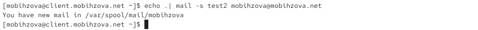{#fig-018 width=70%}

## Конфигурация Postfix для домена

Запустим мониторинг работы почтовой службы - видим ошибку DNS (рис. 20)

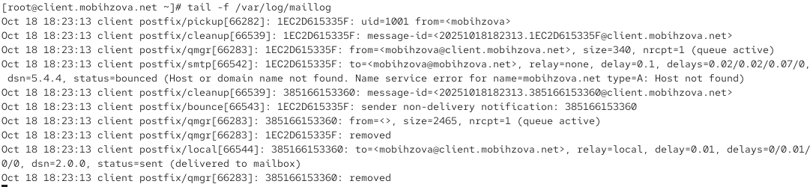{#fig-019 width=70%}

## Конфигурация Postfix для домена

Проверим очередь сообщений - она пустая (рис. 21)

{#fig-020 width=70%}

## Конфигурация Postfix для домена

Создадим файлы DNS-зон - прямую (рис. 22) и обратную (рис. 23)

## Конфигурация Postfix для домена

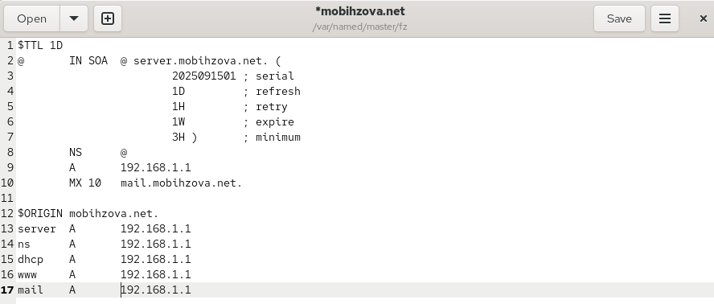{#fig-021 width=70%}

## Конфигурация Postfix для домена

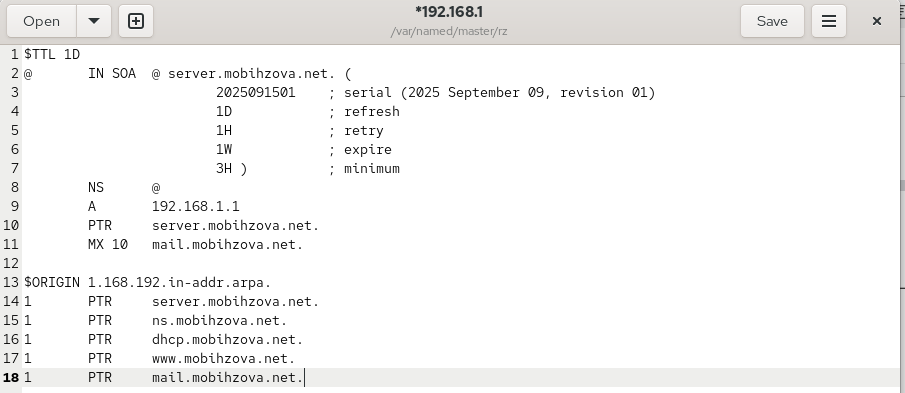{#fig-022 width=70%}

## Конфигурация Postfix для домена

В конфигурации Postfix добавим домен в список элементов сети (рис. 24)

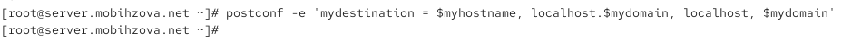{#fig-023 width=70%}

## Конфигурация Postfix для домена

Перезагрузим конфигурацию Postfix и DNS (рис. 25)

{#fig-024 width=70%}

## Конфигурация Postfix для домена

Попробуем отправить сообщения, находящиеся в очереди, и проверим отправку почты с клиента на доменный адрес (рис. 26)

{#fig-025 width=70%}

## Конфигурация Postfix для домена

Проверим результат в логах - письмо успешно доставлено (рис. 27)

{#fig-026 width=70%}

## Внесение изменений в настройки внутреннего окружения виртуальной машины

Заменим конфигурационные файлы DNS-сервера и создадим исполняемый файл mail.sh на сервере (рис. 28)

{#fig-027 width=70%}

## Внесение изменений в настройки внутреннего окружения виртуальной машины

Создадим скрипт для автоматической настройки почты на сервере (рис. 29)

{#fig-028 width=70%}

## Внесение изменений в настройки внутреннего окружения виртуальной машины

Создадим исполняемый файл mail.sh на клиенте (рис. 30)

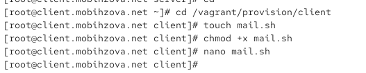{#fig-029 width=70%}

## Внесение изменений в настройки внутреннего окружения виртуальной машины

Настроим скрипт для автоматической настройки почты на клиенте (рис. 31)

{#fig-030 width=70%}

## Внесение изменений в настройки внутреннего окружения виртуальной машины

Добавим в конфигурационный файл Vagrantfile provision для сервера (рис. 32)

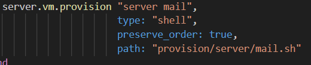{#fig-031 width=70%}

## Внесение изменений в настройки внутреннего окружения виртуальной машины

Добавим в конфигурационный файл Vagrantfile provision для клиента (рис. 33)

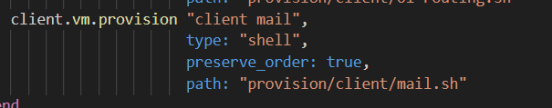{#fig-032 width=70%}

# Выводы

## Выводы

В ходе выполнения данной лабораторной работы я приобрела практические навыки по установке и конфигурированию SMTP-сервера.

# Список литературы

## Список литературы

1. Postfix Documentation. — URL: http://www.postfix.org/documentation.html
