---
# Preamble

## Author
author:
  name: Бызова Мария Олеговна
## Title
title: "Отчёт по лабораторной работе №8"
subtitle: "Настройка SMTP-сервера"
license: "CC BY"
## Generic options
lang: ru-RU
number-sections: true
toc: true
toc-title: "Содержание"
toc-depth: 2
## Crossref customization
crossref:
  lof-title: "Список иллюстраций"
  lot-title: "Список таблиц"
  lol-title: "Листинги"
## Bibliography
bibliography:
  - bib/cite.bib
csl: _resources/csl/gost-r-7-0-5-2008-numeric.csl
## Formats
format:
### Pdf output format
  pdf:
    toc: true
    number-sections: true
    colorlinks: false
    toc-depth: 2
    lof: true # List of figures
    lot: true # List of tables
#### Document
    documentclass: scrreprt
    papersize: a4
    fontsize: 12pt
    linestretch: 1.5
#### Language
    babel-lang: russian
    babel-otherlangs: english
#### Biblatex
    cite-method: biblatex
    biblio-style: gost-numeric
    biblatexoptions:
      - backend=biber
      - langhook=extras
      - autolang=other*
#### Misc options
    csquotes: true
    indent: true
    header-includes: |
      \usepackage{indentfirst}
      \usepackage{float}
      \floatplacement{figure}{H}
      \usepackage[math,RM={Scale=0.94},SS={Scale=0.94},SScon={Scale=0.94},TT={Scale=MatchLowercase,FakeStretch=0.9},DefaultFeatures={Ligatures=Common}]{plex-otf}
### Docx output format
  docx:
    toc: true
    number-sections: true
    toc-depth: 2
---

# Цель работы

Целью данной лабораторной работы является приобретение практических навыков по установке и конфигурированию SMTP-
сервера.

# Задание 

1. Установить на виртуальной машине server SMTP-сервер postfix.
2. Сделать первоначальную настройку postfix при помощи утилиты postconf, задав отправку писем не на локальный хост, а на сервер в домене.
3. Проверить отправку почты с сервера и клиента.
4. Сконфигурировать Postfix для работы в домене. Проверить отправку почты с сервера и клиента.
5. Написать скрипт для Vagrant, фиксирующий действия по установке и настройке Postfix во внутреннем окружении виртуальной машины server. Соответствующим образом внести изменения в Vagrantfile.

# Выполнение лабораторной работы

## Установка Postfix

Загрузим нашу операционную систему и перейдём в рабочий каталог с проектом. Далее запустим виртуальную машину server ([рис. @fig-001]).

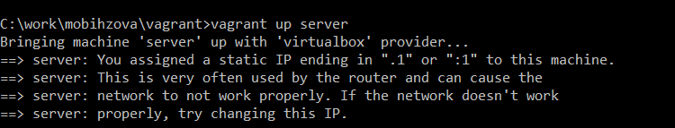{#fig-001 width=70%}

На виртуальной машине server войдём под нашим пользователем и откроем терминал. Далее перейдём в режим суперпользователя и установим необходимые для работы пакеты ([рис. @fig-002]).

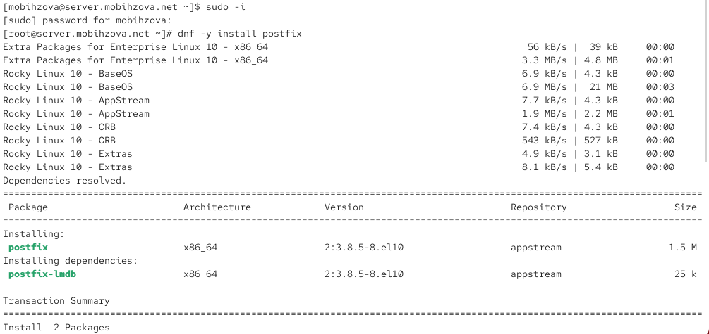{#fig-002 width=70%}

Установим почтовый клиент s-nail ([рис. @fig-003]).

{#fig-003 width=70%}

Сконфигурируем межсетевой экран, разрешив работать службе протокола SMTP, восстановим контекст безопасности в SELinux и запустим Postfix ([рис. @fig-004]).

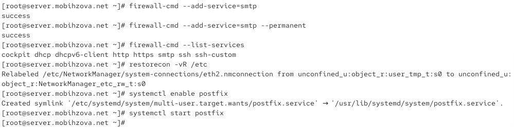{#fig-004 width=70%}

## Изменение параметров Postfix с помощью postconf

Просмотрим список текущих настроек Postfix ([рис. @fig-005]).

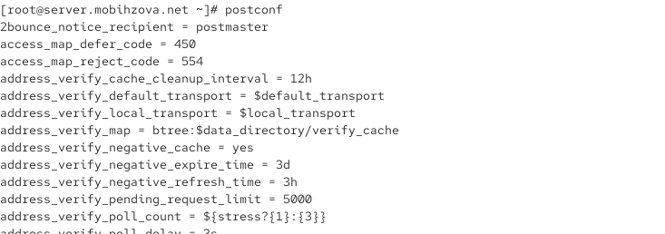{#fig-005 width=70%}

Посмотрим текущие значения параметров myorigin и mydomain, затем заменим значение параметра myorigin на значение параметра mydomain ([рис. @fig-006]).

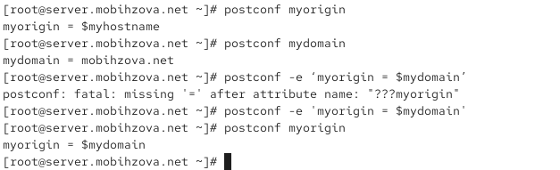{#fig-006 width=70%}

Просмотрим все параметры с значением, отличным от значения по умолчанию ([рис. @fig-007]).

{#fig-007 width=70%}

Зададим жёстко значение домена и отключим IPv6 в списке разрешённых протоколов ([рис. @fig-008]).

{#fig-008 width=70%}

## Проверка работы Postfix

На сервере под учётной записью пользователя отправим себе письмо ([рис. @fig-009]).

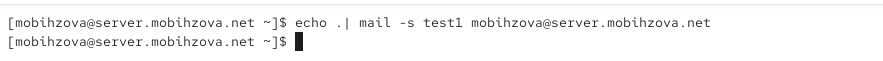{#fig-009 width=70%}

Запустим мониторинг работы почтовой службы и посмотрим, что произошло с сообщением ([рис. @fig-010]).

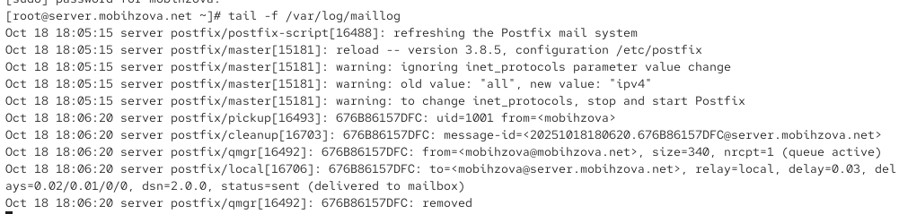{#fig-010 width=70%}

Проверим содержание каталога /var/spool/mail ([рис. @fig-011]).

{#fig-011 width=70%}

**Результат:** Сообщение успешно доставлено. В логах видна строка `status=sent (delivered to mailbox)`, подтверждающая успешную доставку. В каталоге /var/spool/mail появился файл почтового ящика пользователя mobihzova.

На виртуальной машине client установим необходимые для работы пакеты ([рис. @fig-012], [рис. @fig-013]).

{#fig-012 width=70%}

{#fig-013 width=70%}

На клиенте под учётной записью пользователя отправим себе письмо ([рис. @fig-013-5]).

{#fig-013-5 width=70%}

Запустим мониторинг работы почтовой службы на клиенте ([рис. @fig-014]).

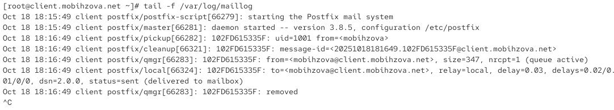{#fig-014 width=70%}

**Результат:** Сообщение доставлено локально на клиенте. В логах видна строка `status=sent (delivered to mailbox)`.

На сервере в конфигурации Postfix посмотрим значения параметров сетевых интерфейсов и настроим их для работы в сети ([рис. @fig-015]).

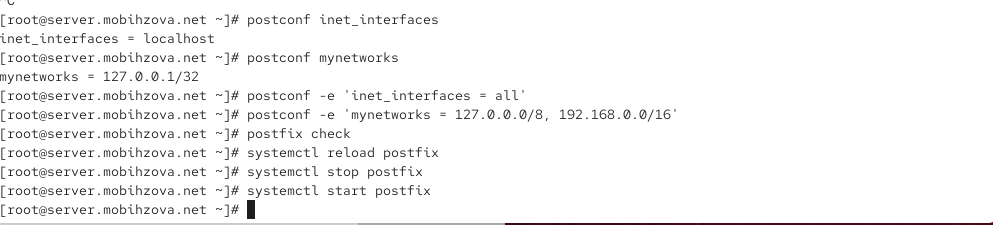{#fig-015 width=70%}

Повторим отправку сообщения с клиента ([рис. @fig-016]).

{#fig-016 width=70%}

Проверим результат отправки в логах ([рис. @fig-017]).

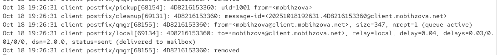{#fig-017 width=70%}

**Результат:** После настройки `inet_interfaces = all` и `mynetworks = 127.0.0.0/8, 192.168.0.0/16` сообщение успешно доставляется.

## Конфигурация Postfix для домена

С клиента отправим письмо на свой доменный адрес ([рис. @fig-018]).

{#fig-018 width=70%}

Запустим мониторинг работы почтовой службы - видим ошибку DNS ([рис. @fig-019]).

{#fig-019 width=70%}

**Результат:** Сообщение не доставлено - ошибка "Host or domain name not found". Это ожидаемый результат, так как DNS ещё не настроен.

Проверим очередь сообщений - она пустая ([рис. @fig-020]).

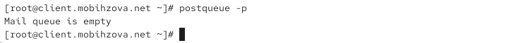{#fig-020 width=70%}

Создадим файлы DNS-зон - прямую ([рис. @fig-021]) и обратную ([рис. @fig-022]).

{#fig-021 width=70%}

{#fig-022 width=70%}

В конфигурации Postfix добавим домен в список элементов сети ([рис. @fig-023]).

{#fig-023 width=70%}

Перезагрузим конфигурацию Postfix и DNS ([рис. @fig-024]).

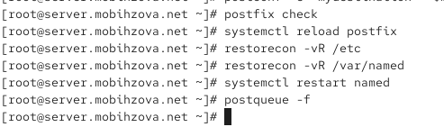{#fig-024 width=70%}

Попробуем отправить сообщения, находящиеся в очереди, и проверим отправку почты с клиента на доменный адрес ([рис. @fig-025]).

{#fig-025 width=70%}

Проверим результат в логах - письмо успешно доставлено ([рис. @fig-026]).

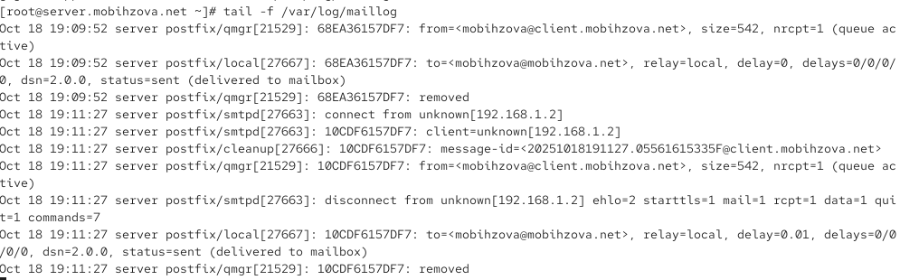{#fig-026 width=70%}

**Результат:** После настройки DNS и конфигурации Postfix для домена сообщение успешно доставляется на доменный адрес `mobihzova@mobihzova.net`. Очередь писем пустая, все письма доставлены.

## Внесение изменений в настройки внутреннего окружения виртуальной машины

Заменим конфигурационные файлы DNS-сервера и создадим исполняемый файл mail.sh на сервере ([рис. @fig-027]).

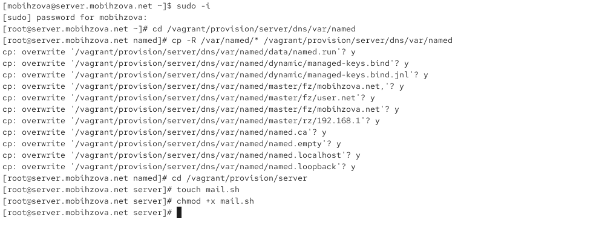{#fig-027 width=70%}

Создадим скрипт для автоматической настройки почты на сервере ([рис. @fig-028]).

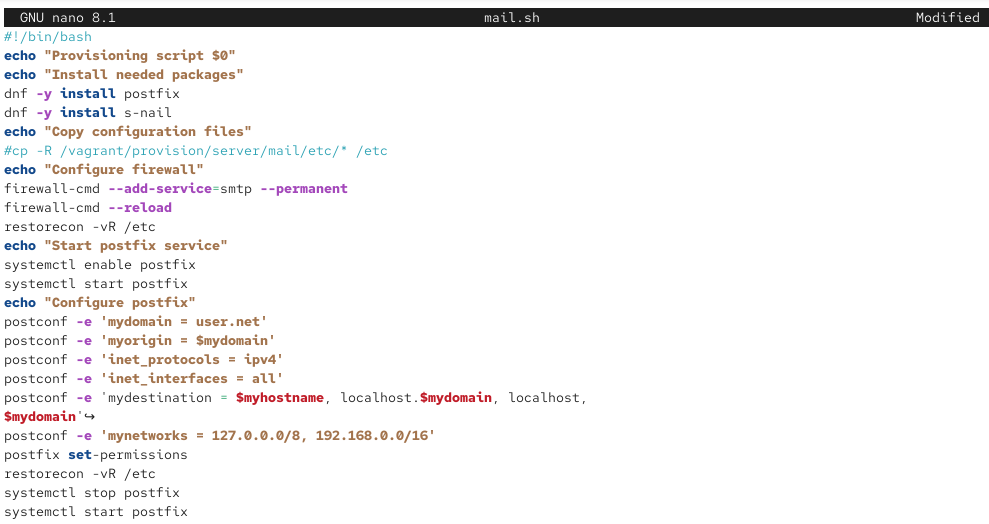{#fig-028 width=70%}

Создадим исполняемый файл mail.sh на клиенте ([рис. @fig-029]).

{#fig-029 width=70%}

Настроим скрипт для автоматической настройки почты на клиенте ([рис. @fig-030]).

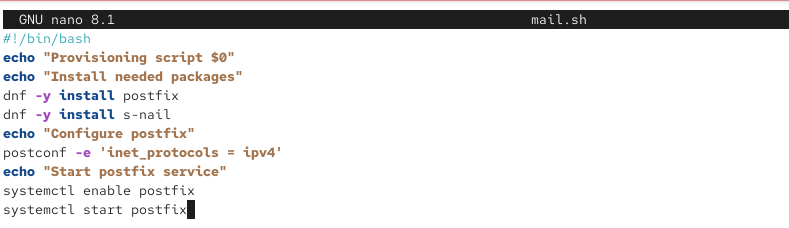{#fig-030 width=70%}

Добавим в конфигурационный файл Vagrantfile provision для сервера ([рис. @fig-031]).

{#fig-031 width=70%}

Добавим в конфигурационный файл Vagrantfile provision для клиента ([рис. @fig-032]).

{#fig-032 width=70%}

# Выводы

В ходе выполнения данной лабораторной работы я приобрела практические навыки по установке и конфигурированию SMTP-сервера.

# Ответы на контрольные вопросы

1. **В каком каталоге и в каком файле следует смотреть конфигурацию Postfix?**

   Конфигурация Postfix находится в каталоге `/etc/postfix`, основной файл конфигурации — `main.cf`.

2. **Каким образом можно проверить корректность синтаксиса в конфигурационном файле Postfix?**

   Для проверки корректности синтаксиса используется команда `postfix check`.

3. **В каких параметрах конфигурации Postfix требуется внести изменения в значениях для настройки возможности отправки писем не на локальный хост, а на доменные адреса?**

   Основные параметры:
   
   - `myorigin` - домен, с которого отправляется локальная почта
   - `mydomain` - название домена сервера
   - `mydestination` - домены, для которых сервер является конечной точкой
   - `inet_interfaces` - сетевые интерфейсы для приёма почты
   - `mynetworks` - доверенные внутренние сети

4. **Приведите примеры работы с утилитой mail по отправке письма, просмотру имеющихся писем, удалению письма.**

   - Отправка: `echo "Текст" | mail -s "Тема" user@domain.net`
   - Просмотр: `mail`
   - Удаление: в режиме просмотра командой `d`

5. **Приведите примеры работы с утилитой postqueue. Как посмотреть очередь сообщений? Как определить число сообщений в очереди? Как отправить все сообщения, находящиеся в очереди? Как удалить письмо из очереди?**

   - Просмотр очереди: `postqueue -p`
   - Отправка всех: `postqueue -f`
   - Удаление письма: `postsuper -d ID_сообщения`

# Список литературы

1. Postfix Documentation. — URL: http://www.postfix.org/documentation.html
