---
# Preamble

## Author
author:
  name: Бызова Мария Олеговна
## Title
title: Отчёт по лабораторной работе №9
subtitle: Настройка POP3/IMAP сервера
license: CC BY
date: 2025-10-28
## Generic options
lang: ru-RU
crossref:
  lof-title: Список иллюстраций
  lot-title: Список таблиц
  lol-title: Листинги
## Formats
format:
### Pdf output format
  beamer:
    toc: true
    toc-title: Содержание
    number-sections: true
    colorlinks: false
    toc-depth: 2
    slide_level: 2
    aspectratio: 169
    section-titles: true
    theme: metropolis
    themeoptions: progressbar=frametitle,sectionpage=progressbar,numbering=fraction
#### Language
    babel-lang: russian
    babel-otherlangs: english
### Html output
  revealjs:
    transition: slide
    margin: 0.2
    smaller: false
    output-ext: html
    theme: beige
    logo: _resources/image/logo_rudn.png
    
## Fonts 
mainfont: PT Serif 
romanfont: PT Serif 
sansfont: PT Sans 
monofont: PT Mono 
mainfontoptions: Ligatures=TeX 
romanfontoptions: Ligatures=TeX 
sansfontoptions: Ligatures=TeX,Scale=MatchLowercase 
monofontoptions: Scale=MatchLowercase,Scale=0.9
---

# Цель работы

## Цель работы

Целью данной лабораторной работы является приобретение практических навыков по установке и простейшему конфигурирова-
нию POP3/IMAP-сервера.

# Выполнение лабораторной работы

## Установка Dovecot и Telnet

На виртуальной машине server войдём под нашим пользователем и откроем терминал. Перейдём в режим суперпользователя и установим необходимые для работы пакеты (рис. 1)

{#fig-001 width=40%}

## Настройка Dovecot

В конфигурационном файле `/etc/dovecot/dovecot.conf` пропишем список почтовых протоколов, по которым разрешено работать Dovecot (рис. 2)

{#fig-002 width=70%}

## Настройка Dovecot

В конфигурационном файле `/etc/dovecot/conf.d/10-auth.conf` проверяем, что указан метод аутентификации plain (рис. 3)

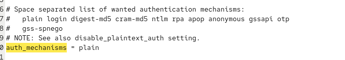{#fig-003 width=70%}

## Настройка Dovecot

В конфигурационном файле `/etc/dovecot/conf.d/auth-system.conf.ext` проверяем, что для поиска пользователей и их паролей используется pam и файл passwd (рис. 4, рис. 5)

{#fig-004 width=70%}

## Настройка Dovecot

{#fig-005 width=70%}

## Настройка Dovecot

В конфигурационном файле `/etc/dovecot/conf.d/10-mail.conf` настраиваем месторасположение почтовых ящиков пользователей (рис. 6)

{#fig-006 width=70%}

## Настройка Dovecot

В Postfix задаём каталог для доставки почты (рис. 7)

{#fig-007 width=70%}

## Настройка межсетевого экрана

Сконфигурируем межсетевой экран, разрешив работать службам протоколов POP3 и IMAP (рис. 8)

{#fig-008 width=40%}

## Настройка SELinux и запуск служб

Восстановим контекст безопасности в SELinux (рис. 9)

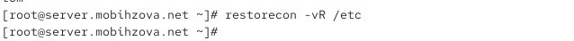{#fig-009 width=70%}

## Настройка SELinux и запуск служб

Перезапустим Postfix и запустим Dovecot (рис. 10).

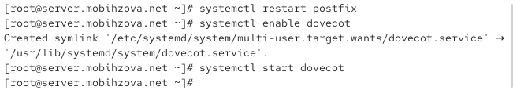{#fig-010 width=70%}

## Проверка работы Dovecot

Запустим мониторинг работы почтовой службы (рис. 11)

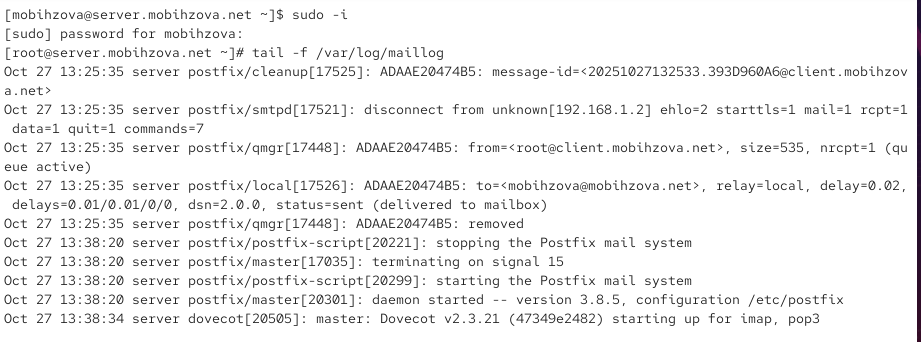{#fig-011 width=70%}

## Проверка работы Dovecot

Проверим наличие почты для пользователя и список mailbox'ов (рис. 12)

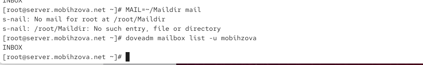{#fig-012 width=70%}

## Установка Evolution на клиенте

На виртуальной машине client установим почтовый клиент Evolution (рис. 13)

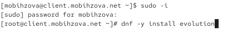{#fig-013 width=70%}

## Настройка Evolution

Запустим и настроим почтовый клиент Evolution. В окне настройки учётной записи почты укажем имя и адрес почты (рис. 14)

{#fig-014 width=40%}

## Настройка Evolution

Заполним данные идентификации (рис. 15)

{#fig-015 width=40%}

## Настройка Evolution

Настроим параметры получения почты (IMAP) (рис. 16)

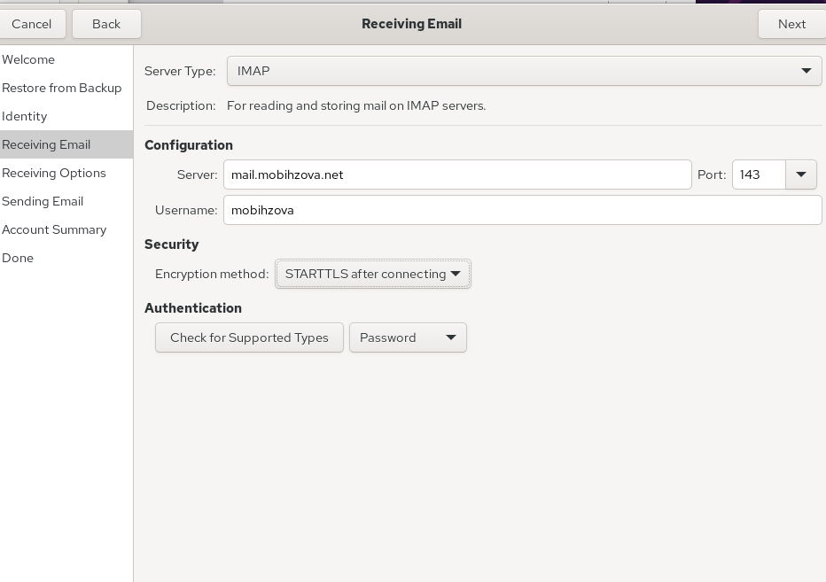{#fig-016 width=40%}

## Настройка Evolution

Настроим параметры отправки почты (SMTP) (рис. 17)

{#fig-017 width=40%}

## Настройка Evolution

Просмотрим сводку настроек (рис. 18)

{#fig-018 width=40%}

## Настройка Evolution

При возникновении сообщения о небезопасном соединении подтвердим исключение безопасности (рис. 19)

{#fig-019 width=70%}

## Проверка работы почтовой системы

Из почтового клиента отправляем себе несколько тестовых писем и убеждаемся, что они доставлены (рис. 20).

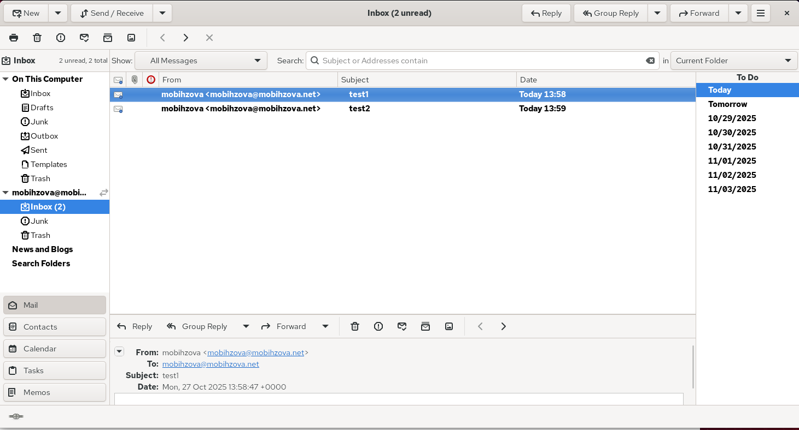{#fig-020 width=70%}

## Проверка работы почтовой системы

Параллельно смотрим, какие сообщения выдаются при мониторинге почтовой службы на сервере (рис. 21)

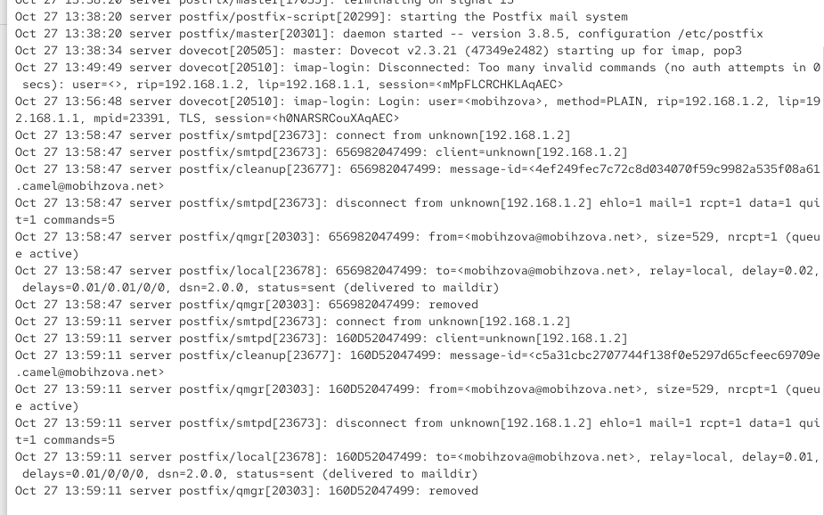{#fig-021 width=40%}

## Проверка работы почтовой системы

Проверяем наличие почты через командную строку (рис. 22)

{#fig-022 width=70%}

## Проверка работы через Telnet

Проверяем работу почтовой службы, используя на сервере протокол Telnet. Подключаемся к почтовому серверу по протоколу POP3 и проходим аутентификацию (рис. 23)

{#fig-023 width=70%}

## Проверка работы через Telnet

Получаем первое письмо из списка (рис. 24)

{#fig-024 width=70%}

## Проверка работы через Telnet

Удаляем второе письмо из списка и завершаем сеанс (рис. 25)

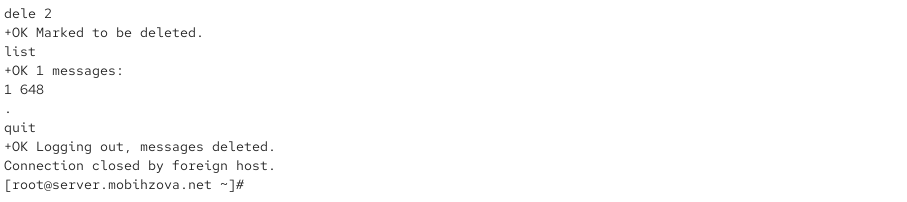{#fig-025 width=70%}

## Внесение изменений в настройки внутреннего окружения виртуальной машины

На виртуальной машине server переходим в каталог для внесения изменений в настройки внутреннего окружения и копируем конфигурационные файлы Dovecot (рис. 26)

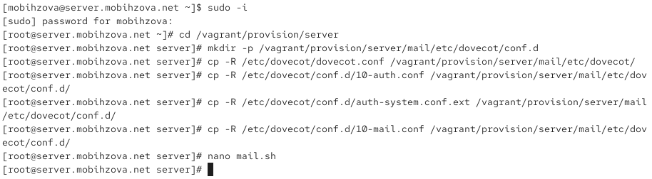{#fig-026 width=70%}

## Внесение изменений в настройки внутреннего окружения виртуальной машины

Вносим изменения в файл `/vagrant/provision/server/mail.sh`, добавляя в него строки по установке Dovecot и Telnet, настройке межсетевого экрана и запуску служб (рис. 27)

{#fig-027 width=30%}

## Внесение изменений в настройки внутреннего окружения виртуальной машины

На виртуальной машине client в каталоге `/vagrant/provision/client` корректируем файл mail.sh, прописывая в нём установку Evolution (рис. 28)

{#fig-028 width=30%}

# Выводы

## Выводы

В ходе выполнения данной лабораторной работы я приобрела практические навыки по установке и простейшему конфигурированию POP3/IMAP-сервера. 

