---
# Preamble

## Author
author:
  name: Бызова Мария Олеговна
## Title
title: "Отчёт по лабораторной работе №9"
subtitle: "Настройка POP3/IMAP сервера"
license: "CC BY"
## Generic options
lang: ru-RU
number-sections: true
toc: true
toc-title: "Содержание"
toc-depth: 2
## Crossref customization
crossref:
  lof-title: "Список иллюстраций"
  lot-title: "Список таблиц"
  lol-title: "Листинги"
## Bibliography
bibliography:
  - bib/cite.bib
csl: _resources/csl/gost-r-7-0-5-2008-numeric.csl
## Formats
format:
### Pdf output format
  pdf:
    toc: true
    number-sections: true
    colorlinks: false
    toc-depth: 2
    lof: true # List of figures
    lot: true # List of tables
#### Document
    documentclass: scrreprt
    papersize: a4
    fontsize: 12pt
    linestretch: 1.5
#### Language
    babel-lang: russian
    babel-otherlangs: english
#### Biblatex
    cite-method: biblatex
    biblio-style: gost-numeric
    biblatexoptions:
      - backend=biber
      - langhook=extras
      - autolang=other*
#### Misc options
    csquotes: true
    indent: true
    header-includes: |
      \usepackage{indentfirst}
      \usepackage{float}
      \floatplacement{figure}{H}
      \usepackage[math,RM={Scale=0.94},SS={Scale=0.94},SScon={Scale=0.94},TT={Scale=MatchLowercase,FakeStretch=0.9},DefaultFeatures={Ligatures=Common}]{plex-otf}
### Docx output format
  docx:
    toc: true
    number-sections: true
    toc-depth: 2
---

# Цель работы

Целью данной лабораторной работы является приобретение практических навыков по установке и простейшему конфигурирова-
нию POP3/IMAP-сервера.

# Задание

* Установить на виртуальной машине server Dovecot и Telnet для дальнейшей проверки корректности работы почтового сервера.
* Настроить Dovecot.
* Установить на виртуальной машине client программу для чтения почты Evolution и настроить её для манипуляций с почтой вашего пользователя. Проверьте корректность работы почтового сервера как с виртуальной машины server, так и с виртуальной машины client.
* Изменить скрипт для Vagrant, фиксирующий действия по установке и настройке Postfix и Dovecote во внутреннем окружении виртуальной машины server, создать скрипт для Vagrant, фиксирующий действия по установке Evolution во внутреннем окружении виртуальной машины client. Соответствующим образом внести изменения в Vagrantfile

# Выполнение лабораторной работы

## Установка Dovecot и Telnet

На виртуальной машине server войдём под нашим пользователем и откроем терминал. Перейдём в режим суперпользователя и установим необходимые для работы пакеты ([рис. @fig-001]).

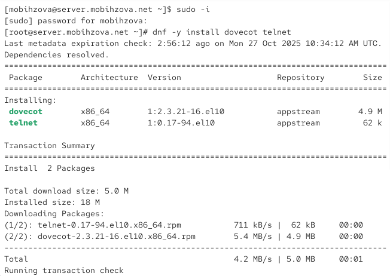{#fig-001 width=70%}

## Настройка Dovecot

В конфигурационном файле `/etc/dovecot/dovecot.conf` пропишем список почтовых протоколов, по которым разрешено работать Dovecot ([рис. @fig-002]).

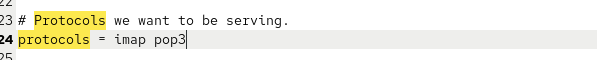{#fig-002 width=70%}

В конфигурационном файле `/etc/dovecot/conf.d/10-auth.conf` проверяем, что указан метод аутентификации plain ([рис. @fig-003]).

{#fig-003 width=70%}

В конфигурационном файле `/etc/dovecot/conf.d/auth-system.conf.ext` проверяем, что для поиска пользователей и их паролей используется pam и файл passwd ([рис. @fig-004], [рис. @fig-005]).

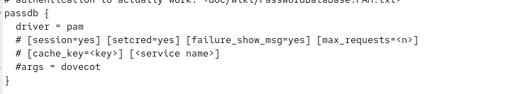{#fig-004 width=70%}

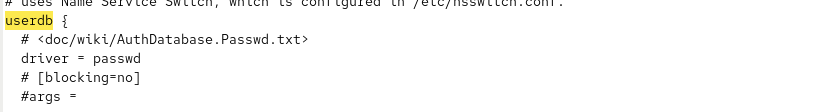{#fig-005 width=70%}

В конфигурационном файле `/etc/dovecot/conf.d/10-mail.conf` настраиваем месторасположение почтовых ящиков пользователей ([рис. @fig-006]).

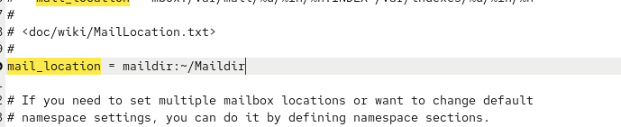{#fig-006 width=70%}

В Postfix задаём каталог для доставки почты ([рис. @fig-007]).

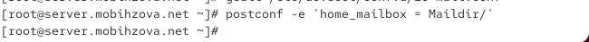{#fig-007 width=70%}

## Настройка межсетевого экрана

Сконфигурируем межсетевой экран, разрешив работать службам протоколов POP3 и IMAP ([рис. @fig-008]).

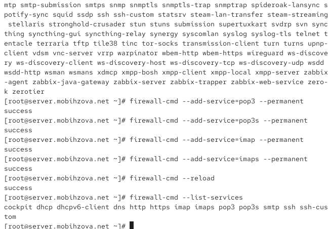{#fig-008 width=70%}

## Настройка SELinux и запуск служб

Восстановим контекст безопасности в SELinux ([рис. @fig-009]).

{#fig-009 width=70%}

Перезапустим Postfix и запустим Dovecot ([рис. @fig-010]).

{#fig-010 width=70%}

## Проверка работы Dovecot

Запустим мониторинг работы почтовой службы ([рис. @fig-011]).

{#fig-011 width=70%}

Проверим наличие почты для пользователя и список mailbox'ов ([рис. @fig-012]).

{#fig-012 width=70%}

## Установка Evolution на клиенте

На виртуальной машине client установим почтовый клиент Evolution ([рис. @fig-013]).

{#fig-013 width=70%}

## Настройка Evolution

Запустим и настроим почтовый клиент Evolution. В окне настройки учётной записи почты укажем имя и адрес почты ([рис. @fig-014]).

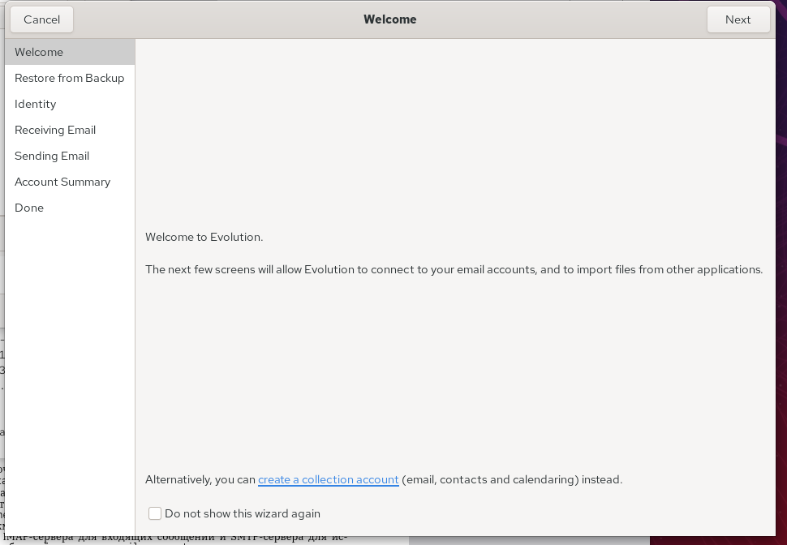{#fig-014 width=70%}

Заполним данные идентификации ([рис. @fig-015]).

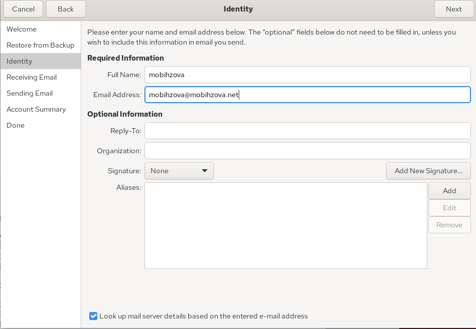{#fig-015 width=70%}

Настроим параметры получения почты (IMAP) ([рис. @fig-016]).

{#fig-016 width=70%}

Настроим параметры отправки почты (SMTP) ([рис. @fig-017]).

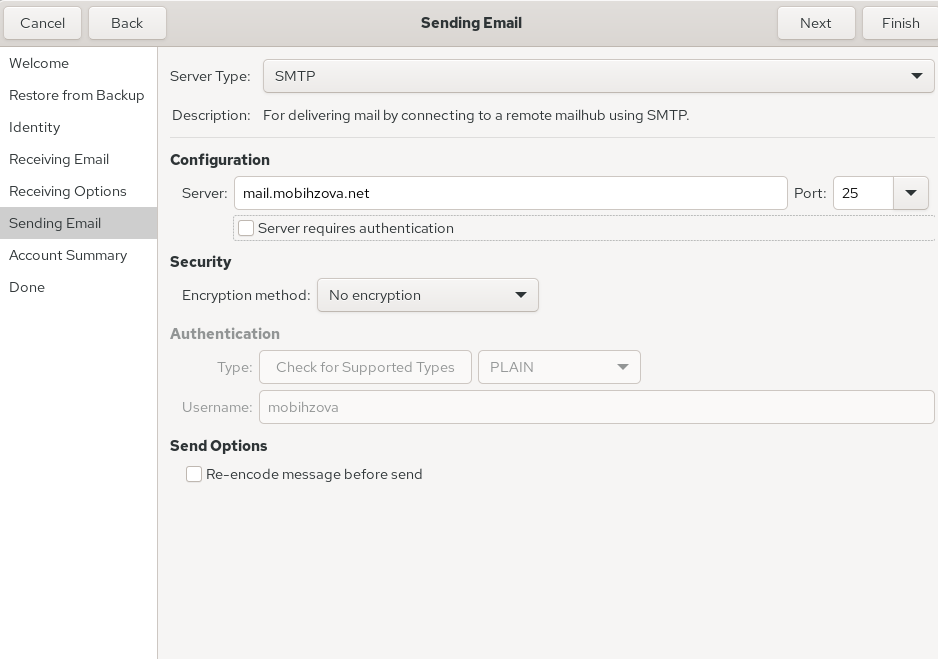{#fig-017 width=70%}

Просмотрим сводку настроек ([рис. @fig-018]).

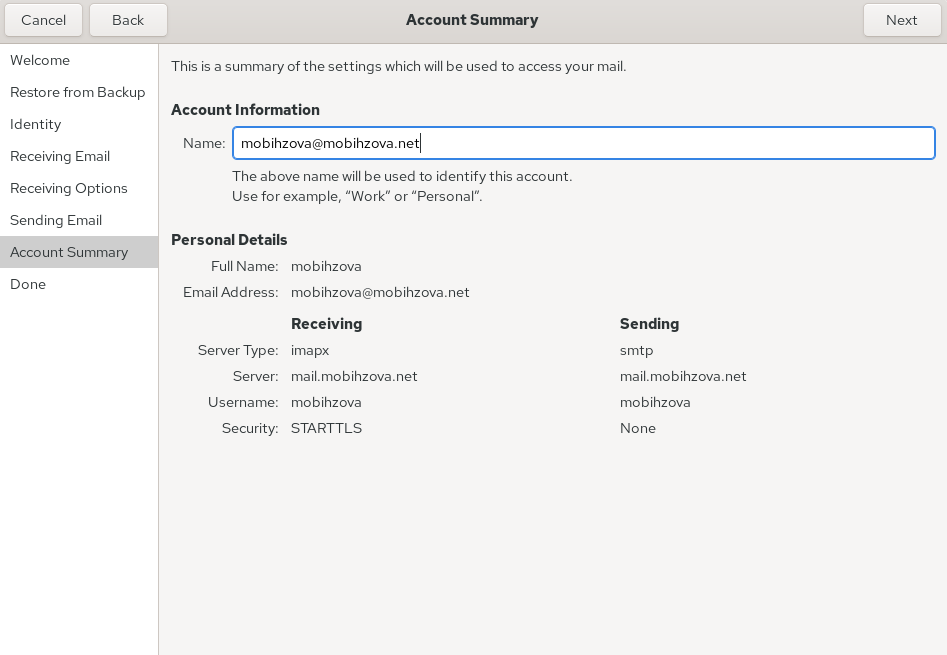{#fig-018 width=70%}

При возникновении сообщения о небезопасном соединении подтвердим исключение безопасности ([рис. @fig-019]).

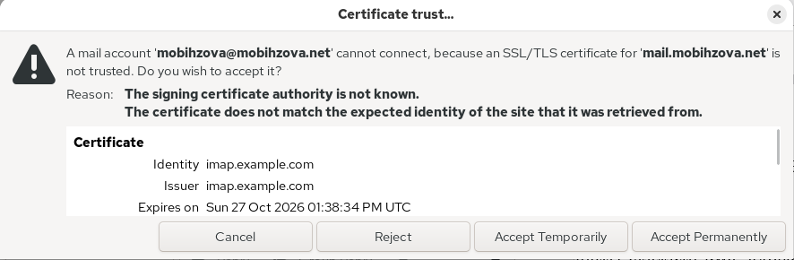{#fig-019 width=70%}

## Проверка работы почтовой системы

Из почтового клиента отправляем себе несколько тестовых писем и убеждаемся, что они доставлены ([рис. @fig-020]).

{#fig-020 width=70%}

Параллельно смотрим, какие сообщения выдаются при мониторинге почтовой службы на сервере ([рис. @fig-021]).

{#fig-021 width=70%}

Проверяем наличие почты через командную строку ([рис. @fig-022]).

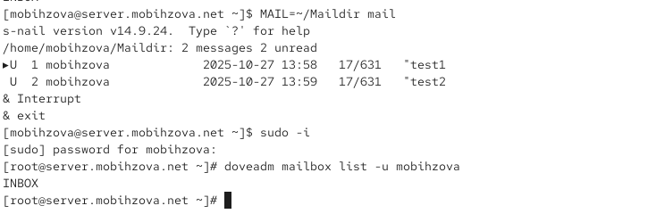{#fig-022 width=70%}

## Проверка работы через Telnet

Проверяем работу почтовой службы, используя на сервере протокол Telnet. Подключаемся к почтовому серверу по протоколу POP3 и проходим аутентификацию ([рис. @fig-023]).

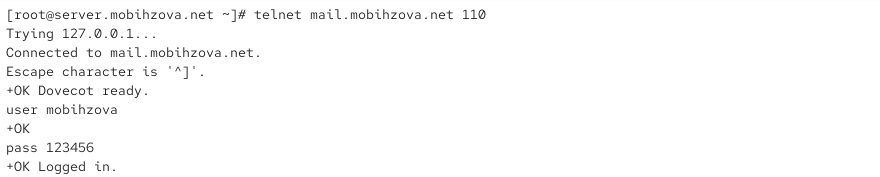{#fig-023 width=70%}

Получаем первое письмо из списка ([рис. @fig-024]).

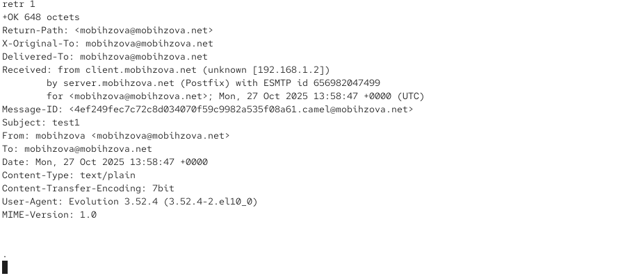{#fig-024 width=70%}

Удаляем второе письмо из списка и завершаем сеанс ([рис. @fig-025]).

{#fig-025 width=70%}

## Внесение изменений в настройки внутреннего окружения виртуальной машины

На виртуальной машине server переходим в каталог для внесения изменений в настройки внутреннего окружения и копируем конфигурационные файлы Dovecot ([рис. @fig-026]).

{#fig-026 width=70%}

Вносим изменения в файл `/vagrant/provision/server/mail.sh`, добавляя в него строки по установке Dovecot и Telnet, настройке межсетевого экрана и запуску служб ([рис. @fig-027]).

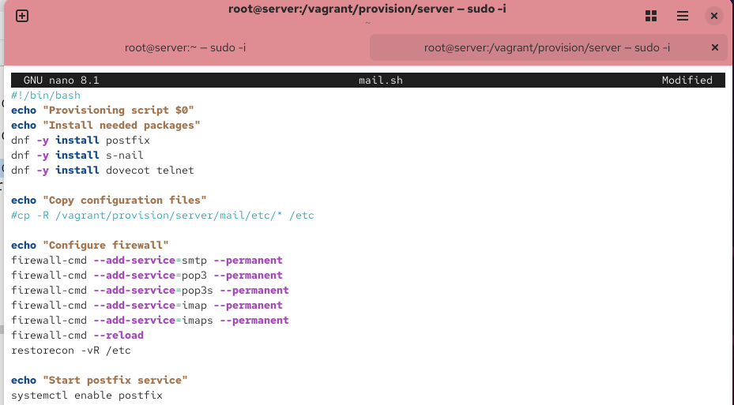{#fig-027 width=70%}

На виртуальной машине client в каталоге `/vagrant/provision/client` корректируем файл mail.sh, прописывая в нём установку Evolution ([рис. @fig-028]).

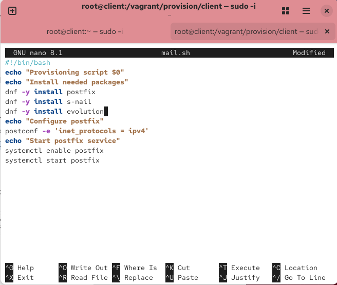{#fig-028 width=70%}

# Выводы

В ходе выполнения данной лабораторной работы я приобрела практические навыки по установке и простейшему конфигурированию POP3/IMAP-сервера. 

# Ответы на контрольные вопросы

1. **За что отвечает протокол SMTP?**

   SMTP (Simple Mail Transfer Protocol) отвечает за отправку и пересылку электронной почты между серверами.

2. **За что отвечает протокол IMAP?**

   IMAP (Internet Message Access Protocol) позволяет получать доступ к электронной почте, хранящейся на сервере, с возможностью управления папками и синхронизации между разными клиентами.

3. **За что отвечает протокол POP3?**

   POP3 (Post Office Protocol version 3) предназначен для загрузки почты с сервера на локальный компьютер, обычно с удалением писем с сервера после загрузки.

4. **В чём назначение Dovecot?**

   Dovecot — это агент доставки почты (MDA), который предоставляет сервисы POP3 и IMAP для доступа пользователей к своим почтовым ящикам.

5. **В каких файлах обычно находятся настройки работы Dovecot? За что отвечает каждый из файлов?**

   Основные файлы конфигурации:
   
   - `/etc/dovecot/dovecot.conf` — основной файл конфигурации
   - `/etc/dovecot/conf.d/10-auth.conf` — настройки аутентификации
   - `/etc/dovecot/conf.d/10-mail.conf` — настройки почтовых ящиков
   - `/etc/dovecot/conf.d/auth-system.conf.ext` — настройки системной аутентификации

6. **В чём назначение Postfix?**

   Postfix — это агент пересылки почты (MTA), который отвечает за приём, маршрутизацию и доставку электронной почты.

7. **Какие методы аутентификации пользователей можно использовать в Dovecot и в чём их отличие?**

   Основные методы: plain, login, digest-md5, cram-md5. Метод plain передаёт пароль в открытом виде, но может использоваться с SSL/TLS.

8. **Приведите пример заголовка письма с пояснениями его полей.**

   * Return-Path: user@domain.net # обратный адрес
   * Received: from server... # информация о прохождении через серверы
   * Message-ID: <unique-id> # уникальный идентификатор письма
   * Subject: Test message # тема письма
   * From: user@domain.net # отправитель
   * To: user@domain.net # получатель
   * Date: Mon, 27 Oct 2025 13:58:47 +0000 # дата отправки

9. **Приведите примеры использования команд для работы с почтовыми протоколами через терминал (например через telnet).**

   * telnet mail.domain.net 110
   * USER username
   * PASS password
   * LIST
   * RETR 1
   * DELE 2
   * QUIT

10. **Приведите примеры с пояснениями по работе с doveadm.**

   * doveadm mailbox list -u username    # список почтовых ящиков пользователя
   * doveadm search -u username ALL      # поиск писем
   * doveadm fetch -u username header    # получение заголовков писем

