---
# Preamble

## Author
author:
  name: Бызова Мария Олеговна
## Title
title: Отчёт по лабораторной работе №10
subtitle: Простейший вариант
license: CC BY
date: 2025-11-04
## Generic options
lang: ru-RU
crossref:
  lof-title: Список иллюстраций
  lot-title: Список таблиц
  lol-title: Листинги
## Formats
format:
### Pdf output format
  beamer:
    toc: true
    toc-title: Содержание
    number-sections: true
    colorlinks: false
    toc-depth: 2
    slide_level: 2
    aspectratio: 169
    section-titles: true
    theme: metropolis
    themeoptions: progressbar=frametitle,sectionpage=progressbar,numbering=fraction
#### Language
#    babel-lang: russian
#    babel-otherlangs: english
### Html output
  revealjs:
    transition: slide
    margin: 0.2
    smaller: false
    output-ext: html
    theme: beige
    logo: _resources/image/logo_rudn.png
    
## Fonts 
mainfont: PT Serif 
romanfont: PT Serif 
sansfont: PT Sans 
monofont: PT Mono 
mainfontoptions: Ligatures=TeX 
romanfontoptions: Ligatures=TeX 
sansfontoptions: Ligatures=TeX,Scale=MatchLowercase 
monofontoptions: Scale=MatchLowercase,Scale=0.9
---

# Цель работы

## Цель работы

Целью данной лабораторной работы является приобретение практических навыков по конфигурированию SMTP-сервера в части
настройки аутентификации.

# Выполнение лабораторной работы

## Настройка LMTP в Dovecot

На виртуальной машине server вошли под пользователем и открыли терминал. Перешли в режим суперпользователя ([рис. @fig-001]).

{#fig-001 width=70%}

## Настройка LMTP в Dovecot

Запустили мониторинг работы почтовой службы ([рис. @fig-002]).

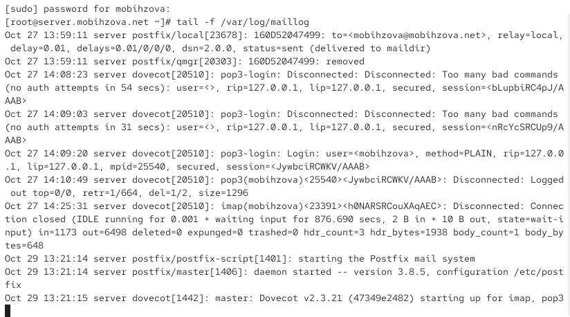{#fig-002 width=70%}

## Настройка LMTP в Dovecot

Добавили в список протоколов, с которыми может работать Dovecot, протокол LMTP ([рис. @fig-003]).

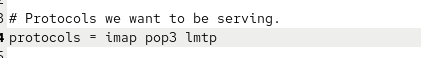{#fig-003 width=70%}

## Настройка LMTP в Dovecot

Настроили в Dovecot сервис lmtp для связи с Postfix ([рис. @fig-004]).

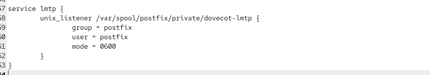{#fig-004 width=70%}

## Настройка LMTP в Dovecot

Переопределили в Postfix передачу сообщений через заданный unix-сокет ([рис. @fig-005]).

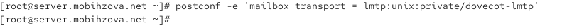{#fig-005 width=70%}

## Настройка LMTP в Dovecot

Задали формат имени пользователя для аутентификации ([рис. @fig-006]).

{#fig-006 width=70%}

## Настройка LMTP в Dovecot

Перезапустили Postfix и Dovecot ([рис. @fig-007]).

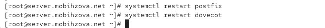{#fig-007 width=70%}

## Настройка LMTP в Dovecot

Отправили письмо с клиента для тестирования LMTP ([рис. @fig-008]).

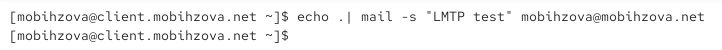{#fig-008 width=70%}

## Настройка LMTP в Dovecot

Проверили доставку письма в почтовый ящик на сервере ([рис. @fig-009]).

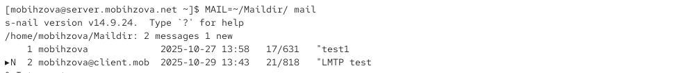{#fig-009 width=70%}

## Настройка LMTP в Dovecot

Просмотрели логи доставки письма ([рис. @fig-010]).

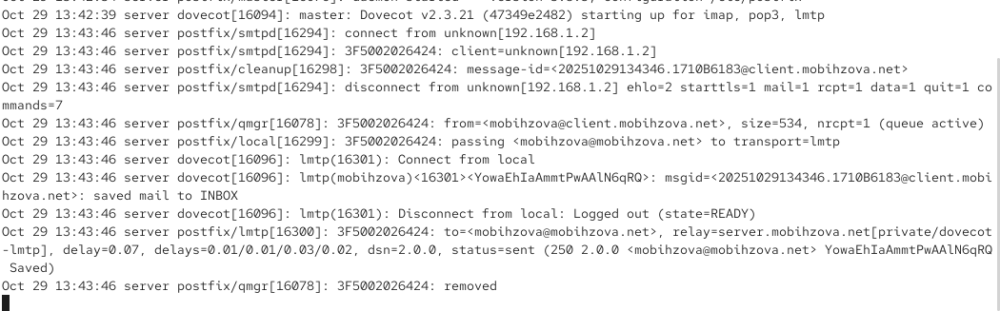{#fig-010 width=70%}

## Настройка SMTP-аутентификации

Определили службу аутентификации пользователей в Dovecot ([рис. @fig-011]).

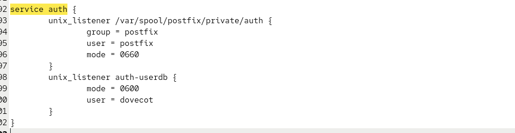{#fig-011 width=70%}

## Настройка SMTP-аутентификации

Задали тип аутентификации SASL и путь к unix-сокету в Postfix ([рис. @fig-012]).

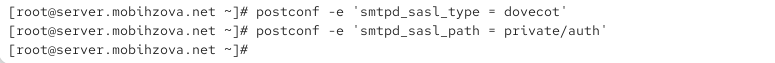{#fig-012 width=70%}

## Настройка SMTP-аутентификации

Настроили ограничения для получателей в Postfix ([рис. @fig-013]).

{#fig-013 width=70%}

## Настройка SMTP-аутентификации

Указали доверенную сеть ([рис. @fig-014]).

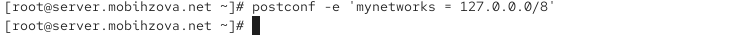{#fig-014 width=70%}

## Настройка SMTP-аутентификации

Настроили мастер-процесс Postfix для включения SASL-аутентификации ([рис. @fig-015]).

{#fig-015 width=70%}

## Настройка SMTP-аутентификации

Перезапустили Postfix и Dovecot ([рис. @fig-016]).

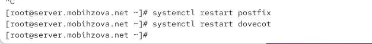{#fig-016 width=70%}

## Настройка SMTP-аутентификации

Установили telnet на клиенте ([рис. @fig-017]).

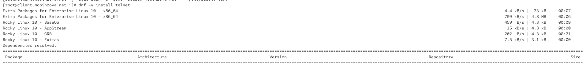{#fig-017 width=70%}

## Настройка SMTP-аутентификации

Сгенерировали строку для аутентификации ([рис. @fig-018]).

{#fig-018 width=70%}

## Настройка SMTP-аутентификации

Протестировали аутентификацию через telnet ([рис. @fig-019]).

{#fig-019 width=70%}

## Настройка SMTP over TLS

Скопировали сертификаты Dovecot в каталог TLS ([рис. @fig-020]).

{#fig-020 width=70%}

## Настройка SMTP over TLS

Настроили параметры TLS в Postfix ([рис. @fig-021]).

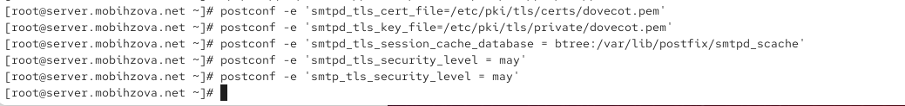{#fig-021 width=70%}

## Настройка SMTP over TLS

Настроили порт 587 для Submission с TLS ([рис. @fig-022]).

{#fig-022 width=70%}

## Настройка SMTP over TLS

Настроили межсетевой экран для работы с smtp-submission ([рис. @fig-023]).

{#fig-023 width=70%}

## Настройка SMTP over TLS

Протестировали подключение через openssl s_client ([рис. @fig-024]).

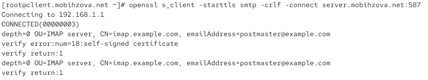{#fig-024 width=70%}

## Настройка SMTP over TLS

Выполнили команду EHLO для проверки возможностей сервера ([рис. @fig-025]).

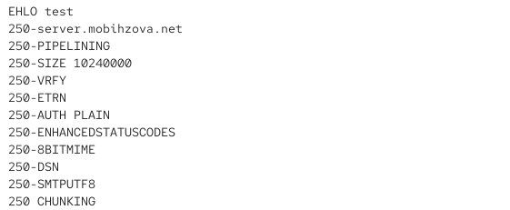{#fig-025 width=70%}

## Настройка SMTP over TLS

Протестировали аутентификацию через TLS соединение ([рис. @fig-026]).

{#fig-026 width=70%}

## Настройка SMTP over TLS

Настроили почтовый клиент Evolution для работы с SMTP ([рис. @fig-027]).

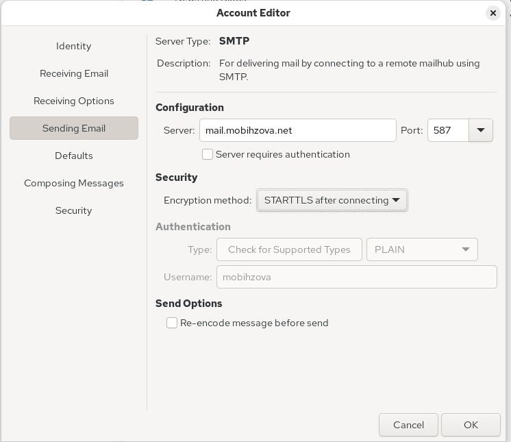{#fig-027 width=40%}

## Настройка SMTP over TLS

Создали и отправили тестовое письмо через Evolution ([рис. @fig-028]).

{#fig-028 width=40%}

## Настройка SMTP over TLS

Ввели учетные данные при запросе аутентификации ([рис. @fig-029]).

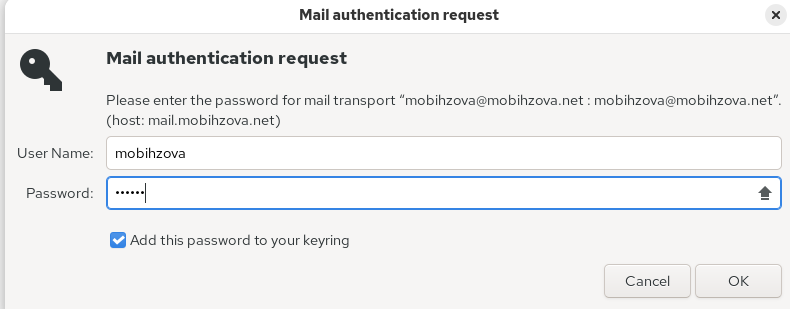{#fig-029 width=70%}

## Настройка SMTP over TLS

Проверили доставку письма в почтовый ящик ([рис. @fig-030]).

{#fig-030 width=70%}

## Внесение изменений в настройки внутреннего окружения виртуальной машины

Скопировали конфигурационные файлы в директорию Vagrant ([рис. @fig-031]).

{#fig-031 width=70%}

## Внесение изменений в настройки внутреннего окружения виртуальной машины

Обновили скрипт mail.sh для автоматической настройки ([рис. @fig-032]).

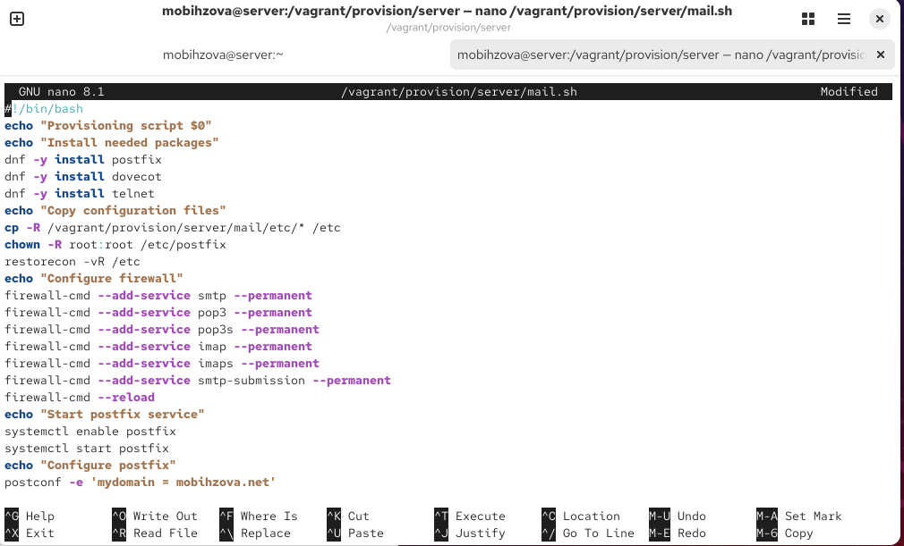{#fig-032 width=40%}

## Внесение изменений в настройки внутреннего окружения виртуальной машины

Обновили скрипт на клиенте ([рис. @fig-033]).

{#fig-033 width=70%}

# Выводы

## Выводы

В ходе данной лабораторной работы я приобрела практические навыки по конфигурированию SMTP-сервера в части настройки аутентификации.
