---
# Preamble

## Author
author:
  name: Бызова Мария Олеговна
## Title
title: "Отчёт по лабораторной работе №10"
subtitle: "Расширенные настройки SMTP-сервера"
license: "CC BY"
## Generic options
lang: ru-RU
number-sections: true
toc: true
toc-title: "Содержание"
toc-depth: 2
## Crossref customization
crossref:
  lof-title: "Список иллюстраций"
  lot-title: "Список таблиц"
  lol-title: "Листинги"
## Bibliography
#bibliography:
#  - bib/cite.bib
#csl: _resources/csl/gost-r-7-0-5-2008-numeric.csl
## Formats
format:
### Pdf output format
  pdf:
    toc: true
    number-sections: true
    colorlinks: false
    toc-depth: 2
    lof: true # List of figures
    lot: true # List of tables
#### Document
    documentclass: scrreprt
    papersize: a4
    fontsize: 12pt
    linestretch: 1.5
#### Language
#    babel-lang: russian
#    babel-otherlangs: english
#### Biblatex
#    cite-method: biblatex
#    biblio-style: gost-numeric
#   biblatexoptions:
#      - backend=biber
#     - langhook=extras
#      - autolang=other*
#### Misc options
    csquotes: true
    indent: true
    header-includes: |
      \usepackage{indentfirst}
      \usepackage{float}
      \floatplacement{figure}{H}
      \usepackage[math,RM={Scale=0.94},SS={Scale=0.94},SScon={Scale=0.94},TT={Scale=MatchLowercase,FakeStretch=0.9},DefaultFeatures={Ligatures=Common}]{plex-otf}
### Docx output format
  docx:
    toc: true
    number-sections: true
    toc-depth: 2
---

# Цель работы

Целью данной лабораторной работы является приобретение практических навыков по конфигурированию SMTP-сервера в части
настройки аутентификации.

# Задание

1. Настроить Dovecot для работы с LMTP.
2. Настроить аутентификацию посредством SASL на SMTP-сервере.
3. Настроить работу SMTP-сервера поверх TLS.
4. Скорректировать скрипт для Vagrant, фиксирующий действия расширенной настройки SMTP-сервера во внутреннем окружении виртуальной машины server.

# Выполнение лабораторной работы

## Настройка LMTP в Dovecot

На виртуальной машине server вошли под пользователем и открыли терминал. Перешли в режим суперпользователя ([рис. @fig-001]).

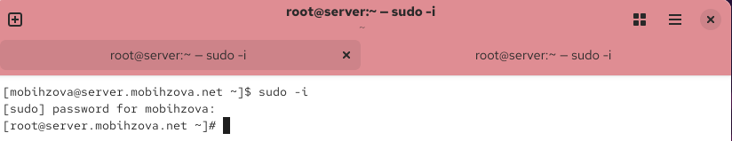{#fig-001 width=70%}

Запустили мониторинг работы почтовой службы ([рис. @fig-002]).

{#fig-002 width=70%}

Добавили в список протоколов, с которыми может работать Dovecot, протокол LMTP ([рис. @fig-003]).

{#fig-003 width=70%}

Настроили в Dovecot сервис lmtp для связи с Postfix ([рис. @fig-004]).

{#fig-004 width=70%}

Переопределили в Postfix передачу сообщений через заданный unix-сокет ([рис. @fig-005]).

{#fig-005 width=70%}

Задали формат имени пользователя для аутентификации ([рис. @fig-006]).

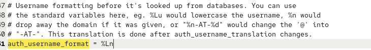{#fig-006 width=70%}

Перезапустили Postfix и Dovecot ([рис. @fig-007]).

{#fig-007 width=70%}

Отправили письмо с клиента для тестирования LMTP ([рис. @fig-008]).

{#fig-008 width=70%}

Проверили доставку письма в почтовый ящик на сервере ([рис. @fig-009]).

{#fig-009 width=70%}

Просмотрели логи доставки письма ([рис. @fig-010]).

{#fig-010 width=70%}

Пояснения по содержанию логов при мониторинге почтовой службы

В логах доставки письма через LMTP можно наблюдать следующий процесс:

Oct 29 13:42:39 server dovecot[16094]: master: Dovecot v2.3.21 (47349e2482) starting up for imap, pop3, lmtp
Запускается служба Dovecot с поддержкой протоколов imap, pop3 и lmtp

Oct 29 13:43:46 server postfix/smtpd[16294]: connect from unknown[192.168.1.2]
*Установлено соединение с SMTP-сервером от клиента с IP-адресом 192.168.1.2*

Oct 29 13:43:46 server postfix/smtpd[16294]: 3F5002026424: client=unknown[192.168.1.2]
Присвоен идентификатор 3F5002026424 входящему сообщению от клиента

Oct 29 13:43:46 server postfix/cleanup[16298]: 3F5002026424: message-id=20251029134346.1710B6L83@client.mobihzova.net
Сообщение получает уникальный идентификатор

Oct 29 13:43:46 server postfix/smtpd[16294]: disconnect from unknown[192.168.1.2]
Клиент отключается после успешной передачи письма

Oct 29 13:43:46 server postfix/qmgr[16078]: 3F5002026424: from=mobihzova@client.mobihzova.net, size=534, nrcpt=1
Письмо помещено в очередь доставки, указан отправитель и размер

Oct 29 13:43:46 server postfix/local[16299]: 3F5002026424: passing mobihzova@mobihzova.net to transport=lmtp
Postfix передает письмо в транспорт LMTP для доставки

Oct 29 13:43:46 server dovecot[16096]: lmtp(16301): Connect from local
Dovecot LMTP принимает соединение от локального Postfix

Oct 29 13:43:46 server dovecot[16096]: lmtp(mobihzova)<16301><YowaEhIaAmmtPwAAIN6qRQ>: msgid=20251029134346.1710B6L83@client.mobihzova.net: saved mail to INBOX
Письмо успешно сохранено в папку INBOX пользователя mobihzova

Oct 29 13:43:46 server dovecot[16096]: lmtp(16301): Disconnect from local: Logged out
Завершено соединение LMTP

Oct 29 13:43:46 server postfix/lmtp[16300]: 3F5002026424: to=mobihzova@mobihzova.net, relay=server.mobihzova.net[private/dovecot-lmtp], delay=0.07, status=sent
Postfix подтверждает успешную доставку через LMTP

Oct 29 13:43:46 server postfix/qmgr[16078]: 3F5002026424: removed
Сообщение удалено из очереди как доставленное

## Настройка SMTP-аутентификации

Определили службу аутентификации пользователей в Dovecot ([рис. @fig-011]).

{#fig-011 width=70%}

service auth {
Определение службы аутентификации Dovecot

unix_listener /var/spool/postfix/private/auth {
Создание UNIX-сокета для взаимодействия с Postfix
group = postfix - принадлежность группе postfix
user = postfix - принадлежность пользователю postfix
mode = 0660 - права доступа: чтение/запись для владельца и группы*

}
Закрытие блока первого сокета

unix_listener auth-userdb {
Создание сокета для доступа к базе пользователей Dovecot
mode = 0600 - права доступа: только чтение/запись для владельца*
user = dovecot - принадлежность пользователю dovecot*

}
Закрытие блока второго сокета

}
Завершение определения службы аутентификации

Задали тип аутентификации SASL и путь к unix-сокету в Postfix ([рис. @fig-012]).

{#fig-012 width=70%}

Настроили ограничения для получателей в Postfix ([рис. @fig-013]).

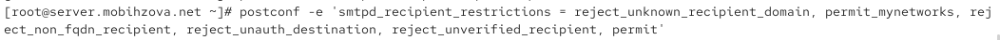{#fig-013 width=70%}

Комментарии к указанным опциям ограничений получателей

smtpd_recipient_restrictions = reject_unknown_recipient_domain, permit_mynetworks, reject_non_fqdn_recipient, reject_unauth_destination, reject_unverified_recipient, permit

reject_unknown_recipient_domain
Отклонять письма, адресованные в несуществующие домены

permit_mynetworks
Разрешать доставку писем от доверенных сетей (mynetworks)

reject_non_fqdn_recipient
Отклонять адреса получателей, не являющиеся полными доменными именами (FQDN)

reject_unauth_destination
Запрещать релей писем для доменов, не указанных в mydestination

reject_unverified_recipient
Отклонять письма несуществующим получателям после проверки

permit
Разрешить доставку, если все предыдущие проверки пройдены

Указали доверенную сеть ([рис. @fig-014]).

{#fig-014 width=70%}

Настроили мастер-процесс Postfix для включения SASL-аутентификации ([рис. @fig-015]).

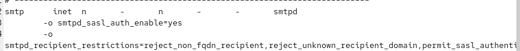{#fig-015 width=70%}

Перезапустили Postfix и Dovecot ([рис. @fig-016]).

{#fig-016 width=70%}

Установили telnet на клиенте ([рис. @fig-017]).

{#fig-017 width=70%}

Сгенерировали строку для аутентификации ([рис. @fig-018]).

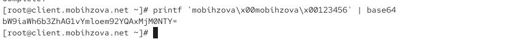{#fig-018 width=70%}

Протестировали аутентификацию через telnet ([рис. @fig-019]).

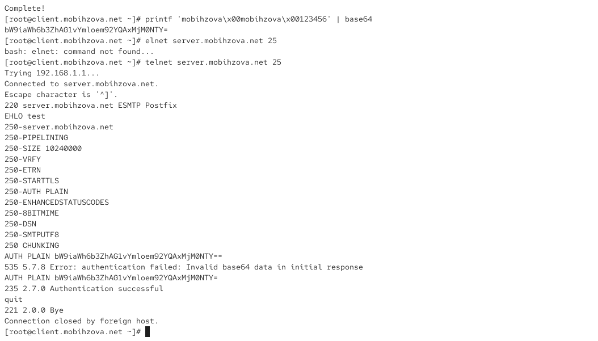{#fig-019 width=70%}

## Настройка SMTP over TLS

Скопировали сертификаты Dovecot в каталог TLS ([рис. @fig-020]).

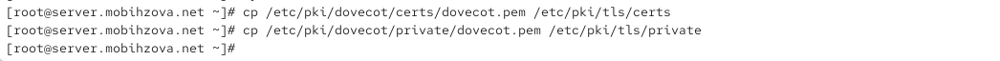{#fig-020 width=70%}

Настроили параметры TLS в Postfix ([рис. @fig-021]).

{#fig-021 width=70%}

Настроили порт 587 для Submission с TLS ([рис. @fig-022]).

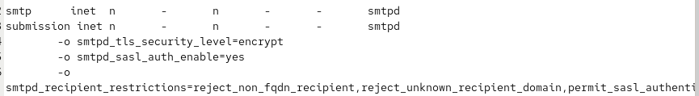{#fig-022 width=70%}

Настроили межсетевой экран для работы с smtp-submission ([рис. @fig-023]).

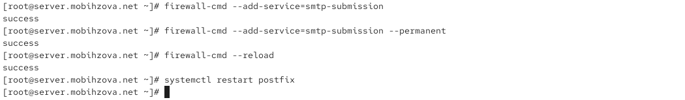{#fig-023 width=70%}

Протестировали подключение через openssl s_client ([рис. @fig-024]).

{#fig-024 width=70%}

Выполнили команду EHLO для проверки возможностей сервера ([рис. @fig-025]).

{#fig-025 width=70%}

Протестировали аутентификацию через TLS соединение ([рис. @fig-026]).

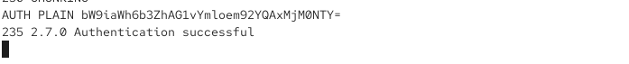{#fig-026 width=70%}

Настроили почтовый клиент Evolution для работы с SMTP ([рис. @fig-027]).

{#fig-027 width=70%}

Создали и отправили тестовое письмо через Evolution ([рис. @fig-028]).

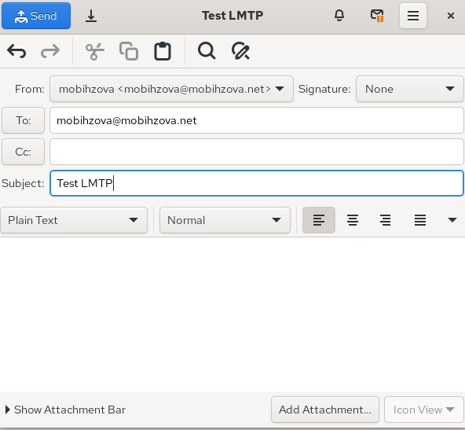{#fig-028 width=70%}

Ввели учетные данные при запросе аутентификации ([рис. @fig-029]).

{#fig-029 width=70%}

Проверили доставку письма в почтовый ящик ([рис. @fig-030]).

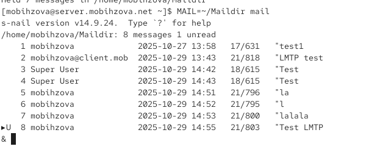{#fig-030 width=70%}

## Внесение изменений в настройки внутреннего окружения виртуальной машины

Скопировали конфигурационные файлы в директорию Vagrant ([рис. @fig-031]).

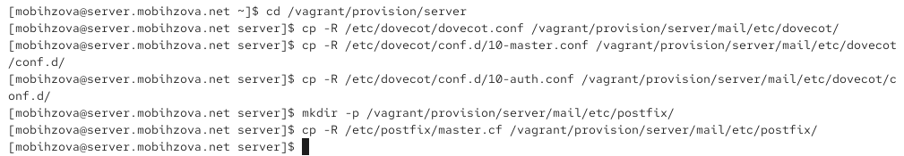{#fig-031 width=70%}

Обновили скрипт mail.sh для автоматической настройки ([рис. @fig-032]).

{#fig-032 width=70%}

Обновили скрипт на клиенте ([рис. @fig-033]).

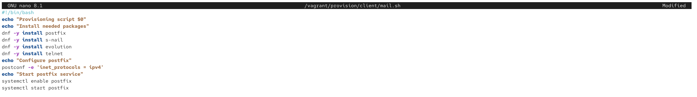{#fig-033 width=70%}

# Выводы

В ходе данной лабораторной работы я приобрела практические навыки по конфигурированию SMTP-сервера в части настройки аутентификации.

# Ответы на контрольные вопросы

1. Приведите пример задания формата аутентификации пользователя в Dovecot в форме логина с указанием домена.
   
   Для указания логина с доменом можно использовать формат: `auth_username_format = %Lu`

2. Какие функции выполняет почтовый Relay-сервер?

   Почтовый Relay-сервер выполняет пересылку почтовых сообщений между разными почтовыми системами и доменами.

3. Какие угрозы безопасности могут возникнуть в случае настройки почтового сервера как Relay-сервера?

   Основные угрозы: использование сервера для рассылки спама, попадание IP-адреса в черные списки, перехват конфиденциальной информации, ресурсоемкие DDoS-атаки.

