---
# Preamble

## Author
author:
  name: Бызова Мария Олеговна
## Title
title: Отчёт по лабораторной работе №11
subtitle: Настройка безопасного удалённого доступа по протоколу SSH
license: CC BY
date: 2025-11-10
## Generic options
lang: ru-RU
crossref:
  lof-title: Список иллюстраций
  lot-title: Список таблиц
  lol-title: Листинги
## Formats
format:
### Pdf output format
  beamer:
    toc: true
    toc-title: Содержание
    number-sections: true
    colorlinks: false
    toc-depth: 2
    slide_level: 2
    aspectratio: 169
    section-titles: true
    theme: metropolis
    themeoptions: progressbar=frametitle,sectionpage=progressbar,numbering=fraction
#### Language
    babel-lang: russian
    babel-otherlangs: english
### Html output
  revealjs:
    transition: slide
    margin: 0.2
    smaller: false
    output-ext: html
    theme: beige
    logo: _resources/image/logo_rudn.png
    
## Fonts 
mainfont: PT Serif 
romanfont: PT Serif 
sansfont: PT Sans 
monofont: PT Mono 
mainfontoptions: Ligatures=TeX 
romanfontoptions: Ligatures=TeX 
sansfontoptions: Ligatures=TeX,Scale=MatchLowercase 
monofontoptions: Scale=MatchLowercase,Scale=0.9    
---

# Цель работы

## Цель работы

Приобретение практических навыков по настройке удалённого доступа к серверу с помощью SSH.

# Выполнение лабораторной работы

## Запрет удалённого доступа по SSH для пользователя root

На сервере задали пароль для пользователя root ([рис. @fig-001]).

{#fig-001 width=70%}

## Запрет удалённого доступа по SSH для пользователя root

На сервере в дополнительном терминале запустили мониторинг системных событий ([рис. @fig-002]).

{#fig-002 width=70%}

## Запрет удалённого доступа по SSH для пользователя root

С клиента попытались получить доступ к серверу посредством SSH-соединения через пользователя root ([рис. @fig-003]).

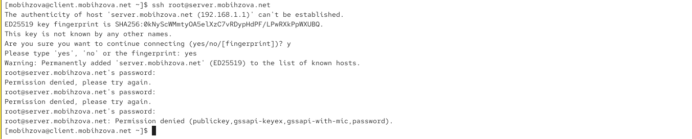{#fig-003 width=70%}

## Запрет удалённого доступа по SSH для пользователя root

На сервере открыли файл /etc/ssh/sshd_config конфигурации sshd для редактирования и запретили вход на сервер пользователю root, установив: PermitRootLogin no ([рис. @fig-004]).

{#fig-004 width=70%}

## Запрет удалённого доступа по SSH для пользователя root

После сохранения изменений в файле конфигурации перезапустили sshd ([рис. @fig-005]).

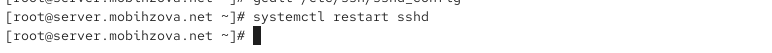{#fig-005 width=70%}

## Запрет удалённого доступа по SSH для пользователя root

Повторили попытку получения доступа с клиента к серверу посредством SSH-соединения через пользователя root ([рис. @fig-006]).

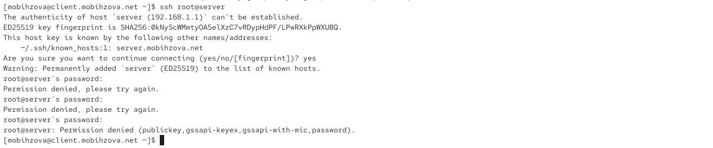{#fig-006 width=70%}

## Ограничение списка пользователей для удалённого доступа по SSH

С клиента попытались получить доступ к серверу посредством SSH-соединения через пользователя mobihzova ([рис. @fig-007]).

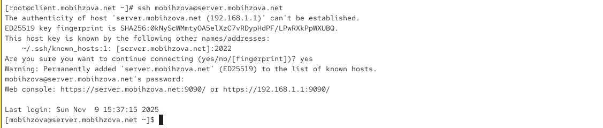{#fig-007 width=70%}

## Ограничение списка пользователей для удалённого доступа по SSH

На сервере открыли файл /etc/ssh/sshd_config конфигурации sshd на редактирование и добавили строку AllowUsers vagrant ([рис. @fig-008]).

{#fig-008 width=70%}

## Ограничение списка пользователей для удалённого доступа по SSH

После сохранения изменений в файле конфигурации перезапустили sshd ([рис. @fig-009]).

{#fig-009 width=70%}

## Ограничение списка пользователей для удалённого доступа по SSH

Повторили попытку получения доступа с клиента к серверу посредством SSH-соединения через пользователя mobihzova ([рис. @fig-010]).

{#fig-010 width=70%}

## Ограничение списка пользователей для удалённого доступа по SSH

В файле /etc/ssh/sshd_config конфигурации sshd внесли следующее изменение: AllowUsers vagrant mobihzova ([рис. @fig-011]).

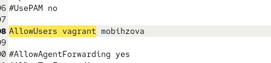{#fig-011 width=70%}

## Ограничение списка пользователей для удалённого доступа по SSH

После сохранения изменений в файле конфигурации перезапустили sshd ([рис. @fig-012]).

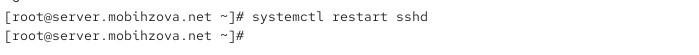{#fig-012 width=70%}

## Ограничение списка пользователей для удалённого доступа по SSH

Повторно попытались получить доступ с клиента к серверу посредством SSH-соединения через пользователя mobihzova ([рис. @fig-013]).

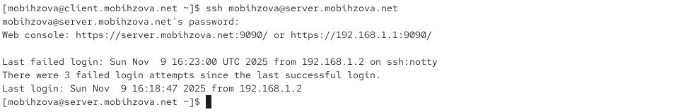{#fig-013 width=70%}

## Настройка дополнительных портов для удалённого доступа по SSH

На сервере в файле конфигурации sshd /etc/ssh/sshd_config нашли строку Port и ниже этой строки добавили: Port 22, Port 2022 ([рис. @fig-014]).

{#fig-014 width=70%}

## Настройка дополнительных портов для удалённого доступа по SSH

После сохранения изменений в файле конфигурации перезапустили sshd ([рис. @fig-015]).

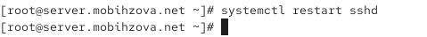{#fig-015 width=70%}

## Настройка дополнительных портов для удалённого доступа по SSH

Посмотрели расширенный статус работы sshd ([рис. @fig-016]).

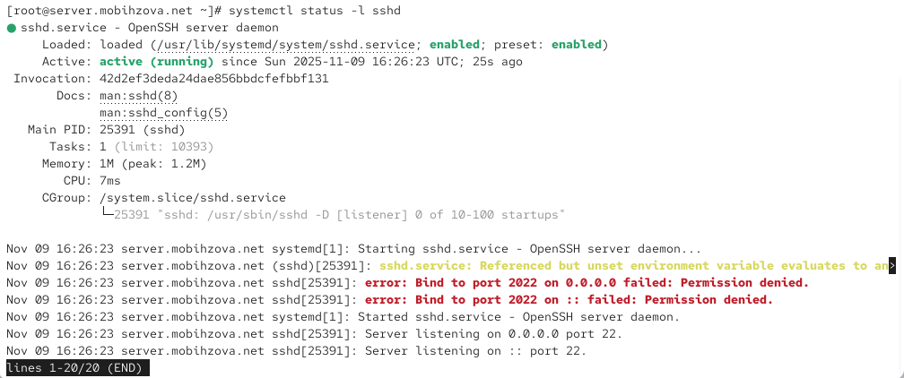{#fig-016 width=70%}

## Настройка дополнительных портов для удалённого доступа по SSH

В терминале с мониторингом системных событий наблюдали сообщения об ошибках ([рис. @fig-017]).

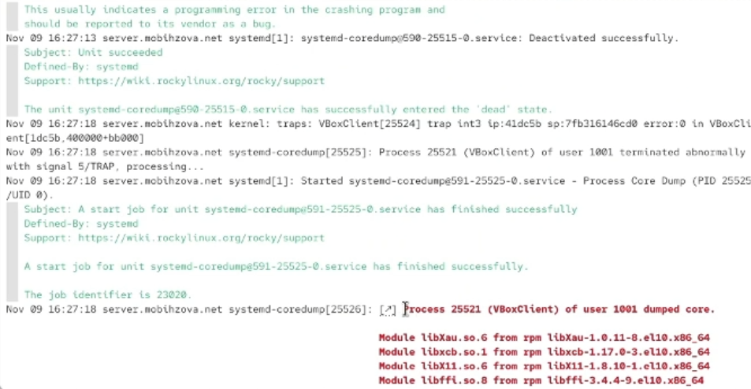{#fig-017 width=70%}

## Настройка дополнительных портов для удалённого доступа по SSH

Исправили на сервере метки SELinux к порту 2022 ([рис. @fig-018]).

{#fig-018 width=70%}

## Настройка дополнительных портов для удалённого доступа по SSH

В настройках межсетевого экрана открыли порт 2022 протокола TCP. Вновь перезапустили sshd и посмотрели расширенный статус его работы ([рис. @fig-019]).

{#fig-019 width=70%}

## Настройка дополнительных портов для удалённого доступа по SSH

С клиента попытались получить доступ к серверу посредством SSH-соединения через пользователя mobihzova ([рис. @fig-020]).

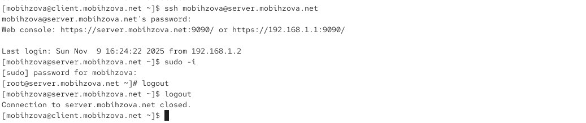{#fig-020 width=70%}

## Настройка дополнительных портов для удалённого доступа по SSH

Повторили попытку получения доступа с клиента к серверу посредством SSH-соединения через пользователя mobihzova, указав порт 2022 ([рис. @fig-021]).

{#fig-021 width=70%}

## Настройка удалённого доступа по SSH по ключу

На сервере в конфигурационном файле /etc/ssh/sshd_config задали параметр, разрешающий аутентификацию по ключу: PubkeyAuthentication yes ([рис. @fig-022]).

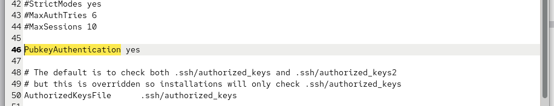{#fig-022 width=70%}

## Настройка удалённого доступа по SSH по ключу

После сохранения изменений в файле конфигурации перезапустили sshd ([рис. @fig-023]).

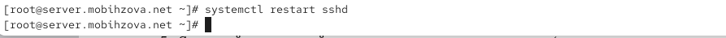{#fig-023 width=70%}

## Настройка удалённого доступа по SSH по ключу

На клиенте сформировали SSH-ключ, введя в терминале под пользователем mobihzova: ssh-keygen ([рис. @fig-024]).

{#fig-024 width=70%}

## Настройка удалённого доступа по SSH по ключу

Скопировали открытый ключ на сервер, введя на клиенте: ssh-copy-id mobihzova@server.mobihzova.net ([рис. @fig-025]).

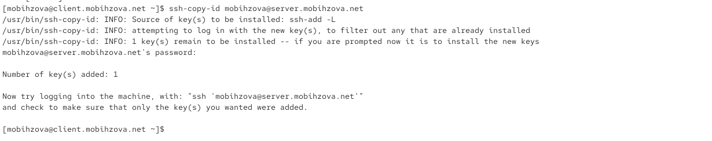{#fig-025 width=70%}

## Настройка удалённого доступа по SSH по ключу

Попробовали получить доступ с клиента к серверу посредством SSH-соединения ([рис. @fig-026]).

{#fig-026 width=70%}

## Организация туннелей SSH, перенаправление TCP-портов

На клиенте посмотрели, запущены ли какие-то службы с протоколом TCP ([рис. @fig-027]).

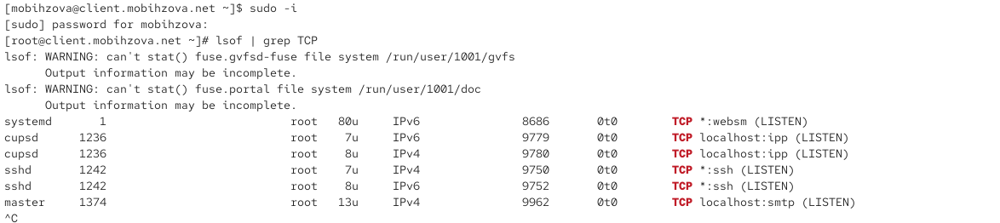{#fig-027 width=70%}

## Организация туннелей SSH, перенаправление TCP-портов

Перенаправили порт 80 на server.mobihzova.net на порт 8080 на локальной машине ([рис. @fig-028]).

{#fig-028 width=70%}

## Организация туннелей SSH, перенаправление TCP-портов

Вновь на клиенте посмотрели, запущены ли какие-то службы с протоколом TCP ([рис. @fig-029]).

{#fig-029 width=70%}

## Организация туннелей SSH, перенаправление TCP-портов

На клиенте запустили браузер и в адресной строке ввели localhost:8080 ([рис. @fig-030]).

{#fig-030 width=70%}

## Запуск консольных приложений через SSH

На клиенте открыли терминал под пользователем mobihzova. Посмотрели с клиента имя узла сервера ([рис. @fig-031]).

{#fig-031 width=70%}

## Запуск консольных приложений через SSH

Посмотрели с клиента список файлов на сервере ([рис. @fig-032]).

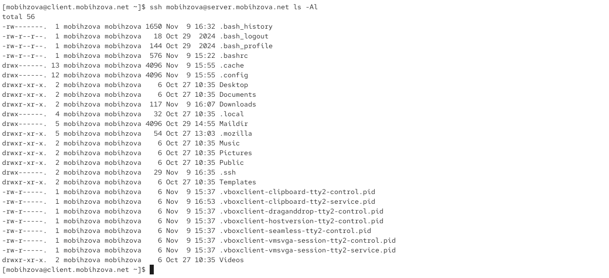{#fig-032 width=70%}

## Запуск консольных приложений через SSH

Посмотрели с клиента почту на сервере ([рис. @fig-033]).

{#fig-033 width=70%}

## Запуск графических приложений через SSH (X11Forwarding)

На сервере в конфигурационном файле /etc/ssh/sshd_config разрешили отображать на локальном клиентском компьютере графические интерфейсы X11: X11Forwarding yes ([рис. @fig-034]).

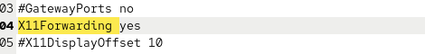{#fig-034 width=70%}

## Запуск графических приложений через SSH (X11Forwarding)

После сохранения изменения в конфигурационном файле перезапустили sshd ([рис. @fig-035]).

{#fig-035 width=70%}

## Запуск графических приложений через SSH (X11Forwarding)

Попробовали с клиента удалённо подключиться к серверу и запустить графическое приложение firefox ([рис. @fig-036]).

{#fig-036 width=70%}

## Запуск графических приложений через SSH (X11Forwarding)

Окно Firefox успешно отобразилось на клиентской машине ([рис. @fig-037]).

{#fig-037 width=70%}

## Внесение изменений в настройки внутреннего окружения виртуальной машины

На виртуальной машине server перешли в каталог для внесения изменений в настройки внутреннего окружения /vagrant/provision/server/, создали в нём каталог ssh, в который поместили в соответствующие подкаталоги конфигурационный файл sshd_config ([рис. @fig-038]).

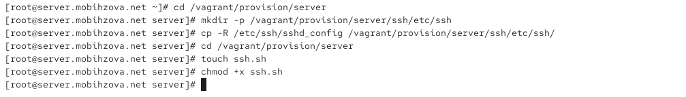{#fig-038 width=70%}

## Внесение изменений в настройки внутреннего окружения виртуальной машины

В каталоге /vagrant/provision/server создали исполняемый файл ssh.sh ([рис. @fig-039]).

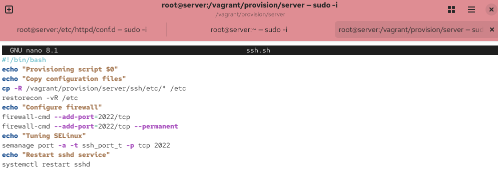{#fig-039 width=70%}

## Внесение изменений в настройки внутреннего окружения виртуальной машины

Для отработки созданного скрипта во время загрузки виртуальной машины server в конфигурационном файле Vagrantfile добавили в разделе конфигурации для сервера соответствующую запись ([рис. @fig-040]).

{#fig-040 width=70%}

# Выводы

## Выводы

В ходе выполнения лабораторной работы были приобретены практические навыки по настройке безопасного удалённого доступа к серверу с помощью SSH. Были выполнены все поставленные задачи по настройке безопасности SSH-сервера, включая запрет доступа для root, ограничение круга пользователей, настройку дополнительных портов, аутентизацию по ключам, организацию туннелей и запуск графических приложений.
