---
# Preamble

## Author
author:
  name: Бызова Мария Олеговна
## Title
title: "Отчёт по лабораторной работе №11"
subtitle: "Настройка безопасного удалённого доступа по протоколу SSH"
license: "CC BY"
## Generic options
lang: ru-RU
number-sections: true
toc: true
toc-title: "Содержание"
toc-depth: 2
## Crossref customization
crossref:
  lof-title: "Список иллюстраций"
  lot-title: "Список таблиц"
  lol-title: "Листинги"
## Bibliography
#bibliography:
#  - bib/cite.bib
#csl: _resources/csl/gost-r-7-0-5-2008-numeric.csl
## Formats
format:
### Pdf output format
  pdf:
    toc: true
    number-sections: true
    colorlinks: false
    toc-depth: 2
    lof: true # List of figures
    lot: true # List of tables
#### Document
    documentclass: scrreprt
    papersize: a4
    fontsize: 12pt
    linestretch: 1.5
#### Language
#    babel-lang: russian
#    babel-otherlangs: english
#### Biblatex
#    cite-method: biblatex
#    biblio-style: gost-numeric
#    biblatexoptions:
#      - backend=biber
#      - langhook=extras
#      - autolang=other*
#### Misc options
    csquotes: true
    indent: true
    header-includes: |
      \usepackage{indentfirst}
      \usepackage{float}
      \floatplacement{figure}{H}
      \usepackage[math,RM={Scale=0.94},SS={Scale=0.94},SScon={Scale=0.94},TT={Scale=MatchLowercase,FakeStretch=0.9},DefaultFeatures={Ligatures=Common}]{plex-otf}
### Docx output format
  docx:
    toc: true
    number-sections: true
    toc-depth: 2
---

# Цель работы

Целью данной лабораторной работы является приобретение практических навыков по настройке удалённого доступа к серверу с помощью SSH.

# Выполнение лабораторной работы

## Запрет удалённого доступа по SSH для пользователя root

На сервере задали пароль для пользователя root ([рис. @fig-001]).

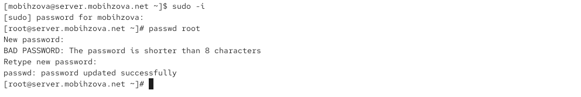{#fig-001 width=70%}

На сервере в дополнительном терминале запустили мониторинг системных событий ([рис. @fig-002]).

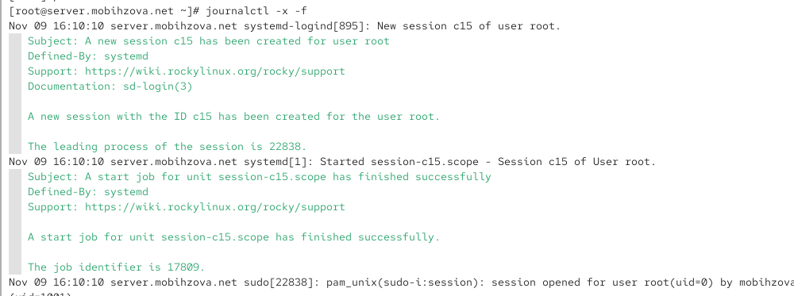{#fig-002 width=70%}

С клиента попытались получить доступ к серверу посредством SSH-соединения через пользователя root ([рис. @fig-003]).

{#fig-003 width=70%}

При первой попытке подключения ssh root@server.mobihzova.net система запрашивает подтверждение подлинности хоста, так как это первое подключение к данному серверу. После подтверждения запрашивается пароль пользователя root, но после нескольких попыток ввода доступ запрещается с сообщением "Permission denied".

На сервере открыли файл /etc/ssh/sshd_config конфигурации sshd для редактирования и запретили вход на сервер пользователю root, установив: PermitRootLogin no ([рис. @fig-004]).

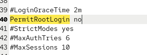{#fig-004 width=70%}

После сохранения изменений в файле конфигурации перезапустили sshd ([рис. @fig-005]).

{#fig-005 width=70%}

Повторили попытку получения доступа с клиента к серверу посредством SSH-соединения через пользователя root ([рис. @fig-006]).

После установки PermitRootLogin no и перезапуска sshd повторная попытка подключения ssh root@server также завершается ошибкой "Permission denied", но теперь без запроса пароля - система сразу отклоняет подключение.

{#fig-006 width=70%}

## Ограничение списка пользователей для удалённого доступа по SSH

С клиента попытались получить доступ к серверу посредством SSH-соединения через пользователя mobihzova ([рис. @fig-007]).

{#fig-007 width=70%}

Подключение ssh mobihzova@server.mobihzova.net успешно выполняется после ввода правильного пароля пользователя mobihzova.

На сервере открыли файл /etc/ssh/sshd_config конфигурации sshd на редактирование и добавили строку AllowUsers vagrant ([рис. @fig-008]).

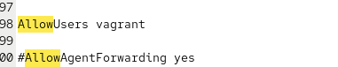{#fig-008 width=70%}

После сохранения изменений в файле конфигурации перезапустили sshd ([рис. @fig-009]).

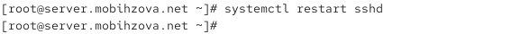{#fig-009 width=70%}

Повторили попытку получения доступа с клиента к серверу посредством SSH-соединения через пользователя mobihzova ([рис. @fig-010]).

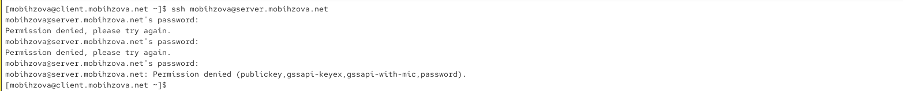{#fig-010 width=70%}

После добавления AllowUsers vagrant и перезапуска sshd попытка подключения ssh mobihzova@server.mobihzova.net завершается ошибкой "Permission denied", так как пользователь mobihzova исключен из списка разрешенных.

В файле /etc/ssh/sshd_config конфигурации sshd внесли следующее изменение: AllowUsers vagrant mobihzova ([рис. @fig-011]).

{#fig-011 width=70%}

После сохранения изменений в файле конфигурации перезапустили sshd ([рис. @fig-012]).

{#fig-012 width=70%}

Повторно попытались получить доступ с клиента к серверу посредством SSH-соединения через пользователя mobihzova ([рис. @fig-013]).

{#fig-013 width=70%}

После добавления AllowUsers vagrant mobihzova и перезапуска sshd подключение ssh mobihzova@server.mobihzova.net снова успешно выполняется.

## Настройка дополнительных портов для удалённого доступа по SSH

На сервере в файле конфигурации sshd /etc/ssh/sshd_config нашли строку Port и ниже этой строки добавили: Port 22, Port 2022 ([рис. @fig-014]).

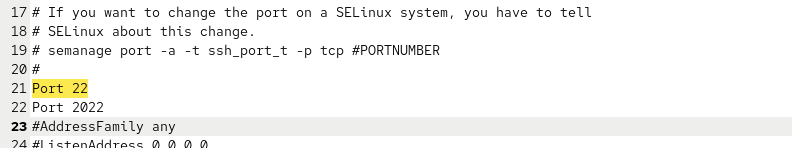{#fig-014 width=70%}

После сохранения изменений в файле конфигурации перезапустили sshd ([рис. @fig-015]).

{#fig-015 width=70%}

Посмотрели расширенный статус работы sshd ([рис. @fig-016]).

{#fig-016 width=70%}

В терминале с мониторингом системных событий наблюдали сообщения об ошибках ([рис. @fig-017]).

{#fig-017 width=70%}

Суть системных сообщений: При анализе расширенного статуса работы sshd (systemctl status -l sshd) и системных логов наблюдаются следующие ключевые сообщения, связанные с портом 2022:

"error: Bind to port 2022 on 0.0.0.0 failed: Permission denied" - sshd не может занять порт 2022 на всех сетевых интерфейсах

"error: Bind to port 2022 on :: failed: Permission denied" - аналогичная ошибка для IPv6-интерфейсов

Причина проблемы: SELinux блокирует использование нестандартного порта 2022 для SSH-сервиса. По умолчанию SELinux разрешает SSH работать только на портах, помеченных специальной меткой ssh_port_t. Порт 2022 не входит в этот список, поэтому политика безопасности запрещает sshd использовать его.

В логах journalctl также присутствуют соответствующие сообщения от SELinux, которые указывают на нарушение политики безопасности при попытке биндинга на порт 2022.

Решение проблемы: Требуется добавить порт 2022 в контекст безопасности SSH с помощью команды semanage port -a -t ssh_port_t -p tcp 2022, что сообщит SELinux о разрешении использования данного порта для SSH-соединений.

Исправили на сервере метки SELinux к порту 2022 ([рис. @fig-018]).

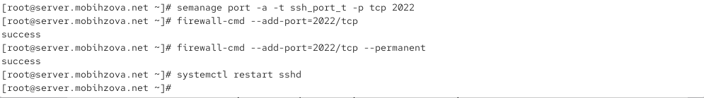{#fig-018 width=70%}

В настройках межсетевого экрана открыли порт 2022 протокола TCP. Вновь перезапустили sshd и посмотрели расширенный статус его работы ([рис. @fig-019]).

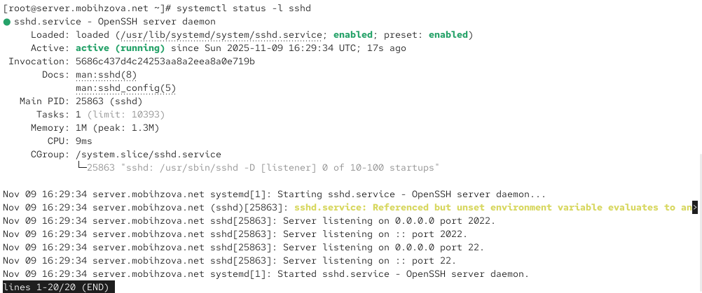{#fig-019 width=70%}

С клиента попытались получить доступ к серверу посредством SSH-соединения через пользователя mobihzova ([рис. @fig-020]).

{#fig-020 width=70%}

Повторили попытку получения доступа с клиента к серверу посредством SSH-соединения через пользователя mobihzova, указав порт 2022 ([рис. @fig-021]).

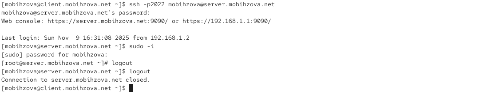{#fig-021 width=70%}

## Настройка удалённого доступа по SSH по ключу

На сервере в конфигурационном файле /etc/ssh/sshd_config задали параметр, разрешающий аутентификацию по ключу: PubkeyAuthentication yes ([рис. @fig-022]).

{#fig-022 width=70%}

После сохранения изменений в файле конфигурации перезапустили sshd ([рис. @fig-023]).

{#fig-023 width=70%}

На клиенте сформировали SSH-ключ, введя в терминале под пользователем mobihzova: ssh-keygen ([рис. @fig-024]).

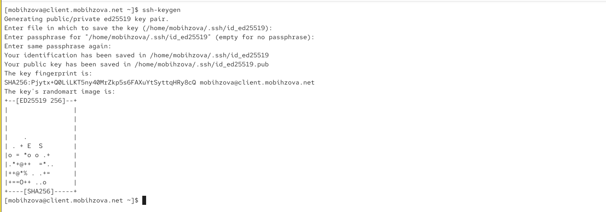{#fig-024 width=70%}

Скопировали открытый ключ на сервер, введя на клиенте: ssh-copy-id mobihzova@server.mobihzova.net ([рис. @fig-025]).

{#fig-025 width=70%}

Попробовали получить доступ с клиента к серверу посредством SSH-соединения ([рис. @fig-026]).

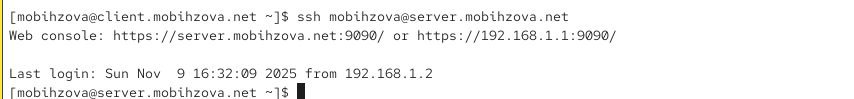{#fig-026 width=70%}

## Организация туннелей SSH, перенаправление TCP-портов

На клиенте посмотрели, запущены ли какие-то службы с протоколом TCP ([рис. @fig-027]).

{#fig-027 width=70%}

Перенаправили порт 80 на server.mobihzova.net на порт 8080 на локальной машине ([рис. @fig-028]).

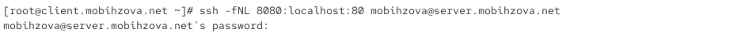{#fig-028 width=70%}

Вновь на клиенте посмотрели, запущены ли какие-то службы с протоколом TCP ([рис. @fig-029]).

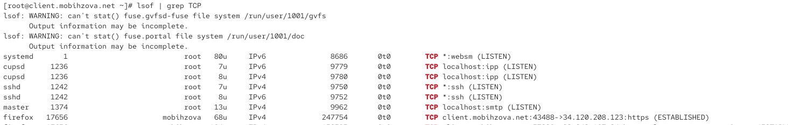{#fig-029 width=70%}

После создания SSH-туннеля в выводе lsof | grep TCP появляется новое установленное соединение Firefox с внешним сервером (client.mobihzova.net:43488->34.120.208.123:https), что свидетельствует о работе браузера через туннель.

На клиенте запустили браузер и в адресной строке ввели localhost:8080 ([рис. @fig-030]).

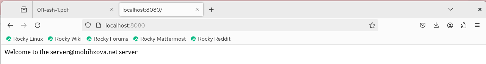{#fig-030 width=70%}

## Запуск консольных приложений через SSH

На клиенте открыли терминал под пользователем mobihzova. Посмотрели с клиента имя узла сервера ([рис. @fig-031]).

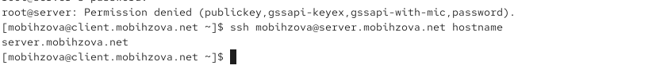{#fig-031 width=70%}

Посмотрели с клиента список файлов на сервере ([рис. @fig-032]).

{#fig-032 width=70%}

Посмотрели с клиента почту на сервере ([рис. @fig-033]).

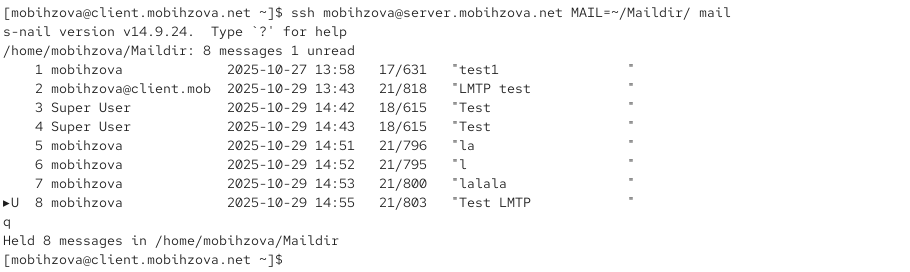{#fig-033 width=70%}

## Запуск графических приложений через SSH (X11Forwarding)

На сервере в конфигурационном файле /etc/ssh/sshd_config разрешили отображать на локальном клиентском компьютере графические интерфейсы X11: X11Forwarding yes ([рис. @fig-034]).

{#fig-034 width=70%}

После сохранения изменения в конфигурационном файле перезапустили sshd ([рис. @fig-035]).

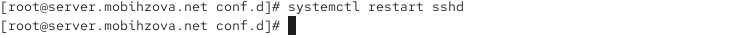{#fig-035 width=70%}

Попробовали с клиента удалённо подключиться к серверу и запустить графическое приложение firefox ([рис. @fig-036]).

{#fig-036 width=70%}

Окно Firefox успешно отобразилось на клиентской машине ([рис. @fig-037]).

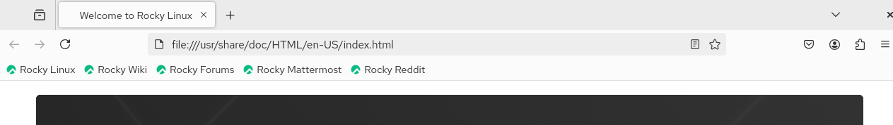{#fig-037 width=70%}

## Внесение изменений в настройки внутреннего окружения виртуальной машины

На виртуальной машине server перешли в каталог для внесения изменений в настройки внутреннего окружения /vagrant/provision/server/, создали в нём каталог ssh, в который поместили в соответствующие подкаталоги конфигурационный файл sshd_config ([рис. @fig-038]).

{#fig-038 width=70%}

В каталоге /vagrant/provision/server создали исполняемый файл ssh.sh ([рис. @fig-039]).

{#fig-039 width=70%}

Для отработки созданного скрипта во время загрузки виртуальной машины server в конфигурационном файле Vagrantfile добавили в разделе конфигурации для сервера соответствующую запись ([рис. @fig-040]).

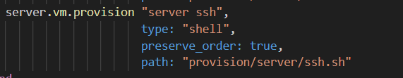{#fig-040 width=70%}

# Выводы

В ходе выполнения лабораторной работы были приобретены практические навыки по настройке безопасного удалённого доступа к серверу с помощью SSH. Были выполнены все поставленные задачи по настройке безопасности SSH-сервера, включая запрет доступа для root, ограничение круга пользователей, настройку дополнительных портов, аутентизацию по ключам, организацию туннелей и запуск графических приложений.

# Ответы на контрольные вопросы

1. Вы хотите запретить удалённый доступ по SSH на сервер пользователю root и разрешить доступ пользователю alice. Как это сделать?
   В файле /etc/ssh/sshd_config установить параметр PermitRootLogin no и добавить строку AllowUsers alice.

2. Как настроить удалённый доступ по SSH через несколько портов? Для чего это может потребоваться?
   В файле /etc/ssh/sshd_config добавить несколько строк Port с указанием номеров портов. Это может потребоваться для обеспечения отказоустойчивости или сокрытия стандартного порта.

3. Какие параметры используются для создания туннеля SSH, когда команда ssh устанавливает фоновое соединение и не ожидает какой-либо конкретной команды?
   Параметры -f (фоновый режим) и -N (не выполнять удалённую команду).

4. Как настроить локальную переадресацию с локального порта 5555 на порт 80 сервера server2.example.com?
   Команда: ssh -L 5555:localhost:80 user@server2.example.com

5. Как настроить SELinux, чтобы позволить SSH связываться с портом 2022?
   Выполнить команду: semanage port -a -t ssh_port_t -p tcp 2022

6. Как настроить межсетевой экран на сервере, чтобы разрешить входящие подключения по SSH через порт 2022?
   Выполнить команды: 
   firewall-cmd --add-port=2022/tcp
   firewall-cmd --add-port=2022/tcp --permanent
