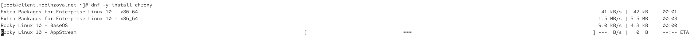
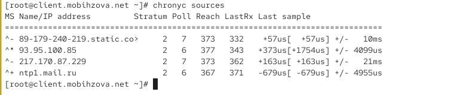
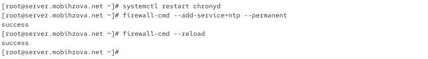
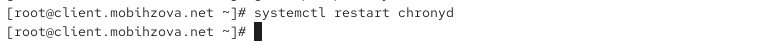
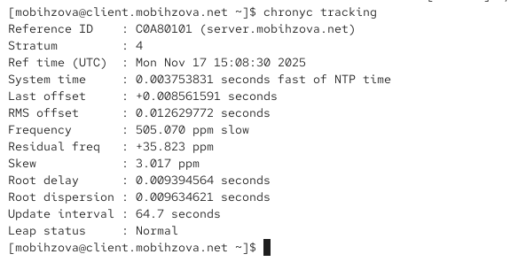
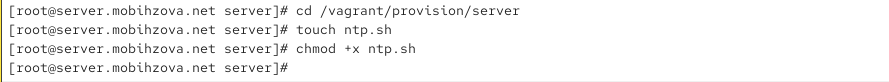
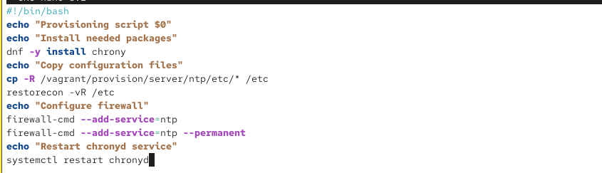
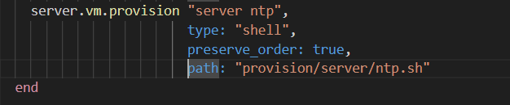
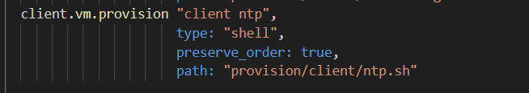

---
# Preamble

## Author
author:
  name: Бызова Мария Олеговна
## Title
title: Отчёт по лабораторной работе №12
subtitle: Синхронизация времени
license: CC BY
date: 2025-11-10
## Generic options
lang: ru-RU
crossref:
  lof-title: Список иллюстраций
  lot-title: Список таблиц
  lol-title: Листинги
## Formats
format:
### Pdf output format
  beamer:
    toc: true
    toc-title: Содержание
    number-sections: true
    colorlinks: false
    toc-depth: 2
    slide_level: 2
    aspectratio: 169
    section-titles: true
    theme: metropolis
    themeoptions: progressbar=frametitle,sectionpage=progressbar,numbering=fraction
#### Language
    babel-lang: russian
    babel-otherlangs: english
### Html output
  revealjs:
    transition: slide
    margin: 0.2
    smaller: false
    output-ext: html
    theme: beige
    logo: _resources/image/logo_rudn.png
    
## Fonts 
mainfont: PT Serif 
romanfont: PT Serif 
sansfont: PT Sans 
monofont: PT Mono 
mainfontoptions: Ligatures=TeX 
romanfontoptions: Ligatures=TeX 
sansfontoptions: Ligatures=TeX,Scale=MatchLowercase 
monofontoptions: Scale=MatchLowercase,Scale=0.9    
---

# Цель работы

## Цель работы

Целью данной лабораторной работы является получение навыков по управлению системным временем и настройке синхронизации времени.

# Выполнение лабораторной работы

## Проверка параметров времени на сервере

На сервере посмотрим параметры настройки даты и времени с помощью команды `timedatectl`, текущее системное время с помощью команды `date` и аппаратное время с помощью команды `hwclock` ([рис. @fig-001]).

{#fig-001 width=70%}

## Проверка параметров времени на клиенте

На клиенте также проверим параметры времени с помощью тех же команд ([рис. @fig-002]).

{#fig-002 width=70%}

## Управление синхронизацией времени

Установим необходимое программное обеспечение chrony на сервере ([рис. @fig-003]).

{#fig-003 width=70%}

## Установка chrony на клиенте

Установим chrony на клиенте ([рис. @fig-004]).

{#fig-004 width=70%}

## Проверка исходных источников времени на сервере

Проверим источники времени на сервере до настройки ([рис. @fig-005]).

{#fig-005 width=70%}

## Проверка исходных источников времени на клиенте

Проверим источники времени на клиенте до настройки ([рис. @fig-006]).

{#fig-006 width=70%}

## Настройка сервера chrony

На сервере отредактируем файл `/etc/chrony.conf` и добавим строку, разрешающую доступ клиентам из локальной сети ([рис. @fig-007]).

{#fig-007 width=70%}

## Настройка сервера chrony

Перезапустим службу chronyd и настроим межсетевой экран ([рис. @fig-008]).

{#fig-008 width=70%}

## Настройка клиента chrony

На клиенте отредактируем файл `/etc/chrony.conf`, добавив строку с указанием сервера синхронизации и удалив все остальные строки с директивой server ([рис. @fig-009])

{#fig-009 width=70%}

## Настройка клиента chrony

Перезапустим службу chronyd на клиенте ([рис. @fig-010]).

{#fig-010 width=70%}

## Проверка синхронизации после настройки

Проверим источники времени на клиенте после настройки ([рис. @fig-011]).

{#fig-011 width=70%}

## Проверка синхронизации после настройки

Проверим источники времени на сервере после настройки ([рис. @fig-012]).

{#fig-012 width=70%}

## Детальная информация о синхронизации

Посмотрим подробную информацию о синхронизации на клиенте ([рис. @fig-013]).

{#fig-013 width=70%}

## Внесение изменений в настройки внутреннего окружения виртуальных машин

На виртуальной машине server перейдем в каталог для внесения изменений и создадим необходимые структуры каталогов ([рис. @fig-014]).

{#fig-014 width=70%}

## Внесение изменений в настройки внутреннего окружения виртуальных машин

Создадим исполняемый файл ntp.sh на сервере ([рис. @fig-015]).

{#fig-015 width=70%}

## Внесение изменений в настройки внутреннего окружения виртуальных машин

Настроим содержимое скрипта ntp.sh для сервера ([рис. @fig-016]).

{#fig-016 width=70%}

## Внесение изменений в настройки внутреннего окружения виртуальных машин

На виртуальной машине client создадим структуру каталогов для конфигурации ([рис. @fig-017]).

{#fig-017 width=70%}

## Внесение изменений в настройки внутреннего окружения виртуальных машин

Создадим исполняемый файл ntp.sh на клиенте ([рис. @fig-018]).

{#fig-018 width=70%}

## Внесение изменений в настройки внутреннего окружения виртуальных машин

Настроим содержимое скрипта ntp.sh для клиента ([рис. @fig-019]).

{#fig-019 width=70%}

## Внесение изменений в настройки внутреннего окружения виртуальных машин

Добавим в конфигурационный файл Vagrantfile секции для автоматического выполнения скриптов при загрузке виртуальных машин ([рис. @fig-020], [рис. @fig-021]).

## Внесение изменений в настройки внутреннего окружения виртуальных машин

{#fig-020 width=70%}

## Внесение изменений в настройки внутреннего окружения виртуальных машин

{#fig-021 width=70%}

# Выводы

## Выводы

В ходе данной лабораторной работы я приобрела навыки по управлению системным временем и настройке синхронизации времени.
