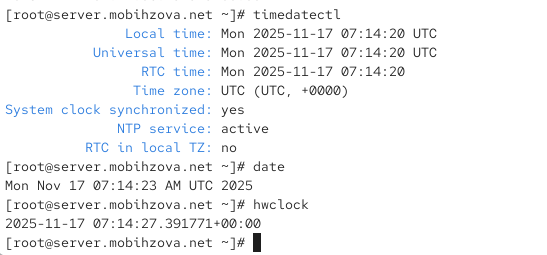
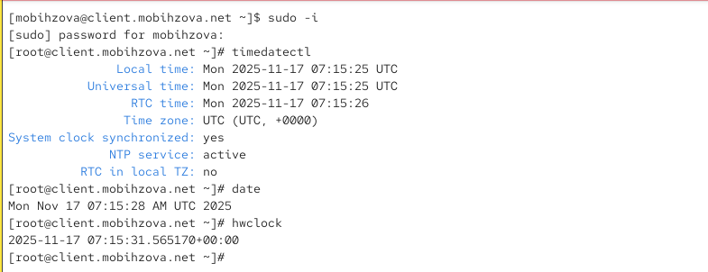
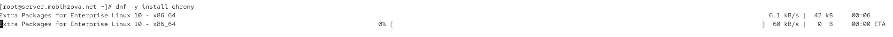
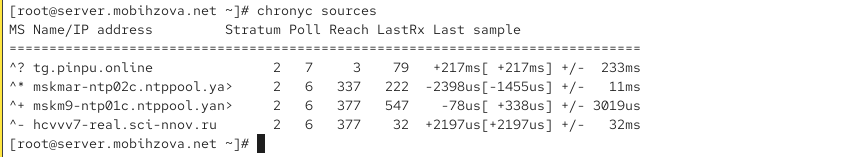
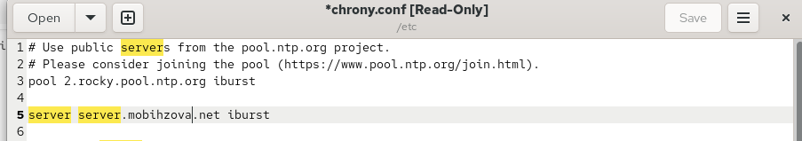
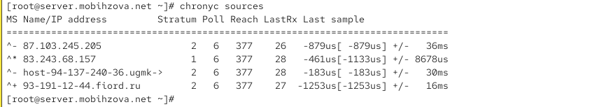
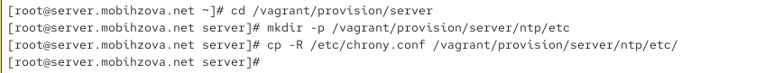
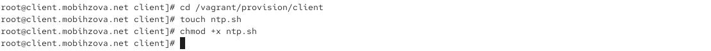
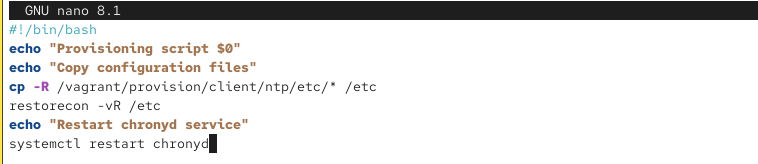

---
# Preamble

## Author
author:
  name: Бызова Мария Олеговна
## Title
title: "Отчёт по лабораторной работе №12"
subtitle: "Синхронизация времени"
license: "CC BY"
## Generic options
lang: ru-RU
number-sections: true
toc: true
toc-title: "Содержание"
toc-depth: 2
## Crossref customization
crossref:
  lof-title: "Список иллюстраций"
  lot-title: "Список таблиц"
  lol-title: "Листинги"
## Bibliography
#bibliography:
#  - bib/cite.bib
#csl: _resources/csl/gost-r-7-0-5-2008-numeric.csl
## Formats
format:
### Pdf output format
  pdf:
    toc: true
    number-sections: true
    colorlinks: false
    toc-depth: 2
    lof: true # List of figures
    lot: true # List of tables
#### Document
    documentclass: scrreprt
    papersize: a4
    fontsize: 12pt
    linestretch: 1.5
#### Language
#    babel-lang: russian
#    babel-otherlangs: english
#### Biblatex
#    cite-method: biblatex
#    biblio-style: gost-numeric
#    biblatexoptions:
#      - backend=biber
#      - langhook=extras
#      - autolang=other*
#### Misc options
    csquotes: true
    indent: true
    header-includes: |
      \usepackage{indentfirst}
      \usepackage{float}
      \floatplacement{figure}{H}
      \usepackage[math,RM={Scale=0.94},SS={Scale=0.94},SScon={Scale=0.94},TT={Scale=MatchLowercase,FakeStretch=0.9},DefaultFeatures={Ligatures=Common}]{plex-otf}
### Docx output format
  docx:
    toc: true
    number-sections: true
    toc-depth: 2
---

# Цель работы

Целью данной лабораторной работы является получение навыков по управлению системным временем и настройке синхронизации времени.

# Выполнение лабораторной работы

## Настройка параметров времени

### Проверка параметров времени на сервере

На сервере посмотрим параметры настройки даты и времени с помощью команды `timedatectl`, текущее системное время с помощью команды `date` и аппаратное время с помощью команды `hwclock` ([рис. @fig-001]).

{#fig-001 width=70%}

**Анализ результатов:**
- Сервер находится в часовом поясе UTC
- Сетевая синхронизация времени активна (`NTP service: active`)
- Системные часы синхронизированы (`System clock synchronized: yes`)
- Локальное время: 17 ноября 2025 года, 07:14:20 UTC

### Проверка параметров времени на клиенте

На клиенте также проверим параметры времени с помощью тех же команд ([рис. @fig-002]).

{#fig-002 width=70%}

**Анализ результатов:**
- Клиент также находится в часовом поясе UTC
- Сетевая синхронизация времени активна
- Системные часы синхронизированы
- Локальное время: 17 ноября 2025 года, 07:15:25 UTC

## Управление синхронизацией времени

### Установка chrony на сервере

Установим необходимое программное обеспечение chrony на сервере ([рис. @fig-003]).

{#fig-003 width=70%}

### Установка chrony на клиенте

Установим chrony на клиенте ([рис. @fig-004]).

{#fig-004 width=70%}

### Проверка исходных источников времени на сервере

Проверим источники времени на сервере до настройки ([рис. @fig-005]).

{#fig-005 width=70%}

**Анализ вывода `chronyc sources`:**
- Сервер синхронизируется с несколькими внешними NTP-серверами
- Символ `^*` указывает на текущий выбранный источник синхронизации (`mskmar-ntp02c.ntppool.ya...`)
- Символ `^+` указывает на приемлемые источники времени
- Страта источников составляет 2, что означает высокую точность

### Проверка исходных источников времени на клиенте

Проверим источники времени на клиенте до настройки ([рис. @fig-006]).

{#fig-006 width=70%}

**Анализ вывода `chronyc sources`:**
- Клиент синхронизируется с внешними серверами (`93.95.100.85`, `ntpl.mail.ru`)
- Символ `^*` указывает на активный источник синхронизации
- Все источники имеют страту 2

### Настройка сервера chrony

На сервере отредактируем файл `/etc/chrony.conf` и добавим строку, разрешающую доступ клиентам из локальной сети ([рис. @fig-007]).

{#fig-007 width=70%}

Перезапустим службу chronyd и настроим межсетевой экран ([рис. @fig-008]).

{#fig-008 width=70%}

### Настройка клиента chrony

На клиенте отредактируем файл `/etc/chrony.conf`, добавив строку с указанием сервера синхронизации и удалив все остальные строки с директивой server ([рис. @fig-009])

{#fig-009 width=70%}

Перезапустим службу chronyd на клиенте ([рис. @fig-010]).

{#fig-010 width=70%}

### Проверка синхронизации после настройки

Проверим источники времени на клиенте после настройки ([рис. @fig-011]).

{#fig-011 width=70%}

**Анализ результатов:**
- Клиент теперь показывает только один источник — `server.mobihzova.net`
- Символ `^*` означает, что клиент успешно синхронизирован с этим сервером
- Страта сервера составляет 2
- Задача выполнена — клиент синхронизируется исключительно с внутренним сервером

Проверим источники времени на сервере после настройки ([рис. @fig-012]).

{#fig-012 width=70%}

**Анализ результатов:**
- Сервер продолжает синхронизироваться с внешними Stratum 1 и 2 серверами
- Это обеспечивает точное время для всей локальной сети

### Детальная информация о синхронизации

Посмотрим подробную информацию о синхронизации на клиенте ([рис. @fig-013]).

{#fig-013 width=70%}

**Анализ вывода `chronyc tracking`:**
- `Reference ID : C0A80101 (server.mobihzova.net)` — клиент синхронизируется с сервером `server.mobшhzova.net`
- `Stratum : 4` — уровень синхронизации клиента равен 4 (сервер имеет уровень 3)
- `Ref time (UTC) : Mon Nov 17 15:08:30 2025` — актуальное время последнего обновления
- `System time : 0.003753831 seconds fast of NTP time` — локальные часы опережают на ~3.7 мс
- `Root delay : 0.009394564 seconds` — общая задержка до эталонного сервера (~9.4 мс)
- `Leap status : Normal` — статус синхронизации "Нормальный"

## Внесение изменений в настройки внутреннего окружения виртуальных машин

### Настройка сервера для автоматической конфигурации

На виртуальной машине server перейдем в каталог для внесения изменений и создадим необходимые структуры каталогов ([рис. @fig-014]).

{#fig-014 width=70%}

Создадим исполняемый файл ntp.sh на сервере ([рис. @fig-015]).

{#fig-015 width=70%}

Настроим содержимое скрипта ntp.sh для сервера ([рис. @fig-016]).

{#fig-016 width=70%}

### Настройка клиента для автоматической конфигурации

На виртуальной машине client создадим структуру каталогов для конфигурации ([рис. @fig-017]).

{#fig-017 width=70%}

Создадим исполняемый файл ntp.sh на клиенте ([рис. @fig-018]).

{#fig-018 width=70%}

Настроим содержимое скрипта ntp.sh для клиента ([рис. @fig-019]).

{#fig-019 width=70%}

### Интеграция с Vagrant

Добавим в конфигурационный файл Vagrantfile секции для автоматического выполнения скриптов при загрузке виртуальных машин ([рис. @fig-020], [рис. @fig-021]).

{#fig-020 width=70%}

{#fig-021 width=70%}

# Выводы

В ходе данной лабораторной работы я приобрела навыки по управлению системным временем и настройке синхронизации времени.

# Ответы на контрольные вопросы

1. **Почему важна точная синхронизация времени для служб баз данных?**
   Точная синхронизация времени критически важна для обеспечения согласованности данных, особенно в распределенных системах баз данных. Она позволяет корректно упорядочивать транзакции, обеспечивать целостность репликации данных и корректно работать механизмам блокировок.

2. **Почему служба проверки подлинности Kerberos сильно зависит от правильной синхронизации времени?**
   Kerberos использует временные метки в билетах аутентификации для защиты от атак повторного воспроизведения. Если разница во времени между клиентом и сервером превышает допустимый порог (обычно 5 минут), аутентификация завершится неудачно.

3. **Какая служба используется по умолчанию для синхронизации времени на RHEL 7?**
   На RHEL 7 по умолчанию используется служба chronyd для синхронизации времени.

4. **Какова страта по умолчанию для локальных часов?**
   Страта по умолчанию для локальных часов обычно равна 10, когда нет доступных источников синхронизации.

5. **Какой порт брандмауэра должен быть открыт, если вы настраиваете свой сервер как одноранговый узел NTP?**
   Для работы NTP-сервера должен быть открыт порт 123/UDP.

6. **Какую строку вам нужно включить в конфигурационный файл chrony, если вы хотите быть сервером времени, даже если внешние серверы NTP недоступны?**
   Необходимо добавить директиву `local stratum 10` или `allow` для соответствующей сети, чтобы сервер мог работать как источник времени даже при отсутствии внешней синхронизации.

7. **Какую страту имеет хост, если нет текущей синхронизации времени NTP?**
   Если нет текущей синхронизации, хост имеет страту 16, что означает несинхронизированное состояние.

8. **Какую команду вы бы использовали на сервере с chrony, чтобы узнать, с какими серверами он синхронизируется?**
   Команда `chronyc sources` показывает список серверов, с которыми осуществляется синхронизация.

9. **Как вы можете получить подробную статистику текущих настроек времени для процесса chrony вашего сервера?**
   Команда `chronyc tracking` предоставляет подробную статистику о текущих настройках времени, включая смещение, задержку, дисперсию и другие параметры синхронизации.
