---
# Preamble

## Author
author:
  name: Бызова Мария Олеговна
## Title
title: "Отчёт по лабораторной работе №13"
subtitle: "Настройка NFS"
license: "CC BY"
## Generic options
lang: ru-RU
number-sections: true
toc: true
toc-title: "Содержание"
toc-depth: 2
## Crossref customization
crossref:
  lof-title: "Список иллюстраций"
  lot-title: "Список таблиц"
  lol-title: "Листинги"
## Bibliography
bibliography:
  - bib/cite.bib
csl: _resources/csl/gost-r-7-0-5-2008-numeric.csl
## Formats
format:
### Pdf output format
  pdf:
    toc: true
    number-sections: true
    colorlinks: false
    toc-depth: 2
    lof: true # List of figures
    lot: true # List of tables
#### Document
    documentclass: scrreprt
    papersize: a4
    fontsize: 12pt
    linestretch: 1.5
#### Language
#    babel-lang: russian
#    babel-otherlangs: english
#### Biblatex
#    cite-method: biblatex
#    biblio-style: gost-numeric
#   biblatexoptions:
#      - backend=biber
#      - langhook=extras
#      - autolang=other*
#### Misc options
    csquotes: true
    indent: true
    header-includes: |
      \usepackage{indentfirst}
      \usepackage{float}
      \floatplacement{figure}{H}
      \usepackage[math,RM={Scale=0.94},SS={Scale=0.94},SScon={Scale=0.94},TT={Scale=MatchLowercase,FakeStretch=0.9},DefaultFeatures={Ligatures=Common}]{plex-otf}
### Docx output format
  docx:
    toc: true
    number-sections: true
    toc-depth: 2
---

# Цель работы

Целью данной лабораторной работы является приобретение навыков настройки сервера NFS для удалённого доступа к ресурсам.

# Выполнение лабораторной работы

## Настройка сервера NFSv4

### Установка необходимого программного обеспечения

На сервере установим необходимое программное обеспечение ([рис. @fig-001]).

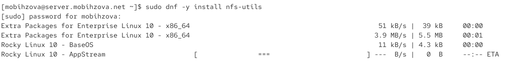{#fig-001 width=70%}

### Создание корневого каталога NFS

На сервере создадим каталог, который предполагается сделать доступным всем пользователям сети (корень дерева NFS) ([рис. @fig-002]).

{#fig-002 width=70%}

### Настройка экспорта каталогов

В файле /etc/exports пропишем подключаемый через NFS общий каталог с доступом только на чтение ([рис. @fig-003]).

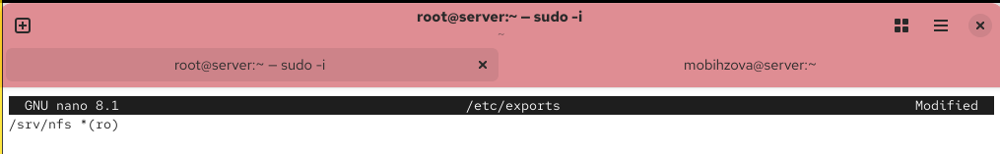{#fig-003 width=70%}

### Настройка SELinux

Для общего каталога зададим контекст безопасности NFS и применим изменённую настройку SELinux к файловой системе ([рис. @fig-004]).

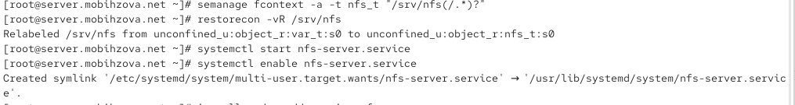{#fig-004 width=70%}

### Настройка фаервола

Настроим межсетевой экран для работы сервера NFS ([рис. @fig-005]).

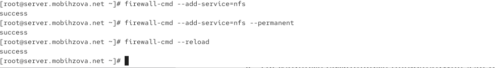{#fig-005 width=70%}

### Установка ПО на клиенте

На клиенте установим необходимое для работы NFS программное обеспечение ([рис. @fig-006]).

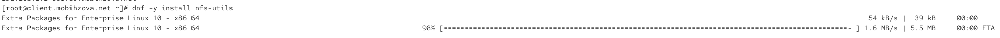{#fig-006 width=70%}

### Проверка подключения до настройки фаервола

На клиенте попробуем посмотреть имеющиеся подмонтированные удалённые ресурсы ([рис. @fig-007]).

{#fig-007 width=70%}

Команда showmount завершается с ошибкой "RPC: Unable to receive", так как фаервол на сервере блокирует необходимые для NFS порты.

### Отключение фаервола для тестирования

Попробуем на сервере остановить сервис межсетевого экрана ([рис. @fig-008]).

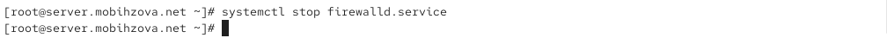{#fig-008 width=70%}

### Проверка подключения после отключения фаервола

После остановки firewalld на сервере, на клиенте вновь пробуем подключиться к удалённо смонтированному ресурсу ([рис. @fig-009]).

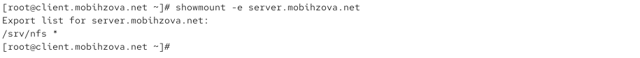{#fig-009 width=70%}

После остановки фаервола команда showmount выполняется успешно и показывает экспортируемый каталог /srv/nfs. Это подтверждает, что проблема была именно в сетевой блокировке.

### Включение фаервола

На сервере запустим сервис межсетевого экрана ([рис. @fig-010]).

{#fig-010 width=70%}

### Анализ используемых служб

На сервере посмотрим, какие службы задействованы при удалённом монтировании ([рис. @fig-011], [рис. @fig-012]).

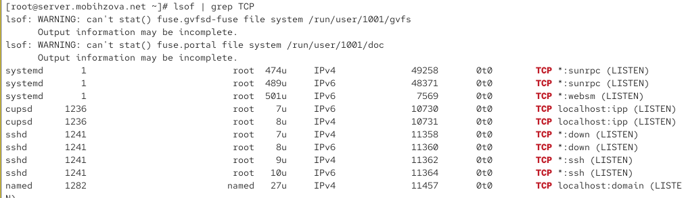{#fig-011 width=70%}

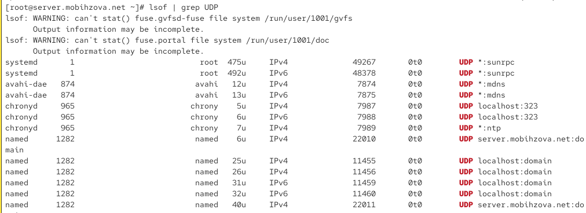{#fig-012 width=70%}

### Добавление дополнительных служб в фаервол

Добавим службы rpc-bind и mountd в настройки межсетевого экрана на сервере ([рис. @fig-013]).

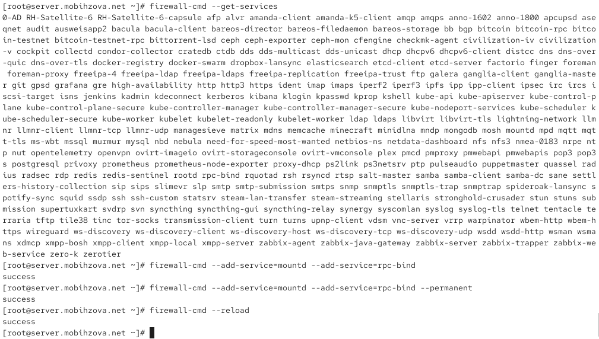{#fig-013 width=70%}

### Финальная проверка подключения

На клиенте проверяем подключение удалённого ресурса после полной настройки фаервола ([рис. @fig-014]).

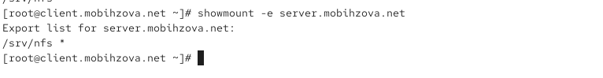{#fig-014 width=70%}

После полной настройки фаервола команда showmount работает корректно, показывая экспортируемый каталог /srv/nfs.

## Монтирование NFS на клиенте

### Создание точки монтирования и монтирование ресурса

На клиенте создадим каталог, в который будет монтироваться удалённый ресурс, и подмонтируем дерево NFS ([рис. @fig-015]).

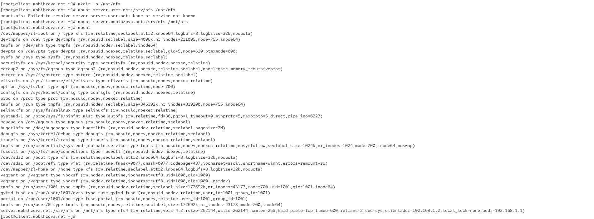{#fig-015 width=70%}

Команда mount показывает, что ресурс server.mobihzova.net:/srv/nfs успешно смонтирован в точку /mnt/nfs с типом файловой системы nfs4 и опциями rw, relative, context="system_u:object_r:nfs_t:s0", версией 4.2 и размером блока 65536.

### Настройка автоматического монтирования

На клиенте в конце файла /etc/fstab добавим запись для автоматического монтирования ([рис. @fig-016]).

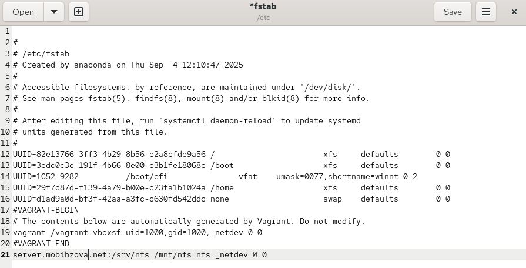{#fig-016 width=70%}

Синтаксис записи в /etc/fstab:
- server.mobthzoval.net:/srv/nfs - сетевое расположение ресурса
- /mnt/nfs - точка монтирования на клиенте
- nfs - тип файловой системы
- _netdev - опция, указывающая, что это сетевое устройство и его монтирование следует отложить до запуска сети
- 0 0 - параметры для утилиты dump и fsck

### Проверка сервиса удалённых файловых систем

На клиенте проверим наличие автоматического монтирования удалённых ресурсов при запуске операционной системы ([рис. @fig-017]).

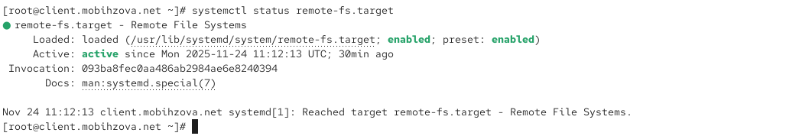{#fig-017 width=70%}

Сервис remote-fs.target активен, что означает готовность системы к монтированию удалённых файловых систем при загрузке.

## 13.4.3. Подключение каталогов к дереву NFS

### Создание общего каталога для веб-сервера

На сервере создадим общий каталог, в который затем будет подмонтирован каталог с контентом веб-сервера ([рис. @fig-018]).

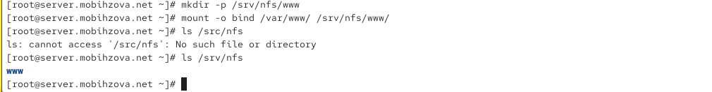{#fig-018 width=70%}

### Bind-монтирование каталога веб-сервера

Подмонтируем каталог web-сервера с помощью bind-монтирования ([рис. @fig-018]).

### Проверка отображения каталогов

На сервере проверим, что отображается в каталоге /srv/nfs ([рис. @fig-018]).

На клиенте посмотрим, что отображается в каталоге /mnt/nfs ([рис. @fig-019]).

{#fig-019 width=70%}

### Настройка экспорта каталога веб-сервера

На сервере в файле /etc/exports добавим экспорт каталога веб-сервера ([рис. @fig-020]).

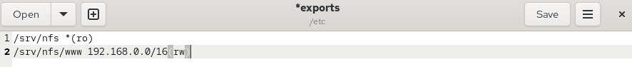{#fig-020 width=70%}

### Применение изменений экспорта

Экспортируем все каталоги, упомянутые в файле /etc/exports ([рис. @fig-021], [рис. @fig-024]).

{#fig-021 width=70%}

### Настройка автоматического bind-монтирования

На сервере в конце файла /etc/fstab добавим запись для автоматического bind-монтирования ([рис. @fig-022]).

{#fig-022 width=70%}

### Повторное применение изменений экспорта

Повторно экспортируем каталоги, указанные в файле /etc/exports ([рис. @fig-024]).

{#fig-024 width=70%}

## Подключение каталогов для работы пользователей

### Создание пользовательского каталога

На сервере под пользователем mobihzova в его домашнем каталоге создадим каталог common с полными правами доступа только для этого пользователя ([рис. @fig-026]).

{#fig-026 width=70%}

### Создание общего каталога для пользователя

На сервере создадим общий каталог для работы пользователя mobihzova по сети ([рис. @fig-027]).

{#fig-027 width=70%}

### Bind-монтирование пользовательского каталога

Подмонтируем каталог common пользователя mobihzova в NFS ([рис. @fig-028]).

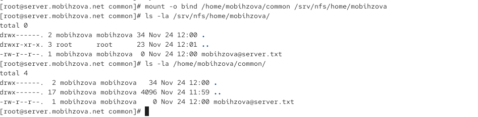{#fig-028 width=70%}

Права доступа на каталог установлены как drwx---. (700), что означает полные права только для владельца (чтение, запись, выполнение).

### Настройка экспорта пользовательского каталога

Подключим каталог пользователя в файле /etc/exports ([рис. @fig-029]).

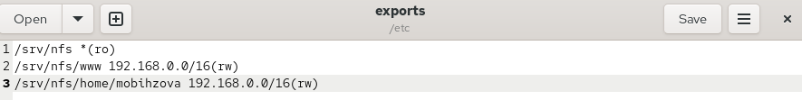{#fig-029 width=70%}

### Настройка автоматического bind-монтирования пользовательского каталога

Внесём изменения в файл /etc/fstab для автоматического bind-монтирования ([рис. @fig-030]).

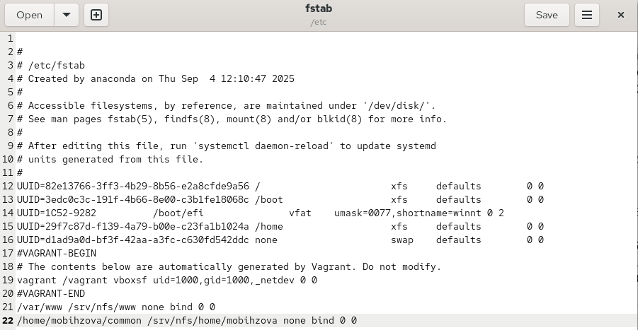{#fig-030 width=70%}

### Применение изменений экспорта

Повторно экспортируем каталоги ([рис. @fig-031]).

{#fig-031 width=70%}

### Проверка каталогов на клиенте

На клиенте проверим каталог /mnt/nfs ([рис. @fig-032]).

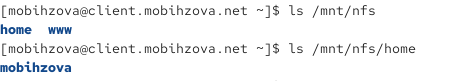{#fig-032 width=70%}

### Проверка прав доступа на клиенте

На клиенте под пользователем mobihzova перейдём в каталог /mnt/nfs/home/mobihzova и попробуем создать в нём файл ([рис. @fig-033]).

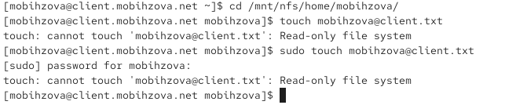{#fig-033 width=70%}

Возникает ошибка "Read-only file system", что указывает на проблему с правами доступа на запись.

### Проверка изменений на сервере

На сервере посмотрим, появились ли изменения в каталоге пользователя /home/mobihzova/common ([рис. @fig-034]).

{#fig-034 width=70%}

## Внесение изменений в настройки внутреннего окружения виртуальных машин

### Подготовка конфигурационных файлов на сервере

На виртуальной машине server перейдём в каталог для внесения изменений в настройки внутреннего окружения и создадим структуру каталогов для конфигурационных файлов ([рис. @fig-035]).

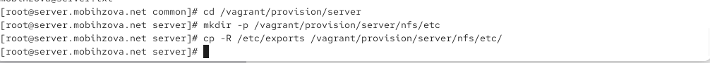{#fig-035 width=70%}

### Создание исполняемого файла на сервере

В каталоге /vagrant/provision/server создадим исполняемый файл nfs.sh ([рис. @fig-036]).

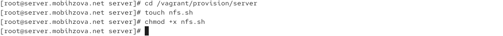{#fig-036 width=70%}

### Наполнение скрипта на сервере

Откроем файл на редактирование и пропишем в нём скрипт для автоматической настройки NFS ([рис. @fig-037]).

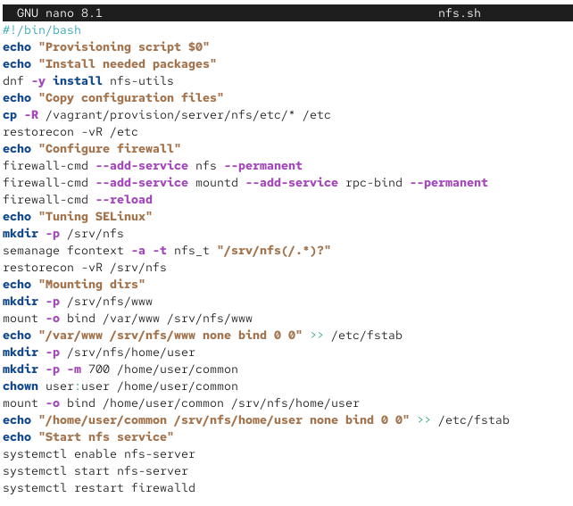{#fig-037 width=70%}

### Подготовка на клиенте

На виртуальной машине client перейдём в каталог для внесения изменений в настройки внутреннего окружения ([рис. @fig-038]).

{#fig-038 width=70%}

### Создание исполняемого файла на клиенте

В каталоге /vagrant/provision/client создадим исполняемый файл nfs.sh ([рис. @fig-038]).

### Наполнение скрипта на клиенте

Откроем файл на редактирование и пропишем в нём скрипт для автоматической настройки NFS-клиента ([рис. @fig-039]).

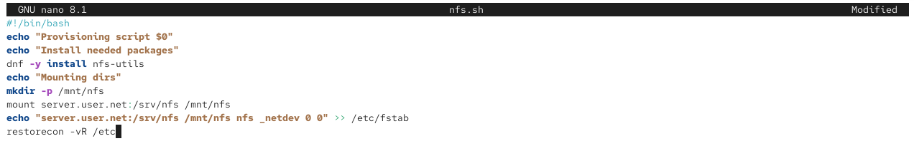{#fig-039 width=70%}

### Настройка Vagrantfile

Для отработки созданных скриптов во время загрузки виртуальных машин server и client в конфигурационном файле Vagrantfile необходимо добавить соответствующие разделы конфигураций ([рис. @fig-040], [рис. @fig-041]).

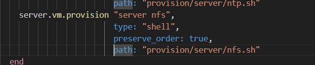{#fig-040 width=70%}

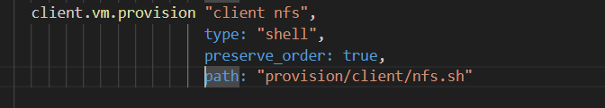{#fig-041 width=70%}

# Выводы

В ходе выполнения лабораторной работы были приобретены практические навыки настройки сервера NFS для удалённого доступа к ресурсам.

# Ответы на контрольные вопросы

1. **Как называется файл конфигурации, содержащий общие ресурсы NFS?**
   Файл конфигурации, содержащий общие ресурсы NFS, называется /etc/exports.

2. **Какие порты должны быть открыты в брандмауэре, чтобы обеспечить полный доступ к серверу NFS?**
   Для обеспечения полного доступа к серверу NFS в брандмауэре должны быть открыты службы: nfs, mountd и rpc-bind.

3. **Какую опцию следует использовать в /etc/fstab, чтобы убедиться, что общие ресурсы NFS могут быть установлены автоматически при перезагрузке?**
   В файле /etc/fstab следует использовать опцию _netdev, которая гарантирует, что монтирование сетевых ресурсов произойдет только после запуска сетевых служб при загрузке системы.

