---
# Preamble

## Author
author:
  name: Бызова Мария Олеговна
## Title
title: Отчёт по лабораторной работе №14
subtitle: Настройка файловых служб Samba
license: CC BY
date: 2025-12-05
## Generic options
lang: ru-RU
crossref:
  lof-title: Список иллюстраций
  lot-title: Список таблиц
  lol-title: Листинги
## Formats
format:
### Pdf output format
  beamer:
    toc: true
    toc-title: Содержание
    number-sections: true
    colorlinks: false
    toc-depth: 2
    slide_level: 2
    aspectratio: 169
    section-titles: true
    theme: metropolis
    themeoptions: progressbar=frametitle,sectionpage=progressbar,numbering=fraction
#### Language
    babel-lang: russian
    babel-otherlangs: english
### Html output
  revealjs:
    transition: slide
    margin: 0.2
    smaller: false
    output-ext: html
    theme: beige
    logo: _resources/image/logo_rudn.png

## Fonts 
mainfont: PT Serif 
romanfont: PT Serif 
sansfont: PT Sans 
monofont: PT Mono 
mainfontoptions: Ligatures=TeX 
romanfontoptions: Ligatures=TeX 
sansfontoptions: Ligatures=TeX,Scale=MatchLowercase 
monofontoptions: Scale=MatchLowercase,Scale=0.9
---

# Цель работы

## Цель работы

Целью данной лабораторной работы является приобретение навыков настройки доступа групп пользователей к общим ресурсам
по протоколу SMB.

# Задание

## Задание

1. Установить и настроить сервер Samba.
2. Настроить на клиенте доступ к разделяемым ресурсам.
3. Написать скрипты для Vagrant, фиксирующие действия по установке и настройке сервера Samba для доступа к разделяемым ресурсам во внутреннем окружении виртуальных машин server и client. Внести соответствующие изменения в Vagrantfile.

# Выполнение лабораторной работы

## Настройка сервера Samba

На сервере установлены необходимые пакеты для работы Samba ([рис. @fig-001]).

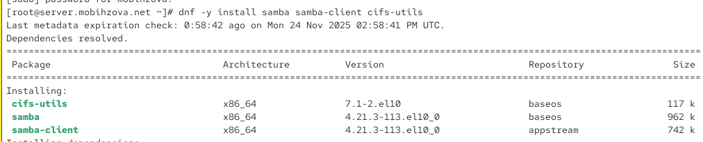{#fig-001 width=70%}

## Настройка сервера Samba

Создана группа `sambagroup` и добавлен пользователь `mobihzova` в эту группу ([рис. @fig-002]).

{#fig-002 width=70%}

## Настройка сервера Samba

Создан общий каталог `/srv/sambashare` для хранения разделяемых ресурсов ([рис. @fig-003]).

{#fig-003 width=70%}

## Настройка сервера Samba

Настроен основной файл конфигурации Samba `/etc/samba/smb.conf` с указанием рабочей группы `mobihzova-NET` ([рис. @fig-004]).

{#fig-004 width=70%}

## Настройка сервера Samba

Добавлена секция `[sambashare]` для общего ресурса ([рис. @fig-005]).

{#fig-005 width=70%}

## Настройка сервера Samba

Проверена корректность конфигурации с помощью команды `testparm` ([рис. @fig-006]).

{#fig-006 width=70%}

## Настройка сервера Samba

Запущена и включена служба Samba, проверен её статус ([рис. @fig-007]).

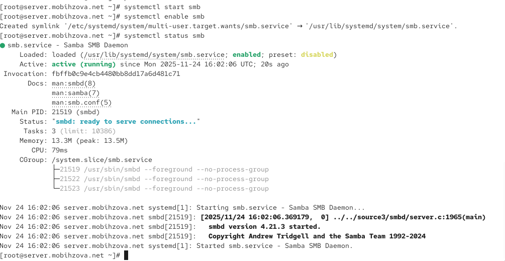{#fig-007 width=70%}

## Настройка сервера Samba

Проверена доступность общих ресурсов с помощью команды `smbclient` ([рис. @fig-008]).

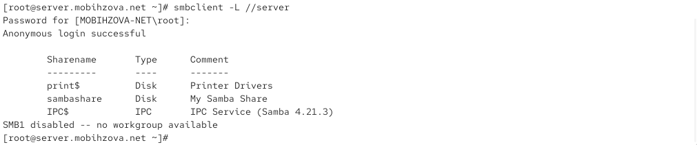{#fig-008 width=70%}

## Настройка сервера Samba

Добавлен сервис Samba в исключения файрвола ([рис. @fig-009]).

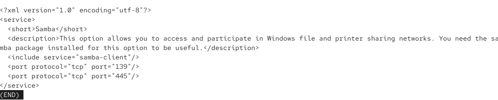{#fig-009 width=70%}

## Настройка сервера Samba

Применены изменения конфигурации файрвола ([рис. @fig-010]).

{#fig-010 width=70%}

## Настройка сервера Samba

Настроены права доступа для группы `sambagroup` на каталог общего ресурса ([рис. @fig-011]).

{#fig-011 width=70%}

## Настройка сервера Samba

Проверен текущий контекст безопасности каталога общего ресурса ([рис. @fig-012]).

{#fig-012 width=70%}

## Настройка сервера Samba

Настроен контекст безопасности SELinux для каталога общего ресурса ([рис. @fig-013]).

{#fig-013 width=70%}

## Настройка сервера Samba

Разрешён экспорт ресурсов на запись через SELinux ([рис. @fig-014]).

{#fig-014 width=70%}

## Настройка сервера Samba

Проверены идентификаторы пользователя `mobihzova` ([рис. @fig-015]).

{#fig-015 width=70%}

## Настройка сервера Samba

Попытка создания файла пользователем `mobihzova` не удалась из-за недостаточных прав ([рис. @fig-016]).

{#fig-016 width=70%}

## Настройка сервера Samba

Добавлен пользователь `mobihzova` в базу пользователей Samba ([рис. @fig-017]).

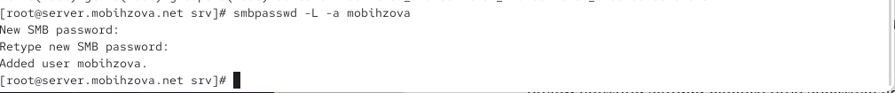{#fig-017 width=70%}

## Настройка клиента для доступа к ресурсам Samba

Установлены необходимые пакеты на клиенте для работы с Samba ([рис. @fig-018]).

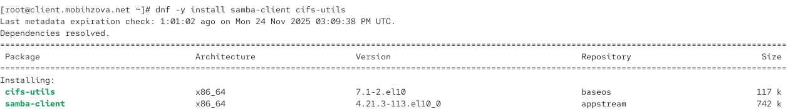{#fig-018 width=70%}

## Настройка клиента для доступа к ресурсам Samba

Настроен файрвол на клиенте для работы с Samba ([рис. @fig-019]).

{#fig-019 width=70%}

## Настройка клиента для доступа к ресурсам Samba

Применены изменения конфигурации файрвола на клиенте ([рис. @fig-020]).

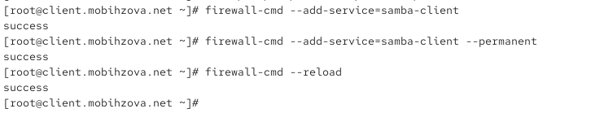{#fig-020 width=70%}

## Настройка клиента для доступа к ресурсам Samba

Создана группа `sambagroup` и добавлен пользователь `mobihzova` на клиенте ([рис. @fig-021]).

{#fig-021 width=70%}

## Настройка клиента для доступа к ресурсам Samba

Настроен файл конфигурации Samba на клиенте ([рис. @fig-022]).

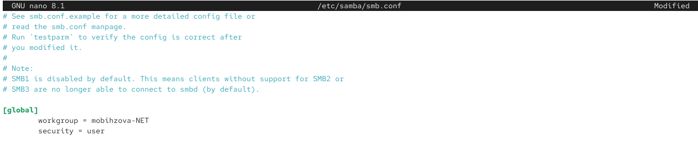{#fig-022 width=70%}

## Настройка клиента для доступа к ресурсам Samba

Проверена доступность общих ресурсов сервера с клиента ([рис. @fig-023]).

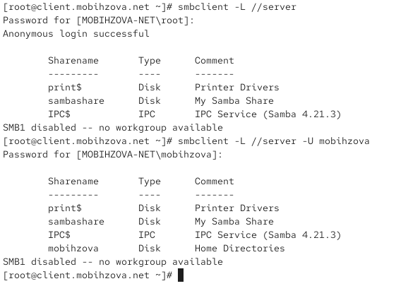{#fig-023 width=40%}

## Настройка клиента для доступа к ресурсам Samba

Создана точка монтирования для общего ресурса ([рис. @fig-024]).

{#fig-024 width=70%}

## Настройка клиента для доступа к ресурсам Samba

Смонтирован общий ресурс сервера на клиенте ([рис. @fig-025]).

{#fig-025 width=70%}

## Настройка клиента для доступа к ресурсам Samba

Успешно создан файл на общем ресурсе с клиента ([рис. @fig-026]).

{#fig-026 width=70%}

## Настройка клиента для доступа к ресурсам Samba

Размонтирован общий ресурс ([рис. @fig-027]).

{#fig-027 width=70%}

## Настройка клиента для доступа к ресурсам Samba

Создан файл учётных данных для автоматического монтирования ([рис. @fig-028]).

{#fig-028 width=70%}

## Настройка клиента для доступа к ресурсам Samba

Настроено содержимое файла учётных данных ([рис. @fig-029]).

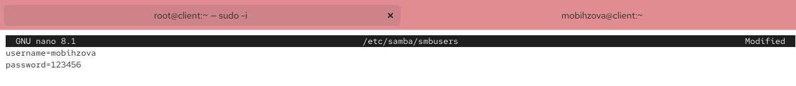{#fig-029 width=70%}

## Настройка клиента для доступа к ресурсам Samba

Добавлена запись в файл `/etc/fstab` для автоматического монтирования ([рис. @fig-030]).

{#fig-030 width=70%}

## Настройка клиента для доступа к ресурсам Samba

Проверено автоматическое монтирование через `mount -a` ([рис. @fig-031]).

{#fig-031 width=70%}

## Создание скриптов для автоматической настройки через Vagrant

Создана структура каталогов для хранения конфигурации Samba на сервере ([рис. @fig-032]).

{#fig-032 width=70%}

## Создание скриптов для автоматической настройки через Vagrant

Создан скрипт автоматической настройки Samba для сервера ([рис. @fig-033]).

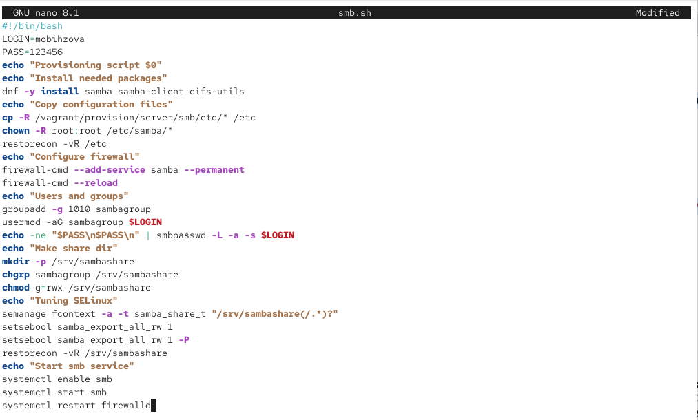{#fig-033 width=70%}

## Создание скриптов для автоматической настройки через Vagrant

Создана структура каталогов для хранения конфигурации Samba на клиенте ([рис. @fig-034]).

{#fig-034 width=70%}

## Создание скриптов для автоматической настройки через Vagrant

Создан скрипт автоматической настройки Samba для клиента ([рис. @fig-035]).

{#fig-035 width=70%}

## Создание скриптов для автоматической настройки через Vagrant

Добавлена конфигурация провижининга для сервера в Vagrantfile ([рис. @fig-036]).

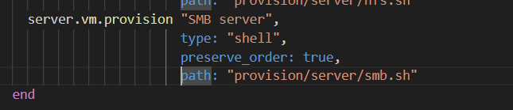{#fig-036 width=70%}

## Создание скриптов для автоматической настройки через Vagrant

Добавлена конфигурация провижининга для клиента в Vagrantfile ([рис. @fig-037]).

{#fig-037 width=70%}

# Выводы

## Выводы

В ходе выполнения данной лабораторной работы я приобрела навыки настройки доступа групп пользователей к общим ресурсам по протоколу SMB.
