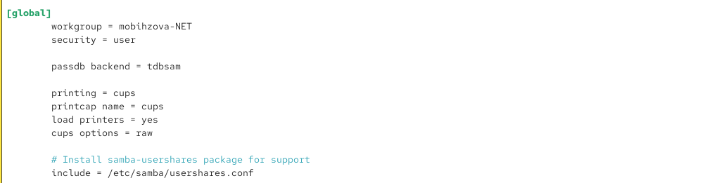
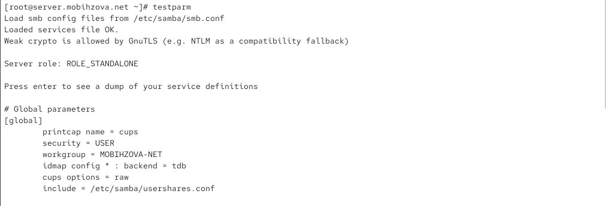
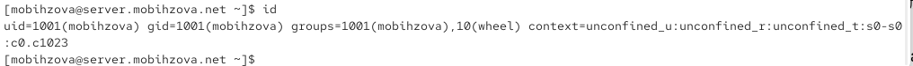
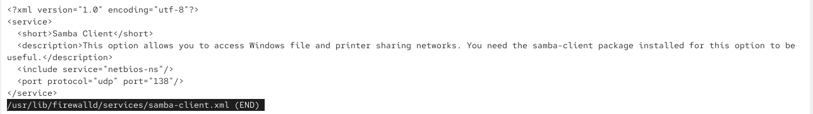
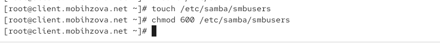
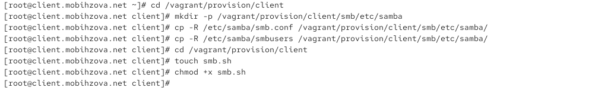
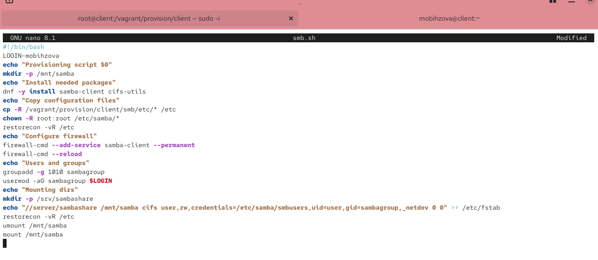
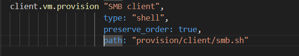

---
# Preamble

## Author
author:
  name: Бызова Мария Олеговна
## Title
title: "Отчёт по лабораторной работе №14"
subtitle: "Настройка файловых служб Samba"
license: "CC BY"
## Generic options
lang: ru-RU
number-sections: true
toc: true
toc-title: "Содержание"
toc-depth: 2
## Crossref customization
crossref:
  lof-title: "Список иллюстраций"
  lot-title: "Список таблиц"
  lol-title: "Листинги"
## Bibliography
# bibliography:
#  - bib/cite.bib
csl: _resources/csl/gost-r-7-0-5-2008-numeric.csl
## Formats
format:
### Pdf output format
  pdf:
    toc: true
    number-sections: true
    colorlinks: false
    toc-depth: 2
    lof: true # List of figures
    lot: true # List of tables
#### Document
    documentclass: scrreprt
    papersize: a4
    fontsize: 12pt
    linestretch: 1.5
#### Language
#    babel-lang: russian
#    babel-otherlangs: english
#### Biblatex
#    cite-method: biblatex
#    biblio-style: gost-numeric
#    biblatexoptions:
#      - backend=biber
#      - langhook=extras
#      - autolang=other*
#### Misc options
    csquotes: true
    indent: true
    header-includes: |
      \usepackage{indentfirst}
      \usepackage{float}
      \floatplacement{figure}{H}
      \usepackage[math,RM={Scale=0.94},SS={Scale=0.94},SScon={Scale=0.94},TT={Scale=MatchLowercase,FakeStretch=0.9},DefaultFeatures={Ligatures=Common}]{plex-otf}
### Docx output format
  docx:
    toc: true
    number-sections: true
    toc-depth: 2
---

# Цель работы

Целью данной лабораторной работы является приобретение навыков настройки доступа групп пользователей к общим ресурсам
по протоколу SMB.

# Задание

1. Установить и настроить сервер Samba.
2. Настроить на клиенте доступ к разделяемым ресурсам.
3. Написать скрипты для Vagrant, фиксирующие действия по установке и настройке сервера Samba для доступа к разделяемым ресурсам во внутреннем окружении виртуальных машин server и client. Внести соответствующие изменения в Vagrantfile.

# Выполнение лабораторной работы

## Настройка сервера Samba

### Установка необходимых пакетов

На сервере установлены необходимые пакеты для работы Samba ([рис. @fig-001]).

{#fig-001 width=70%}

### Создание группы и добавление пользователя

Создана группа `sambagroup` и добавлен пользователь `mobihzova` в эту группу ([рис. @fig-002]).

{#fig-002 width=70%}

### Создание общего каталога

Создан общий каталог `/srv/sambashare` для хранения разделяемых ресурсов ([рис. @fig-003]).

{#fig-003 width=70%}

### Настройка конфигурации Samba

Настроен основной файл конфигурации Samba `/etc/samba/smb.conf` с указанием рабочей группы `mobihzova-NET` ([рис. @fig-004]).

{#fig-004 width=70%}

Добавлена секция `[sambashare]` для общего ресурса ([рис. @fig-005]).

{#fig-005 width=70%}

### Проверка конфигурации

Проверена корректность конфигурации с помощью команды `testparm` ([рис. @fig-006]).

{#fig-006 width=70%}

### Запуск и настройка службы Samba

Запущена и включена служба Samba, проверен её статус ([рис. @fig-007]).

{#fig-007 width=70%}

### Проверка доступности общих ресурсов

Проверена доступность общих ресурсов с помощью команды `smbclient` ([рис. @fig-008]).

{#fig-008 width=70%}

### Настройка файрвола

Добавлен сервис Samba в исключения файрвола ([рис. @fig-009]).

{#fig-009 width=70%}

Применены изменения конфигурации файрвола ([рис. @fig-010]).

{#fig-010 width=70%}

### Настройка прав доступа

Настроены права доступа для группы `sambagroup` на каталог общего ресурса ([рис. @fig-011]).

{#fig-011 width=70%}

### Настройка контекста безопасности SELinux

Проверен текущий контекст безопасности каталога общего ресурса ([рис. @fig-012]).

{#fig-012 width=70%}

Настроен контекст безопасности SELinux для каталога общего ресурса ([рис. @fig-013]).

{#fig-013 width=70%}

### Настройка политик SELinux

Разрешён экспорт ресурсов на запись через SELinux ([рис. @fig-014]).

{#fig-014 width=70%}

### Проверка идентификаторов пользователя

Проверены идентификаторы пользователя `mobihzova` ([рис. @fig-015]).

{#fig-015 width=70%}

### Проверка создания файла пользователем

Попытка создания файла пользователем `mobihzova` не удалась из-за недостаточных прав ([рис. @fig-016]).

{#fig-016 width=70%}

### Добавление пользователя в базу Samba

Добавлен пользователь `mobihzova` в базу пользователей Samba ([рис. @fig-017]).

{#fig-017 width=70%}

## Настройка клиента для доступа к ресурсам Samba

### Установка пакетов на клиенте

Установлены необходимые пакеты на клиенте для работы с Samba ([рис. @fig-018]).

{#fig-018 width=70%}

### Настройка файрвола на клиенте

Настроен файрвол на клиенте для работы с Samba ([рис. @fig-019]).

{#fig-019 width=70%}

Применены изменения конфигурации файрвола на клиенте ([рис. @fig-020]).

{#fig-020 width=70%}

### Создание группы и добавление пользователя на клиенте

Создана группа `sambagroup` и добавлен пользователь `mobihzova` на клиенте ([рис. @fig-021]).

{#fig-021 width=70%}

### Настройка конфигурации Samba на клиенте

Настроен файл конфигурации Samba на клиенте ([рис. @fig-022]).

{#fig-022 width=70%}

### Проверка доступности ресурсов с клиента

Проверена доступность общих ресурсов сервера с клиента ([рис. @fig-023]).

{#fig-023 width=70%}

**Результаты проверки:**

1. При выполнении команды `smbclient -L //server` подключение осуществляется под **анонимной учётной записью** (Anonymous login successful).

2. При выполнении команды `smbclient -L //server -U mobihzova` подключение осуществляется под **учётной записью пользователя `mobihzova`**.

### Создание точки монтирования

Создана точка монтирования для общего ресурса ([рис. @fig-024]).

{#fig-024 width=70%}

### Монтирование общего ресурса

Смонтирован общий ресурс сервера на клиенте ([рис. @fig-025]).

{#fig-025 width=70%}

### Создание файла на общем ресурсе

Успешно создан файл на общем ресурсе с клиента ([рис. @fig-026]).

{#fig-026 width=70%}

### Размонтирование ресурса

Размонтирован общий ресурс ([рис. @fig-027]).

{#fig-027 width=70%}

### Создание файла учётных данных

Создан файл учётных данных для автоматического монтирования ([рис. @fig-028]).

{#fig-028 width=70%}

Настроено содержимое файла учётных данных ([рис. @fig-029]).

{#fig-029 width=70%}

### Настройка автоматического монтирования

Добавлена запись в файл `/etc/fstab` для автоматического монтирования ([рис. @fig-030]).

{#fig-030 width=70%}

### Проверка автоматического монтирования

Проверено автоматическое монтирование через `mount -a` ([рис. @fig-031]).

{#fig-031 width=70%}

## Создание скриптов для автоматической настройки через Vagrant

### Подготовка структуры каталогов и файлов на сервере

Создана структура каталогов для хранения конфигурации Samba на сервере ([рис. @fig-032]).

{#fig-032 width=70%}

### Создание скрипта настройки для сервера

Создан скрипт автоматической настройки Samba для сервера ([рис. @fig-033]).

{#fig-033 width=70%}

### Подготовка структуры каталогов и файлов на клиенте

Создана структура каталогов для хранения конфигурации Samba на клиенте ([рис. @fig-034]).

{#fig-034 width=70%}

### Создание скрипта настройки для клиента

Создан скрипт автоматической настройки Samba для клиента ([рис. @fig-035]).

{#fig-035 width=70%}

### Настройка провижининга в Vagrantfile

Добавлена конфигурация провижининга для сервера в Vagrantfile ([рис. @fig-036]).

{#fig-036 width=70%}

Добавлена конфигурация провижининга для клиента в Vagrantfile ([рис. @fig-037]).

{#fig-037 width=70%}

# Выводы

В ходе выполнения данной лабораторной работы я приобрела навыки настройки доступа групп пользователей к общим ресурсам по протоколу SMB.

# Ответы на контрольные вопросы

1. **Какова минимальная конфигурация для smb.conf для создания общего ресурса, который предоставляет доступ к каталогу /data?**

   Минимальная конфигурация должна содержать глобальные параметры (рабочую группу и тип безопасности) и секцию общего ресурса с указанием пути к каталогу. Пример минимальной конфигурации включает секцию `[global]` с параметрами `workgroup` и `security`, и секцию ресурса (например, `[datashare]`) с параметром `path`, указывающим на каталог /data.

2. **Как настроить общий ресурс, который даёт доступ на запись всем пользователям, имеющим права на запись в файловой системе Linux?**

   Для предоставления доступа на запись всем пользователям, имеющим соответствующие права в файловой системе Linux, в секции ресурса необходимо установить параметр `read only = no` и настроить маски создания файлов и каталогов (`create mask`, `directory mask`), соответствующие правам в Linux.

3. **Как ограничить доступ на запись к ресурсу только членам определённой группы?**

   Чтобы ограничить запись только для членов определённой группы, используется параметр `write list`. В этом параметре указывается имя группы с символом @ перед ним (например, `@specialgroup`), что позволяет записывать данные только пользователям, входящим в указанную группу.

4. **Какой переключатель SELinux нужно использовать, чтобы позволить пользователям получать доступ к домашним каталогам на сервере через SMB?**

   Для разрешения доступа к домашним каталогам через SMB необходимо активировать переключатель SELinux `samba_enable_home_dirs`. Этот переключатель разрешает демону Samba доступ к домашним каталогам пользователей.

5. **Как ограничить доступ к определённому ресурсу только узлам из сети 192.168.10.0/24?**

   Для ограничения доступа по IP-адресам используется параметр `hosts allow`, в котором указывается разрешённая подсеть. Дополнительно можно использовать параметр `hosts deny` для явного запрета всех других адресов.

6. **Какую команду можно использовать, чтобы отобразить список всех пользователей Samba на сервере?**

   Для отображения списка пользователей Samba используется команда `pdbedit` с опцией `-L`. Эта команда показывает всех пользователей, зарегистрированных в базе данных Samba.

7. **Что нужно сделать пользователю для доступа к ресурсу, который настроен как многопользовательский ресурс?**

   Для доступа к многопользовательскому ресурсу пользователь должен иметь учётную запись на сервере Samba, быть членом группы, которой разрешён доступ к ресурсу, и использовать правильные учётные данные при подключении к ресурсу.

8. **Как установить общий ресурс Samba в качестве многопользовательской учётной записи, где пользователь alice используется как минимальная учётная запись пользователя?**

   Для создания многопользовательского ресурса с минимальной учётной записью используется параметр `force user`, который заставляет все операции файловой системы выполняться от имени указанного пользователя (например, alice). Это позволяет всем подключающимся пользователям работать с файлами как от имени этого пользователя.

9. **Как можно запретить пользователям просматривать учётные данные монтирования Samba в файле /etc/fstab?**

   Для защиты учётных данных от просмотра рекомендуется использовать отдельный файл с учётными данными, на который устанавливаются строгие права доступа (только для чтения владельцем). В файле /etc/fstab указывается путь к этому файлу через параметр `credentials`, а сам файл с данными располагается в защищённом каталоге.

10. **Какая команда позволяет перечислить все экспортируемые ресурсы Samba, доступные на определённом сервере?**

    Для перечисления всех экспортируемых ресурсов Samba на сервере используется команда `smbclient` с опцией `-L` и указанием имени сервера. Эта команда показывает список всех доступных общих ресурсов на указанном сервере.
