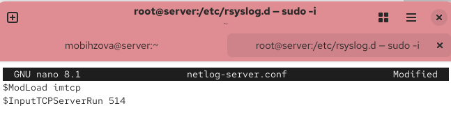
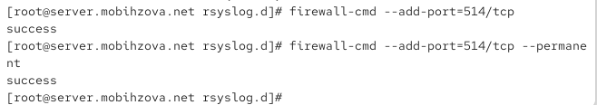
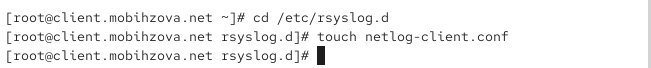
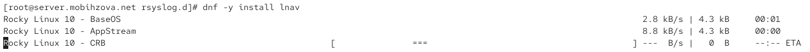
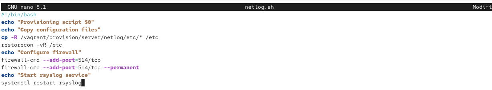
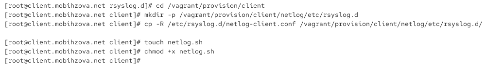
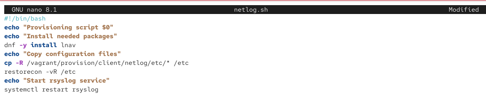
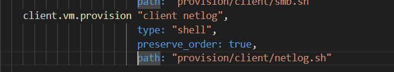

---
# Preamble

## Author
author:
  name: Бызова Мария Олеговна
## Title
title: Отчёт по лабораторной работе №15
subtitle: Настройка сетевого журналирования
license: CC BY
date: 2025-12-05
## Generic options
lang: ru-RU
crossref:
  lof-title: Список иллюстраций
  lot-title: Список таблиц
  lol-title: Листинги
## Formats
format:
### Pdf output format
  beamer:
    toc: true
    toc-title: Содержание
    number-sections: true
    colorlinks: false
    toc-depth: 2
    slide_level: 2
    aspectratio: 169
    section-titles: true
    theme: metropolis
    themeoptions: progressbar=frametitle,sectionpage=progressbar,numbering=fraction
#### Language
    babel-lang: russian
    babel-otherlangs: english
### Html output
  revealjs:
    transition: slide
    margin: 0.2
    smaller: false
    output-ext: html
    theme: beige
    logo: _resources/image/logo_rudn.png

## Fonts 
mainfont: PT Serif 
romanfont: PT Serif 
sansfont: PT Sans 
monofont: PT Mono 
mainfontoptions: Ligatures=TeX 
romanfontoptions: Ligatures=TeX 
sansfontoptions: Ligatures=TeX,Scale=MatchLowercase 
monofontoptions: Scale=MatchLowercase,Scale=0.9
---

# Цель работы

## Цель работы

Целью данной лабораторной работы является приобретение навыков по работе с журналами системных событий.

# Задание

## Задание

1. Настроить сервер сетевого журналирования событий.
2. Настроить клиент для передачи системных сообщений в сетевой журнал на сервере.
3. Просмотреть журналы системных событий с помощью нескольких программ.
4. Написать скрипты для Vagrant, фиксирующие действия по установке и настройке сетевого сервера журналирования.

# Выполнение лабораторной работы

## Выполнение лабораторной работы

На сервере создан файл конфигурации для сетевого хранения журналов в каталоге `/etc/rsyslog.d/` ([рис. @fig-001]).

{#fig-001 width=70%}

## Выполнение лабораторной работы

В файл `/etc/rsyslog.d/netlog-server.conf` добавлены строки для включения приёма записей журнала по TCP-порту 514 ([рис. @fig-002]).

{#fig-002 width=70%}

## Выполнение лабораторной работы

Служба rsyslog перезапущена для применения изменений конфигурации ([рис. @fig-003]).

{#fig-003 width=70%}

## Выполнение лабораторной работы

Проверка показывает, что служба rsyslog прослушивает TCP-порт для приёма сетевых логов ([рис. @fig-004]).

{#fig-004 width=40%}

## Выполнение лабораторной работы

Добавлено разрешение для TCP-порта 514 в настройках файрвола ([рис. @fig-005]).

{#fig-005 width=70%}

## Выполнение лабораторной работы

На клиенте создан файл конфигурации для сетевого хранения журналов в каталоге `/etc/rsyslog.d/` ([рис. @fig-006]).

{#fig-006 width=70%}

## Выполнение лабораторной работы

В файл `/etc/rsyslog.d/netlog-client.conf` добавлена строка для перенаправления всех системных сообщений на сервер журналирования ([рис. @fig-007]).

{#fig-007 width=70%}

## Выполнение лабораторной работы

Служба rsyslog перезапущена на клиенте для применения изменений конфигурации ([рис. @fig-008]).

{#fig-008 width=70%}

## Выполнение лабораторной работы

На сервере выполнен просмотр журналов системных событий в реальном времени ([рис. @fig-009]).

{#fig-009 width=70%}

## Выполнение лабораторной работы

Запущен графический монитор системы для просмотра системных процессов и ресурсов ([рис. @fig-010]).

{#fig-010 width=70%}

## Выполнение лабораторной работы

Интерфейс графического монитора системы отображает список процессов и информацию об использовании системных ресурсов ([рис. @fig-011]).

{#fig-011 width=40%}

## Выполнение лабораторной работы

Установлены дополнительные утилиты для просмотра и анализа журналов ([рис. @fig-012]).

{#fig-012 width=70%}

## Выполнение лабораторной работы

Установлены утилиты multitail и most для расширенного просмотра журналов ([рис. @fig-013]).

{#fig-013 width=70%}

## Выполнение лабораторной работы

Выполнен просмотр журналов системных событий с помощью утилиты multitail ([рис. @fig-014]).

{#fig-014 width=70%}

## Выполнение лабораторной работы

Отображено содержимое журналов системных событий с сообщениями о работе системы ([рис. @fig-015]).

{#fig-015 width=70%}

## Выполнение лабораторной работы

Выполнена фильтрация журналов для просмотра только сообщений, связанных с клиентом ([рис. @fig-016]).

{#fig-016 width=70%}

## Выполнение лабораторной работы

В журналах сервера обнаружены записи, поступившие с клиентской машины ([рис. @fig-017]).

{#fig-017 width=70%}

## Выполнение лабораторной работы

Создана структура каталогов для хранения конфигурации rsyslog на сервере ([рис. @fig-018]).

{#fig-018 width=70%}

## Выполнение лабораторной работы

Создан скрипт автоматической настройки rsyslog для сервера ([рис. @fig-019]).

{#fig-019 width=70%}

## Выполнение лабораторной работы

Создана структура каталогов для хранения конфигурации rsyslog на клиенте ([рис. @fig-020]).

{#fig-020 width=70%}

## Выполнение лабораторной работы

Создан скрипт автоматической настройки rsyslog для клиента ([рис. @fig-021]).

{#fig-021 width=70%}

## Выполнение лабораторной работы

Добавлена конфигурация провижининга для сервера в Vagrantfile ([рис. @fig-022]).

{#fig-022 width=70%}

## Выполнение лабораторной работы

Добавлена конфигурация провижининга для клиента в Vagrantfile ([рис. @fig-023]).

{#fig-023 width=70%}

# Выводы

## Выводы

В ходе выполнения данной лабораторной работы я приобрела практические навыки по работе с журналами системных событий. 
