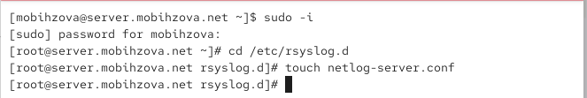
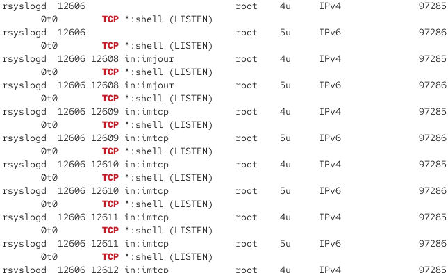
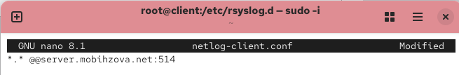
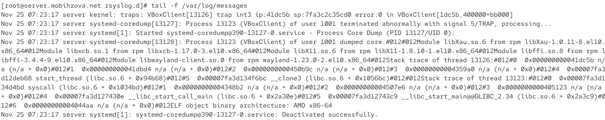
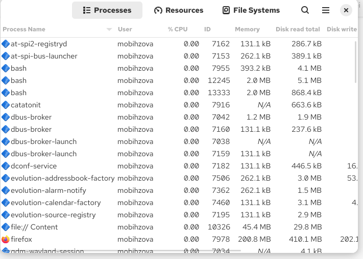
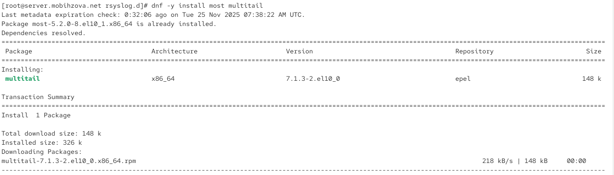
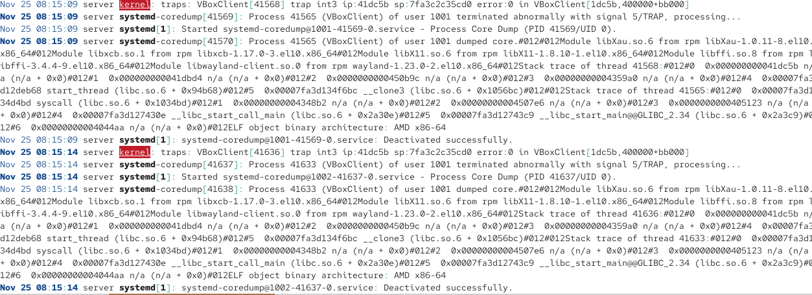
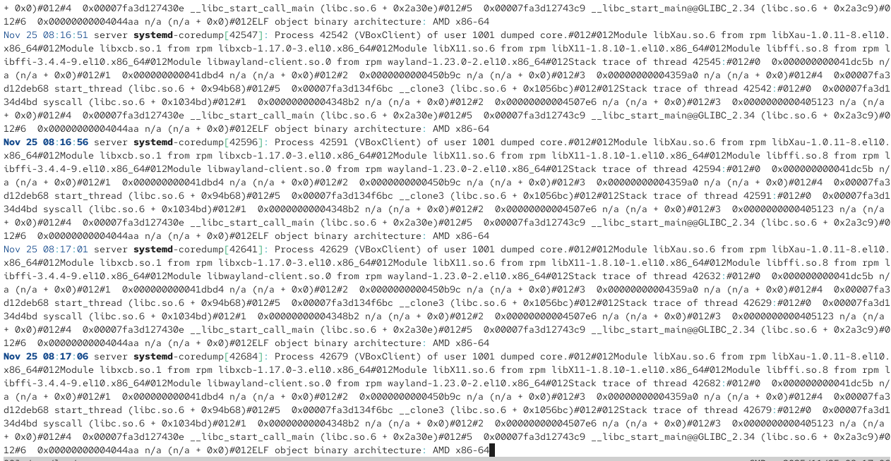
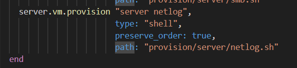

---
# Preamble

## Author
author:
  name: Бызова Мария Олеговна
## Title
title: "Отчёт по лабораторной работе №15"
subtitle: "Настройка сетевого журналирования"
license: "CC BY"
## Generic options
lang: ru-RU
number-sections: true
toc: true
toc-title: "Содержание"
toc-depth: 2
## Crossref customization
crossref:
  lof-title: "Список иллюстраций"
  lot-title: "Список таблиц"
  lol-title: "Листинги"
## Bibliography
# bibliography:
#  - bib/cite.bib
csl: _resources/csl/gost-r-7-0-5-2008-numeric.csl
## Formats
format:
### Pdf output format
  pdf:
    toc: true
    number-sections: true
    colorlinks: false
    toc-depth: 2
    lof: true # List of figures
    lot: true # List of tables
#### Document
    documentclass: scrreprt
    papersize: a4
    fontsize: 12pt
    linestretch: 1.5
#### Language
#    babel-lang: russian
#    babel-otherlangs: english
#### Biblatex
#    cite-method: biblatex
#    biblio-style: gost-numeric
#    biblatexoptions:
#      - backend=biber
#      - langhook=extras
#      - autolang=other*
#### Misc options
    csquotes: true
    indent: true
    header-includes: |
      \usepackage{indentfirst}
      \usepackage{float}
      \floatplacement{figure}{H}
      \usepackage[math,RM={Scale=0.94},SS={Scale=0.94},SScon={Scale=0.94},TT={Scale=MatchLowercase,FakeStretch=0.9},DefaultFeatures={Ligatures=Common}]{plex-otf}
### Docx output format
  docx:
    toc: true
    number-sections: true
    toc-depth: 2
---

# Цель работы

Целью данной лабораторной работы является приобретение навыков по работе с журналами системных событий.

# Задание

1. Настроить сервер сетевого журналирования событий.
2. Настроить клиент для передачи системных сообщений в сетевой журнал на сервере.
3. Просмотреть журналы системных событий с помощью нескольких программ.
4. Написать скрипты для Vagrant, фиксирующие действия по установке и настройке сетевого сервера журналирования.

# Выполнение лабораторной работы

## Настройка сервера сетевого журналирования

### Создание файла конфигурации сервера

На сервере создан файл конфигурации для сетевого хранения журналов в каталоге `/etc/rsyslog.d/` ([рис. @fig-001]).

{#fig-001 width=70%}

### Настройка конфигурации сервера

В файл `/etc/rsyslog.d/netlog-server.conf` добавлены строки для включения приёма записей журнала по TCP-порту 514 ([рис. @fig-002]).

{#fig-002 width=70%}

### Перезапуск службы rsyslog на сервере

Служба rsyslog перезапущена для применения изменений конфигурации ([рис. @fig-003]).

{#fig-003 width=70%}

### Проверка прослушивания портов

Проверка показывает, что служба rsyslog прослушивает TCP-порт для приёма сетевых логов ([рис. @fig-004]).

{#fig-004 width=70%}

### Настройка межсетевого экрана на сервере

Добавлено разрешение для TCP-порта 514 в настройках файрвола ([рис. @fig-005]).

{#fig-005 width=70%}

## Настройка клиента сетевого журналирования

### Создание файла конфигурации клиента

На клиенте создан файл конфигурации для сетевого хранения журналов в каталоге `/etc/rsyslog.d/` ([рис. @fig-006]).

{#fig-006 width=70%}

### Настройка конфигурации клиента

В файл `/etc/rsyslog.d/netlog-client.conf` добавлена строка для перенаправления всех системных сообщений на сервер журналирования ([рис. @fig-007]).

{#fig-007 width=70%}

### Перезапуск службы rsyslog на клиенте

Служба rsyslog перезапущена на клиенте для применения изменений конфигурации ([рис. @fig-008]).

{#fig-008 width=70%}

## Просмотр журналов системных событий

### Просмотр журналов в реальном времени

На сервере выполнен просмотр журналов системных событий в реальном времени ([рис. @fig-009]).

{#fig-009 width=70%}

### Запуск графического монитора системы

Запущен графический монитор системы для просмотра системных процессов и ресурсов ([рис. @fig-010]).

{#fig-010 width=70%}

### Интерфейс графического монитора системы

Интерфейс графического монитора системы отображает список процессов и информацию об использовании системных ресурсов ([рис. @fig-011]).

{#fig-011 width=70%}

### Установка утилит для просмотра журналов

Установлены дополнительные утилиты для просмотра и анализа журналов ([рис. @fig-012]).

{#fig-012 width=70%}

### Установка multitail и most

Установлены утилиты multitail и most для расширенного просмотра журналов ([рис. @fig-013]).

{#fig-013 width=70%}

### Просмотр журналов с помощью multitail

Выполнен просмотр журналов системных событий с помощью утилиты multitail ([рис. @fig-014]).

{#fig-014 width=70%}

### Содержимое журналов в multitail

Отображено содержимое журналов системных событий с сообщениями о работе системы ([рис. @fig-015]).

{#fig-015 width=70%}

### Фильтрация журналов по клиенту

Выполнена фильтрация журналов для просмотра только сообщений, связанных с клиентом ([рис. @fig-016]).

{#fig-016 width=70%}

### Записи с клиента в журналах

В журналах сервера обнаружены записи, поступившие с клиентской машины ([рис. @fig-017]).

{#fig-017 width=70%}

## Создание скриптов для автоматической настройки через Vagrant

### Подготовка структуры каталогов и файлов на сервере

Создана структура каталогов для хранения конфигурации rsyslog на сервере ([рис. @fig-018]).

{#fig-018 width=70%}

### Создание скрипта настройки для сервера

Создан скрипт автоматической настройки rsyslog для сервера ([рис. @fig-019]).

{#fig-019 width=70%}

### Подготовка структуры каталогов и файлов на клиенте

Создана структура каталогов для хранения конфигурации rsyslog на клиенте ([рис. @fig-020]).

{#fig-020 width=70%}

### Создание скрипта настройки для клиента

Создан скрипт автоматической настройки rsyslog для клиента ([рис. @fig-021]).

{#fig-021 width=70%}

### Настройка провижининга в Vagrantfile для сервера

Добавлена конфигурация провижининга для сервера в Vagrantfile ([рис. @fig-022]).

{#fig-022 width=70%}

### Настройка провижининга в Vagrantfile для клиента

Добавлена конфигурация провижининга для клиента в Vagrantfile ([рис. @fig-023]).

{#fig-023 width=70%}

# Выводы

В ходе выполнения данной лабораторной работы я приобрела практические навыки по работе с журналами системных событий. 

# Ответы на контрольные вопросы

1. **Какой модуль rsyslog вы должны использовать для приёма сообщений от journald?**
   
   Для приёма сообщений от journald используется модуль `imjournal`.

2. **Как называется устаревший модуль, который можно использовать для включения приёма сообщений журнала в rsyslog?**
   
   Устаревший модуль для приёма сообщений журнала называется `imuxsock`.

3. **Чтобы убедиться, что устаревший метод приёма сообщений из journald в rsyslog не используется, какой дополнительный параметр следует использовать?**
   
   Для отключения устаревшего метода следует использовать параметр `$OmitLocalLogging on`.

4. **В каком конфигурационном файле содержатся настройки, которые позволяют вам настраивать работу журнала?**
   
   Настройки работы журнала содержатся в файле `/etc/systemd/journald.conf`.

5. **Каким параметром управляется пересылка сообщений из journald в rsyslog?**
   
   Пересылка сообщений из journald в rsyslog управляется параметром `ForwardToSyslog` в файле `journald.conf`.

6. **Какой модуль rsyslog вы можете использовать для включения сообщений из файла журнала, не созданного rsyslog?**
   
   Для включения сообщений из внешних файлов журналов используется модуль `imfile`.

7. **Какой модуль rsyslog вам нужно использовать для пересылки сообщений в базу данных MariaDB?**
   
   Для пересылки сообщений в базу данных MariaDB используется модуль `ommysql`.

8. **Какие две строки вам нужно включить в rsyslog.conf, чтобы позволить текущему журнальному серверу получать сообщения через TCP?**
   
   Для настройки приёма сообщений через TCP необходимо добавить строки: `$ModLoad imtcp` и `$InputTCPServerRun 514`.

9. **Как настроить локальный брандмауэр, чтобы разрешить приём сообщений журнала через порт TCP 514?**
   
   Для настройки локального брандмауэра необходимо выполнить команды: `firewall-cmd --add-port=514/tcp --permanent` и `firewall-cmd --reload`.
