---
# Preamble

## Author
author:
  name: Бызова Мария Олеговна
## Title
title: Отчёт по лабораторной работе №16
subtitle: Базовая защита от атак типа «brute force»
license: CC BY
date: 2025-12-05
## Generic options
lang: ru-RU
crossref:
  lof-title: Список иллюстраций
  lot-title: Список таблиц
  lol-title: Листинги
## Formats
format:
### Pdf output format
  beamer:
    toc: true
    toc-title: Содержание
    number-sections: true
    colorlinks: false
    toc-depth: 2
    slide_level: 2
    aspectratio: 169
    section-titles: true
    theme: metropolis
    themeoptions: progressbar=frametitle,sectionpage=progressbar,numbering=fraction
#### Language
    babel-lang: russian
    babel-otherlangs: english
### Html output
  revealjs:
    transition: slide
    margin: 0.2
    smaller: false
    output-ext: html
    theme: beige
    logo: _resources/image/logo_rudn.png

## Fonts 
mainfont: PT Serif 
romanfont: PT Serif 
sansfont: PT Sans 
monofont: PT Mono 
mainfontoptions: Ligatures=TeX 
romanfontoptions: Ligatures=TeX 
sansfontoptions: Ligatures=TeX,Scale=MatchLowercase 
monofontoptions: Scale=MatchLowercase,Scale=0.9
---

# Цель работы

## Цель работы

Получение навыков работы с программным средством Fail2ban для обеспечения базовой защиты от атак типа «brute force».

# Выполнение лабораторной работы

## Выполнение лабораторной работы

Выполнена установка пакета Fail2ban на сервер `server.mobihzova.net` ([рис. @fig-001]).

![Установка Fail2ban на сервере.(image/1.PNG){#fig-001 width=70%}

## Выполнение лабораторной работы

После установки служба Fail2ban запущена и добавлена в автозагрузку ([рис. @fig-002]).

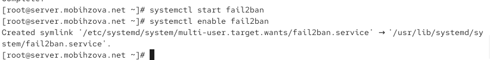{#fig-002 width=70%}

## Выполнение лабораторной работы

Для мониторинга работы Fail2ban выполнен просмотр журнала событий ([рис. @fig-003]).

{#fig-003 width=70%}

## Выполнение лабораторной работы

Создан файл для локальной конфигурации Fail2ban ([рис. @fig-004]).

{#fig-004 width=70%}

## Выполнение лабораторной работы

В файл `customisation.local` добавлены настройки для защиты SSH-службы, включая порт 2022 ([рис. @fig-005]).

{#fig-005 width=70%}

## Выполнение лабораторной работы

После настройки SSH-защиты выполнен перезапуск службы Fail2ban ([рис. @fig-006]).

{#fig-006 width=70%}

## Выполнение лабораторной работы

Проверены логи Fail2ban после включения защиты SSH ([рис. @fig-007]).

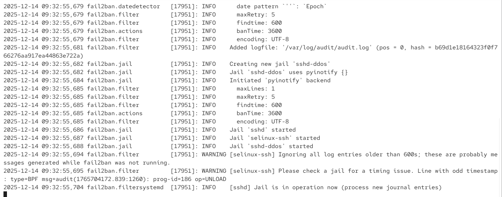{#fig-007 width=70%}

## Выполнение лабораторной работы

В конфигурационный файл добавлены настройки для защиты веб-сервера Apache ([рис. @fig-008]).

{#fig-008 width=70%}

## Выполнение лабораторной работы

Выполнен перезапуск Fail2ban после добавления конфигурации для HTTP ([рис. @fig-009]).

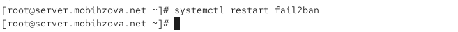{#fig-009 width=70%}

## Выполнение лабораторной работы

Проверены логи после включения защиты HTTP-служб ([рис. @fig-010]).

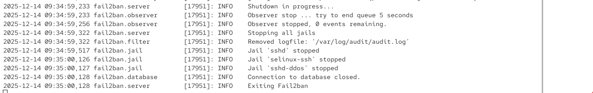{#fig-010 width=70%}

## Выполнение лабораторной работы

Добавлены настройки для защиты почтовых служб (Postfix и Dovecot) ([рис. @fig-011]).

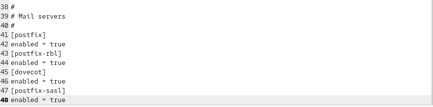{#fig-011 width=70%}

## Выполнение лабораторной работы

Выполнен перезапуск Fail2ban после настройки почтовой защиты ([рис. @fig-012]).

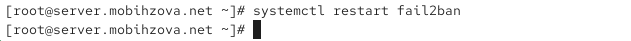{#fig-012 width=70%}

## Выполнение лабораторной работы

Проверены логи Fail2ban после включения всех служб ([рис. @fig-013]).

{#fig-013 width=70%}

## Выполнение лабораторной работы

Проверен общий статус всех jail в Fail2ban ([рис. @fig-014]).

{#fig-014 width=70%}

## Выполнение лабораторной работы

Проверен статус конкретно SSH-защиты ([рис. @fig-015]).

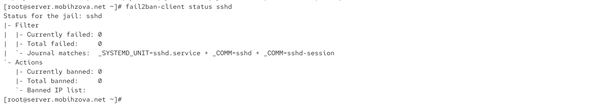{#fig-015 width=70%}

## Выполнение лабораторной работы

Изменено максимальное количество неудачных попыток для SSH с 3 до 2 ([рис. @fig-016]).

{#fig-016 width=70%}

## Выполнение лабораторной работы

С клиента `client.mobihzova.net` выполнена попытка подключения по SSH с неправильным паролем ([рис. @fig-017]).

{#fig-017 width=70%}

## Выполнение лабораторной работы

Проверена блокировка IP-адреса клиента после неудачных попыток ([рис. @fig-018]).

{#fig-018 width=70%}

## Выполнение лабораторной работы

Выполнена разблокировка IP-адреса клиента ([рис. @fig-019]).

{#fig-019 width=70%}

## Выполнение лабораторной работы

IP-адрес клиента добавлен в список игнорируемых адресов ([рис. @fig-020]).

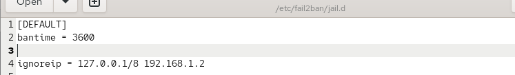{#fig-020 width=70%}

## Выполнение лабораторной работы

Выполнен перезапуск Fail2ban после добавления исключений ([рис. @fig-021]).

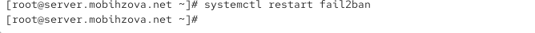{#fig-021 width=70%}

## Выполнение лабораторной работы

Проверены логи после добавления игнорируемых адресов ([рис. @fig-022]).

{#fig-022 width=70%}

## Выполнение лабораторной работы

Выполнена повторная попытка SSH-подключения с клиента, IP-адрес которого добавлен в исключения ([рис. @fig-023]).

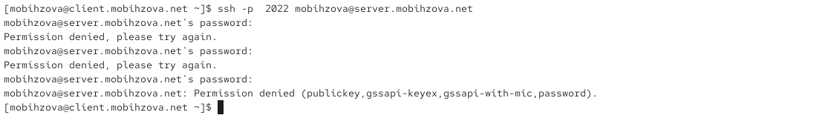{#fig-023 width=70%}

## Выполнение лабораторной работы

Убедились, что IP-адрес клиента не блокируется после добавления в ignoreip ([рис. @fig-024]).

{#fig-024 width=70%}

## Выполнение лабораторной работы

Созданы каталоги и скопированы конфигурационные файлы для автоматизации ([рис. @fig-025]).

{#fig-025 width=70%}

## Выполнение лабораторной работы

Создан скрипт `protect.sh` для автоматической настройки Fail2ban ([рис. @fig-026]).

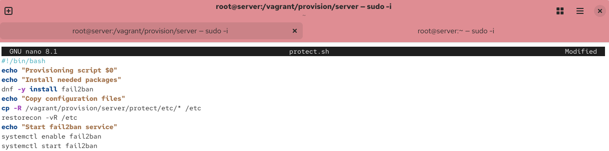{#fig-026 width=70%}

## Выполнение лабораторной работы

Добавлен вызов скрипта в конфигурацию Vagrantfile ([рис. @fig-027]).

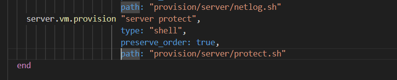{#fig-027 width=70%}

# Выводы

## Выводы

В ходе выполнения лабораторной работы были получены навыки работы с программным средством Fail2ban для
обеспечения базовой защиты от атак типа «brute force».
