---
# Preamble

## Author
author:
  name: Бызова Мария Олеговна
## Title
title: "Отчёт по лабораторной работе №16"
subtitle: "Базовая защита от атак типа «brute force»"
license: "CC BY"
## Generic options
lang: ru-RU
number-sections: true
toc: true
toc-title: "Содержание"
toc-depth: 2
## Crossref customization
crossref:
  lof-title: "Список иллюстраций"
  lot-title: "Список таблиц"
  lol-title: "Листинги"
## Bibliography
#bibliography:
#  - bib/cite.bib
# csl: _resources/csl/gost-r-7-0-5-2008-numeric.csl
## Formats
format:
### Pdf output format
  pdf:
    toc: true
    number-sections: true
    colorlinks: false
    toc-depth: 2
    lof: true # List of figures
    lot: true # List of tables
#### Document
    documentclass: scrreprt
    papersize: a4
    fontsize: 12pt
    linestretch: 1.5
#### Language
#    babel-lang: russian
#    babel-otherlangs: english
#### Biblatex
#    cite-method: biblatex
#    biblio-style: gost-numeric
#    biblatexoptions:
#      - backend=biber
#      - langhook=extras
#      - autolang=other*
#### Misc options
    csquotes: true
    indent: true
    header-includes: |
      \usepackage{indentfirst}
      \usepackage{float}
      \floatplacement{figure}{H}
      \usepackage[math,RM={Scale=0.94},SS={Scale=0.94},SScon={Scale=0.94},TT={Scale=MatchLowercase,FakeStretch=0.9},DefaultFeatures={Ligatures=Common}]{plex-otf}
### Docx output format
  docx:
    toc: true
    number-sections: true
    toc-depth: 2
---

# Цель работы

Получение навыков работы с программным средством Fail2ban для обеспечения базовой защиты от атак типа «brute force».

# Выполнение лабораторной работы

## Установка и базовая настройка Fail2ban

### Установка Fail2ban на сервер

Выполнена установка пакета Fail2ban на сервер `server.mobihzova.net` ([рис. @fig-001]).

![Установка Fail2ban на сервере.(image/1.PNG){#fig-001 width=70%}

### Запуск и активация службы Fail2ban

После установки служба Fail2ban запущена и добавлена в автозагрузку ([рис. @fig-002]).

{#fig-002 width=70%}

### Просмотр логов Fail2ban

Для мониторинга работы Fail2ban выполнен просмотр журнала событий ([рис. @fig-003]).

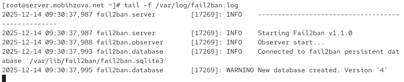{#fig-003 width=70%}

### Создание локального конфигурационного файла

Создан файл для локальной конфигурации Fail2ban ([рис. @fig-004]).

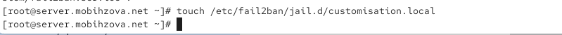{#fig-004 width=70%}

### Настройка конфигурации для SSH

В файл `customisation.local` добавлены настройки для защиты SSH-службы, включая порт 2022 ([рис. @fig-005]).

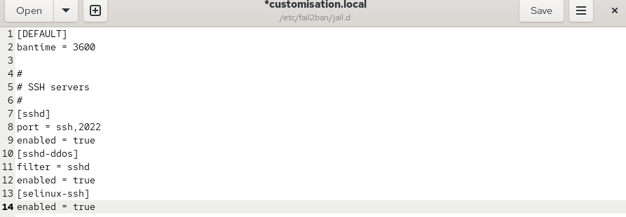{#fig-005 width=70%}

### Перезапуск Fail2ban после настройки SSH

После настройки SSH-защиты выполнен перезапуск службы Fail2ban ([рис. @fig-006]).

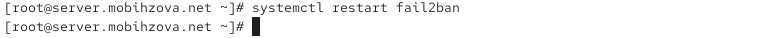{#fig-006 width=70%}

### Просмотр логов после настройки SSH

Проверены логи Fail2ban после включения защиты SSH ([рис. @fig-007]).

{#fig-007 width=70%}

### Настройка конфигурации для HTTP

В конфигурационный файл добавлены настройки для защиты веб-сервера Apache ([рис. @fig-008]).

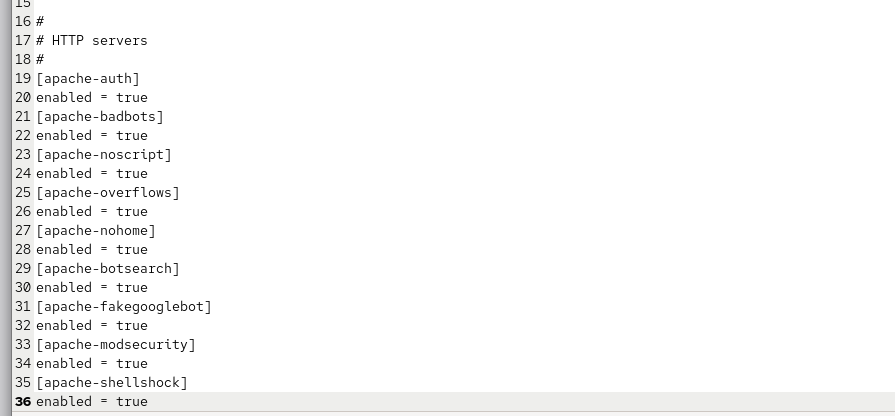{#fig-008 width=70%}

### Перезапуск Fail2ban после настройки HTTP

Выполнен перезапуск Fail2ban после добавления конфигурации для HTTP ([рис. @fig-009]).

{#fig-009 width=70%}

### Логи после перезапуска с HTTP

Проверены логи после включения защиты HTTP-служб ([рис. @fig-010]).

{#fig-010 width=70%}

### Настройка конфигурации для почтовых служб

Добавлены настройки для защиты почтовых служб (Postfix и Dovecot) ([рис. @fig-011]).

{#fig-011 width=70%}

### Перезапуск Fail2ban после настройки почтовых служб

Выполнен перезапуск Fail2ban после настройки почтовой защиты ([рис. @fig-012]).

{#fig-012 width=70%}

### Логи после перезапуска с почтовыми службами

Проверены логи Fail2ban после включения всех служб ([рис. @fig-013]).

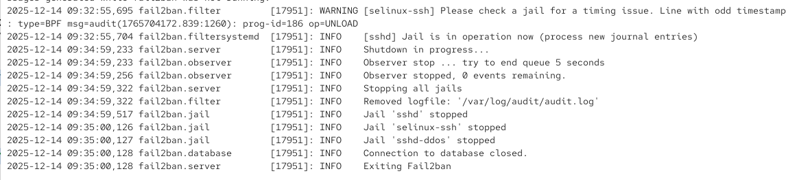{#fig-013 width=70%}

## Проверка работы Fail2ban

### Просмотр статуса всех служб

Проверен общий статус всех jail в Fail2ban ([рис. @fig-014]).

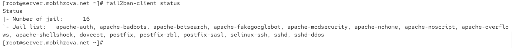{#fig-014 width=70%}

### Просмотр статуса SSH-защиты

Проверен статус конкретно SSH-защиты ([рис. @fig-015]).

{#fig-015 width=70%}

### Изменение максимального количества попыток

Изменено максимальное количество неудачных попыток для SSH с 3 до 2 ([рис. @fig-016]).

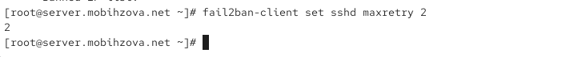{#fig-016 width=70%}

### Попытка несанкционированного доступа с клиента

С клиента `client.mobihzova.net` выполнена попытка подключения по SSH с неправильным паролем ([рис. @fig-017]).

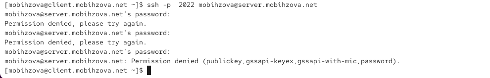{#fig-017 width=70%}

### Проверка блокировки IP-адреса

Проверена блокировка IP-адреса клиента после неудачных попыток ([рис. @fig-018]).

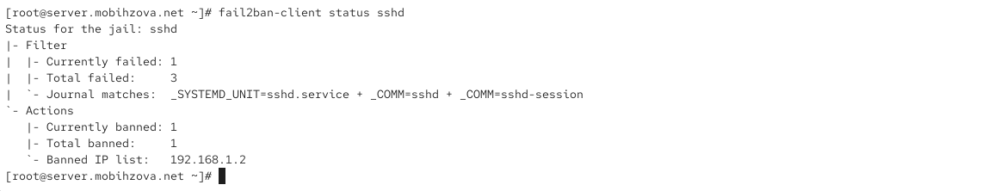{#fig-018 width=70%}

### Разблокировка IP-адреса

Выполнена разблокировка IP-адреса клиента ([рис. @fig-019]).

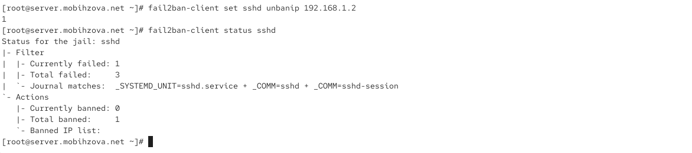{#fig-019 width=70%}

## Настройка исключений

### Добавление IP-адреса в игнорируемые

IP-адрес клиента добавлен в список игнорируемых адресов ([рис. @fig-020]).

{#fig-020 width=70%}

### Перезапуск Fail2ban с новыми настройками

Выполнен перезапуск Fail2ban после добавления исключений ([рис. @fig-021]).

{#fig-021 width=70%}

### Логи после добавления исключений

Проверены логи после добавления игнорируемых адресов ([рис. @fig-022]).

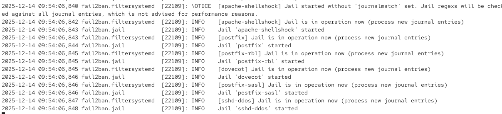{#fig-022 width=70%}

### Повторная попытка доступа с исключённого адреса

Выполнена повторная попытка SSH-подключения с клиента, IP-адрес которого добавлен в исключения ([рис. @fig-023]).

{#fig-023 width=70%}

### Проверка статуса SSH после исключения

Убедились, что IP-адрес клиента не блокируется после добавления в ignoreip ([рис. @fig-024]).

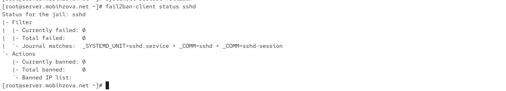{#fig-024 width=70%}

## Автоматизация настройки

### Подготовка каталогов для конфигурации

Созданы каталоги и скопированы конфигурационные файлы для автоматизации ([рис. @fig-025]).

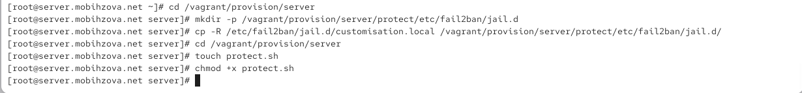{#fig-025 width=70%}

### Создание скрипта автоматизации

Создан скрипт `protect.sh` для автоматической настройки Fail2ban ([рис. @fig-026]).

{#fig-026 width=70%}

### Интеграция скрипта в Vagrantfile

Добавлен вызов скрипта в конфигурацию Vagrantfile ([рис. @fig-027]).

{#fig-027 width=70%}

# Выводы

В ходе выполнения лабораторной работы были получены навыки работы с программным средством Fail2ban для
обеспечения базовой защиты от атак типа «brute force».

# Ответы на контрольные вопросы

1. **Принцип работы Fail2ban** основан на мониторинге лог-файлов различных служб (SSH, Apache, Postfix и др.). При обнаружении подозрительной активности (например, нескольких неудачных попыток входа) система автоматически добавляет правила блокировки IP-адреса в настройки межсетевого экрана на заданное время.

2. **Приоритет файлов конфигурации**: Файлы в каталоге `/etc/fail2ban/jail.d/` (особенно с расширением `.local`) имеют приоритет над основным файлом `jail.conf`. Это позволяет переопределять настройки по умолчанию без редактирования основного конфигурационного файла.

3. **Настройка оповещения администратора** осуществляется через параметры действий (actions) в конфигурации jail. Можно настроить отправку email, выполнение произвольных скриптов или интеграцию с системами мониторинга. Основные настройки действий находятся в каталоге `/etc/fail2ban/action.d/`.

4. **Настройки для веб-службы в jail.conf** включают различные jail для Apache:
   - `[apache-auth]` - аутентификация Apache
   - `[apache-badbots]` - блокировка ботов
   - `[apache-noscript]` - защита от скриптовых атак
   - `[apache-overflows]` - защита от переполнения буфера
   - Каждый jail содержит настройки filter, logpath, maxretry, findtime и bantime.

5. **Настройки для почтовой службы в jail.conf**:
   - `[postfix]` - защита сервера Postfix
   - `[postfix-sasl]` - аутентификация SASL
   - `[postfix-rbl]` - RBL-фильтрация
   - `[dovecot]` - защита сервера Dovecot
   - Настройки включают пути к лог-файлам и параметры обнаружения атак.

6. **Действия Fail2ban при обнаружении атаки**: система может выполнять различные действия, настраиваемые через параметр `action`:
   - Блокировка через iptables/ipset
   - Отправка email-уведомлений
   - Выполнение пользовательских скриптов
   - Запись в системные логи
   Описания всех доступных действий находятся в `/etc/fail2ban/action.d/`.

7. **Получение списка действующих правил**: команда `fail2ban-client status` показывает список всех активных jail и их состояние.

8. **Статистика заблокированных адресов**: для просмотра статистики по конкретному jail используется команда `fail2ban-client status <jail_name>`, которая показывает количество заблокированных адресов и их список.

9. **Разблокировка IP-адреса**: выполняется командой `fail2ban-client set <jail_name> unbanip <IP_address>`. Также можно удалить правило блокировки непосредственно из настроек межсетевого экрана.
