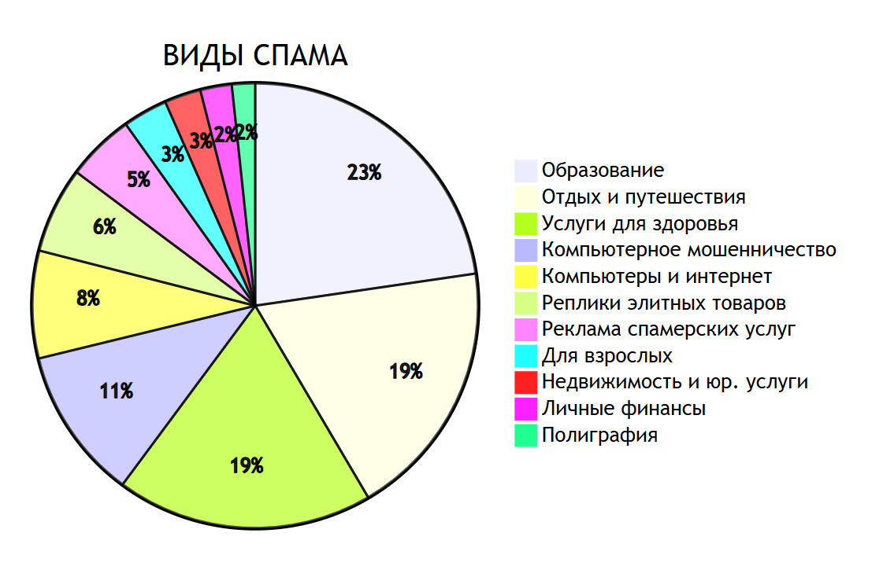
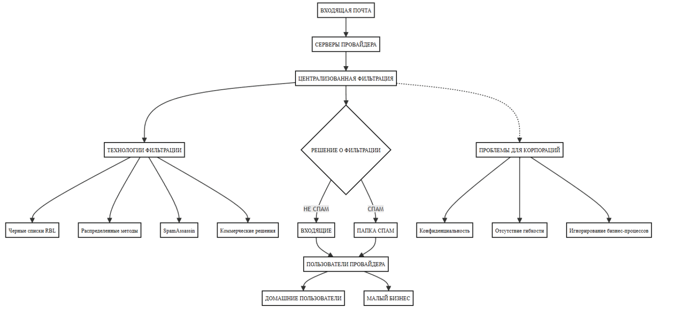
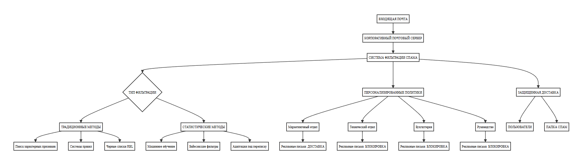
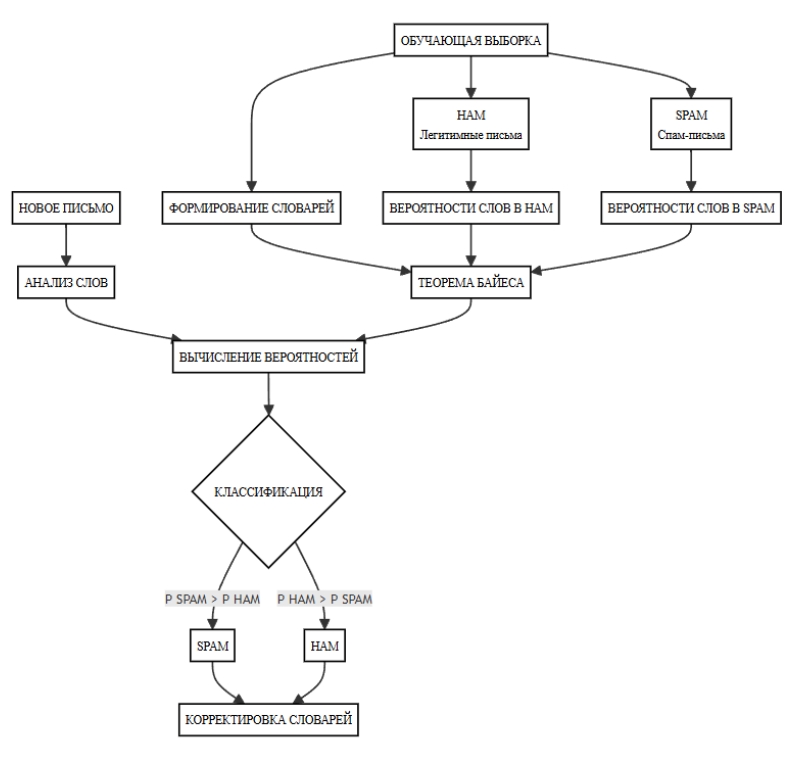

---
# Preamble

## Author
author:
  name: Бызова М. О. Кулябов Дмитрий Сергеевич. Доцент по кафедре систем телекоммуникаций. Доктор физико-математических наук по специальности 05.13.18 «Математическое моделирование, численные методы и комплексы программ». Профессор кафедры прикладной информатики и теории вероятностей РУДН. Заведующий сектором Управления информационно-технологического обеспечения, слаботочных и телекоммуникационных систем РУДН (по совместительству).
  affiliation:
    - name: Российский университет дружбы народов
      country: Российская Федерация
      postal-code: 117198
      city: Москва
      address: ул. Миклухо-Маклая, д. 6
## Title
title: Доклад
subtitle: Тема "Фильтрация спама"
license: CC BY
date: 2025-10-13
## Generic options
lang: ru-RU
crossref:
  lof-title: Список иллюстраций
  lot-title: Список таблиц
  lol-title: Листинги
## Formats
format:
### Pdf output format
  beamer:
    toc: true
    toc-title: Содержание
    number-sections: true
    colorlinks: false
    toc-depth: 2
    slide_level: 2
    aspectratio: 169
    section-titles: true
    theme: metropolis
    themeoptions: progressbar=frametitle,sectionpage=progressbar,numbering=fraction
#### Language
    babel-lang: russian
    babel-otherlangs: english
### Html output
  revealjs:
    transition: slide
    margin: 0.2
    smaller: false
    output-ext: html
    theme: beige
    logo: _resources/image/logo_rudn.png
    
## Fonts 
mainfont: PT Serif 
romanfont: PT Serif 
sansfont: PT Sans 
monofont: PT Mono 
mainfontoptions: Ligatures=TeX 
romanfontoptions: Ligatures=TeX 
sansfontoptions: Ligatures=TeX,Scale=MatchLowercase 
monofontoptions: Scale=MatchLowercase,Scale=0.9
---

# Вводная часть

## Докладчик

:::::::::::::: {.columns align=center}
::: {.column width="70%"}

  * Бызова Мария Олеговна
  * Студент
  * Российский университет дружбы народов
  * 1132236129@pfur.ru

:::
::: {.column width="50%"}

{#fig:001 width=70%}

:::
::::::::::::::

## Актуальность 

Актуальность темы борьбы со спамом обусловлена повсеместным распространением цифровой коммуникации и, как следствие, растущим объемом нежелательной корреспонденции. 

Проблема заключается в необходимости разработки эффективных и точных методов фильтрации спама, способных противостоять постоянно усложняющимся тактикам его распространения, предотвращая финансовые потери и риски для пользователей.

## Объект и предмет исследования

Объектом исследования данного доклада являются системы и методы фильтрации нежелательной корреспонденции (спама) в цифровых каналах коммуникации.

Предмет исследования – алгоритмические и программные средства автоматического распознавания и блокировки спам-сообщений, а также критерии их классификации и оценки эффективности.

## Цель

Целью данного доклада является анализ современных методов и алгоритмов фильтрации спама, а также систематизация подходов к их применению для обеспечения эффективной защиты пользователей от нежелательной и вредоносной корреспонденции.

## Задачи исследования

Задачи исследования включают анализ эволюции и классификацию видов спама, изучение принципов работы и алгоритмов спам-фильтров, а также оценку эффективности и сравнительных характеристик различных методов противодействия спам-рассылкам.

# Введение

## Введение

Современная цифровая коммуникация столкнулась с масштабной проблемой спама, создающей неудобства и угрозы безопасности. Эффективная фильтрация нежелательной корреспонденции стала критически важной задачей.

Ключевые аспекты проблемы:

*   Растущий объем спама.
*   Усложнение методов рассылки.
*   Финансовые потери и риски заражения ПО.

# Спам

## Понятие спама

Спам — это **анонимная, безадресная, массовая и незапрошенная** рассылка почтовых сообщений.

:::::::::::::: {.columns align=center}
::: {.column width="50%"}

   Эволюция термина:

*   Изначально — торговое название мясных консервов «SPAM».
*   1970 г.: скетч Monty Python, сформировавший образ навязчивости.
*   1993 г.: первый зафиксированный случай в Usenet.
*   1978 г.: первая массовая рассылка в ARPANET (рис. 1).

:::
::: {.column width="40%"}

{#fig:001 width=50%}

:::
::::::::::::::

## Классификация спама

**Основные категории спама**: 

:::::::::::::: {.columns align=center}
::: {.column width="50%"}

1. Рекламный спам и антирекламный спам.
2. "Нигерийские письма".
3. Фишинг.
4. Цепные письма ("Письма счастья")
5. Массовая рассылка для вывода почтовой системы из строя.
6. Массовая рассылка писем, содержащих компьютерные вирусы.

:::
::: {.column width="50%"}

{#fig:002 width=90%}

:::
::::::::::::::

#  Организация и технологические основы спам-рассылок

## Организация спам-рассылок

Технологическая цепочка:

1.  Сбор баз адресов:
    *   Автоматический подбор.
    *   Сканирование открытых источников.
    *   Кража через вредоносное ПО.

2.  Инфраструктура доставки:
    *   Арендованные серверы.
    *   Открытые релеи и прокси.
    *   Ботнеты — наиболее эффективный канал.

3.  Программное обеспечение:
    *   Генерация уникального контента.
    *   Подделка заголовков.
    *   Методы противодействия фильтрам.
    
# Методы борьбы со спамом

## Методы борьбы со спамом

Комплексный подход включает три уровня мер:

1.  **Нормативно-правовые:** привлечение спамеров к ответственности. 
2.  **Организационные:** цифровая гигиена пользователей.
3.  **Программно-технические:** использование анти-спам фильтров. 

## Фильтрация на стороне провайдера

**Принцип работы: очистка почтового трафика на серверах провайдера до доставки конечным пользователям.**

**Технологии:**

- RBL-списки (Realtime Blackhole List - черные списки IP)
- Распределенные методы анализа
- DNS-проверки отправителей
- Статистический анализ трафика

## Фильтрация на уровне провайдера

{#fig-007 width=90%}

## RBL-фильтрация (Realtime Blackhole List)

:::::::::::::: {.columns align=center}
::: {.column width="60%"}

**Realtime Blackhole List** - черные списки IP. 
**Принцип работы: Проверка IP-адреса отправителя по спискам известных спамеров через DNS-запрос.**

:::
::: {.column width="40%"}

{#fig-008 width=70%}

:::
::::::::::::::

## Распределённые методы

:::::::::::::: {.columns align=center}
::: {.column width="40%"}

Принцип работы: Агрегация данных о спаме из множества источников (ловушки, голосования, анализ трафика).

:::
::: {.column width="60%"}

{#fig-009 width=85%}

:::
::::::::::::::

## Фильтрация на корпоративном сервере

**Принцип работы: защита почтовой инфраструктуры организации с обработкой трафика до сотрудников.**

**Технологии:**

- Байесовские фильтры
- Машинное обучение
- Персонализированные политики
- Адаптация под бизнес-процессы

## Фильтрация на корпоративном сервере

{#fig-010 width=100%}

## Байесовская фильтрация

:::::::::::::: {.columns align=center}
::: {.column width="50%"}

Принцип работы: Вычисление вероятности того, что письмо является спамом, на основе анализа слов (теорема Байеса).

:::
::: {.column width="50%"}

{#fig:011 width=85%}

:::
::::::::::::::

## Байесовская фильтрация. Конкретный пример 

Формула: P(SPAM|Слова) = [P(Слова|SPAM) × P(SPAM)] / P(Слова)

{#fig-012 width=85%}

## Фильтрация на стороне клиента

**Принцип работы: установка антиспам-решений на устройствах пользователей для персонализированной защиты.**

**Технологии:**

- Интеграция с почтовыми клиентами
- Черные/белые списки
- Эвристические алгоритмы
- Интерактивное обучение

## Фильтрация на стороне клиента

{#fig-013 width=90%}

# Профилактика спама

## Профилактика спама

**Правила цифоровой гигиены:**

1. Разделение ящиков
2. Сложные имена
3. Одноразовые адреса
4. Ротация адресов
5. Никаких ответов на подозрительные сообщения
6. Проверка источников
7. Антиспам-фильтры
8. Мониторинг утечек

# Выводы

## Выводы

Таким образом, для эффективной борьбы с эволюционирующим спамом необходима комплексная, многоуровневая защита, сочетающая статистические методы фильтрации, обучение пользователей кибербезопасности, машинное обучение и международное сотрудничество.

# Список литературы

## Список литературы

* Арутюнов В. В. «Спам: история возникновения и противодействие его распространению» // Вестник Московского финансово-юридического университета, 2012, №1, с. 44–48.

* Попкова А. А. «Спам — разновидность информационной угрозы» // Сборник статей по итогам Международной научно-практической конференции, 2017, с. 183–185.

* Копырулина О. А., Устюжанин Е. В. «Меры борьбы со спамом» // Вестник современных исследований, 2018, №9.3 (24), с. 267–268.

* Рожков Г. Г. «Методы борьбы с почтовым спамом» // Известия Орловского государственного технического университета, Серия: Информационные системы и технологии, 2006, №1–4, с. 180–187.

* Ляпидов К. В. «Спам: понятие, виды, последствия и методы противодействия» // Информационное право, 2013, №5, с. 29–32.

