---
# Preamble

## Author
author:
  name: Бызова Мария Олеговна
## Title
title: "Доклад"
subtitle: "Фильтрация спама"
license: "CC BY"
## Generic options
lang: ru-RU
number-sections: true
toc: true
toc-title: "Содержание"
toc-depth: 2
## Crossref customization
crossref:
  lof-title: "Список иллюстраций"
  lot-title: "Список таблиц"
  lol-title: "Листинги"
## Bibliography
bibliography:
  - bib/cite.bib
csl: _resources/csl/gost-r-7-0-5-2008-numeric.csl
## Formats
format:
### Pdf output format
  pdf:
    toc: true
    number-sections: true
    colorlinks: false
    toc-depth: 2
    lof: true # List of figures
    lot: true # List of tables
#### Document
    documentclass: scrreprt
    papersize: a4
    fontsize: 12pt
    linestretch: 1.5
#### Language
    babel-lang: russian
    babel-otherlangs: english
#### Biblatex
    cite-method: biblatex
    biblio-style: gost-numeric
    biblatexoptions:
      - backend=biber
      - langhook=extras
      - autolang=other*
#### Misc options
    csquotes: true
    indent: true
    header-includes: |
      \usepackage{indentfirst}
      \usepackage{float}
      \floatplacement{figure}{H}
      \usepackage[math,RM={Scale=0.94},SS={Scale=0.94},SScon={Scale=0.94},TT={Scale=MatchLowercase,FakeStretch=0.9},DefaultFeatures={Ligatures=Common}]{plex-otf}
### Docx output format
  docx:
    toc: true
    number-sections: true
    toc-depth: 2
---

# Вводная часть

## Актуальность темы и проблема

Актуальность темы обусловлена повсеместным распространением цифровой коммуникации, где электронная почта и мессенджеры стали ключевыми инструментами. Растущий объем информационного обмена закономерно увеличивает количество спама, создающего неудобства и угрожающего цифровой безопасности пользователей.

Проблема заключается в необходимости эффективной и точной фильтрации спама, особенно в условиях постоянного усложнения методов его рассылки. Спамеры совершенствуют тактики, обходя традиционные защиты, что приводит к финансовым потерям, затратам времени и риску заражения вредоносным ПО. Это делает совершенствование методов борьбы со спамом актуальной и востребованной задачей.

## Объект и предмет исследования

Объектом исследования данного доклада являются системы и методы фильтрации нежелательной корреспонденции (спама) в цифровых каналах коммуникации.

Предмет исследования – алгоритмические и программные средства автоматического распознавания и блокировки спам-сообщений, а также критерии их классификации и оценки эффективности.

## Цель

Целью данного доклада является анализ современных методов и алгоритмов фильтрации спама, а также систематизация подходов к их применению для обеспечения эффективной защиты пользователей от нежелательной и вредоносной корреспонденции.

## Задачи исследования

Задачи исследования включают анализ эволюции и классификацию видов спама, изучение принципов работы и алгоритмов спам-фильтров, а также оценку эффективности и сравнительных характеристик различных методов противодействия спам-рассылкам.

## Материалы, методы и инструменты исследования

Учебные пособия и книги, интернет-ресурсы и аналитика.

# Введение

В современную эпоху цифровизации электронная почта и другие средства коммуникации стали критически важными инструментами как для повседневного личного общения, так и для ведения бизнеса. Они выполняют множество функций — от оперативного обмена сообщениями до заключения юридически значимых соглашений и управления проектами. Однако с ростом зависимости общества от цифровых каналов связи пропорционально увеличивается и масштаб проблемы, связанной с распространением нежелательной и вредоносной корреспонденции — спама.

Использование электронной почты и мессенджеров неизбежно предполагает публикацию своего адреса или номера телефона, которые впоследствии могут быть получены злоумышленниками. Более того, даже единичная регистрация на небезопасном интернет-ресурсе или участие в массовой рассылке может привести к попаданию контактов пользователя в базы данных спамеров. В результате почтовые ящики и аккаунты пользователей оказываются переполнены навязчивыми рекламными предложениями, фишинговыми сообщениями и письмами, содержащими вредоносное программное обеспечение, что создает благоприятную среду для киберпреступников.

Сегодня разработка и совершенствование систем автоматической фильтрации спама приобретают первостепенное значение. Актуальность данной проблемы требует комплексного подхода, сочетающего продвинутые алгоритмические решения со стороны разработчиков почтовых сервисов, повышение цифровой грамотности пользователей, а также развитие нормативно-правовой базы. В рамках данного доклада будут подробно проанализированы ключевые виды и методы распространения спама, рассмотрены и систематизированы современные подходы к его фильтрации, а также дана оценка их эффективности для обеспечения информационной безопасности в современном цифровом пространстве.

# Спам

## Понятие спама

Сегодня термин «спам» знаком практически каждому, кто пользуется интернетом, и для многих он прочно ассоциируется с нежелательными письмами, заполняющими электронные почтовые ящики. Однако изначально это слово имело совершенно иное значение и не было связано со сферой информационных технологий.
С лингвистической точки зрения, «спам» является акронимом, образованным от английского словосочетания «spiced ham», что можно перевести как «ветчина со специями» или «острая колбаса». Изначально так назывался мясной продукт — консервированный колбасный фарш, который начала выпускать в 1937 году американская компания «Hormel Foods». Этот товар был создан из излишков мяса и поначалу не пользовался спросом. Ситуация изменилась после масштабной рекламной кампании, и в период Второй мировой войны продукт стал массово поставляться в армию. В послевоенные годы, во время экономического кризиса, спам стал широко распространенным, хотя и не самым качественным продуктом питания, о чём, в частности, упоминает Джордж Оруэлл в своем романе «1984». Таким образом, слово постепенно приобрело негативный оттенок, означая что-то навязчивое и неизбежное.

Ключевой момент в изменении значения термина произошел в 1970 году, когда комик-группа Monty Python использовала его в своем юмористическом скетче. В сценке посетители кафе сталкиваются с меню, где почти все блюда содержат «спам», а хор викингов, выкрикивающий это слово, заглушает все остальные разговоры. Именно этот образ навязчивой информации, которая подавляет полезное сообщение, и лег в основу современного понимания спама как нежелательных массовых рассылок.
Современное значение термина «спам» как навязчивой массовой рассылки начало формироваться в 1993 году, когда из-за программной ошибки в сети Usenet было размещено несколько сотен одинаковых сообщений. Пользователи, столкнувшиеся с этой ситуацией, именно тогда начали использовать слово «спам» для обозначения такого рода назойливой информации. Примечательно, что история спама как явления даже старше современного интернета. Как установил исследователь Эйнар Стефферуд, первая документально зафиксированная массовая рассылка датируется 1 мая 1978 года, когда сотрудник компании DEC разослал рекламное приглашение всем пользователям сети ARPANET ([рис. @fig-001]).

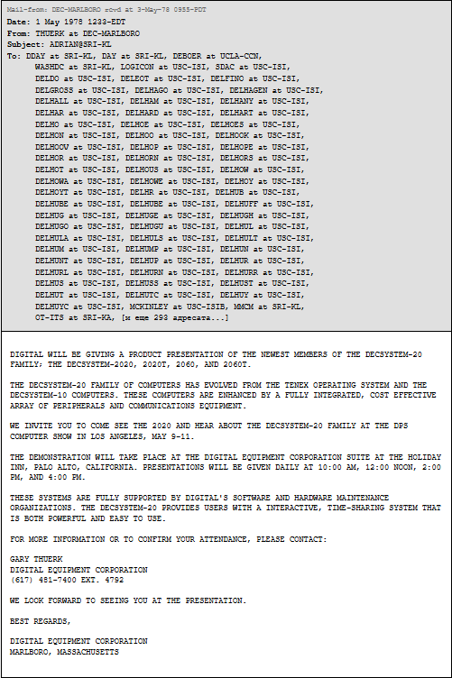{#fig-001 width=70%}

Настоящий расцвет спама произошел после 1994-1995 годов, когда интернет перестал быть исключительно научной сетью и стал общедоступным. Именно тогда появилась знаменитая финансовая пирамида «Make Money Fast», которая стала прообразом современных спам-рассылок. Ее схема была простой: пользователям предлагалось переслать небольшую сумму денег нескольким адресатам из списка, а затем распространить это письмо дальше, добавив свой адрес в конец списка. Эта модель на многие годы определила характер значительной части нежелательной корреспонденции в сети. Таким образом, к моменту появления первых систем фильтрации спам уже представлял собой сложившееся явление со своей историей и характерными чертами, что и обусловило необходимость разработки специальных методов борьбы с ним.

Для успешного изучения любого явления необходима четкая терминологическая база. Вопрос определения спама особенно актуален, поскольку в научной и профессиональной среде существует множество формулировок, зачастую слишком размытых для практического применения. В российском законодательстве на сегодняшний день отсутствует легальное определение этого термина, что вынуждает опираться на устоявшееся в профессиональной среде понимание.

В контексте данного исследования под спамом понимаются нежелательные сообщения, распространяемые по каналам электронной почты. Наиболее точно суть явления раскрывает следующее определение: спам — это анонимная, безадресная, массовая и незапрошенная рассылка почтовых сообщений.

## Критерии идентификации спама

Для эффективного обнаружения нежелательной почты необходимо выделить характерные признаки, по которым можно классифицировать письмо как спам. Все эти признаки условно делятся на две основные категории: формальные и лингвистические.

Формальные (технические) признаки связаны с заголовками и служебной информацией письма. К ним относятся:

* Специфические почтовые и IP-адреса отправителей, что позволяет использовать фильтрацию по чёрным и белым спискам.
* Отсутствие адреса отправителя или получателя, либо, наоборот, наличие чрезмерно большого числа получателей в полях «Кому» или «Копия».
* Отсутствие записи об IP-адресе отправителя в DNS-системе, что может указывать на подделку.
* Определённые характеристики размера и формата сообщения.
* Аномалии в маршруте доставки письма.

Лингвистические признаки относятся к содержанию письма и его текстовому анализу:

* Использование специфических слов, фраз и конструкций, типичных для спам-рассылок.
* Эвристические алгоритмы, выявляющие шаблонность письма.
* Статистические методы анализа текста.

С технической точки зрения, к ключевым индикаторам спама также можно отнести:

* Массовость рассылки, которая проявляется в одновременной отправке идентичных сообщений на множество адресов.
* Наличие текста, который всегда можно проанализировать, что является основой для контекстной фильтрации, несмотря на всевозможные уловки спамеров.
* Открытость и читаемость содержимого. Поскольку цель спама — донести рекламу до пользователя, сообщение редко бывает зашифрованным или перегруженным случайными последовательностями символов, которые затруднили бы его восприятие.
* Безадресность. Отсутствие персонального обращения к конкретному человеку является сильным индикатором массовой рассылки.
* Признаки подмены (спуфинга) адреса отправителя, для борьбы с чем применяются специальные механизмы.

Кроме прямых признаков, существуют и косвенные. Сами по себе они не доказывают принадлежность письма к спаму, но в комплексе с другими усиливают подозрения. Например, большинство спам-сообщений имеют небольшой размер (как правило, до 10 КБ) и простую структуру. Сложносоставные письма объемом в десятки килобайт с вложениями и мультимедийными элементами маловероятны в качестве спама, так как это снижает эффективность массовых рассылок.

## Классификация спама

Классификация спама

Современный спам не является однородным явлением и может быть классифицирован на несколько ключевых категорий в зависимости от своей цели и содержания.

1. Рекламный спам

Данный вид рассылок используется компаниями, в том числе занимающимися легальным бизнесом, для продвижения своих товаров и услуг. Зачастую рассылка осуществляется не напрямую, а через специализированные организации, предоставляющие такие услуги. Основными преимуществами этого канала для рекламодателей остаются его низкая себестоимость и возможность охвата многомиллионной аудитории ([рис. @fig-002]).

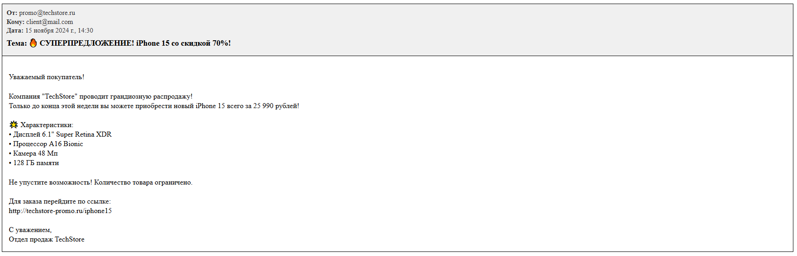{#fig-002 width=100%}

2. «Нигерийские письма»

Эта категория спама представляет собой один из способов мошенничества, направленный на незаконное изъятие денежных средств у получателя. Историческое название закрепилось из-за большого количества подобных писем, рассылавшихся из Нигерии. Схема мошенничества строится на том, что получателю сообщают о возможности получения крупной суммы денег при содействии отправителя. Для реализации этой фиктивной операции у жертвы под различными предлогами (например, для оплаты услуг юриста или открытия счета) запрашивается сравнительно небольшой денежный перевод, который и является конечной целью злоумышленников ([рис. @fig-003]).

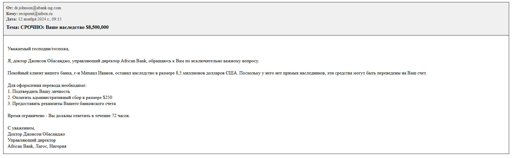{#fig-003 width=100%}

3. Фишинг

Фишинг — это более сложный метод мошенничества, целью которого является получение конфиденциальных данных пользователя: логинов, паролей и реквизитов банковских карт. Сообщение в таком письме маскируется под официальное уведомление от имени банка или платежной системы. В нем содержится ложное предупреждение о блокировке счета и требование подтвердить личные данные, перейдя по предоставленной ссылке. Ссылка ведет на поддельный веб-сайт, внешне идентичный настоящему, где пользователь, не подозревая об обмане, вводит свою информацию, которая сразу попадает к мошенникам ([рис. @fig-004]).

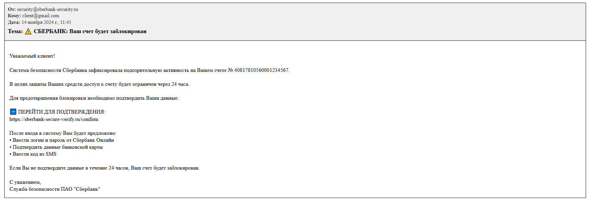{#fig-004 width=100%}

4. Цепные письма (письма «счастья»)

Данный тип рассылок характеризуется распространением по принципу «сарафанного радио». Получателю предлагается или требуется отправить копию полученного сообщения нескольким контактам. Среди распространенных разновидностей можно выделить письма-просьбы («Милостыня»), письма-петиции, предложения быстрого обогащения («Обогащение») или призывы к обмену различными благами. Их главный признак — механизм вирусного распространения, основанный на социальном воздействии на получателя ([рис. @fig-005]).

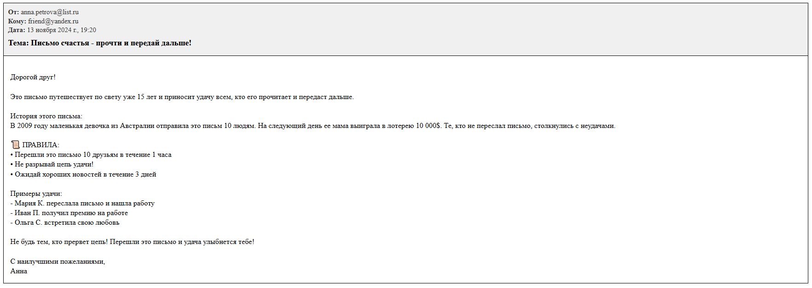{#fig-005 width=100%}

Тематическая структура русскоязычного спама имеет свою специфику и заметно отличается от содержания англоязычных рассылок. Если международный спам часто касается финансовых пирамид, «нигерийских писем» и фармацевтики, то в Рунете наблюдается иная картина. Значительную долю занимает коммерческая реклама самых разнообразных товаров. Ассортимент поражает своим диапазоном: от бытовых товаров, таких как кондиционеры или аксессуары для животных, до узкоспециализированной промышленной продукции и даже предметов роскоши.

# Организация и технологические основы спам-рассылок

Ежедневный объем спам-рассылок достигает десятков миллиардов сообщений, что составляет 60-90% мирового почтового трафика. Поддержание такой активности требует значительных ресурсов и сложной инфраструктуры. Сформировалась устойчивая технологическая цепочка, состоящая из взаимосвязанных этапов: сбора адресных баз, подготовки инфраструктуры, разработки специализированного ПО и непосредственного проведения рассылок.

Для формирования спам-баз используются разнообразные методы сбора данных. Автоматический подбор адресов осуществляется по словарям имен и популярных словосочетаний. Активно применяется сканирование открытых источников - форумов, сайтов, социальных сетей для выявления email-адресов. Особую опасность представляет кража баз данных через вредоносное ПО, позволяющая получать проверенные активные адреса.

Собранные адреса проходят многократную верификацию. Наиболее распространены методы пробных рассылок с анализом отклика серверов, отслеживание фактов прочтения писерез специальные ссылки, а также использование фиктивных ссылок "отписки", которые фактически подтверждают активность адреса.

Современные спамеры используют три основных канала доставки. Арендованные серверы обеспечивают высокую скорость, но быстро попадают в черные списки. Уязвимые открытые сервисы (почтовые релеи, прокси) позволяют маскировать источник рассылки. Наиболее эффективными оказались ботнеты - сети зараженных компьютеров обычных пользователей, обеспечивающие анонимность и масштабируемость.

Профессиональные программы для рассылок обладают сложным функционалом: поддерживают различные каналы доставки, динамически генерируют уникальный контент, искусно подделывают заголовки сообщений. Для противодействия фильтрам применяются сложные методы - добавление случайного "шума" в текст, использование графического спама, фрагментирование изображений, многовариантное перефразирование содержания.

Спамеры постоянно совершенствуют методы социальной инженерии. Рассылки маскируются под личную переписку, используют маркировку RE/FW, имитируют деловые сообщения. Активно эксплуатируются актуальные новости и сенсации для привлечения внимания.

В индустрии произошло четкое разделение труда: отдельные группы специализируются на создании вредоносного ПО, сборе адресных баз, разработке инструментов рассылки. Годовой оборот рынка оценивается в сотни миллионов долларов. Высокая доходность при относительно низких барьерах входа способствует дальнейшей профессионализации отрасли и появлению вертикально интегрированных структур, несмотря на противодействие правоохранительных органов.

# Методы борьбы со спамом

В рамках обеспечения информационной безопасности борьба со спамом предполагает комплексный подход, включающий три основных класса мер:

* Нормативно-правовые (юридические);
* Организационные (административные);
* Программно-технические.

## Нормативно-правовые акты

Наиболее эффективным методом борьбы является привлечение спамеров к юридической ответственности, поскольку их деятельность носит противоправный характер. Однако для реализации этого метода необходимы следующие условия:

* Проработанная законодательная база, четко определяющая понятия, виды ответственности и полномочия контролирующих органов.
* Эффективно работающие механизмы правоприменения.
* Межгосударственное сотрудничество и координация с правоохранительными службами других стран.

К сожалению, в Российской Федерации на сегодняшний день отсутствует единое и эффективное законодательство, напрямую регулирующее проблему спама, что существенно снижает действенность этого метода.

## Орагинзационные методы 

Эти меры направлены на минимизацию риска попадания электронного адреса в спамерские базы данных. К ним относятся правила цифровой гигиены для пользователей:

* Использование нескольких адресов: Основной адрес, полученный у провайдера, следует использовать только для доверительного общения. Для регистрации на форумах, в онлайн-магазинах и других потенциально рискованных действий рекомендуется завести один или несколько дополнительных ящиков на бесплатных почтовых сервисах.
* Создание сложного имени ящика: Адрес, устойчивый к автоматическому подбору, должен быть длинным и содержать комбинацию букв (в том числе из разных алфавитов), цифр и символов.
* Защита адреса на веб-ресурсах: При публикации адреса в интернете (например, на сайте или в форуме) его можно видоизменить, чтобы он оставался понятным для человека, но нераспознаваемым для роботов-сборщиков.
* Осторожность при участии в акциях и опросах: Следует избегать указания основного адреса при регистрации в онлайн-лотереях и розыгрышах. Требование указать избыточные личные данные (доход, увлечения) часто сигнализирует о сборе информации для последующей продажи спамерам.

Автоматическая фильтрация нежелательной почты осуществляется на основе анализа характерных признаков спама, рассмотренных ранее. Этот процесс выполняется специализированными техническими средствами (антиспам-фильтрами), которые идентифицируют спам-сообщения в общем почтовом потоке и выполняют с ними заданные действия: блокировку, помещение в карантин, маркировку и т.д.

## Программно-технические методы

На сегодняшний день разработано множество антиспам-решений, различающихся используемыми технологиями анализа. Выбор конкретного метода фильтрации зависит от нескольких факторов, ключевым из которых является место установки фильтра в сети. С точки зрения архитектуры защиты можно выделить три основных уровня применения антиспам-фильтров:

* Фильтрация на стороне почтового провайдера. Этот подход предполагает очистку почтового трафика на серверах интернет-провайдера или почтовой службы до доставки сообщений конечным пользователям.
* Фильтрация на корпоративном почтовом сервере. В этом случае защита устанавливается на почтовый сервер организации, обеспечивая безопасность всей бизнес-среды.
* Фильтрация на стороне клиента. Данный метод реализуется с помощью программного обеспечения, установленного непосредственно на компьютере пользователя (в почтовом клиенте или как отдельное приложение).

Проведём сравнение различных программно-технических методов ([рис. @fig-006]).

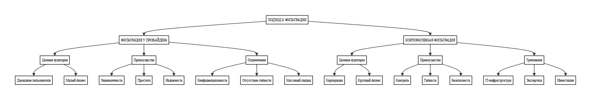{#fig-006 width=100%}

### Фильтрация спама на стороне провайдера

Постоянный рост объемов спама заставляет крупные почтовые сервисы повсеместно внедрять системы фильтрации. В мировом масштабе это такие платформы, как Hotmail, Yahoo! и MSN, а в Рунете — Mail.ru с «Антиспамом Касперского», Яндекс со «Спамообороной» и другие сервисы, использующие как коммерческие, так и открытые решения вроде SpamAssassin.

Данный подход предполагает, что поставщик интернет-услуг самостоятельно фильтрует спам для своих клиентов, которые хранят почтовые ящики на его серверах. Это удобное и экономичное решение для домашних пользователей и малого бизнеса, не имеющего собственной почтовой инфраструктуры

Однако для компаний с развитой ИТ-структурой этот метод имеет серьезные ограничения. Во-первых, возникает вопрос конфиденциальности, поскольку провайдер получает доступ к содержанию всей корпоративной переписки для анализа. Во-вторых, такая фильтрация не обладает необходимой гибкостью. Внутри компании разные отделы могут по-разному оценивать одно и то же письмо: например, реклама отраслевой выставки будет полезной для маркетингового отдела, но окажется спамом для технических специалистов. Провайдер не может учитывать такие внутренние бизнес-процессы.

Кроме того, технологии, применяемые провайдерами — такие как использование черных списков (RBL) и распределенные методы обнаружения — ориентированы на массового пользователя и не позволяют реализовать тонкую настройку под уникальные требования конкретной организации. Поэтому для большинства корпоративных клиентов предпочтительнее оказывается организация фильтрации на собственном почтовом сервере ([рис. @fig-007]).

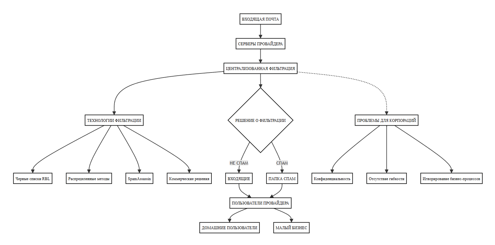{#fig-007 width=100%}

#### Фильтрация спама с использованием RBL-сервисов

Метод фильтрации с применением RBL-списков (Realtime Blackhole List) остается одним из наиболее распространенных и простых в реализации решений для борьбы со спамом, что объясняет его популярность среди интернет-провайдеров. Принцип работы таких систем основан на использовании постоянно обновляемых списков, которые включают IP-адреса известных спамеров, открытых релеев и сетей, не принимающих мер против нежелательных рассылок. Проверка осуществляется в реальном времени через DNS-запросы: почтовый сервер при получении письма запрашивает RBL-сервис, чтобы определить, находится ли IP-адрес отправителя в черном списке, и на этом основании принимает решение о блокировке или приемке сообщения ([рис. @fig-008]).

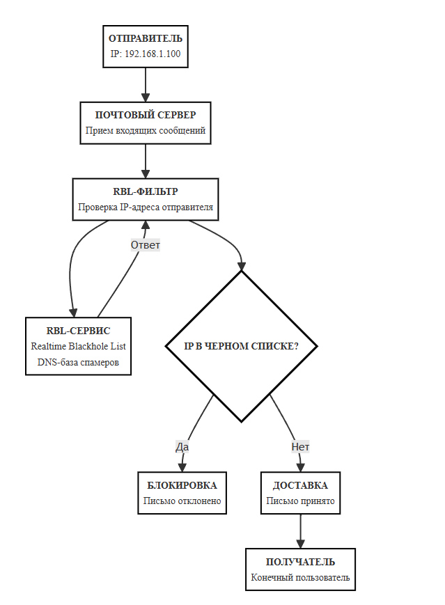{#fig-008 width=100%}

Однако простота этого подхода имеет серьезный недостаток — он не анализирует содержание письма, а полагается исключительно на репутацию отправителя. Это приводит к ситуации, когда весь трафик с заблокированного IP-адреса отклоняется, независимо от того, является ли конкретное письмо спамом или важным сообщением. На практике это означает риск ложных срабатываний, когда почтовые серверы добросовестных отправителей могут ошибочно попадать в черные списки.

Эффективность RBL-сервисов традиционно оценивается по их способности сокращать объем спама, однако ключевой проблемой остается процент ложных блокировок. Исследования в Рунете показывают, что в среднем около 2.1% легитимных писем могут неправомерно отклоняться при использовании данного метода. Для активного пользователя это может означать потерю одного-двух важных сообщений ежедневно. При этом уровень детектирования спама с помощью RBL-списков не превышает 30-40%, что свидетельствует об их ограниченной эффективности в качестве самостоятельного решения.

Тем не менее, полностью отказываться от этого метода не следует. Практика демонстрирует, что RBL-фильтрация играет важную роль в комплексных системах защиты, позволяя на начальном этапе отсекать значительную часть очевидного спама (20-30%). Критически важным является понимание того, что данный подход должен использоваться в сочетании с другими технологиями фильтрации, поскольку его исключительное применение не может обеспечить надежную защиту от всего спектра нежелательных рассылок.

#### Распределённые методы обнаружения спама

Данный подход к фильтрации спама основан на сборе и анализе информации из множества источников, преимущественно крупных почтовых систем с миллионами пользователей. Суть метода заключается в агрегации данных о спам-рассылках из различных точек сети с последующей обработкой и предоставлением результатов всем участникам системы ([рис. @fig-009]).

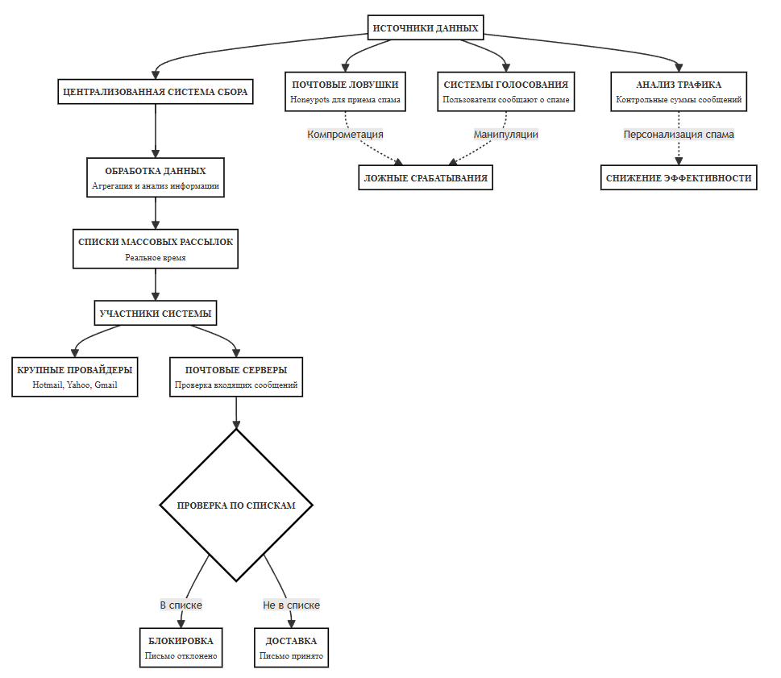{#fig-009 width=100%}

Для сбора информации используются следующие механизмы:

* Специальные почтовые "ловушки" (honeypots), предназначенные для приема спама
* Системы голосования пользователей, где получатели спама сообщают о нежелательных письмах
* Автоматический анализ всего почтового трафика с вычислением контрольных сумм сообщений

На основе собранных данных формируются списки массовых рассылок, доступные участникам системы в реальном времени. 

Почтовые серверы могут проверять каждое входящее сообщение по этим спискам и принимать решение о его дальнейшей судьбе.
Однако распределенные методы имеют существенные недостатки. Главная проблема - уязвимость к компрометации. Спамеры, получив доступ к спискам "ловушек", могут направлять туда легитимные письма, что приводит к ложным срабатываниям. Системы голосования также уязвимы - злоумышленники могут искусственно влиять на результаты голосования. Кроме того, современные спам-рассылки характеризуются высокой степенью персонализации, что снижает эффективность методов, основанных на обнаружении идентичных сообщений.

Для корпоративных пользователей распределенные методы имеют ограниченную применимость из-за особенностей почтового трафика. В отличие от провайдеров, корпоративные почтовые системы работают с менее массовым, но более структурированным потоком сообщений. Это позволяет применять более сложные алгоритмы анализа содержания писем и реализовывать персонализированные политики фильтрации для разных групп пользователей.

Таким образом, хотя распределенные методы и обеспечивают базовый уровень защиты от массовых рассылок, их эффективность ограничена, и для корпоративного сектора более перспективными являются решения, основанные на содержательном анализе почтовых сообщений с учетом специфики бизнес-процессов организации.

### Фильтрация спама на корпоративном сервере

Для средних и крупных компаний с собственной почтовой инфраструктурой оптимальным решением является развертывание системы фильтрации спама на корпоративном сервере. Этот подход позволяет обрабатывать весь входящий трафик до доставки сотрудникам, обеспечивая защиту от нежелательной почты и сохраняя конфиденциальность переписки. Кроме того, он предоставляет возможности для гибкой настройки политик фильтрации согласно специфике бизнес-процессов. Хотя популярные почтовые серверы (Microsoft Exchange, Sendmail, Postfix) включают базовые средства фильтрации, они обычно ограничиваются примитивными системами правил, требующими ручного составления и постоянного обновления. Это недостаточно эффективно против современного спама, который постоянно эволюционирует. Решением становится интеграция специализированных антиспам-решений. На рынке представлены как коммерческие продукты, так и бесплатные системы типа SpamAssassin, показывающие эффективность 90-95%. Однако SpamAssassin имеет недостатки - слабую адаптацию к русскоязычному контенту и сложность настройки из-за непрозрачных правил ([рис. @fig-010]).

{#fig-010 width=100%}

Существуют два основных подхода к фильтрации: традиционный (поиск характерных признаков спама) и статистический (машинное обучение). Традиционные фильтры страдают от ложных срабатываний, так как игнорируют особенности нормальной деловой переписки.

Статистические методы, разработанные Полом Грэмом, лишены этого недостатка. Они обучаются распознавать как спам, так и легитимные письма, формируя эталонные модели для обеих категорий. Это особенно ценно для корпоративной среды, где можно адаптировать систему под специфику переписки. Важное преимущество корпоративной фильтрации - возможность создания персонализированных политик для разных подразделений. Например, рекламные письма могут доставляться в маркетинговый отдел, но блокироваться для других сотрудников.

Хотя внедрение такой системы требует затрат, инвестиции окупаются за счет повышения производительности труда и снижения рисков фишинговых атак. При правильной настройке система обеспечивает надежную защиту, не мешая нормальному документообороту.

#### Статистические (вероятностные) методы фильтрации спама

В основе статистического подхода лежит теорема Байеса, позволяющая вычислять вероятность события по наличию определенных признаков. При фильтрации спама каждому слову или фразе присваиваются два значения вероятности: встречаемости в спаме и в легитимной почте. Анализ этих вероятностей для всех слов письма позволяет определить его принадлежность к спаму ([рис. @fig-011]).

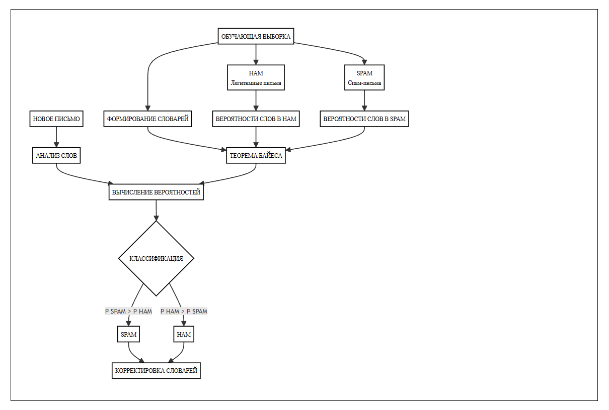{#fig-011 width=100%}

Как отмечал Пол Грэм в работе "A Plan for Spam", уязвимость спамеров заключается в необходимости донести суть предложения. Несмотря на технические уловки, они вынуждены передавать понятную коммерческую информацию, что и становится основой для работы байесовских фильтров. Процесс начинается с обучения на выборках писем разных категорий. Формируются частотные словари, а для новых писем вычисляется вероятность принадлежности к спаму по формуле Байеса. После обучения точность достигает 97-99% и улучшается при дальнейшей корректировке. Ключевое преимущество - способность к индивидуальной адаптации. Фильтр настраивается под специфику лексики организации, что обеспечивает высокую точность. Важной особенностью является учет как "плохих", так и "хороших" признаков, что минимизирует ложные срабатывания.

Испытания подтверждают эффективность метода: при обработке 8000 писем система не распознала лишь 0,5% спама без ложных срабатываний. Дополнительное преимущество - универсальность подхода, позволяющая реализовывать сложные политики классификации писем. 

Таким образом, статистические методы представляют собой совершенный инструмент борьбы со спамом, особенно в корпоративной среде.

Формула Байеса для фильтрации спама:

P(SPAM|Слова) = [P(Слова|SPAM) × P(SPAM)] / P(Слова)

где:

• P(SPAM|Слова) - вероятность что письмо спам при данных словах
• P(Слова|SPAM) - вероятность встретить слова в спаме
• P(SPAM) - априорная вероятность спама
• P(Слова) - общая вероятность встретить слова

Рассмотрим принцип работы байесовского метода фильтрации спама на конкретном примере ([рис. @fig-012]).

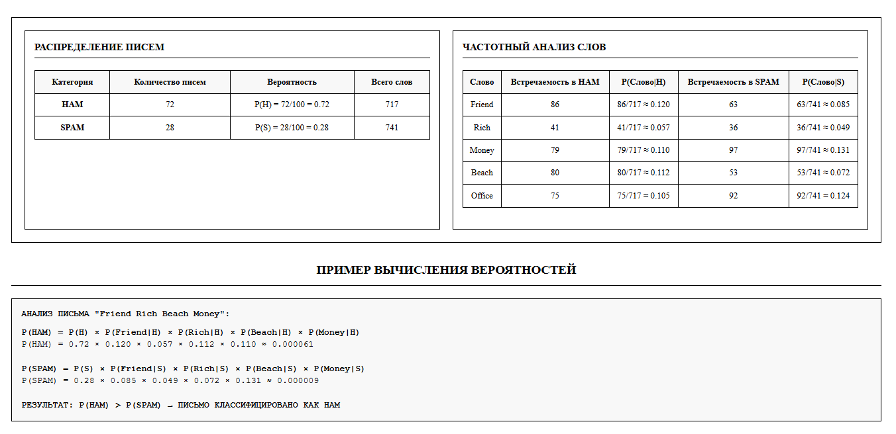{#fig-012 width=100%}

### Фильтрация спама на стороне клиента

Фильтрация на стороне клиента представляет собой завершающий, и во многом ключевой, рубеж обороны в многоуровневой системе защиты от нежелательной почты. В отличие от серверных решений, этот подход делегирует финальную сортировку и анализ конечному пользователю, устанавливая антиспам-решение непосредственно на его рабочей станции — будь то стационарный компьютер, ноутбук или мобильное устройство. Таким образом, обработка почтового трафика происходит уже после его полной загрузки с почтового сервера, что открывает путь к truly персонализированному подходу в управлении входящими сообщениями ([рис. @fig-013]).

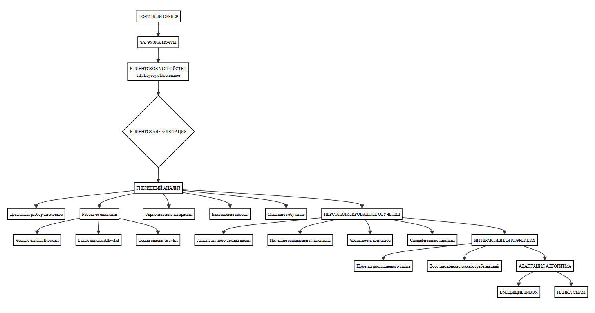{#fig-013 width=100%}

Основное и неоспоримое преимущество клиентской фильтрации кроется в ее уникальной способности адаптироваться под уникальные коммуникационные паттерны и профессиональные нужды конкретного человека. Алгоритмы, часто основанные на байесовских методах или машинном обучении, проходят обучение не на обобщенных выборках, а на личном архиве писем пользователя. Они анализируют стилистику, лексикон, специфические термины и частотность контактов. Это становится незаменимым инструментом для узкопрофессиональных групп: например, для врачей, получающих письма с медицинскими терминами («лимфома», «аспирация»), или юристов, работающих с документами, содержащими специфические юридические конструкции, которые корпоративные серверные фильтры могут счесть подозрительными и отбросить как спам, нанеся ущерб бизнес-процессам.

На технологическом уровне клиентские антиспам-системы чаще всего интегрируются в экосистему пользователя в виде плагинов или расширений для популярных почтовых клиентов, таких как Microsoft Outlook, Mozilla Thunderbird, The Bat! или даже веб-интерфейсов через специализированные браузерные расширения. Эти решения редко полагаются на единственный метод, предпочитая гибридную модель, которая включает:

* Детальный разбор заголовков: Проверка на наличие несоответствий и технических признаков подделки.
* Работу с динамическими списками: Использование черных (blocklist), белых (allowlist) и серых (greylist) списков, которые пользователь может гибко настраивать.
* Эвристические алгоритмы: Поиск шаблонов, характерных для спам-рассылок.

Критически важной особенностью является интерактивность и прямая обратная связь. Пользователь становится активным участником обучения системы: одним кликом он может пометить пропущенный спам или, что еще важнее, «спасти» из папки «Спам» ложноположительное легитимное письмо. Эта корректировка мгновенно учитывается алгоритмом, повышая его точность в будущем ([рис. @fig-014]).

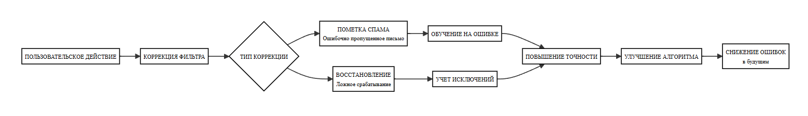{#fig-014 width=100%}

Несмотря на кастомизацию, клиентская фильтрация имеет фундаментальные ограничения. Наиболее очевидный изъян — ресурсные затраты: поскольку фильтрация происходит после загрузки, весь объем спама потребляет трафик и место в почтовом ящике, создавая нагрузку на каналы связи и системы хранения. С точки зрения ИТ-инфраструктуры, подход не решает проблему радикально — нагрузка на серверы и каналы связи не снижается. В крупных организациях массовое развертывание и поддержка клиентских решений на каждом рабочем месте становятся сложной и дорогой административной задачей. Добавляется и психофизиологический фактор: даже кратковременный контакт со спамом при ручной проверке вызывает когнитивную усталость и снижает продуктивность. При работе с нескольких устройств возникает проблема синхронизации — фильтры, обученные на одном устройстве, не переносят свои "знания" на другие, что приводит к необходимости повторного обучения на каждой платформе.

# Профилактика спама

Основой эффективной защиты от нежелательной почты является грамотная профилактика, направленная на предотвращение попадания email-адресов в базы данных спамеров. Ключевой стратегией является дифференцированный подход к использованию электронных адресов, при котором строго разделяются приватные и публичные ящики.

Приватный адрес, предназначенный для важной личной и деловой переписки, должен оставаться конфиденциальным и никогда не публиковаться в открытых источниках. Его следует составлять по принципу максимальной сложности для автоматического подбора - использовать длинные комбинации букв, цифр и специальных символов. Например, адрес вида "Vasily.M-Pupkin-1975" значительно надежнее простых "ivan" или "info", которые легко подбираются роботами-сборщиками по стандартным словарям.

Для участия в интернет-активностях, требующих указания email - регистрации на сайтах, форумах, онлайн-покупках - необходимо завести отдельный публичный адрес. Такой ящик изначально следует рассматривать как временный и быть готовым к его замене при первых признаках повышенного внимания спамеров. Практика показывает, что даже при осторожном использовании публичный адрес начинает получать спам в среднем через 2-3 недели после первого использования.

Особого внимания требует безопасная публикация адресов в интернете. При необходимости размещения email на веб-страницах рекомендуется использовать методы, затрудняющие автоматическое распознавание роботами. Наиболее эффективны графическое представление адреса в виде изображения или использование JavaScript-кода для его динамической генерации. Если технические средства недоступны, допустимо применять текстовые модификации типа "example[at]domain[dot]com".

Критически важным является правильное поведение при получении спама. Ни в коем случае не следует отвечать на такие письма или использовать предлагаемые в них ссылки "отписаться от рассылки". Эти действия играют роль подтверждения активности адреса и приводят к резкому увеличению объема нежелательной почты. Современные спамеры часто маскируют под запросы подтверждения подписки или фиктивные опросы.

При значительном увеличении потока спама рекомендуется своевременная замена скомпрометированного адреса. Для постоянно используемых публичных ящиков необходимо подключение антиспам-фильтров, которые могут быть реализованы как на стороне почтового провайдера, так и в виде клиентских решений. Современные системы фильтрации демонстрируют эффективность на уровне 95-98% при правильной настройке.

Дополнительной защитной мерой является использование одноразовых адресов для регистрации на сомнительных ресурсах. Многие почтовые службы предоставляют возможность создания временных алиасов, которые автоматически прекращают работу через заданное время. Это позволяет отслеживать источники утечки адресов и блокировать недобросовестные сервисы.

Системное применение перечисленных профилактических мер позволяет снизить объем получаемого спама на 80-90% и сохранить приватность основного почтового ящика для важной переписки.

# Выводы 

Проведенный анализ позволяет констатировать, что проблема спама продолжает оставаться актуальной угрозой информационной безопасности, требующей комплексного подхода к решению. Ни один из рассмотренных методов фильтрации не может обеспечить полную защиту в отдельности. Наиболее эффективной стратегией представляется многоуровневая система защиты, сочетающая фильтрацию на стороне провайдера, корпоративного сервера и конечного пользователя. Среди технических решений наибольшую эффективность демонстрируют статистические методы на основе алгоритма Байеса, обеспечивающие высокую точность обнаружения при минимальном количестве ложных срабатываний.

Для достижения оптимальных результатов необходимо сочетание технических мер с организационными мероприятиями - обучением пользователей основам кибербезопасности и выработкой четких правил работы с электронной почтой. Перспективы борьбы со спамом связаны с дальнейшим развитием технологий машинного обучения и усилением международного сотрудничества в правовой сфере.

# Список литературы

* Арутюнов В. В. «Спам: история возникновения и противодействие его распространению» // Вестник Московского финансово-юридического университета, 2012, №1, с. 44–48.

* Попкова А. А. «Спам — разновидность информационной угрозы» // Сборник статей по итогам Международной научно-практической конференции, 2017, с. 183–185.

* Копырулина О. А., Устюжанин Е. В. «Меры борьбы со спамом» // Вестник современных исследований, 2018, №9.3 (24), с. 267–268.

* Рожков Г. Г. «Методы борьбы с почтовым спамом» // Известия Орловского государственного технического университета, Серия: Информационные системы и технологии, 2006, №1–4, с. 180–187.

* Ляпидов К. В. «Спам: понятие, виды, последствия и методы противодействия» // Информационное право, 2013, №5, с. 29–32.

